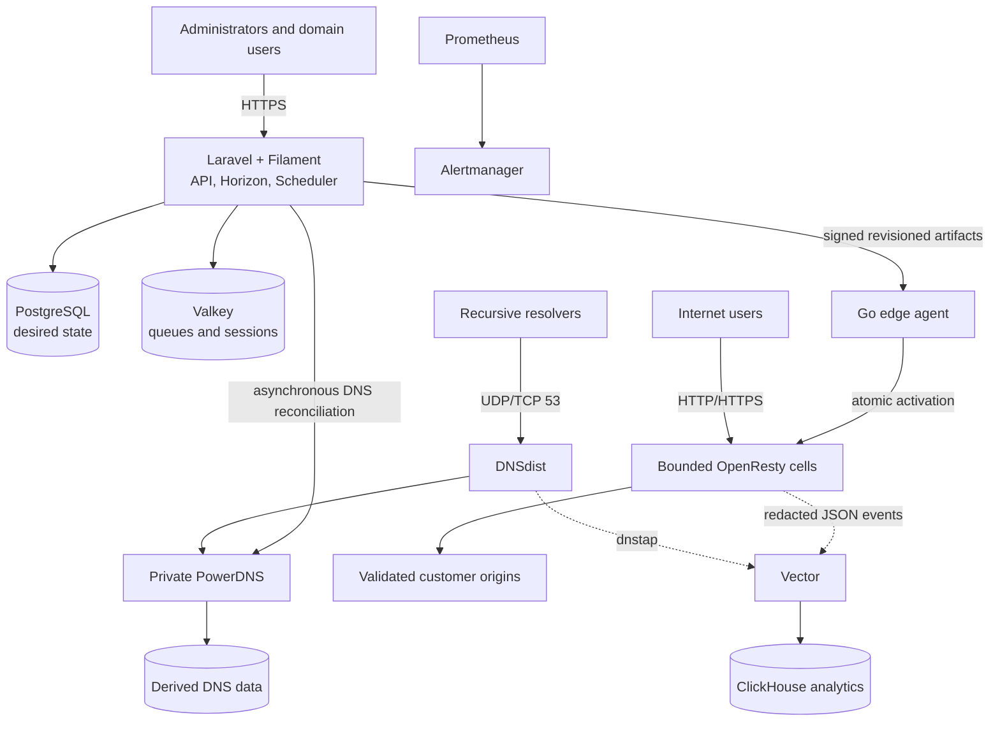

# CDNFoundry

[](https://github.com/vaheed/CDNFoundry/actions/workflows/ci.yml)
[](https://github.com/vaheed/CDNFoundry/releases)
[](LICENSE)
[](core/composer.json)
[](edge-agent/go.mod)
[](https://vaheed.github.io/CDNFoundry/)
[](https://github.com/vaheed/CDNFoundry/actions/workflows/docs-pages.yml)

CDNFoundry is an open-source, production-oriented **private CDN platform** for
companies, hosting providers, and large ISPs that want to operate their own
authoritative DNS, edge proxy, cache, TLS, security, and analytics
infrastructure.

It combines a Laravel and Filament control plane with PowerDNS, DNSdist,
OpenResty, a Go edge agent, Vector, ClickHouse, Prometheus, and bounded
role-based Docker Compose deployments.

> [!IMPORTANT]
> PostgreSQL owns desired state, but customer DNS and HTTP traffic never pass
> through Laravel. Existing data planes continue from their last valid state
> during a control-plane or telemetry outage.

## Why CDNFoundry

- **Private ownership:** run DNS, edge, certificates, cache, telemetry, and
  operational data on infrastructure you control.
- **Authoritative DNS:** DNSdist-only public ingress, private PowerDNS,
  deterministic zones, Geo-DNS, import/export, reconciliation, and drift
  visibility.
- **Data-driven edge:** shared, quarantine, and exceptional dedicated pools use
  bounded OpenResty cells instead of a process or server block per domain.
- **Safe origins:** every proxied hostname has one explicit origin; unsafe
  loopback, link-local, metadata, internal-service, and proxy-loop destinations
  fail closed.
- **TLS lifecycle:** managed DNS-01 issuance, encrypted custom certificates,
  bounded renewal, validation, and last-valid certificate preservation.
- **Deterministic cache:** one lookup/purge key, bounded objects, development
  mode, stale policy, URL purge tasks, and epoch-based full purge.
- **Application security:** ordered IP/CIDR/geography rules, bounded profiles,
  target readiness, quarantine, and expiring emergency controls.
- **Direct telemetry:** Vector sends redacted DNS and edge events directly to
  ClickHouse; analytics failure cannot block serving.
- **Operational recovery:** explicit migrations, immutable images, health and
  readiness, four queue lanes, optional Restic backup/restore, runbooks, and
  canary upgrade guidance.
- **Predictable mutation:** external effects are asynchronous, revisioned,
  idempotent, coalesced, verified, and last-valid-state preserving.

## Architecture



| Plane | Source of truth | Runtime behavior |
| --- | --- | --- |
| Management | Laravel policies and PostgreSQL | Authorizes and records intent |
| DNS | PostgreSQL desired records | DNSdist and PowerDNS answer independently |
| Edge | Domain revisions and placements | Agents validate and atomically activate snapshots |
| TLS/cache/security | Typed domain state | OpenResty applies data without per-domain reload |
| Telemetry | Runtime events | Vector buffers and ClickHouse stores bounded analytics |

Start with [CDN fundamentals](docs/concepts/cdn-fundamentals.md) and
[How CDNFoundry works](docs/concepts/how-cdnfoundry-works.md), then read the
[architecture overview](docs/architecture/index.md) and
[data-flow diagrams](docs/architecture/data-flows.md) for component and failure
boundaries.

## Production deployment

The minimum recommended topology is one control/telemetry host and two combined
DNS/edge hosts in separate failure domains.

> [!CAUTION]
> Production uses immutable images, explicit Laravel and PowerDNS migrations,
> private PKI, exact-source firewalls, and persistent named volumes. The
> built-in encrypted off-host backup integration is optional but a tested
> recovery method is strongly recommended. Do not promote the development stack.

Follow the detailed [Production quick start](docs/deployment/production-quick-start.md).
It covers bootstrap DNS, registrar glue, `.env.prod`, private certificates,
control startup, DNS qualification, edge enrollment, the first customer domain,
acceptance checks, IPv6, scaling, and rollback.

## Local development

Requirements are Docker Engine, Docker Compose, GNU Make, and enough capacity
for the complete development topology.

```sh
make dev-control-up
make dev-migrate
make dev-up
make dev-test
```

Create the first administrator interactively:

```sh
docker compose -f compose.dev.yml exec core \
  php artisan cdnf:admin:create \
  --name="Local Administrator" \
  --email="admin@example.test"
```

Open:

- administrator panel: <http://localhost:8080/admin>
- domain-user panel: <http://localhost:8080/app>
- Horizon: <http://localhost:8080/admin/horizon>
- development mail: <http://localhost:8025>
- PowerAdmin diagnostics: <http://localhost:9191>

See [Installation](docs/getting-started/installation.md) and
[Development](docs/development/index.md) before changing the stack.

## Implemented feature map

| Area | Capabilities |
| --- | --- |
| Identity | Administrators, assigned domain users, sessions, Sanctum tokens, audit, account disablement |
| Domains | Normalization, delegation verification, activation, delayed deprovision, tombstones, reclaim cooldown |
| DNS | A, AAAA, CNAME, MX, TXT, NS, CAA, SRV, reverse PTR, BIND import/export, Geo-DNS |
| Edge | Geo-Unicast and Simple Anycast pools, eight bounded cell slots, host gateway ingress, enrollment, mTLS identity, signed artifacts, placement, drain, and fleet rollouts |
| Proxy | Explicit safe primary/backup origins, host/SNI policy, bounded timeouts/retries, active-passive failover, WebSocket policy, and health tests |
| TLS | Managed ACME DNS-01, custom uploads, renewal, reissue, validation, encrypted private keys |
| Cache and delivery | Persistent bounded cache, canonical keys, TTL/admission/query policy, stale grace, development mode, URL/full purge, Gzip, and Brotli |
| Security | Ordered rules, trusted-client parsing, profiles, managed OWASP CRS WAF, bounded exclusions, quarantine, and emergency controls |
| Analytics | Raw events, aggregates, status/cache/origin/geography/compression/WAF views, stable usage exports |
| Operations | Health, readiness, metrics, alerts, two Grafana command centers, bounded Loki logs, reconciliation, failed jobs, optional Restic backups, restore, and canary upgrades |

## API

The JSON API uses Sanctum bearer tokens, policy-aware nested binding, stable
machine-readable errors, cursor pagination, UUID idempotency keys, and operation
receipts for asynchronous work.

- [API conventions](docs/reference/api/index.md)
- [Generated endpoint catalog](docs/reference/api/endpoints.md)
- [OpenAPI 3.1 contract](docs/public/openapi.json)
- [Edge-agent protocol](docs/reference/api/edge-agent.md)

## Documentation

Browse the production [CDNFoundry documentation
website](https://vaheed.github.io/CDNFoundry/) for full navigation, local
search, rendered architecture diagrams, and light/dark modes. The Markdown
links below also work directly on GitHub.

| Audience | Start here |
| --- | --- |
| CDN learners | [CDN fundamentals](docs/concepts/cdn-fundamentals.md) |
| Evaluators | [Product overview](docs/getting-started/index.md) |
| New CDNFoundry users | [Using CDNFoundry](docs/getting-started/using-cdnfoundry.md) |
| Architects | [Production reference architectures](docs/architecture/production-reference-architectures.md) |
| Production operators | [Production best practices](docs/operations/production-best-practices.md) |
| Administrators | [Operations](docs/operations/index.md) |
| Domain users | [Feature guides](docs/guides/index.md) |
| API clients | [API reference](docs/reference/api/index.md) |
| Developers | [Development environment](docs/development/index.md) |
| Security teams | [Security model](docs/security/index.md) |
| Incident responders | [Troubleshooting](docs/troubleshooting/index.md) |

Build and validate the documentation:

```sh
npm ci --prefix docs
make docs-check
```

## Safety and contribution

Read [AGENTS.md](AGENTS.md) before modifying behavior. In particular:

- never remove persistent development or production volumes;
- never run destructive Laravel migration tests against PostgreSQL;
- use the isolated SQLite test target;
- keep DNS and HTTP request paths independent from Laravel;
- do not introduce a default per-domain process, container, timer, cache
  directory, or Nginx server block;
- preserve previous valid runtime state when a candidate fails;

See [Contributing](CONTRIBUTING.md), [Security](SECURITY.md),
[Code of conduct](CODE_OF_CONDUCT.md), and [MIT license](LICENSE).
