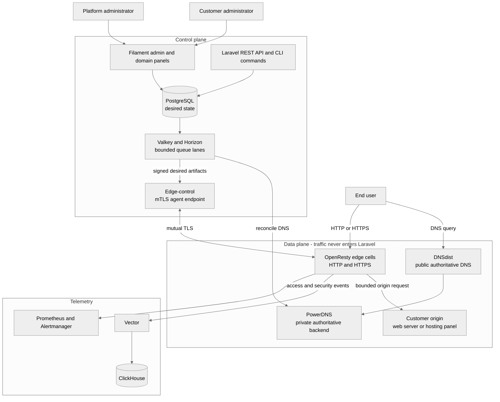
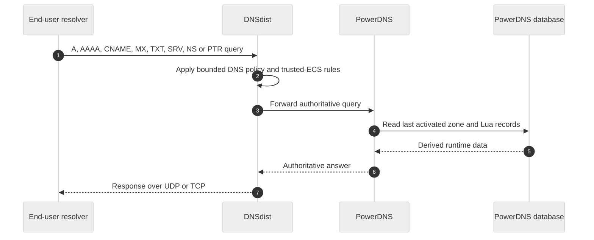
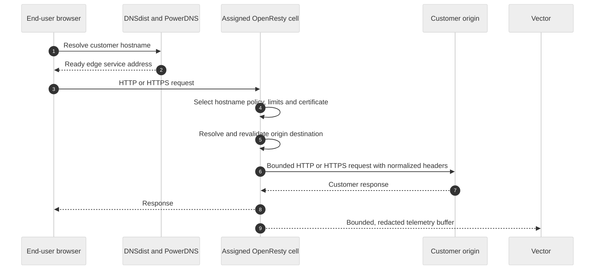
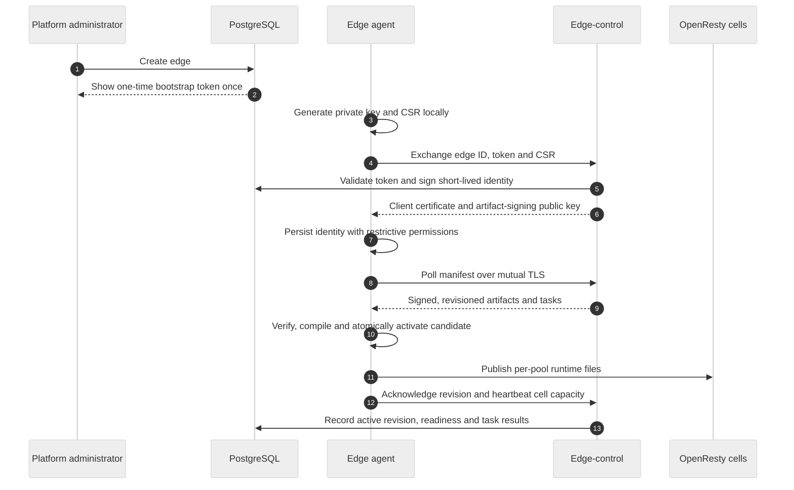
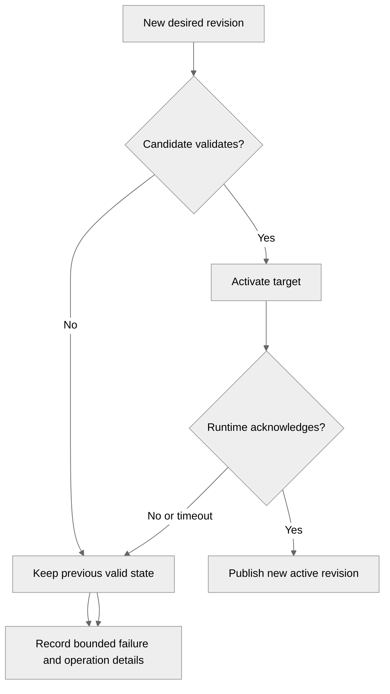
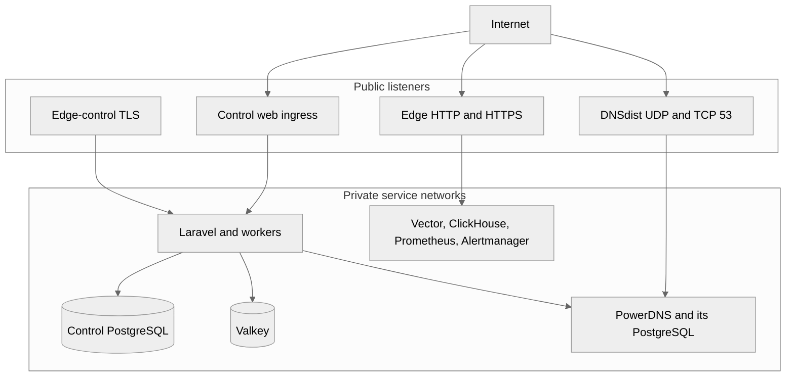

# CDNFoundry architecture

This document explains the complete CDNFoundry design in operational language. It is intended for system administrators, network administrators, developers, and incident responders. The diagrams are deliberately small and top-to-bottom so they remain readable on narrow screens as well as desktops.

## The short version

CDNFoundry has two separate paths:

- The **data plane** answers DNS and serves customer HTTP/HTTPS traffic. It stays available without Laravel.
- The **control plane** stores desired state in PostgreSQL, validates changes, and asynchronously publishes immutable runtime state.

PostgreSQL is the source of truth. PowerDNS tables, edge JSON files, signed artifacts, and ClickHouse aggregates are derived and can be rebuilt. A failed update never replaces the last valid DNS zone or edge runtime.



## Who owns what

| State | Authority | Notes |
|---|---|---|
| Users, domain assignments, tokens, domains, DNS records, origins, pools, placements, settings, operations and audit logs | PostgreSQL | Durable source of truth |
| Platform-setting values and defaults | PostgreSQL | Changed through API, CLI, or UI; not runtime environment variables |
| PowerDNS records and metadata | Derived PowerDNS PostgreSQL | Reconciled from desired state; direct PowerAdmin edits are drift |
| Edge manifests and domain artifacts | Derived PostgreSQL rows | Deterministic, revisioned, checksummed, and signed |
| Active edge runtime JSON | Derived file on each edge | Atomically activated only after validation |
| Raw and aggregated traffic analytics | ClickHouse | Never used to decide whether a request may be served |
| Sessions, queues, locks and rate limits | Valkey | Operational state, not product truth |
| Application keys, signing keys, identity CAs and TLS private keys | External secret storage/files | Required for recovery; never stored in normal settings rows |

## End-user DNS traffic

DNSdist is the only public authoritative DNS endpoint. PowerDNS remains private and never calls Laravel during a query.



Geo-DNS chooses a country override first, then a continent override, then the mandatory default. If trusted ECS is absent, classification uses the recursive resolver address. Both IPv4 and IPv6 answer paths are supported. A CNAME must be the only record at its owner name, regardless of whether it is DNS-only or geographic.

## End-user web traffic to the customer origin

One proxied hostname has exactly one validated origin. The edge resolves the origin again before connection and blocks loopback, link-local, metadata, multicast, platform, edge, proxy-loop, and disallowed private destinations.



For plain HTTP origins the standard UI uses port `80` and has no TLS verification or SNI fields. For HTTPS it uses port `443`; certificate verification and SNI are explicit. The API retains deliberate custom-port support for advanced integrations. Connect timeouts, response timeouts, retries, request bodies, response buffering, headers, connections, and temporary storage are bounded.

## A customer or administrator changes configuration

An HTTP request never waits for PowerDNS, an edge, certificate issuance, or a deployment. It validates and stores desired state, increments a revision, commits, and queues one coalesced job.

```mermaid
%%{init: {"sequence": {"useMaxWidth": true}, "theme": "neutral"}}%%
sequenceDiagram
    autonumber
    participant UI as UI, API or CLI
    participant L as Laravel
    participant PG as PostgreSQL
    participant H as Horizon worker
    participant R as DNS or edge runtime

    UI->>L: Authenticated mutation
    L->>L: Policy, type, bounds and idempotency validation
    L->>PG: Transaction: desired state, revision, audit, operation
    PG-->>L: Commit
    L-->>UI: Saved or 202 with operation ID
    L->>H: Dispatch unique/coalesced job after commit
    H->>PG: Re-read current revision; skip obsolete work
    H->>H: Render, checksum and validate candidate
    H->>R: Activate candidate asynchronously
    R-->>H: Verify and acknowledge
    H->>PG: Record success, failure and active revision
```

If no ready edge exists, a proxied record is still valid desired state. The UI says that it is saved but not ready to serve. Once an agent enrolls and reports a ready listener, reconciliation publishes the pending revision. This avoids losing user intent while never pretending the platform is ready.

## Edge enrollment and ongoing control

Each edge has one Go agent and one or more data-driven OpenResty cells. Cells represent shared, quarantine, or exceptional dedicated pools; CDNFoundry does not create a process or container per customer domain.



The bootstrap token is removed after successful enrollment. Normal traffic uses the persisted client identity. Rotating an identity revokes the previous certificate and issues a new one-time token. A stale or revoked edge is automatically excluded from published routing.

## DNS and edge deployment failure behavior



Important guarantees:

- An invalid PowerDNS replacement never removes the active zone.
- An invalid edge bundle never replaces the active JSON runtime.
- Pool movement activates and publishes the target before draining the source.
- Duplicate jobs are coalesced and obsolete revisions are skipped.
- Agent, telemetry, ClickHouse, and Laravel failures do not stop already-active edge traffic.
- Telemetry buffers are bounded; dropping telemetry is safer than stopping delivery.

## Control-plane components

| Component | Responsibility | Does not do |
|---|---|---|
| Laravel modular monolith | UI, API, policies, validation, desired state, audit and operation creation | Serve DNS or proxy user traffic |
| Filament admin panel | Platform users, DNS clusters, settings, operations, audit, edges and pools | Maintain a separate backend |
| Filament domain panel | Assigned domains, DNS, origins, proxy policy and user-visible operations | Bypass Laravel policies |
| PostgreSQL | Durable desired state and revision history | Act as an edge request dependency |
| Valkey and Horizon | Four bounded queue lanes, cache, sessions, locks and limits | Own product state |
| Scheduler | Periodic checks, renewal spreading, pruning and bounded maintenance | Create per-domain timers |
| Edge-control Nginx | Dedicated TLS/mTLS boundary for agent routes | Expose normal control-panel routes |

Queue lanes are separated so a bulk job cannot starve interactive or runtime work:

1. `interactive`
2. `runtime`
3. `certificate_purge`
4. `bulk_maintenance`

## Data-plane components

| Component | Exposure | Responsibility |
|---|---|---|
| DNSdist | Public UDP/TCP 53 | Authoritative DNS entry point, rate controls and ECS trust boundary |
| PowerDNS | Private | Authoritative records, Lua Geo-DNS and monotonic zone serials |
| OpenResty shared cells | Public HTTP/HTTPS | Normal customer delivery from one data-driven runtime |
| OpenResty quarantine cells | Usually separately addressed | Isolated noisy or risky workloads |
| OpenResty dedicated cells | Exceptional and explicitly provisioned | A bounded pool for a justified customer, never the default |
| Go edge agent | Outbound control connectivity | Identity, artifact verification, atomic activation, heartbeat and cell tasks |
| Vector | Private/local | Direct bounded telemetry shipping to ClickHouse |

## Network boundaries



Only web ingress, DNSdist, edge listeners, and the dedicated agent control endpoint need public reachability. Control PostgreSQL, PowerDNS, Valkey, ClickHouse, and PHP-FPM remain private.

## Permissions and security boundaries

- Administrators have `users.type = admin`; domain users are restricted to assigned domains by the same policies in sessions and token requests.
- Mutations support `Idempotency-Key`; reuse with different input is a conflict.
- Lists use cursor pagination and bulk payloads have explicit limits.
- Secrets are shown only at their one-time boundary and are redacted from logs and idempotency records.
- Edge configuration is signed; edge agent communication after enrollment uses mutual TLS.
- The identity-CA private key is readable only by the unprivileged control-plane signing worker and its owning secret group.
- Customer TLS keys are validated, encrypted, and never sent to unassigned cells.
- Origin Host, forwarding, upgrade, and hop-by-hop headers are normalized at the edge.

## Scaling model

CDNFoundry scales by adding capacity to existing roles:

- more Horizon workers per bounded queue lane;
- more DNSdist/PowerDNS capacity;
- more ClickHouse/Vector capacity;
- more edge nodes and bounded OpenResty cells.

It does not require Kubernetes, Kafka, microservices, a container per domain, a worker per domain, an Nginx server block per domain, or an Nginx reload for normal domain changes.

## Development topology

`compose.dev.yml` starts real PowerDNS/DNSdist, the mTLS edge-control endpoint,
and OpenResty runtimes. `make dev-edge-up` additionally starts two real agents
configured from the gitignored `.env.dev` file. Each agent owns a persistent
identity volume and a separate runtime-state volume shared by its own shared and
quarantine cells.

Local ports are documented in [development-stack.md](development-stack.md). Production host roles, immutable GHCR images, networks, volumes, resource limits, and secret paths are documented in [production-layout.md](production-layout.md).

## Operator troubleshooting map

| Symptom | First checks |
|---|---|
| Proxy defaults save but traffic does not change | Confirm at least one DNS record is in Proxied mode, then check placement, operation, ready edge heartbeat and active revision |
| Edge Cells shows awaiting enrollment | Start the agent with the exact edge ID and one-time token; inspect edge-control and agent logs |
| Edge enrolled but Cells awaits heartbeat | Check runtime status URLs/token, cell names, agent network reachability and heartbeat validation errors |
| Geo-DNS CNAME will not save | Use a unique owner name; CNAME cannot coexist with A, AAAA, NS or another CNAME at that owner |
| DNS desired state saved but query is old | Inspect DNS deployment per cluster, PowerDNS API health, operation error and active serial |
| Candidate deployment failed | Fix the bounded validation error; the previous valid zone/runtime should still serve |

## Recovery essentials

A recoverable control plane requires backups of PostgreSQL plus external copies of the Laravel encryption key, artifact-signing key, edge identity CA, and managed TLS material. PowerDNS data, edge snapshots, and analytics aggregates alone are not sufficient backups; they are derived. Restore keys and PostgreSQL first, then rebuild and reconcile runtime state.
