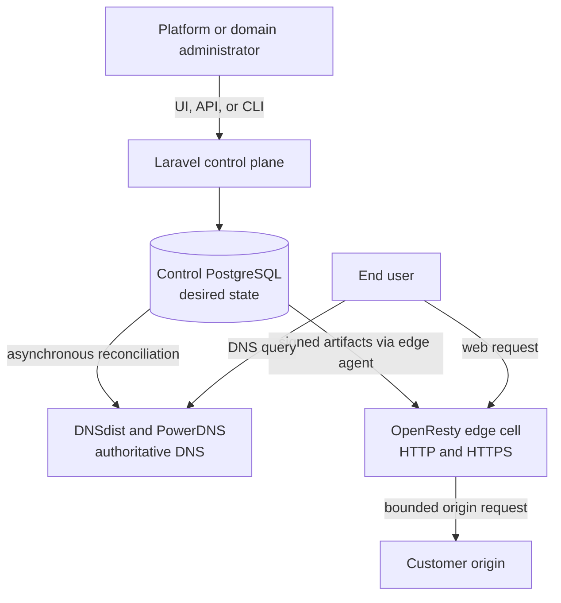
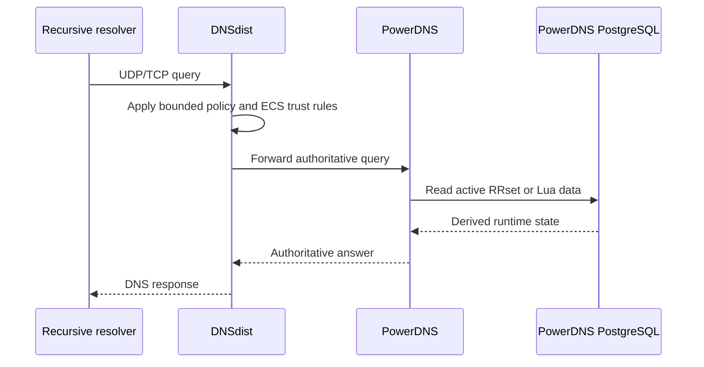
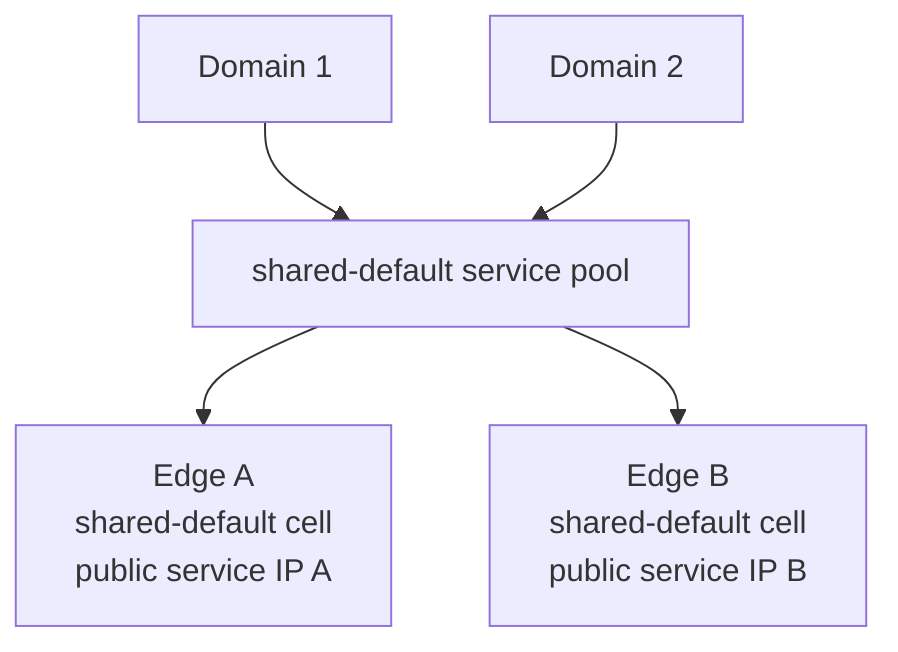
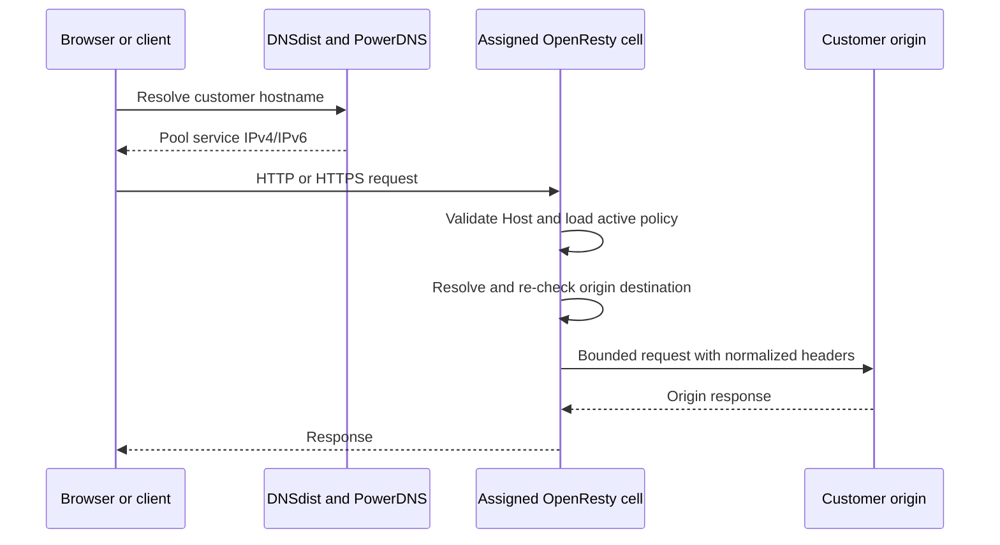
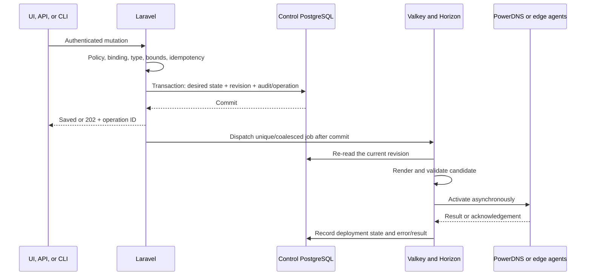
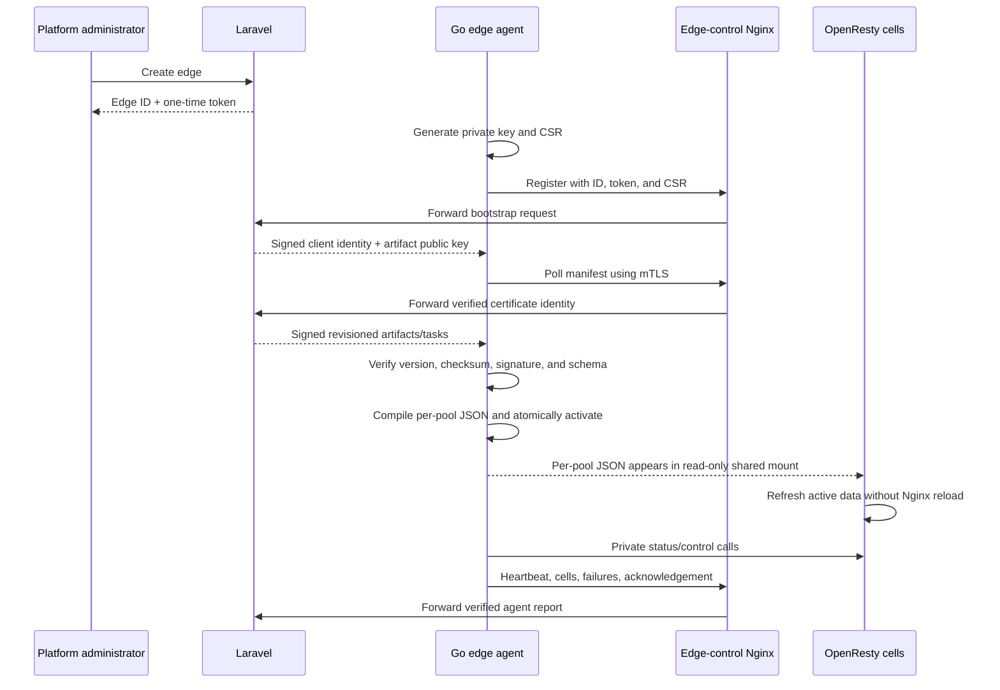
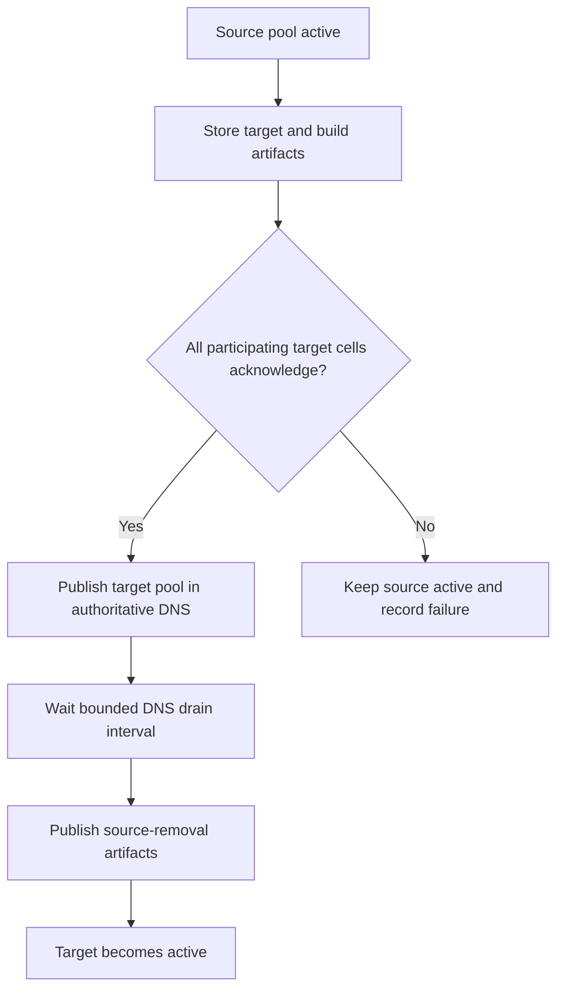

# CDNFoundry architecture

This is the architecture that exists in the repository today. It describes the
current control plane, authoritative DNS path, Phase 4 proxy path, service-pool
placement, and failure behaviour. Later roadmap features are called out
separately so operators do not mistake planned work for a deployed capability.

The diagrams run top to bottom and avoid wide component maps so they remain
readable on phones, terminals, and normal documentation panes.

## Mental model

CDNFoundry has two independent planes:

- The **control plane** accepts administrator and domain-user changes, validates
  them, and stores desired state in control PostgreSQL.
- The **data plane** answers DNS and carries end-user HTTP/HTTPS traffic. It does
  not call Laravel while serving a request.



If Laravel, Horizon, Valkey, or control PostgreSQL is temporarily unavailable,
the last activated PowerDNS zone and edge runtime continue serving. New changes
wait until the control plane recovers.

## State ownership

| State | Owner | Recovery meaning |
|---|---|---|
| Users, tokens, domain assignments, domains, desired DNS, origins, settings, pools, placements, operations, audits | Control PostgreSQL | Authoritative product state |
| PowerDNS records and Lua programs | Separate PowerDNS PostgreSQL | Derived; rebuild from control PostgreSQL |
| Edge revisions and signed artifacts | Control PostgreSQL | Derived from current desired revisions |
| Agent identity and active runtime JSON | Persistent storage on each edge | Derived; agent can fetch a full snapshot |
| Queues, locks, sessions, and rate-limit counters | Valkey | Operational state, not product truth |
| GeoIP database | Validated MMDB volume | Replaceable runtime input |
| Application key, artifact signing key, edge identity CA, listener keys | Secret files/environment at deployment | External recovery material; never normal platform settings |

Operator-tunable platform values live in the typed `system_settings` rows in
control PostgreSQL and are exposed through the UI, API, and CLI. Environment
variables are limited to deployment wiring, bootstrap credentials, bind
addresses, and secrets.

PowerAdmin is diagnostic only. Editing its PowerDNS database changes derived
runtime state, not CDNFoundry desired state, and a later reconciliation can
replace that drift.

## Authoritative DNS request path

DNSdist is the only public authoritative DNS listener. PowerDNS and its
PostgreSQL backend remain private.



Normal records return their stored DNS-only answer. Geo-DNS Lua selects a
country override, then a continent override, then the required default. Trusted
ECS is used when configured; otherwise location is based on the recursive
resolver address. No DNS query calls Laravel or an external GeoIP service.

## What a service pool is

A service pool is not an origin pool and is not a container per customer. It is
a stable delivery class made of equivalent OpenResty cells and their public
service addresses.



The pool kinds have deliberately narrow meanings:

| Kind | Use |
|---|---|
| `shared` | Normal domains; stable placement chooses one enabled shared pool |
| `quarantine` | Explicit isolation for noisy, attacked, or risky domains |
| `dedicated` | Administrator-created exceptional capacity; never automatic per domain |

One pool maps to at most one cell on each participating edge. A cell is a
resource-bounded OpenResty container or process group using the same generic
runtime image as every other cell. Many domains share a cell. Adding a domain
does not create a process, container, server block, cache directory, worker, or
reload.

Pools exist for two reasons: stable public routing and bounded blast radius. A
domain can move from shared to quarantine without changing its origin model or
mixing quarantine traffic into the shared cell.

## How proxied DNS is published

Every proxied hostname has exactly one origin. That rule applies to the routing
record, not to unrelated apex mail or verification records.

### Proxied subdomain

`www.example.com` publishes a CNAME to its assigned pool, for example:

```text
www.example.com.  CNAME  pool-1.proxy.cdnf.example.
```

The pool hostname returns healthy service addresses using country, then
continent, then global fallback. It is intentionally pool-specific. The generic
`proxy.cdnf.example` name aliases only the default shared pool and cannot
represent a domain moved to quarantine or dedicated capacity.

Because the generated subdomain record is a CNAME, it must be the only record at
that owner name.

### Proxied apex

The zone apex cannot normally be a CNAME because it must also contain SOA and NS
and often contains MX/TXT/CAA. CDNFoundry therefore publishes PowerDNS Lua A and
AAAA answers that look up the same pool routing data.

```text
example.com.  LUA  A     <bounded lookup of pool-1 routing data>
example.com.  LUA  AAAA  <bounded lookup of pool-1 routing data>
example.com.  MX   10 mail.example.net.
example.com.  TXT  "verification=value"
```

An apex proxy may coexist with MX, TXT, CAA, NS, and other non-address records.
It cannot coexist with another A, AAAA, or CNAME because those would compete
with the managed pool answer. If an apex Geo-DNS or DNS-only A/AAAA already
exists, edit that record to Proxied or remove it before adding the proxy.

## End-user HTTP/HTTPS path



OpenResty loads a per-pool runtime JSON file. It selects the hostname policy,
sets the configured origin Host header and SNI, strips/replaces forwarding and
hop-by-hop headers, and uses bounded connections, request sizes, buffers,
timeouts, and retries. The dynamic balancer revalidates resolved origin
addresses before connecting and rejects loopback, link-local, metadata,
multicast, platform, edge-service, proxy-loop, and other blocked destinations.

The standard UI maps HTTP to port 80 and HTTPS to port 443. The typed API allows
a deliberately configured custom port. TLS verification is meaningful only for
HTTPS origins.

## Administrator change to active runtime

An interactive request stores intent; it does not wait for PowerDNS or edges.



If no edge is ready, a valid proxied record remains saved desired state. It is
not advertised as ready. Enrolling a ready edge triggers reconciliation of the
waiting proxy state.

## DNS reconciliation

The runtime queue worker renders deterministic RRsets from the current domain,
platform DNS identity, and active/target placement. For each enabled DNS
cluster it:

1. records the desired revision and attempt;
2. skips an obsolete revision;
3. creates the zone if absent through the private PowerDNS HTTP API;
4. sends one bounded RRset patch containing replacements and removals;
5. records the checksum and deployed revision only after success.

PowerDNS itself writes its private PostgreSQL backend. Laravel does not write
that database directly. Failed rendering or API activation leaves the recorded
previous RRsets/deployed revision as the last valid state and exposes the error
through the operation and DNS deployment status.

## Edge enrollment and artifact flow

Each physical edge node has one Go edge agent and one or more OpenResty cells.
The agent—not OpenResty—talks to the control plane.



`edge-control` is a dedicated Nginx TLS/mTLS boundary. It does not own desired
state or compile artifacts; it exposes only `/edge/v1` to the same Laravel
monolith and passes the verified client-certificate result/serial to Laravel.

The agent keeps its issued identity and the last valid state in persistent
storage. It writes a separate JSON file per pool into storage mounted read-only
by each cell. OpenResty refreshes the data without a normal configuration reload.
Cell drain, undrain, restart, capacity, and passive-origin status use a private
token-protected status listener between the local agent and cells.

## Pool placement and safe movement

Initial shared placement uses a stable hash of the domain name across enabled
shared pools. A move keeps source and target explicit:



An unaddressed cell is not a routing participant. A participating cell must have
the required public service addresses and report a fresh, ready listener. A
failed target never causes early source removal.

## Network and process boundaries

| Listener/service | Exposure | Purpose |
|---|---|---|
| Web Nginx | Public/reverse-proxied | Filament, REST API, health, Horizon access policy |
| Edge-control Nginx | Public to edge nodes | Agent bootstrap and mTLS `/edge/v1` only |
| DNSdist UDP/TCP 53 | Public | Only authoritative DNS entry point |
| OpenResty cell HTTP/HTTPS | Public service addresses | Customer traffic |
| Laravel PHP-FPM, Horizon, scheduler | Private control network | Control-plane execution |
| Control PostgreSQL and Valkey | Private control network | Desired/operational state |
| PowerDNS and PowerDNS PostgreSQL | Private DNS network | Derived authoritative runtime |
| OpenResty status port | Private edge network | Agent-only cell status/control |

Production Compose uses separate `control`, `ingress`, `dns-private`,
`telemetry`, and `edge` networks. Internal databases are not published. Profiles
allow control, DNS, telemetry, and edge roles to run on separate hosts with
site-specific routing/firewall overrides.

## Permissions and secret boundaries

- `users.type = admin` grants platform administration. Domain users are limited
  to assigned domains by the same policies and route bindings for sessions and
  API tokens.
- Mutations support `Idempotency-Key`; a reused key with different input is a
  conflict. Bulk inputs and list sizes are bounded.
- Personal tokens and edge bootstrap tokens are displayed only at creation.
- Edge artifacts are signed. Agent private keys are generated and retained on
  the edge; post-registration control requests use mTLS.
- The artifact signing key, Laravel application key, edge identity CA private
  key, control endpoint key, and runtime listener keys are deployment secrets,
  not database platform settings.
- Origin destinations are validated both when desired state is accepted and
  again immediately before an edge connects.

## Failure behaviour

| Failure | Expected result |
|---|---|
| Invalid domain DNS candidate | No PowerDNS activation; operation records error |
| PowerDNS API unavailable | Existing authoritative zone keeps serving; queued work retries |
| Invalid/tampered edge artifact | Agent rejects it and retains active JSON |
| Edge misses heartbeat or listener is unready | Its cell addresses disappear from shared pool routing data |
| Target pool does not acknowledge | Source pool remains active |
| Laravel/Valkey/control PostgreSQL outage | Existing DNS and edge traffic continue; changes pause |
| Agent/control link outage | OpenResty continues with last valid local runtime |
| One cell fails | Other cells/edges and unrelated pools continue within available capacity |

The system reduces blast radius and bounds local resource use. It does not claim
to scrub volumetric attacks after an edge uplink is saturated.

## Scaling model

Capacity grows by adding more workers within bounded queue lanes, more
DNSdist/PowerDNS capacity, more edge nodes, and a bounded number of cells/pools.
Normal domain placement does not reshuffle unrelated domains. Bulk maintenance
uses a separate lane so it cannot consume every interactive/runtime worker.

The four queue lanes are `interactive`, `runtime`, `certificate_purge`, and
`bulk_maintenance`.

## Current implementation boundary

Do not infer later roadmap features from containers or schema that already
exist:

- The current edge Compose listener uses mounted TLS certificate/key files.
  Full per-host managed certificate issuance/distribution belongs to the later
  TLS roadmap phase.
- The cache control plane stores bounded desired settings, an epoch, and durable
  per-edge purge tasks. Edge agents apply purge generations to every bounded
  cell through authenticated control endpoints. The current OpenResty path
  remains a proxy runtime without customer-content response caching; advanced
  security profiles and analytics dashboards are also later work.
- ClickHouse is provisioned and Vector currently exports its own internal
  Prometheus metrics. The repository does not yet claim that raw edge request
  telemetry is flowing into ClickHouse.
- Prometheus/Alertmanager services exist, but complete product monitoring and
  alert coverage must follow their roadmap qualification rather than being
  assumed from container presence.

Verified completion status remains in [roadmap.md](roadmap.md). This distinction
is important: architecture documentation must describe real runtime behaviour,
not turn future acceptance criteria into present-tense claims.

## Development and production maps

The supported local workflow is [development-stack.md](development-stack.md).
It includes real PowerDNS/DNSdist, two shared and two quarantine OpenResty cells,
an mTLS edge-control endpoint, and optional real agents enrolled with UI-created
one-time tokens.

Production host profiles, immutable commit-SHA GHCR images, resource limits,
secret mounts, and recovery material are in
[production-layout.md](production-layout.md). `compose.prod.yml` contains no
`latest` tag and no production build instruction.

## First troubleshooting checks

| Symptom | Check |
|---|---|
| Apex proxy will not save | Edit/remove an existing apex A/AAAA/CNAME; MX/TXT/CAA may remain |
| Proxied subdomain seems absent in PowerAdmin | Look for `CNAME pool-<id>.<proxy-hostname>`, then check the domain DNS deployment status |
| Pool CNAME exists but has no addresses | Check pool enabled state, cell service IPs, edge heartbeat, listener readiness, and drain state |
| Desired proxy saved but not live | Check active placement, edge acknowledgements, active edge revision, and enabled DNS cluster deployment |
| Edge row exists but is not ready | Enroll the real agent with that row's ID/token and inspect shared/quarantine cell heartbeat details |
| DNS query returns old data | Check operation/deployment error and revision; PowerAdmin direct edits are not desired state |
| Pool move is stuck | Inspect target-cell addresses/acknowledgements and the placement's last error; do not remove the source manually |
