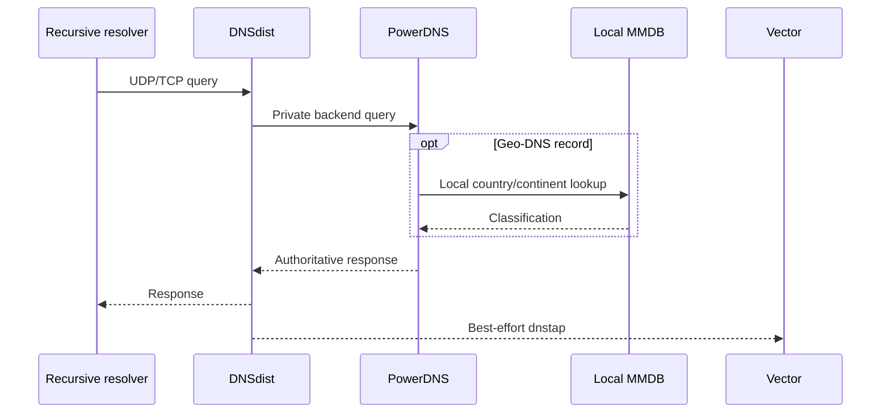
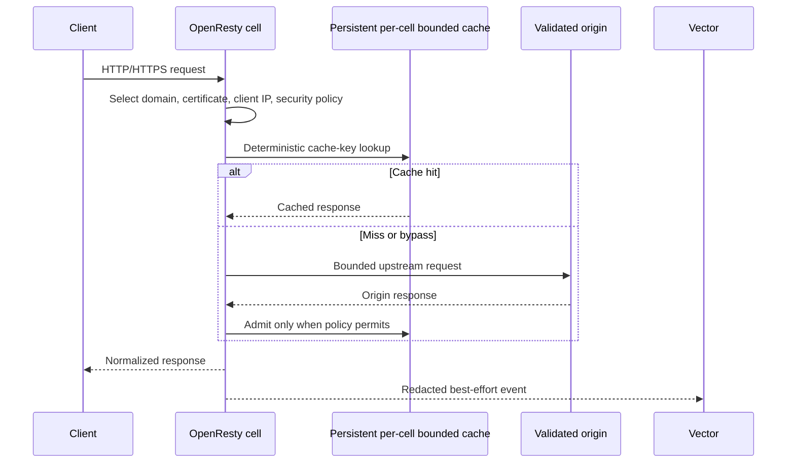
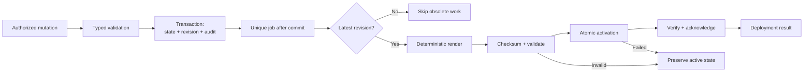
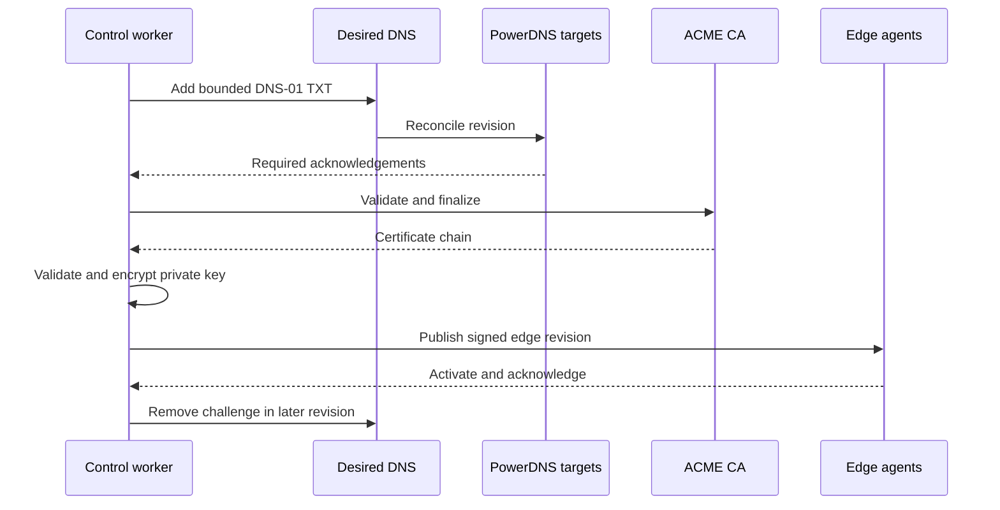
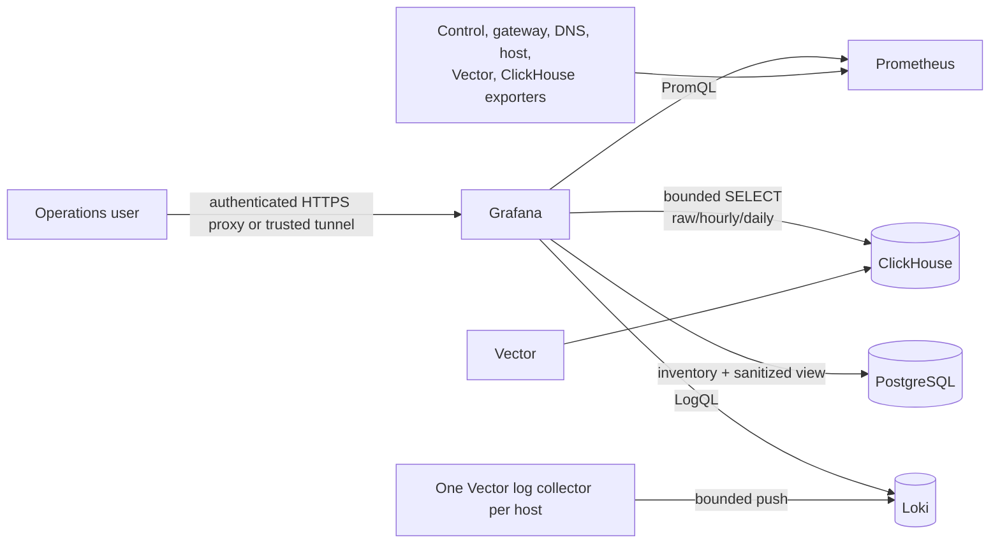

# Architecture data flows

## Authoritative DNS

1. A resolver sends UDP or TCP DNS to DNSdist.
2. DNSdist selects the first available private PowerDNS backend.
3. PowerDNS reads the derived runtime database.
4. Geo-DNS Lua records consult the local memory-mapped MMDB and EDNS Client Subnet when present.
5. DNSdist emits best-effort dnstap to Vector after answering.

Laravel is absent from this path.

## Customer HTTP and HTTPS

1. DNS returns a listener-ready pool address.
2. The client connects to the assigned OpenResty cell.
3. OpenResty rejects unknown hosts and selects the certificate from runtime data.
4. Lua resolves the trusted client address, applies pool/domain maintenance, ordered security rules, profile ceilings, cache policy, and origin policy.
5. A cache hit returns locally; a miss uses the explicitly configured origin.
6. Access telemetry goes directly to Vector.

Laravel and ClickHouse are absent from the serving decision.

## Runtime mutation

1. The API or Filament action validates and commits desired state.
2. A revision and audit event are recorded transactionally.
3. A unique job renders DNS RRsets or a canonical edge snapshot.
4. The target validates and activates the candidate.
5. Deployment rows, tasks, and operations record acknowledgement or failure.

See [Desired state](../concepts/desired-state.md) for failure behaviour.

## Edge enrollment and sync

1. An administrator creates the edge and receives a one-time token.
2. The agent opens an outbound connection to `EDGE_CONTROL_URL`, creates a
   private key, and submits a CSR whose common name is the edge UUID.
3. Edge control validates the token and signs a short-lived identity certificate.
4. Later requests require that certificate and its serial.
5. The agent polls for tasks and fetches the manifest or a full recovery snapshot.
6. It verifies, compiles, atomically activates, then acknowledges.
7. Heartbeats report sequence, listener readiness, cell capacity, origin health, and bounded security summaries.

Laravel and its workers never initiate a connection to an edge host. They
commit desired state, artifacts, and durable tasks; the agent pulls them over
its outbound control connection and posts results. Therefore an edge does not
need an inbound management address for control delivery.

## Pool routing

Geo-Unicast stores a distinct address pair on each edge/pool endpoint and
renders country, continent, and global fallback data. Simple Anycast stores one
pair on the pool; every attached ready edge receives the same binding and DNS
publishes that pair while any endpoint remains ready. The operator/provider is
outside this activation flow and exclusively owns BGP advertisement,
withdrawal, and route evidence. CDNFoundry has no router credential or command
path.

## Managed TLS

1. An active, nameserver-verified domain gains its first proxied hostname.
2. A bounded certificate job creates or reuses the ACME account.
3. DNS-01 challenge TXT records are added to desired DNS and reconciled.
4. Issuance waits for DNS acknowledgement before notifying the CA.
5. The validated key and certificate are encrypted/stored, then included in a new edge revision.
6. Challenge state is removed through another DNS revision.

DNS-only domains do not create orders.

## Telemetry

OpenResty sends JSON logs to Vector; DNSdist sends dnstap. Vector removes
authorization, cookies, bodies, and query strings, bounds field length, and
writes ClickHouse. The API queries raw data for at most 24 hours and aggregates
for at most 90 days. Usage rollups are finalized into compact PostgreSQL rows.

::: info Independence rule
Telemetry is downstream of serving. Bounded buffers may sacrifice telemetry
when exhausted, but telemetry backpressure must never enter DNS or HTTP paths.
:::

## Operator observability

Grafana provisions exactly a system and a domain command center. The domain
selector comes from non-deleted PostgreSQL domains, while traffic panels query
ClickHouse by numeric domain ID. Prometheus supplies current health, alerts,
capacity, infrastructure, and gateway metrics. Loki supplies normalized,
redacted operational logs and live tail; HTTP access and DNS queries remain
exclusively in ClickHouse. Each datasource account is
read-only and independently bounded. Grafana does not proxy telemetry
ingestion, call Laravel per panel, or participate in a customer request.
