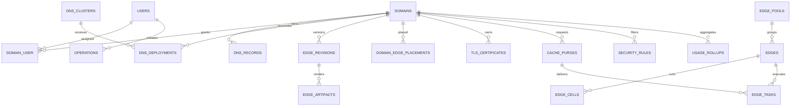

# Data model

The migrations define these major durable groups.

| Group | Tables and purpose |
| --- | --- |
| Identity | `users`, `personal_access_tokens`, `domain_user` assignments |
| Audit and request safety | `audit_logs`, `idempotency_keys`, `operations` |
| Domains | `domains`, `domain_name_tombstones` |
| DNS | `dns_records`, `dns_clusters`, `dns_deployments`, `platform_dns_settings`, `platform_dns_deployments` |
| Edge | `edge_pools`, `edges`, `edge_cells`, `domain_edge_placements`, `edge_revisions`, `edge_artifacts`, `edge_tasks` |
| Cache | domain cache fields and `cache_purges` linked to edge tasks |
| TLS | `tls_certificates`, `tls_orders`, `acme_accounts`, `acme_challenges` |
| Security | domain security state, `security_rules`, `security_events`, `emergency_modes` |
| Analytics and operations | `usage_rollups`, `backups`, Laravel jobs and failed jobs |
| Product policy | `system_settings` JSONB groups validated by `config/platform.php` |

Domain records use integer identifiers. Edges, operations, tasks, backups,
purges, certificates, orders, and challenges use UUIDs where they cross process
or host boundaries.

## Correctness constraints

Database constraints protect unique domain names, edge identities and
addresses, pool/cell relationships, logical DNS records, monotonic per-domain
edge revisions, artifact content identity, active deployment relationships,
cache purge task delivery, and usage intervals.

JSON and JSONB columns are not arbitrary extension bags. Controllers and support
types validate proxy, origin, Geo-DNS, cache, security, operation, capacity, and
platform-setting shapes before storage.

## Identity and authorization relationships

`users.type` distinguishes administrators from domain users. The `domain_user`
pivot is the customer-scope assignment. Policies apply that relationship to
browser sessions and Sanctum tokens; scoped binding prevents a child record
from being addressed through another domain URL.

## Revision relationships

Domain changes monotonically increase desired revision. DNS deployments track
candidate and active checksums per cluster. Edge revisions retain canonical
state and artifacts; placements and tasks record delivery. Rollback creates a
new higher revision instead of decreasing a sequence.

## Secret-bearing rows

Recoverable application secrets are encrypted using the application key. API
tokens are one-way hashed. One-time bootstrap and plaintext token boundaries
cannot be replayed from normal status endpoints.

::: danger Recovery dependency
A PostgreSQL dump without the original encryption/signing keys and external
TLS material is not a complete recovery set.
:::

## Derived data

The PowerDNS schema under `docker/postgres/` is migrated separately. It can be
rebuilt by global DNS reconciliation from the control database. Edge artifacts
and snapshots can be rebuilt from desired domain and placement state.
ClickHouse raw events and aggregates are operational telemetry, not
authoritative configuration.
