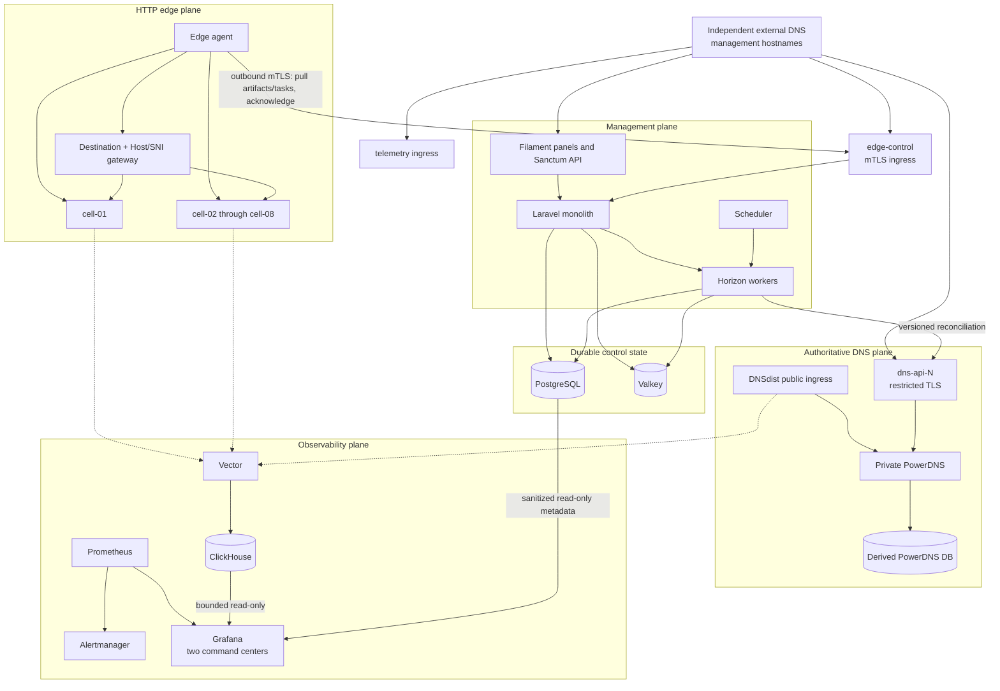

# System architecture

CDNFoundry is a modular Laravel monolith surrounded by specialized data-plane
services. PostgreSQL stores desired state. PowerDNS data, signed edge artifacts,
runtime snapshots, cache contents, ClickHouse events, and aggregates are derived
or rebuildable.

## DNS namespaces and addresses

| Namespace or address | Owner and purpose | CDNFoundry PowerDNS? |
| --- | --- | --- |
| `control.<operator-zone>`, `edge-control.<operator-zone>`, `telemetry.<operator-zone>`, `grafana.<operator-zone>`, `dns-api-N.<operator-zone>` | Independent external DNS provider; management and recovery reachability | Never |
| `ns1.<platform-zone>`, `ns2.<platform-zone>` and glue | Parent/registrar delegation to public DNSdist addresses | Served by DNSdist from derived PowerDNS state after bootstrap |
| Enrolled customer zones | PostgreSQL desired state reconciled into private PowerDNS databases | Yes |
| Edge pool service addresses | Public HTTP/HTTPS addresses selected through platform/customer DNS | Stored as platform desired state, not management addresses |
| Private PowerDNS, PostgreSQL, Valkey, ClickHouse, agent/status addresses | Host or private service networks | No public DNS required |

::: danger Avoid a DNS bootstrap loop
Management records must remain resolvable while CDNFoundry DNS is empty,
degraded, or being restored. Hosting them in the platform's own PowerDNS can
leave the DNS API and control plane unreachable precisely when operators need
them for repair.
:::

| Plane | Components | Responsibility |
| --- | --- | --- |
| Management | Laravel, Filament, Horizon, scheduler | Authorization, validation, desired state, operations, reconciliation |
| Durable control data | PostgreSQL, Valkey | Desired state, audit, operation records, queues, sessions, cache |
| Authoritative DNS | DNSdist, PowerDNS, PowerDNS PostgreSQL | Public DNS ingress and private authoritative answers |
| Edge HTTP | Edge agent, edge gateway, bounded OpenResty cells | Artifact activation, destination/Host/SNI routing, TLS selection, proxying, cache, security |
| Observability | Vector, ClickHouse, Prometheus, Alertmanager, Grafana | Bounded event delivery, analytics, metrics, alerts, read-only operator diagnosis |

Only DNSdist, mapped edge-gateway service listeners, and the browser/API reverse proxy
belong on public ingress. Edge control uses mutual TLS. Telemetry and PowerDNS
API gateways are source restricted by the production Caddy configuration. Internal
databases, Valkey, ClickHouse, raw metrics, Grafana port 3000, and PowerDNS
itself remain private. Remote Grafana access uses a deployment-owned
authenticated HTTPS proxy or trusted tunnel.

## Architectural decisions

### PostgreSQL owns intent

The control schema stores what the operator asked for, who may change it,
which revision is current, and whether derived targets acknowledged it.
PowerDNS tables, artifacts, active edge directories, cache objects, and
analytics aggregates can be rebuilt.

### Reconciliation owns side effects

Controllers and Filament actions validate, authorize, and commit desired state.
They do not call PowerDNS, ACME, an edge, an origin, or ClickHouse synchronously
to finish a mutation. Unique jobs coalesce work, skip obsolete revisions,
validate candidates, activate atomically, and record receipts.

### Data planes remain autonomous

An outage of Laravel, PostgreSQL, Valkey, ClickHouse, or Vector must not stop
an already-configured DNS answer or HTTP request. DNSdist and OpenResty operate
from private runtime state, and the edge agent retains active and previous
snapshots.

### Observability is read-only and downstream

Grafana reads Prometheus, bounded ClickHouse telemetry, and a sanitized
PostgreSQL view through separate least-privilege accounts. It cannot mutate
desired state or ingest traffic. The two provisioned dashboards are diagnostic
read models; dashboard or datasource failure cannot affect serving or
reconciliation.

### Scale uses bounded shared units

Domains are data inside shared DNS and OpenResty runtimes. Scale comes from
workers, DNS capacity, telemetry capacity, edge nodes, and bounded cells—not a
normal per-domain container, daemon, timer, cache directory, or reload.

::: warning Boundary test
If a feature requires Laravel, PostgreSQL, ClickHouse, or an external API
during a customer DNS or HTTP request, it violates the serving boundary.
:::

## Failure isolation

| Failure | Existing traffic | Management/recovery |
| --- | --- | --- |
| Laravel or PostgreSQL unavailable | DNS and HTTP continue from active runtime | UI, mutations, and reconciliation pause |
| One PowerDNS target fails | Other authoritative targets continue | Failed target keeps its last valid zone |
| Invalid edge artifact | Active cell continues | Candidate is rejected and failure recorded |
| ClickHouse or Vector unavailable | DNS and HTTP continue | Analytics becomes partial or unavailable |
| Grafana or Prometheus unavailable | DNS and HTTP continue | Command centers or alert evaluation become unavailable; source state is unchanged |
| Origin unavailable | Cache/stale policy may serve eligible objects | Origin health and errors become visible |

Continue with [Components](components.md), [Data flows](data-flows.md), and
[Data model](data-model.md). Before allocating production hosts, compare the
[Production reference architectures](production-reference-architectures.md).
