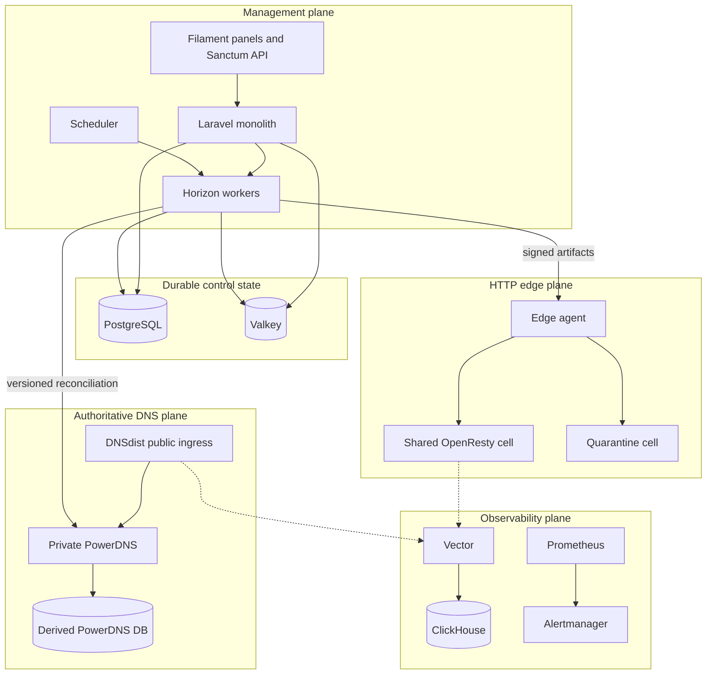

# System architecture

CDNFoundry is a modular Laravel monolith surrounded by specialized data-plane
services. PostgreSQL stores desired state. PowerDNS data, signed edge artifacts,
runtime snapshots, cache contents, ClickHouse events, and aggregates are derived
or rebuildable.

| Plane | Components | Responsibility |
| --- | --- | --- |
| Management | Laravel, Filament, Horizon, scheduler | Authorization, validation, desired state, operations, reconciliation |
| Durable control data | PostgreSQL, Valkey | Desired state, audit, operation records, queues, sessions, cache |
| Authoritative DNS | DNSdist, PowerDNS, PowerDNS PostgreSQL | Public DNS ingress and private authoritative answers |
| Edge HTTP | Edge agent, OpenResty cells | Artifact activation, TLS selection, proxying, cache, security |
| Telemetry | Vector, ClickHouse, Prometheus, Alertmanager | Bounded event delivery, analytics, metrics, alerts |

Only DNSdist, intended OpenResty listeners, and the browser/API reverse proxy
belong on public ingress. Edge control uses mutual TLS. Telemetry and PowerDNS
API gateways are source restricted in the production overlays. Internal
databases, Valkey, ClickHouse, raw metrics, and PowerDNS itself remain private.

## Architectural decisions

### PostgreSQL owns intent

The control schema stores what the operator asked for, who may change it,
which revision is current, and whether derived targets acknowledged it.
PowerDNS tables, artifacts, active edge directories, cache objects, and
analytics aggregates can be rebuilt.

### Reconciliation owns side effects

Controllers and Filament actions validate, authorize, and commit desired state.
They do not call PowerDNS, ACME, an edge, an origin, or ClickHouse synchronously
to finish a mutation. Unique jobs coalesce work, skip obsolete revisions,
validate candidates, activate atomically, and record receipts.

### Data planes remain autonomous

An outage of Laravel, PostgreSQL, Valkey, ClickHouse, or Vector must not stop
an already-configured DNS answer or HTTP request. DNSdist and OpenResty operate
from private runtime state, and the edge agent retains active and previous
snapshots.

### Scale uses bounded shared units

Domains are data inside shared DNS and OpenResty runtimes. Scale comes from
workers, DNS capacity, telemetry capacity, edge nodes, and bounded cells—not a
normal per-domain container, daemon, timer, cache directory, or reload.

::: warning Boundary test
If a feature requires Laravel, PostgreSQL, ClickHouse, or an external API
during a customer DNS or HTTP request, it violates the serving boundary.
:::

## Failure isolation

| Failure | Existing traffic | Management/recovery |
| --- | --- | --- |
| Laravel or PostgreSQL unavailable | DNS and HTTP continue from active runtime | UI, mutations, and reconciliation pause |
| One PowerDNS target fails | Other authoritative targets continue | Failed target keeps its last valid zone |
| Invalid edge artifact | Active cell continues | Candidate is rejected and failure recorded |
| ClickHouse or Vector unavailable | DNS and HTTP continue | Analytics becomes partial or unavailable |
| Origin unavailable | Cache/stale policy may serve eligible objects | Origin health and errors become visible |

Continue with [Components](components.md),
[Data flows](data-flows.md), and [Data model](data-model.md).
