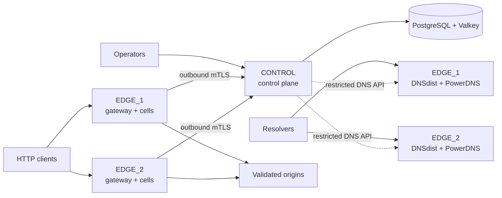
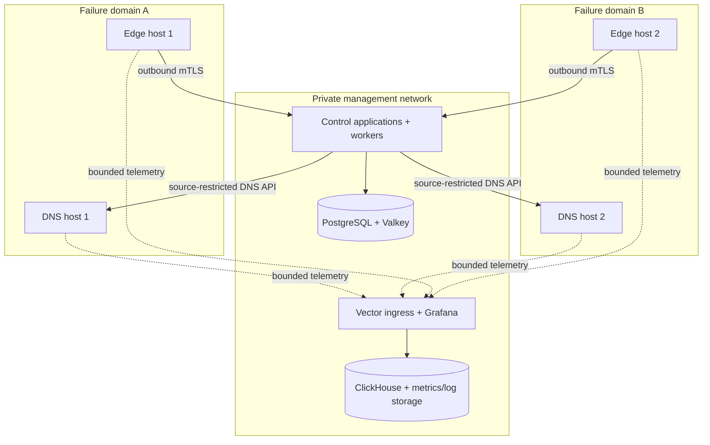
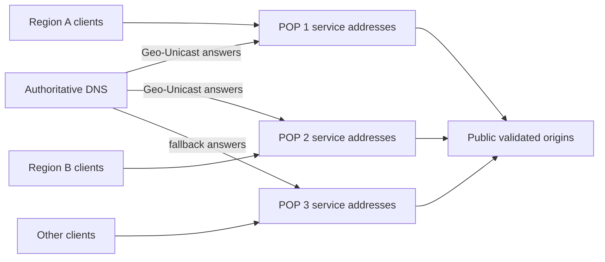
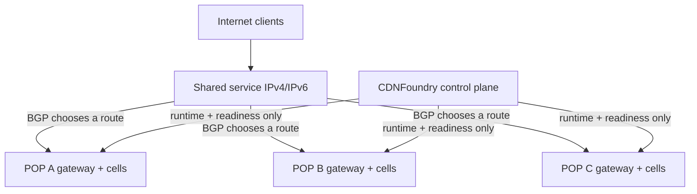

# Production reference architectures

There is no single best topology for every network. The recommended starting
architecture is the smallest design that provides two independent DNS and edge
failure domains while keeping internal services private. Split roles only when
measurement, ownership, or failure isolation requires it.

::: info Start small, preserve boundaries
Adding hosts does not improve reliability if they share one rack, uplink,
provider, route, power source, or administrative failure. Define failure
domains first; assign CDNFoundry roles second.
:::

## Design inputs

Record these before choosing a topology:

| Input | Questions |
| --- | --- |
| Audience | Internal users, one country, regional subscribers, or global clients? |
| Traffic | Peak bandwidth, requests/s, connections, TLS handshakes, DNS QPS? |
| Content | Object sizes, cacheability, churn, personalization, upload behavior? |
| Origins | Locations, public reachability, latency, capacity, failover ownership? |
| Network | Providers, IPv4/IPv6, NAT, firewall, load balancer, BGP capability? |
| Failure target | Which host, rack, POP, or provider losses must serving tolerate? |
| Recovery | Required RPO/RTO for desired state, keys, PKI, and TLS material? |
| Operations | Who owns DNS, routing, Linux, databases, incidents, and on-call? |

Published container limits are safety ceilings, not capacity claims. Qualify
the chosen hardware and real request mix.

## Architecture A: minimum production fleet

Use one control host and two combined DNS/edge hosts in distinct failure
domains.

Best for:

- first production deployments;
- a company, regional provider, or ISP proving real demand;
- moderate control-plane mutation volume;
- teams that prefer fewer hosts and clear recovery procedures.

Tradeoffs:

- `CONTROL` is one management failure domain;
- PostgreSQL and Valkey availability are operator-owned;
- DNS and edge share resources on each serving host;
- optional telemetry on `CONTROL` competes for host resources unless measured
  and constrained.

An outage of `CONTROL` pauses management but must not stop previously activated
DNS and HTTP service. Loss of either edge reduces redundancy; it must not leave
both authoritative nameservers or every pool endpoint unavailable.

Follow the [Production quick start](../deployment/production-quick-start.md) for
this topology.

## Architecture B: separated serving and observability roles

Use separate control, telemetry, DNS, and edge hosts when traffic or ownership
justifies independent scaling.

Best for:

- edge bandwidth or DNS load that should not compete on one host;
- a dedicated database or observability team;
- independent maintenance windows;
- deployments using the external control-data or telemetry-data overlays.

Tradeoffs:

- more certificates, firewall relationships, backups, upgrades, and alerts;
- an external database endpoint is not automatically highly available;
- separating roles without separate failure domains mainly improves resource
  isolation, not site resilience.

CDNFoundry supplies role overlays and external endpoints. It does not supply a
PostgreSQL, Valkey, or ClickHouse clustering product. The operator owns those
systems' quorum, fencing, failover, consistency, and restore qualification.

## Architecture C: multi-POP private CDN

Add qualified edge capacity by location while keeping domain state and runtime
formats shared.

Best for:

- operators with real POPs, local transit, and on-call ownership;
- latency or origin-offload goals supported by measurement;
- service pools that need distinct geographic endpoint pairs.

Each POP should have:

- independent power, network path, firewall, and monitoring where possible;
- stable local service addresses mapped one-to-one from advertised addresses;
- outbound mTLS reachability to edge control;
- bounded cells sized from its own traffic evidence;
- a documented drain and withdrawal procedure;
- IPv4/IPv6 parity only when both paths are qualified.

Geo-Unicast uses endpoint geography and readiness to render addresses. It is
not continuous latency-based global load balancing. DNS caches delay movement,
so test failure and recovery through at least the effective TTL window.

## Architecture D: operator-routed Simple Anycast

Simple Anycast publishes one pool address pair from multiple qualified edges.
The network operator advertises and withdraws those routes outside CDNFoundry.

Use this only when the operator can prove:

- the same address is assigned locally at every participating gateway;
- BGP advertisements and withdrawals are correct and monitored;
- return paths, stateful firewalls, and load balancers preserve connection
  behavior;
- IPv4 and IPv6 converge independently;
- a failed or partitioned POP does not black-hole traffic;
- routing evidence is retained for release qualification.

::: danger CDNFoundry does not operate BGP
Simple Anycast records desired membership and endpoint readiness. It has no
router credentials, does not advertise or withdraw a prefix, and cannot prove
Internet convergence. Routing automation and rollback remain entirely
operator-owned.
:::

Use [Simple Anycast](../operations/simple-anycast.md) and its
[qualification procedure](../operations/simple-anycast-qualification.md).

## Choose a placement model

| Requirement | Prefer | Reason |
| --- | --- | --- |
| Simplest two-site deployment | Geo-Unicast/global fallback endpoints | No BGP control required |
| Country/continent DNS preference | Geo-Unicast endpoint policy | Distinct service addresses can be selected in DNS |
| One stable service address across POPs | Simple Anycast | External routing selects the site |
| Per-record geographic values without proxy | Geo-DNS | Authoritative response feature, independent of pools |
| High-risk tenant isolation | Quarantine or exceptional dedicated pool | Separate bounded placement class |
| Normal multi-tenant service | Shared pool | Bounded data-driven cells, no per-domain process |

## Network boundaries

| Flow | Direction | Exposure rule |
| --- | --- | --- |
| Browser/API HTTPS | Operator/client → `CONTROL` | Public only through the authenticated reverse proxy |
| Authoritative DNS | Resolvers → DNSdist | Public TCP and UDP 53 |
| Customer HTTP/HTTPS | Clients → edge gateway | Public mapped service listeners |
| Edge control | Edge agent → `CONTROL` | Outbound mTLS from edge |
| PowerDNS API | Control workers → DNS API gateway | Source-restricted TLS; PowerDNS itself private |
| Telemetry | Edge/DNS Vector → telemetry endpoint | Bounded, authenticated/restricted where deployed |
| Databases and Valkey | Owning application roles only | Private; never general public ingress |
| Grafana | Operator → authenticated proxy/tunnel | Native port remains private or loopback |

Public/NAT identity is not necessarily a local bind address. Use a locally
assigned private address or wildcard bind behind DNAT/firewall for shared
listeners. Edge service addresses require an explicit advertised-to-local
gateway address map and a distinct local destination for each advertised
service address.

## Durable state and recovery placement

The production design must protect together:

- PostgreSQL desired state and audit history;
- `APP_KEY` and artifact-signing private key;
- edge-control and internal service PKI material;
- current customer TLS private keys and chains retained outside derived edge
  snapshots;
- backup repository password and least-privilege credentials;
- exact release identifiers and restore procedures.

PowerDNS runtime rows, edge artifacts, active snapshots, cache objects, and
telemetry aggregates are derived or expendable according to their documented
role. Do not promote manual runtime edits to source of truth.

## Growth path

1. Start with Architecture A and prove restoration and one-edge failure.
2. Add cells when cell pressure is the constraint.
3. Add an edge when host, address, bandwidth, or failure-domain capacity is the
   constraint.
4. Split DNS and edge roles when their resources or maintenance ownership
   conflict.
5. Split telemetry when retention and query load compete with management.
6. Move control data externally only with a tested database reliability model.
7. Adopt Anycast only after routing qualification and operational ownership
   exist.

Scale the constrained plane. Do not add microservices, per-domain containers,
or a second control backend to solve a bandwidth or cache-capacity problem.

## Architecture review checklist

- [ ] At least two authoritative DNS instances occupy distinct failure domains.
- [ ] Every production pool has qualified capacity after losing one intended
  failure domain.
- [ ] Internal databases, APIs, metrics, and Grafana remain private.
- [ ] Public/NAT addresses are separated from local bind and service-map data.
- [ ] Control, runtime, telemetry, and routing ownership are explicit.
- [ ] Origin capacity includes cache-miss and retry amplification scenarios.
- [ ] Backup scope includes encryption, signing, PKI, and TLS recovery material.
- [ ] RPO/RTO and restore evidence exist for operator-owned data services.
- [ ] IPv4, IPv6, UDP/TCP DNS, TLS, cache, and failure paths are tested where
  advertised.
- [ ] The deployment acknowledges that uplink saturation needs upstream help.

Continue with [Production best practices](../operations/production-best-practices.md),
[Topology and Compose roles](../deployment/topology.md), and
[Scaling](../operations/scaling.md).
