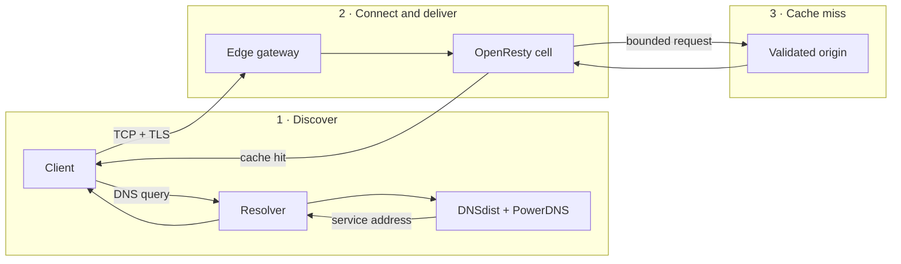

# CDN fundamentals

A content delivery network (CDN) is a distributed layer between clients and an
origin application. It answers DNS, accepts HTTP and HTTPS near or on behalf of
the client, applies bounded policy, serves eligible cached responses, and
forwards cache misses to an explicitly configured origin.

A CDN is not only a cache. It is also a DNS, TLS, routing, proxy, security,
observability, and failure-management system.

::: info CDNFoundry vocabulary
CDNFoundry calls a physical or virtual edge host an **edge**, a bounded
OpenResty runtime on that host a **cell**, and a service class spanning selected
edges a **pool**. PostgreSQL stores operator intent; DNS and edge runtimes serve
the activated result.
:::

## Why use a CDN?

| Goal | How a CDN helps | Important limit |
| --- | --- | --- |
| Lower latency | Serves cacheable content from a closer or better-connected edge | A cache miss still reaches the origin |
| Reduce origin load | Reuses eligible responses and bounds upstream concurrency | Uncacheable or constantly changing traffic still consumes origin capacity |
| Centralize TLS | Selects and renews certificates at the edge | Private keys and issuance state become critical recovery material |
| Apply consistent policy | Enforces request, cache, and security rules before origin access | It cannot repair unsafe application logic at the origin |
| Improve resilience | Keeps serving cached or last-valid runtime state during some failures | It cannot survive loss of every edge, route, or upstream link |
| Observe traffic | Produces bounded DNS and HTTP telemetry | Telemetry may be sampled or dropped to preserve serving |

## The request journey

An HTTPS request normally crosses three distinct decisions:

### 1. DNS chooses a service address

The client usually asks a recursive resolver. That resolver asks the
authoritative nameservers and caches the answer for its DNS TTL. CDNFoundry
publishes only addresses backed by eligible, listener-ready pool endpoints.

DNS placement and HTTP caching are independent. A DNS TTL controls how long a
resolver may reuse an address; an HTTP cache lifetime controls how long an edge
may reuse a response object.

### 2. The edge accepts and identifies the connection

For HTTPS, the client sends a TLS Server Name Indication (SNI) value before the
HTTP request. The edge gateway uses the destination service address together
with validated Host/SNI data to select a bounded cell. The cell selects the
certificate and domain policy from its active runtime data.

Unknown destinations and unknown hostnames fail closed. A public address is a
service endpoint, not ownership of a dedicated container by one domain.

### 3. The cell applies policy and uses the origin when needed

The cell evaluates trusted client addressing, maintenance state, security
rules, method and size limits, cache policy, and origin policy. It then returns
a cached response or opens a bounded connection to the configured origin.

The control plane is not consulted while this happens. This separation lets an
already-configured edge continue serving during a management outage.

## Cache outcomes

| Outcome | Meaning | Typical cause |
| --- | --- | --- |
| Hit | A fresh eligible object was returned locally | A previous request populated the cache |
| Miss | No usable object existed, so the edge contacted the origin | First request, expiry, purge, or eviction |
| Bypass | Policy deliberately skipped cache lookup or storage | Development mode, method, authorization, or response rules |
| Stale | An expired object was used under an allowed failure policy | Origin failure within a configured stale window |

Caching is safe only when the cache key includes every request property that
changes the representation. CDNFoundry uses one deterministic key for lookup
and URL purge. A full purge increments an epoch; it does not scan and delete a
domain-sized directory.

::: warning Cache is not the source of truth
The origin remains authoritative for application content. Do not rely on an
edge cache as the only copy of customer data, uploads, or generated assets.
Plan origin durability independently.
:::

## Origins

The origin is the upstream application or storage endpoint that produces a
response when the edge cannot serve one locally. A safe CDN must prevent an
operator-supplied origin from becoming a path into its own management network.

CDNFoundry therefore requires one explicit origin for each proxied hostname and
rejects loopback, link-local, metadata, multicast, internal platform,
edge-service, and proxy-loop destinations. It revalidates DNS resolution before
connecting because a hostname can resolve differently after configuration.

## TLS and certificates

TLS provides client-to-edge confidentiality and server identity. It does not
automatically encrypt the edge-to-origin hop; configure an HTTPS origin when
that hop must also be protected.

CDNFoundry supports:

- managed certificates using DNS-01 after an active domain first becomes
  eligible for proxying;
- validated custom certificate, chain, and private-key uploads;
- encrypted private-key storage and signed delivery to assigned cells;
- retention of a valid active certificate when renewal or activation fails.

DNS-only domains do not need an edge certificate.

## Traffic placement

Placement answers two different questions:

1. Which public service address should DNS return?
2. Which bounded runtime should serve the connection arriving at that address?

Geo-Unicast can publish different edge/pool endpoint addresses by geography.
Simple Anycast publishes one shared address that the operator advertises from
multiple sites. CDNFoundry manages endpoint readiness and runtime placement; it
does not configure BGP routers or prove Internet routing convergence.

Geo-DNS is a separate record feature for returning operator-defined DNS values
by country or continent. It is not an HTTP load balancer or health checker.

## Control plane versus data plane

| Plane | When it is used | CDNFoundry components |
| --- | --- | --- |
| Control | Users make and inspect changes | Laravel, Filament, API, PostgreSQL, Horizon, scheduler |
| DNS data | A resolver asks an authoritative question | DNSdist, PowerDNS, local MMDB |
| HTTP data | A client makes an HTTP/HTTPS request | Edge gateway, OpenResty cells, cache |
| Observability | Events and metrics are processed after serving decisions | Vector, ClickHouse, Prometheus, Alertmanager, Grafana |

An accepted control-plane change is desired state, not proof of activation.
Workers reconcile a revision, validate the candidate, activate it atomically,
and record acknowledgement. A failed candidate leaves the previous valid
runtime active.

## What a CDN cannot guarantee

::: danger Know the protection boundary
A CDN running on your own hosts cannot absorb traffic beyond the capacity of
the host, transit provider, firewall, or uplink. CDNFoundry provides bounded
application controls; it does not claim upstream volumetric DDoS scrubbing.
:::

A CDN also cannot by itself:

- make an incorrect or slow origin application correct;
- provide database replication or origin data durability;
- reverse an incorrect registrar or parent-zone change;
- make two nodes in one rack independent failure domains;
- guarantee client geography when recursive resolvers hide it;
- replace capacity measurement, incident response, or tested recovery.

## Common terms

| Term | Meaning in this documentation |
| --- | --- |
| Origin | Explicit upstream application endpoint |
| Edge | One enrolled CDNFoundry agent and host |
| Cell | Stable, resource-bounded OpenResty runtime slot |
| Pool | Service class containing selected cells and endpoints |
| POP | Operator-defined point of presence or failure domain |
| Desired state | Durable configuration committed in PostgreSQL |
| Active state | Last validated runtime currently serving |
| Revision | Monotonic version of a desired-state change |
| Reconciliation | Asynchronous process that makes runtime match desired state |
| TTL | DNS or HTTP lifetime; the relevant protocol determines its meaning |
| Purge | Cache invalidation request, not deletion of origin content |

## Continue learning

1. Read [How CDNFoundry works](how-cdnfoundry-works.md) for an end-to-end domain journey.
2. Follow [Using CDNFoundry](../getting-started/using-cdnfoundry.md) for common operator and domain-user tasks.
3. Review [Production reference architectures](../architecture/production-reference-architectures.md) before choosing hosts and networks.
4. Use the [Production quick start](../deployment/production-quick-start.md) only after the design is understood.
