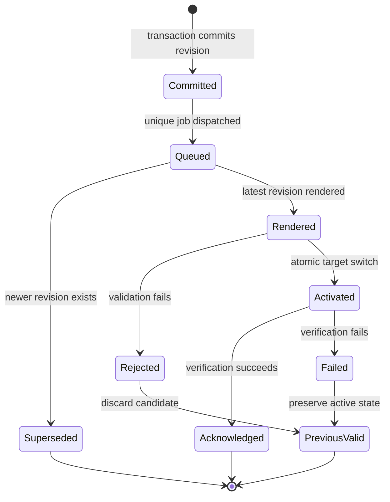

# Desired state and reconciliation

PostgreSQL is authoritative for domains, DNS records, platform identity,
clusters, edges, pools, cells, placements, cache and security settings,
certificates, operations, and audit history. Runtime stores are derived:

- PowerDNS PostgreSQL contains rendered authoritative zones.
- Edge artifacts and agent snapshots are derived from domain revisions.
- OpenResty files and cache content are local serving state.
- ClickHouse contains telemetry and aggregates, not serving decisions.

## Mutation sequence

A runtime-affecting mutation follows this order:

1. Authenticate and authorize through the same policy used by the browser panel.
2. Validate typed input and hard bounds.
3. Lock the relevant row where concurrent revision changes matter.
4. Commit desired state, increment the revision, and write an audit record.
5. Dispatch one unique or coalesced job after commit.
6. Skip work that has become obsolete.
7. Render a deterministic candidate and checksum it.
8. Validate and activate the candidate atomically.
9. Verify or wait for runtime acknowledgement.
10. Record success or a bounded, visible failure.

An HTTP request never waits for DNS, edge, TLS, purge, or backup work. Such
requests return `202 Accepted` with an operation or task identifier.

::: warning Accepted is not activated
`202 Accepted` proves durable desired state and an operation receipt. Poll the
operation and target deployment status before treating the runtime as changed.
:::

## Failure guarantee

A failed candidate does not replace the previous valid state. DNS deployments
retain their active RRsets and checksum. The edge agent validates the artifact
signature, checksum, schema version, compatibility range, and compiled runtime
before switching active directories. Managed TLS keeps a valid active
certificate when issuance fails. Vector preserves serving independence when
ClickHouse is unavailable.

## Coalescing and lanes

Repeated work for the same domain or global scope is coalesced. Horizon isolates
`interactive`, `runtime`, `certificate_purge`, and `bulk_maintenance` queues so
large imports and global reconciliation do not consume every worker.

The transaction never waits on an external network. The desired row, monotonic
revision, audit entry, and operation boundary are committed first. Queue locks
coalesce equivalent work while still allowing one follow-up reconciliation if
a newer revision arrives during processing.

See [Revisions and operations](revisions-and-operations.md) for client
behaviour and [CLI and scheduler](../reference/cli-and-scheduler.md) for scheduled
reconciliation.
