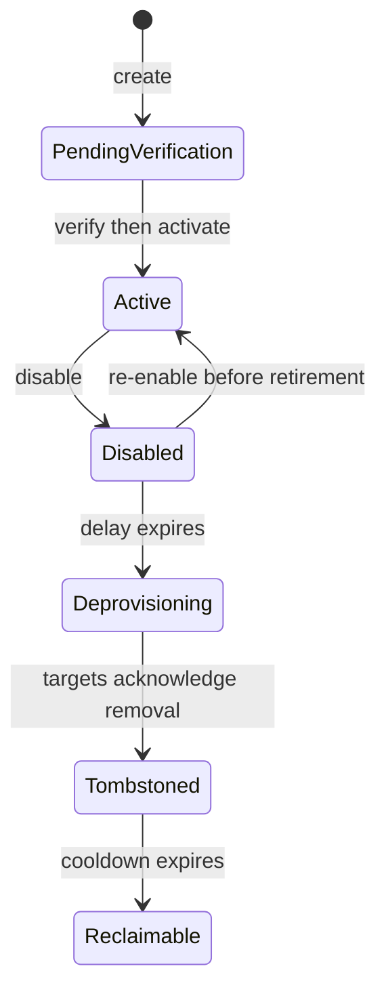

# Domains and DNS concepts

A domain begins as desired state without an origin. Its lifecycle is:

`pending_verification` → `active` → `disabled` → `deprovisioning` → deleted

Nameserver verification is asynchronous. Activation requires verified
delegation. Disabling preserves the last valid runtime for the configured
deprovision delay; later jobs publish tombstones, wait for acknowledgement, and
reserve the name for the reclaim cooldown.

## Record modes

Records use one of three modes:

- `dns_only` publishes the validated record content.
- `proxied` is allowed only for `A`, `AAAA`, and `CNAME` and requires one safe origin.
- `geo_dns` selects bounded answers by country, continent, then default.

CDNFoundry owns SOA serials and platform nameserver identity. Domain users cannot
create, change, or remove apex delegation NS records. Administrators may manage
delegation records where policy permits.

## Proxied publication

A proxied subdomain publishes a CNAME to the assigned pool hostname. A proxied
apex cannot use CNAME, so its A and AAAA answers are compiled from listener-ready
cells in the assigned pool. Existing non-address apex records such as MX and TXT
remain valid.

Every participating cell needs a unique public IPv4 address and may have IPv6.
The platform DNS zone advertises only enabled, fresh, non-drained, ready
listeners. The target placement activates before the source begins its drain
window.

::: caution Disable is not deletion
Disabling preserves last-valid state for the configured delay. Final removal
uses target tombstones and a name cooldown so stale agents and delayed jobs
cannot recreate an earlier tenant.
:::

## Ownership boundaries

Domain users manage records only inside assigned zones. Platform SOA,
nameserver identity, and delegation-sensitive NS records remain administrator
concerns. Proxied record content is platform managed because it represents
listener-ready capacity, while its origin remains explicit desired state.

## DNS request path

Public authoritative queries reach DNSdist over UDP or TCP port 53. DNSdist
selects a private PowerDNS backend. PowerDNS reads its derived PostgreSQL schema
and the local validated MMDB for Geo-DNS. No query calls Laravel or an external
GeoIP API.

See [Authoritative DNS](../guides/dns.md), [DNS records](../reference/dns-records.md), and
[Geo-DNS](../guides/geo-dns.md).
