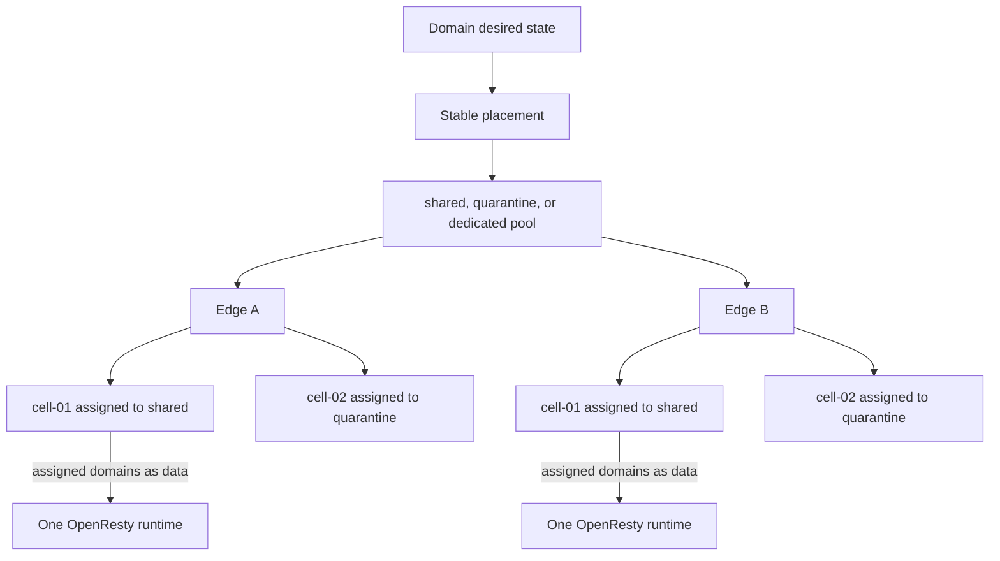

# Edges, pools, and cells

An edge is one enrolled agent identity and host. A pool is a stable service
class: `shared`, `quarantine`, or exceptional `dedicated`. A cell slot is a
bounded OpenResty runtime with stable identity independent of its optional pool
assignment.

The shipped production profile creates exactly eight slots per edge host,
`cell-01` through `cell-08`. Fresh control-plane edges default to the same
bounded count and may select 1–32 slots before creation. The count is immutable
after creation. Each slot has unique host ports, runtime/cache/temporary paths,
status, capacity, and resource limits. Initially:

- `cell-01` is assigned to `shared-default`;
- `cell-02` is assigned to `quarantine-default`;
- the remaining slots are unassigned, hold an empty runtime, and are available
  for explicit later placement work.

Assignment never changes slot identity or storage paths. The registered states
are assigned, unassigned, ready, degraded, drained, and stopped. A missing
assigned runtime becomes degraded; a missing unassigned runtime remains
stopped.

Every cell is limited to 512 MiB, 0.5 CPU, 128 PIDs, 256 MiB cache temporary
storage, 64 MiB request temporary storage, and 16 MiB logs by the shipped
topology. The edge agent is separate, read-only, non-root, and limited to 128 MiB and 0.25
CPU. It owns identity, artifact validation, atomic runtime files, acknowledgements,
and control tasks. It does not proxy customer traffic and has no container-engine
socket. Drain, undrain, and bounded restart controls use authenticated private
cell endpoints.

## Enrollment

An administrator creates an edge with name, country, continent, IPv4, and
optional IPv6. The returned UUID and bootstrap token are shown once. The agent
submits a CSR to the mutual-TLS edge-control endpoint. On success it persists
the issued identity and no longer needs the bootstrap token.

Exact registration retries can reuse a pending key and CSR. A different CSR for
the same consumed token fails closed. Identity rotation invalidates the old
certificate and creates a new one-time boundary.

## Artifact activation

The agent polls a manifest with its active sequence, fetches up to 500 artifact
entries per response, verifies Ed25519 signatures and SHA-256 checksums, compiles
per-pool runtime JSON, and switches the active directory atomically. A full
recovery snapshot is gzip compressed and bounded to 96 MiB on download.

Acknowledgements are persisted locally and retried. Runtime status drives
listener readiness, capacity, passive-origin failure summaries, and security
events.

## Placement

A domain has one active pool and may have one target pool during movement.
Target cells receive and acknowledge the current revision first. DNS then
publishes the target; the source remains active for the configured drain
interval. This avoids withdrawing the only valid route.

The transition is target-first: render and activate the destination, observe
listener readiness, switch derived routing, then drain the source. A failed
destination leaves the source active.

::: warning Protection boundary
Cell CPU, memory, PID, connection, and rate limits contain application-level
resource use. They cannot scrub volumetric traffic after a host or uplink is
saturated.
:::

See [Edges and placement](../guides/edges.md) and [Edge-agent API](../reference/api/edge-agent.md).
