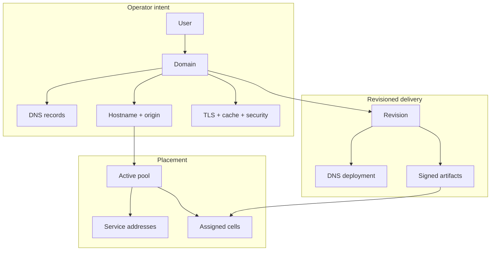
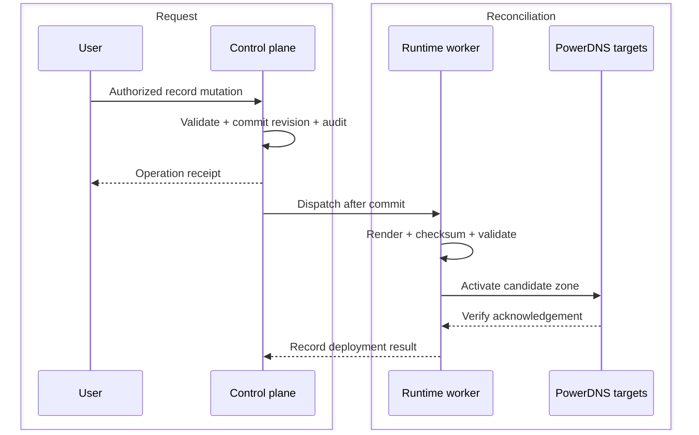
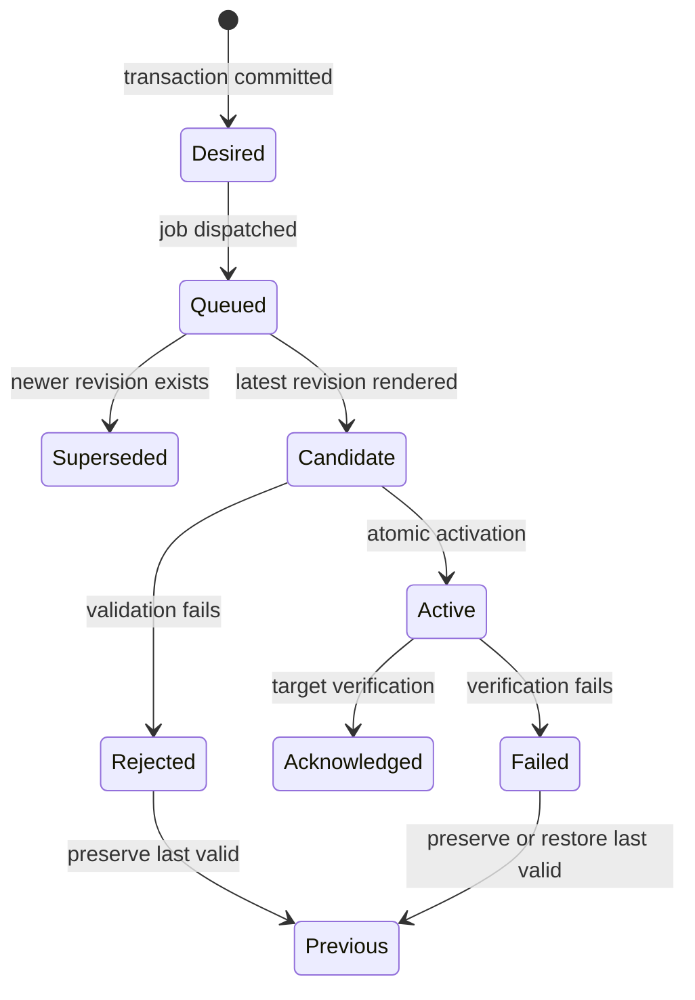

# How CDNFoundry works

CDNFoundry is a private CDN control system with independent DNS and HTTP data
planes. Administrators and domain users declare bounded desired state. Workers
turn the latest revision into validated DNS or edge runtime state. Customer
traffic uses that active runtime without calling Laravel.

::: info The central mental model
**Write intent, observe an operation, verify acknowledgement, then test the
public path.** A successful form submission or `202 Accepted` response is not
the same as successful DNS or edge activation.
:::

## Object relationships

- A **domain** is the authorization and lifecycle boundary.
- A **record** is DNS-only, proxied, or Geo-DNS.
- A **pool** is a service class and placement boundary.
- An **edge** is an enrolled host; a **cell** is one bounded runtime slot on it.
- A **service endpoint** connects public DNS identity to a ready gateway
  listener on an edge/pool pair.
- A **revision** identifies the desired configuration that targets must
  acknowledge.

## A domain's journey

### 1. The administrator prepares platform DNS

The administrator defines the platform zone, authoritative nameservers, glue
addresses, proxy hostname, and SOA policy. Each PowerDNS target is registered
as a source-restricted API cluster, tested asynchronously, and enabled only
after a successful test.

Parent-zone glue and registrar delegation remain external operator actions.

### 2. The administrator prepares edge capacity

The administrator creates pools, enrolls `EDGE_1` and `EDGE_2`, assigns bounded
cells, and creates public service endpoints. An edge uses its one-time token to
obtain an mTLS identity, then pulls signed artifacts and tasks over an outbound
control connection.

Cells have stable identities such as `cell-01`; normal domains are data inside
shared runtimes. Creating a domain does not create a container or Nginx server
block.

### 3. A domain is created and delegated

Creation validates and normalizes the name, creates desired DNS state, and
starts in pending verification. The owner delegates the domain to the platform
nameservers. After asynchronous verification, an administrator activates it.

The origin is not required for a DNS-only domain, and creation alone does not
start certificate issuance.

### 4. Records are added

DNS-only records render their validated values into the derived PowerDNS
schema. Geo-DNS records render bounded country, continent, and default answer
sets. Proxied records require a safe explicit origin and publish platform pool
addresses rather than the origin address.

The DNS workflow is:

Every required target must be observed. If rendering or activation fails, the
previous valid zone remains active.

### 5. Proxying activates TLS and edge state

When an active, verified domain first gains an eligible proxied hostname,
managed TLS can begin DNS-01 issuance. Certificate material, origin policy,
cache policy, security policy, and placement become part of signed edge state.

The agent verifies signature, checksum, schema, and compatibility, compiles a
candidate, validates it, and atomically changes the active directory. It keeps
previous runtime state for rollback.

### 6. A client request is served

1. DNS returns a listener-ready pool endpoint.
2. The client connects to the edge gateway using that service address.
3. The gateway validates destination plus Host/SNI and selects an assigned cell.
4. OpenResty selects the domain certificate and policy from active runtime data.
5. Security and request bounds run before cache/origin handling.
6. A cache hit returns locally; an eligible miss uses the validated origin.
7. Redacted telemetry is sent to Vector after the serving decision.

Laravel, PostgreSQL, ClickHouse, and Grafana are absent from this request path.

## How changes become active

Operations expose this boundary to users and API clients. Poll the operation
and inspect target deployment state. For customer-visible changes, also test
the actual DNS, TLS, and HTTP path from outside the management network.

::: warning Acknowledgement has a scope
A DNS acknowledgement proves a target accepted the zone revision. An edge
acknowledgement proves the agent activated an artifact. Neither proves parent
delegation, Internet routing, every recursive cache, every client network, or
origin correctness.
:::

## Failure behaviour

| Failure | What continues | What pauses or degrades |
| --- | --- | --- |
| Control application unavailable | Active DNS and HTTP runtime | UI, API changes, and new reconciliation |
| PostgreSQL or Valkey unavailable | Active DNS and HTTP runtime | Desired-state access, queues, and management |
| One DNS target unavailable | Other authoritative targets | Failed target deployment and redundancy |
| Invalid DNS candidate | Previous active zone | Requested revision remains failed/pending |
| Invalid edge artifact | Previous active runtime | New edge revision is rejected |
| Origin unavailable | Eligible cached/stale responses | Misses and uncacheable requests |
| Certificate renewal failure | Existing valid certificate until expiry | Future certificate readiness |
| Vector or ClickHouse unavailable | DNS and HTTP serving | Telemetry completeness and analytics |
| One edge or POP unavailable | Other qualified capacity | Traffic using stale DNS/routes may fail until caches or routes converge |

## Who does what?

### Administrators

Administrators own platform identity, DNS clusters, users, domains, edge
enrollment, pools, endpoints, global settings, operations, capacity, backup,
and incident response.

### Domain users

Domain users see only assigned domains. Within policy they manage records,
origins, TLS, cache, security, analytics, and usage. They cannot change global
platform identity or another tenant's state.

### API clients

Sanctum tokens use the same policies. Mutations should send an
`Idempotency-Key`, retain operation IDs, use cursor pagination, and handle
stable machine-readable errors.

### Edge agents

Agents are pull-based runtime participants. They authenticate with short-lived
mTLS identity, verify signed desired state, activate locally, and report
bounded health and acknowledgements. They do not receive raw customer secrets
beyond the assigned runtime material required to serve their cells.

## Safe operating loop

For every production change:

1. inspect current desired, active, and health state;
2. make one bounded, reviewable change;
3. save the operation ID and expected revision;
4. wait for required target acknowledgement;
5. test DNS and HTTP externally over the intended address families;
6. watch errors, cache, origin, security, and capacity signals;
7. retain or restore the previous valid state if qualification fails.

Continue with [Using CDNFoundry](../getting-started/using-cdnfoundry.md),
[Data flows](../architecture/data-flows.md), and
[Desired state and reconciliation](desired-state.md).
