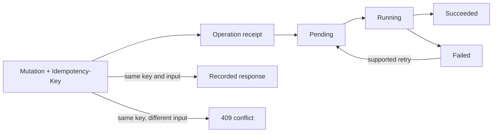

# Revisions and operations

Each domain revision is monotonic. DNS and edge deployments record desired and
active revisions separately so operators can see pending work and last-valid
state. Revision numbers are never reused.

## Operation receipts

Long-running changes create an `operations` row and return its UUID. Poll
`GET /api/operations/{operation}` until the status is `succeeded` or `failed`.
Administrators can list all operations, inspect failures, and retry supported
types. A user can read only an operation they initiated or that belongs to an
assigned domain.

Operations are not a promise that every external target will succeed
immediately. The operation response and the domain-specific deployment endpoint
together show control-plane completion and target acknowledgement.

| Evidence | What it proves |
| --- | --- |
| HTTP `200` or `201` | Synchronous control-state action completed |
| HTTP `202` and operation ID | Work was durably accepted |
| Operation `succeeded` | The job's completion condition passed |
| DNS active checksum | One DNS cluster activated the candidate |
| Edge acknowledgement | One agent/cell activated the sequence |
| Runtime probe | The real listener serves expected behavior |

## Idempotent requests

Mutating account and administrator routes use the `idempotent` middleware.
Supply a UUID in `Idempotency-Key` when retrying is possible. The same method,
path, and normalized payload replays the prior response for 24 hours and sets
`Idempotency-Replayed: true`. Reusing the key with different input returns
`409 idempotency_conflict`.

Plaintext tokens are never stored in an idempotency response. Token creation is
therefore a one-time secret boundary even when the request carries a key.

## Rollback

Edge configuration rollback selects a retained validated revision. Rollback
creates a new desired revision and new artifacts; it does not decrement the
revision counter or restore a database backup. Retention keeps every revision
inside the configured time window and at least the configured minimum number per
domain, while preserving active and relevant rollback points.

Cache policy rollback uses the same mechanism. Full cache purge is different:
it increments the cache epoch instead of scanning a filesystem.
