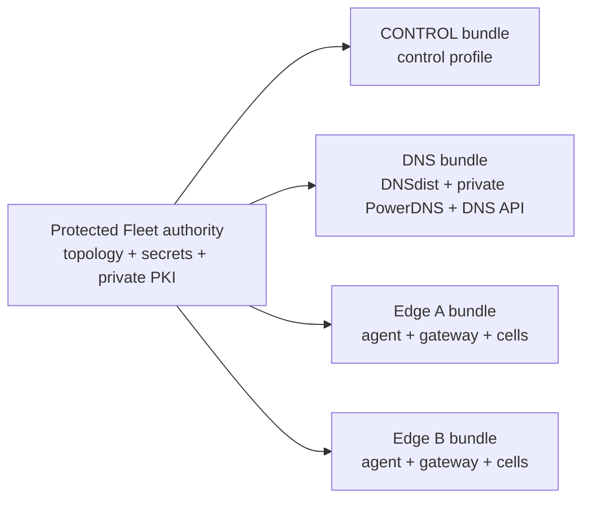

# Production fleet operator guide



Each bundle is a security boundary. Never use a shared `env_file`: database, PowerDNS, bootstrap, identity, backup, and telemetry credentials are emitted only when that node's filtered services require them. Never copy a bundle, `.env.prod`, `pki/`, or `secrets/` directory between nodes.

Work from an immutable checkout. For a fresh operator host:

```bash
git clone https://github.com/vaheed/CDNFoundry.git cdnfoundry
cd cdnfoundry
git checkout v1.0.0
git rev-parse --verify HEAD
```

Replace the example tag with the exact release or commit selected for the fleet. Never operate production from a moving branch.

This guide covers the full lifecycle of a CDNFoundry production fleet: first-time setup, control plus monitoring, additional DNS and edge nodes, validation, bundle transfer, operation, upgrades, recovery, and troubleshooting.

## What the generator creates

The generator runs from a trusted checkout of the CDNFoundry repository and writes two protected outputs:

- **Fleet state**: topology, feature modes, immutable release identifiers, credentials, certificate authorities, node certificates, and state history.
- **Node bundles**: one minimal directory per host containing filtered Compose services, `.env.prod`, only the referenced runtime files, node-specific PKI, generated monitoring/logging files, validation/start scripts, checksums, and a node README.

Remote nodes do not need a repository clone. They receive only their own bundle.

## Fastest supported setup

From the repository root, run:

```bash
./scripts/generate-production-env.sh
```

The wizard now performs the complete workflow instead of only initializing state. It asks for the global domains and release, offers a visible topology menu, adds hosts, validates the fleet, and renders bundles.

The default local paths are:

```text
State:   ./.cdnfoundry-fleet
Bundles: ./build/fleet-bundles
```

Override them without editing the script:

```bash
CDNFOUNDRY_FLEET_STATE_DIR=/var/lib/cdnfoundry-fleet \
CDNFOUNDRY_FLEET_OUTPUT_DIR=/var/lib/cdnfoundry-fleet/bundles \
  sudo -E ./scripts/generate-production-env.sh
```

## Control plus monitoring

Choose **Control + monitoring on the same host** in the wizard. This sets monitoring mode to `colocated`, selects both the `control` and `telemetry` profiles for the control node, and creates exporter targets for every enabled host.

Equivalent non-interactive command:

```bash
./scripts/cdnfoundry-fleet \
  --state-dir ./.cdnfoundry-fleet \
  --output-dir ./build/fleet-bundles \
  --repo-root "$PWD" \
  setup \
  --operator-domain ops.example.com \
  --platform-domain example.net \
  --release v1.0.0 \
  --preset control-monitoring \
  --control-ipv4 192.0.2.10 \
  --non-interactive
```

To enable it on an existing fleet:

```bash
./scripts/cdnfoundry-fleet --state-dir ./.cdnfoundry-fleet \
  configure-monitoring --mode colocated --non-interactive

./scripts/cdnfoundry-fleet \
  --state-dir ./.cdnfoundry-fleet \
  --output-dir ./build/fleet-bundles \
  --repo-root "$PWD" render
```

Verify the selected mode and services:

```bash
./scripts/cdnfoundry-fleet \
  --state-dir ./.cdnfoundry-fleet \
  --output-dir ./build/fleet-bundles status

grep -E '^(  )?(grafana|prometheus|clickhouse|loki|node-exporter):' \
  build/fleet-bundles/control-1/compose.yml
```

## Config-driven setup

For repeatable automation, use a JSON file:

```json
{
  "preset": "control-monitoring",
  "global": {
    "operator_domain": "ops.example.com",
    "platform_domain": "example.net",
    "release": "v1.0.0",
    "acme_email": "operations@example.com",
    "ipv6": false
  },
  "nodes": [
    {
      "name": "control-1",
      "role": "control",
      "region": "global",
      "location": "ashburn",
      "hostname": "control.ops.example.com",
      "public_ipv4": "192.0.2.10",
      "bind_ipv4": "0.0.0.0"
    },
    {
      "name": "dns-frankfurt",
      "role": "dns",
      "region": "europe",
      "location": "frankfurt",
      "public_ipv4": "192.0.2.20",
      "bind_ipv4": "0.0.0.0"
    },
    {
      "name": "edge-frankfurt",
      "role": "edge",
      "region": "europe",
      "location": "frankfurt",
      "public_ipv4": "192.0.2.30",
      "bind_ipv4": "0.0.0.0"
    }
  ],
  "features": {
    "monitoring": {"mode": "colocated", "host": null},
    "logs": {"mode": "disabled", "host": null, "endpoint": null},
    "backups": {"mode": "disabled", "repository": null, "region": "us-east-1"}
  }
}
```

Run:

```bash
./scripts/generate-production-env.sh \
  --config ./fleet-production.json \
  --non-interactive
```

The setup command is idempotent for named nodes in the config: existing nodes are updated and missing nodes are added. Secrets remain stable unless an explicit rotation command is used.

## CLI map

| Goal | Command |
| --- | --- |
| Full wizard/config setup | `setup` |
| Initialize state only | `init` |
| Add or change a host | `add-node`, `update-node` |
| Store manual edge UUID/token | `configure-edge-registration` |
| Remove one-time edge token | `clear-edge-bootstrap-token` |
| Replace a protected secret from file | `set-secret` |
| See fleet and feature modes | `status` |
| Machine-readable inventory | `status --json`, `list-nodes` |
| Check repository and tools | `doctor` |
| Set monitoring | `configure-monitoring` |
| Set centralized logs | `configure-logs` |
| Set backup metadata | `configure-backups` |
| Test rendering without replacing bundles | `validate` |
| Generate node bundles | `render` |
| Show deployment sequence | `show-start-order` |
| Import existing credentials | `adopt-existing` |
| Rotate a supported secret | `rotate-secret` |

Every command has command-specific help:

```bash
./scripts/cdnfoundry-fleet setup --help
./scripts/cdnfoundry-fleet configure-monitoring --help
./scripts/cdnfoundry-fleet render --help
```

## Preflight checks

Run before setup or after updating the repository:

```bash
./scripts/cdnfoundry-fleet --repo-root "$PWD" doctor
```

`doctor` verifies the production Compose file, deployment assets, Python, OpenSSL, and existing fleet state. Docker is reported separately because rendering can occur on a generator machine without starting containers, but Docker Compose is required on deployment hosts and for the final host-side validation.

## Node roles

### Control

Runs the application control plane, Valkey, migrations, and the edge-control TLS endpoint. By default it also runs embedded PostgreSQL. When node `extra_env` contains a non-`control-db` `DB_HOST` or a non-empty `DB_URL`, the generated bundle removes embedded `control-db` and points the application at the operator-managed database. In colocated monitoring mode it also runs the telemetry stack.

### DNS

Runs node-local PostgreSQL, PowerDNS authoritative service, DNSdist, and required geo/MMDB support. Its database password and API key are unique to that node.

### Edge

Runs the edge agent/runtime and gateway services. It receives the edge server CA, a node TLS certificate, and the generated edge-control URL.

### DNS-edge

Combines the DNS and edge service sets on one host. It still uses its own local PowerDNS PostgreSQL database.

### Monitoring

Runs a dedicated telemetry stack when monitoring mode is `dedicated`. It does not start a second control database. The project-specific Grafana control-database provisioning helper is intentionally omitted on a dedicated host; configure an externally reachable control datasource separately when those dashboards are required.

## PKI layout

The generator follows the production repository’s two-CA model:

- `edge-identity-ca`: used by the control plane for edge identity issuance and verification.
- `edge-server-ca`: signs edge-control, edge runtime, and DNS API TLS certificates.

CA private keys stay in the protected fleet state directory. Every node bundle receives the edge server CA certificate plus its own certificate and private key. Only the control bundle receives the edge identity CA private key because the control service requires it. The transferred key begins root-only; the generated control `start.sh` must run as root and changes only this key to owner `root`, numeric group `82`, mode `0640`, allowing the immutable image's PHP-FPM worker to read it without making it public.

Important generated environment paths include:

```text
EDGE_IDENTITY_CA_CERTIFICATE=./pki/edge-identity-ca.crt
EDGE_IDENTITY_CA_PRIVATE_KEY=./pki/edge-identity-ca.key
PDNS_CA_CERTIFICATE=./pki/edge-server-ca.crt
EDGE_CONTROL_SERVER_CERTIFICATE=./pki/node.crt
EDGE_CONTROL_SERVER_PRIVATE_KEY=./pki/node.key
EDGE_CONTROL_CA_CERTIFICATE=./pki/edge-server-ca.crt
EDGE_RUNTIME_TLS_CERTIFICATE=./pki/node.crt
EDGE_RUNTIME_TLS_PRIVATE_KEY=./pki/node.key
DNS_API_SERVER_CERTIFICATE=./pki/node.crt
DNS_API_SERVER_PRIVATE_KEY=./pki/node.key
```

## Manual edge registration and mTLS enrollment

The generator does not create edge records in the control plane. Use this sequence for every edge-capable node:

1. Start the control plane.
2. In **Edge network → Edges**, create the edge and copy its UUID and one-time bootstrap token.
3. Save the token in a protected mode-`0600` file.
4. Store the UUID/token in fleet state with `configure-edge-registration`.
5. Add the edge's complete `EDGE_GATEWAY_ADDRESS_MAP` with `update-node --extra-env`.
6. Validate and render only that node.
7. Transfer and start the node bundle.
8. Wait for the registered identity and heartbeat.
9. Clear the one-time token, rerender, and recreate only `edge-agent`.

Example on the control-plane machine:

```bash
sudo install -m 0600 /dev/null /root/edge-tokyo.bootstrap-token
sudo sh -c 'read -r token; printf "%s\n" "$token" > /root/edge-tokyo.bootstrap-token'

sudo ./scripts/cdnfoundry-fleet \
  --state-dir /var/lib/cdnfoundry-fleet \
  configure-edge-registration \
  --node edge-tokyo \
  --edge-id 11111111-2222-3333-4444-555555555555 \
  --bootstrap-token-file /root/edge-tokyo.bootstrap-token \
  --non-interactive

sudo ./scripts/cdnfoundry-fleet \
  --state-dir /var/lib/cdnfoundry-fleet \
  update-node --node edge-tokyo \
  --extra-env 'EDGE_GATEWAY_ADDRESS_MAP={"203.0.113.40":"10.40.0.40","203.0.113.41":"10.40.0.41"}' \
  --non-interactive

sudo ./scripts/cdnfoundry-fleet \
  --state-dir /var/lib/cdnfoundry-fleet \
  --output-dir /var/lib/cdnfoundry-fleet/bundles \
  --repo-root "$PWD" render --node edge-tokyo
```

The edge agent creates its private key locally, sends a CSR during one-time registration, receives an identity certificate from the edge identity CA, and persists the identity in `edge-agent-state`. Do not copy that volume to another host.

After registration succeeds:

```bash
sudo ./scripts/cdnfoundry-fleet \
  --state-dir /var/lib/cdnfoundry-fleet \
  clear-edge-bootstrap-token --node edge-tokyo --non-interactive

sudo ./scripts/cdnfoundry-fleet \
  --state-dir /var/lib/cdnfoundry-fleet \
  --output-dir /var/lib/cdnfoundry-fleet/bundles \
  --repo-root "$PWD" render --node edge-tokyo

sudo rm -f /root/edge-tokyo.bootstrap-token
```

Transfer the clean bundle and run on the edge:

```bash
cd /opt/cdnfoundry
docker compose --env-file .env.prod up -d --force-recreate edge-agent
```

`EDGE_ID` remains in the generated environment. `EDGE_BOOTSTRAP_TOKEN` is removed.

## Embedded or remote control PostgreSQL

Embedded mode is the default. The control bundle contains `control-db`, and `start.sh` waits for `control-db` and `redis` before running the migration.

For remote mode, set the control node's optional Compose overrides and replace the generated database password with the real remote credential from a protected file:

```bash
sudo ./scripts/cdnfoundry-fleet \
  --state-dir /var/lib/cdnfoundry-fleet \
  update-node --node control-1 \
  --extra-env DB_HOST=postgres.internal.example \
  --extra-env DB_PORT=5432 \
  --extra-env DB_SSLMODE=verify-full \
  --non-interactive

sudo ./scripts/cdnfoundry-fleet \
  --state-dir /var/lib/cdnfoundry-fleet \
  set-secret --secret control-db-password \
  --from-file /root/cdnfoundry-postgres-password \
  --non-interactive
```

A non-empty `DB_URL` also selects remote mode. Do not place a password-bearing URL in version control or shell history.

In remote mode the renderer removes `control-db`, its volume, and every dependency on it. The generated start helper waits only for local Valkey before migration. When telemetry is colocated and `DB_HOST` is supplied, Grafana's control-database provisioning and datasource defaults inherit the same host, port, and SSL mode unless explicitly overridden.

Before rendering, ensure the external service has:

- database and application role expected by the project;
- TLS and certificate hostname verification where supported;
- exact-source network allowlists;
- capacity and connection limits for web, Horizon, scheduler, migrations, and Grafana provisioning;
- backups/PITR and an isolated restore test.

## Validation and rendering

Use both steps in CI or before a production rollout:

```bash
./scripts/cdnfoundry-fleet \
  --state-dir ./.cdnfoundry-fleet \
  --output-dir ./build/fleet-bundles \
  --repo-root "$PWD" validate

./scripts/cdnfoundry-fleet \
  --state-dir ./.cdnfoundry-fleet \
  --output-dir ./build/fleet-bundles \
  --repo-root "$PWD" render
```

Validation renders into a temporary directory and leaves active bundles unchanged. Rendering builds each node in a temporary directory, writes checksums and metadata, then atomically replaces the active bundle while retaining `.previous`.

## Bundle transfer and activation

Archive one node from the generator host:

```bash
tar --numeric-owner --owner=0 --group=0 \
  -C build/fleet-bundles \
  -czf /tmp/edge-frankfurt.tar.gz edge-frankfurt
```

On the target host:

```bash
install -d -m 0700 /opt/cdnfoundry.new
tar -xzf /tmp/edge-frankfurt.tar.gz --strip-components=1 -C /opt/cdnfoundry.new
cd /opt/cdnfoundry.new
sha256sum -c SHA256SUMS
./validate.sh
cd /opt
mv cdnfoundry cdnfoundry.previous 2>/dev/null || true
mv cdnfoundry.new cdnfoundry
cd /opt/cdnfoundry
sudo ./start.sh
```

Never transfer the entire fleet state or another node’s bundle. Do not replace the generated control activation with a direct `docker compose up`: the activation applies the restricted PHP-worker access required for `pki/edge-identity-ca.key`. If `core` reports that the key is not readable, rerun `sudo ./start.sh` and verify `stat -c '%u:%g %a %n' pki/edge-identity-ca.key` reports `0:82 640`.

`validate.sh` runs the pinned Caddy image's adapter against each Caddyfile present in the bundle. Treat any adapter error as a failed bundle and do not activate it. The validation container is short-lived and does not start dependencies; Docker may create the bundle's declared network or empty named-volume metadata while preparing the container.

If `log-collector` exits with code `78` and reports that `LOG_AUTH_TOKEN` is missing, do not put the token directly in the rendered Compose manifest. Verify that `.env.prod` contains a non-empty `LOG_AUTH_TOKEN` and that the rendered `log-collector.environment` maps `LOG_AUTH_TOKEN` from Compose interpolation, then rerender and transfer the corrected node bundle. Recreate only `log-collector`; its bounded `operational-vector-data` volume preserves buffered logs.

## Updating the fleet

Add a host:

```bash
./scripts/cdnfoundry-fleet --state-dir ./.cdnfoundry-fleet add-node \
  --node edge-tokyo --role edge --region asia --location tokyo \
  --public-ipv4 192.0.2.80 --non-interactive
```

Change a release or address:

```bash
./scripts/cdnfoundry-fleet --state-dir ./.cdnfoundry-fleet update-node \
  --node edge-tokyo --release v1.1.0 --public-ipv4 192.0.2.81 \
  --non-interactive
```

Render only that host:

```bash
./scripts/cdnfoundry-fleet \
  --state-dir ./.cdnfoundry-fleet \
  --output-dir ./build/fleet-bundles \
  --repo-root "$PWD" validate --node edge-tokyo

./scripts/cdnfoundry-fleet \
  --state-dir ./.cdnfoundry-fleet \
  --output-dir ./build/fleet-bundles \
  --repo-root "$PWD" render --node edge-tokyo
```

A changed hostname or public IP automatically causes that node certificate to be reissued with updated SANs.

## Troubleshooting

### The script prints only initialization output

Use the full wrapper or `setup`, not the low-level `init` command:

```bash
./scripts/generate-production-env.sh
# or
./scripts/cdnfoundry-fleet setup --help
```

`init` deliberately creates only protected state and secrets. It does not add nodes or render bundles.

### No interactive questions appear

Interactive mode needs a real terminal. In CI, a pipe, or a non-TTY shell, provide all values with `--non-interactive --config FILE`. The CLI now returns a clear validation error instead of silently waiting on unavailable input.

### I cannot find control plus monitoring

Run the setup wizard and choose **Control + monitoring on the same host**, or configure it explicitly:

```bash
./scripts/cdnfoundry-fleet --state-dir ./.cdnfoundry-fleet \
  configure-monitoring --mode colocated --non-interactive
```

Confirm with `status`.

### State already exists

The full setup command reuses existing state. It does not rotate secrets. To inspect it:

```bash
./scripts/cdnfoundry-fleet --state-dir ./.cdnfoundry-fleet status
```

### A required variable is missing

The renderer derives required variables from the final filtered Compose file. Add project-specific values to a node’s `extra_env` only when the repository introduces a new required variable that the generator does not yet know. Do not place secrets in version-controlled config files.

### Compose input contains `!reset` or `!override`

The Fleet loader supports both Docker Compose tags. Older generator versions used `yaml.safe_load` directly and failed on Compose inputs containing them.

### Docker is unavailable on the generator machine

You can still generate bundles and run Python-level validation. Run each bundle’s `validate.sh` on a host with Docker Compose v2 before activation.

## Related documents

- [Production quick start: three nodes](production-quick-start.md)
- [Production quick start: multi-region fleet](production-quick-start-multi-region.md)
- [Production fleet reference](production-fleet.md)
- [Fleet configuration reference](production-fleet-config-reference.md)
