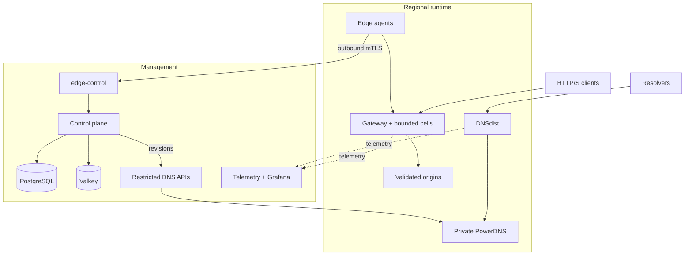
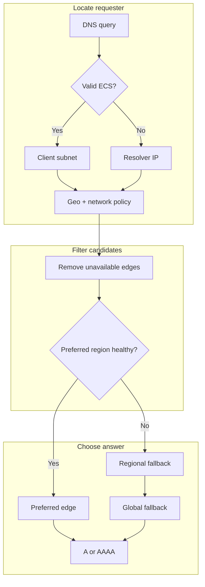
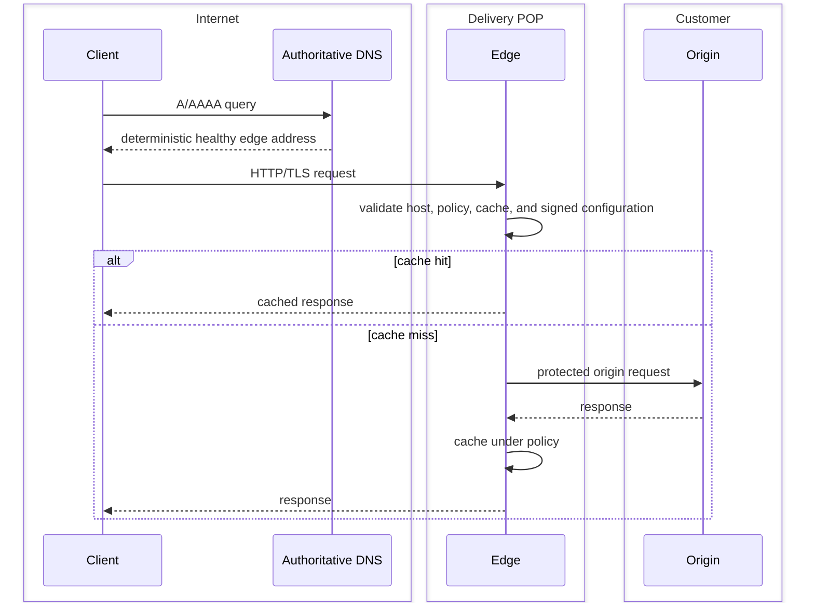
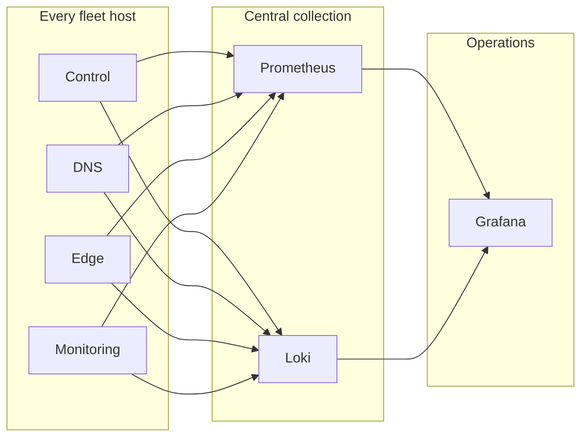
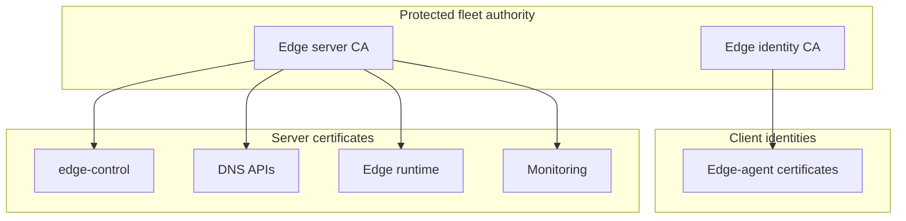
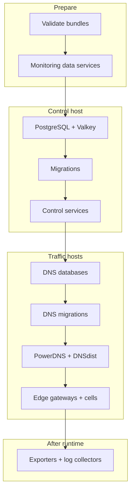
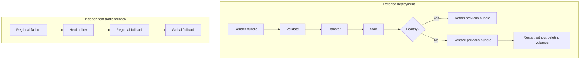

# Production fleet reference

For the complete command workflow and interactive setup, see [Production fleet operator guide](production-fleet-operator-guide.md).

## Design rules

- The Python generator runs only on the control-plane machine.
- A remote host receives one private role-specific bundle and runs Docker Compose locally.
- Each DNS or combined DNS/edge host has its own local PostgreSQL (`pdns-db`) and its own PowerDNS services.
- A DNS host never uses the control-plane application's PostgreSQL database.
- Each DNS host has a separate stable `PDNS_DB_PASSWORD` and `PDNS_API_KEY`.
- Optional monitoring, logging, backups, and IPv6 do not create cross-role variable or secret requirements when disabled.
- Existing DNS and HTTP serving nodes preserve their last valid runtime state during control-plane or regional failures.

## Global topology



::: danger Keep management DNS independent
The operator-zone records shown above must be published by an independent
external DNS provider. CDNFoundry PowerDNS is private derived runtime state for
platform and customer zones; using it for management names creates a bootstrap
and recovery dependency.
:::

## DNS and geo-routing flow



A and AAAA health are evaluated independently. Health state uses configurable consecutive-failure and consecutive-success thresholds to reduce flapping. DNS TTL creates eventual consistency; global changes are not instantaneous.

## Edge request flow



## Monitoring and logging flow



Vector uses authenticated transport configuration, bounded disk buffering, retries, health checks, role labels, and basic secret filtering. Every required host receives a unique log credential. Disabling centralized logs removes Vector and its credentials from bundles.

## Certificate trust



The generator follows the production repository's two-CA contract. The edge identity CA is used by the control plane for edge identities. The edge server CA signs edge-control, edge runtime, and DNS API TLS certificates. The server CA private key stays in protected fleet state; each node receives only its own keypair and the server CA certificate. The control bundle additionally receives the edge identity CA material required by the control service. Certificate SANs are regenerated when a node hostname or service address changes.

## Fleet startup order



The generated `STARTUP-ORDER.md` lists actual configured nodes in this order.
This is service startup order, not permission to create dependent desired
state early. After DNS services and restricted APIs are healthy, register and
test DNS clusters, enable them, and only then apply platform DNS identity. A
combined `dns-edge` node starts its DNS profile before edge inventory exists;
its edge profile starts only after one-time registration data is configured.

## Upgrade, rollback, and regional failure



Never use `docker compose down -v` during rollback or credential recovery.

## Fleet state and secret distribution

Protected control-plane state records global configuration, nodes, addresses, feature modes, release identifiers, secret references, bundle generation, and last successful validation/render timestamps. Writes are atomic and protected by a non-blocking file lock. The previous valid state is retained in bounded history.

Global application secrets are distributed only when the rendered role's Compose file references them. Node-scoped secrets include:

| Node capability | Secrets |
| --- | --- |
| DNS | `pdns-db-password`, `pdns-api-key` |
| Edge | `edge-status-token` |
| Monitoring enabled | Shared `metrics-token`; node-exporter is restricted by the private monitoring network and host firewall |
| Centralized logs enabled | `log-auth-token` |

A DNS node's database password is not shared with any other DNS node or the control plane.

## Per-node DNS database lifecycle

On each DNS-capable host:

1. `pdns-db` starts from that host's persistent PostgreSQL volume.
2. `pdns-migrate` uses the same node-specific stored credential.
3. `pdns-auth` connects to hostname `pdns-db`, database `pdns`, user `pdns`, and that same credential.
4. Health checks and future migrations use the same stable value.
5. A normal render does not generate a new password.

For an existing installation, use `adopt-existing` with the existing `.env.prod`; the importer stores `PDNS_DB_PASSWORD` under that node without printing it. The source database volume is not deleted.

Password rotation is staged. `--phase prepare` creates a pending credential while the active one stays unchanged. The rendered `reconcile-pdns-password.sh` changes only the selected DNS host's local PostgreSQL role and local environment. `--phase commit` makes the pending credential active in protected fleet state. `--phase abort` removes an unreconciled pending value.

## Geo-routing policy

The generated policy records this decision pipeline:

```text
valid ECS client subnet
→ resolver IP fallback
→ country and ASN policy
→ health filtering
→ preferred healthy edge IP
```

Policy implementations consuming the generated file must support country, ASN, region, and network overrides; deterministic choice; ordered regional/global fallback; draining; stale health; compatibility filters; and separate A/AAAA health. A recommended starting point is three consecutive failures before removal and two consecutive successes before re-entry, with a 90-second stale threshold. Tune these values to probe interval and DNS TTL.

## MMDB behavior

MMDB is required only on roles whose selected services actually consume it. A role-specific bundle copies only Compose-referenced runtime files and retains only referenced volumes. A production Compose definition that mounts an MMDB volume must also select a working updater or another documented population mechanism for that same role; an unpopulated MMDB mount is a validation defect and must not be deployed. Roles that do not consume MMDB should have no MMDB environment variable, mount, volume, or dependency.

Before deployment, inspect the rendered role with:

```bash
# Run on the control-plane machine against a rendered bundle.
cd /var/lib/cdnfoundry-fleet/bundles/NODE_NAME
grep -Rni -- 'mmdb\|geoip' ./*.yml .env.prod generated 2>/dev/null || true
```

Then verify on the **target host** that the populated persistent data exists and the consuming service reports successful database loading.

## Monitoring modes

- `disabled`: no full monitoring stack, no node exporter service, and no monitoring credentials in role bundles.
- `colocated`: monitoring data services run on the control host; generated file discovery covers all enabled production hosts.
- `dedicated`: monitoring data services run on a monitoring-role host; generated file discovery covers control, DNSdist, edge gateways, log collectors, and node exporters. An externally reachable control PostgreSQL endpoint is mandatory so the read-only Grafana role and views can be provisioned deterministically.

Prometheus targets are regenerated automatically when nodes are added, updated, disabled, or removed.

## Backup modes

- `disabled`: no backup-specific credentials or placeholder variables are required.
- `control`: protect the fleet state, CA, application database, and control state.
- `all-stateful`: additionally protect every DNS host's local PostgreSQL state and enabled observability stores.

Backups must be encrypted, tested by restore, stored outside the host, and protected independently from normal fleet credentials. Do not back up transient bundles instead of authoritative state and data volumes.

## IPv4 and dual stack

Initialize with `--dual-stack`, then provide each node's `--public-ipv6` and, where needed, `--bind-ipv6`. Firewalls, authoritative glue, health probes, monitoring, and routing policy must be configured separately for IPv4 and IPv6. An edge may be healthy for A and unhealthy for AAAA without being removed from both families.

## Hardware sizing

These are planning baselines; measure actual query rate, request rate, cache working set, log volume, retention, and database growth.

| Deployment | Control | Each DNS host | Each edge host | Monitoring |
| --- | --- | --- | --- | --- |
| Small | 4 vCPU, 8 GB RAM, 100 GB SSD | 2 vCPU, 4 GB, 40 GB SSD | 4 vCPU, 8 GB, cache-sized NVMe | Colocated or 4 vCPU, 8 GB |
| Medium | 8 vCPU, 16–32 GB, 250 GB SSD | 4 vCPU, 8 GB, 100 GB SSD | 8–16 vCPU, 16–32 GB, NVMe | 8 vCPU, 32 GB, 500 GB+ SSD |
| Multi-region baseline | 16+ vCPU, 64 GB, redundant NVMe | 8 vCPU, 16 GB, redundant SSD | 16–32+ vCPU, 64–128 GB, high-endurance NVMe | 16+ vCPU, 64–128 GB, storage sized to retention |

## Firewall requirements

| Destination | Port | Allowed sources |
| --- | --- | --- |
| DNSdist on DNS hosts | UDP/TCP 53 | Internet |
| Edge HTTP/TLS | TCP 80/443 | Internet or configured customer networks |
| Control UI/API | TCP 80/443 | Intended operator/public sources |
| Edge control runtime | TCP 8443 | Configured edge source addresses only |
| DNS API | TCP 8444 | Control-plane source addresses only |
| Node exporter | TCP 9100 | Monitoring host/private monitoring network only |
| PostgreSQL, Valkey, ClickHouse, Loki internal ports | service-specific | Local Docker network or exact private peers only; never Internet |
| SSH | TCP 22 or chosen port | Administrative bastions/VPN only |

Publish authoritative NS and glue records for every unicast DNS host. Allow both UDP and TCP 53. Keep reverse-path filtering and provider anti-spoofing compatible with the selected unicast design.

## Multi-region reference topology

The example contains four authoritative unicast DNS hosts and ten unicast edge hosts. The locations are an example, not generator constants.

DNS: Ashburn, Frankfurt, Singapore, São Paulo.

Edges: Ashburn, Los Angeles, São Paulo, Frankfurt, Johannesburg, Dubai, Mumbai, Singapore, Tokyo, Sydney.

Copy and edit the JSON topology on the **control-plane machine**:

```bash
install -m 0600 deploy/production/examples/multi-region-fleet.json ./fleet.json
sudo ./scripts/cdnfoundry-fleet --config fleet.json --non-interactive setup
```

Replace documentation IP addresses before production use.

## Troubleshooting

### PowerDNS cannot authenticate

On the affected **DNS host**, confirm `pdns-db` and `pdns-auth` are in the same bundle and that PowerDNS points to `pdns-db`:

```bash
cd /opt/cdnfoundry
docker compose --env-file .env.prod config | grep -A12 -E 'pdns-db:|pdns-auth:'
docker compose --env-file .env.prod ps
docker compose --env-file .env.prod logs --since 15m pdns-db pdns-auth
```

Do not print the password. Compare only a local hash when necessary. Use `adopt-existing` for a previously deployed value or the staged rotation procedure. Do not delete the database volume.

### Compose requests another role's variables

Render and inspect the selected node again. The node's generated Compose manifest should contain only services for its role and enabled features; `.env.prod` contains only variables referenced by that filtered Compose plus generated role configuration.

### A bundle render fails

The destination remains unchanged until the temporary bundle is complete. Correct the error, run `validate`, and render again. The previous state JSON and `.previous` node bundle remain available.

### A node is removed but remains in monitoring

Render the monitoring host after state modification. Prometheus target files are generated from current enabled nodes.

### Generator reports another process

A control-plane generation process already holds the fleet lock. Find and finish that process; do not delete the lock file while it is active.

## Deployment runbooks

- [Three-node production quick start](production-quick-start.md)
- [Multi-region fleet quick start](production-quick-start-multi-region.md)
- [Production fleet operator guide](production-fleet-operator-guide.md)
