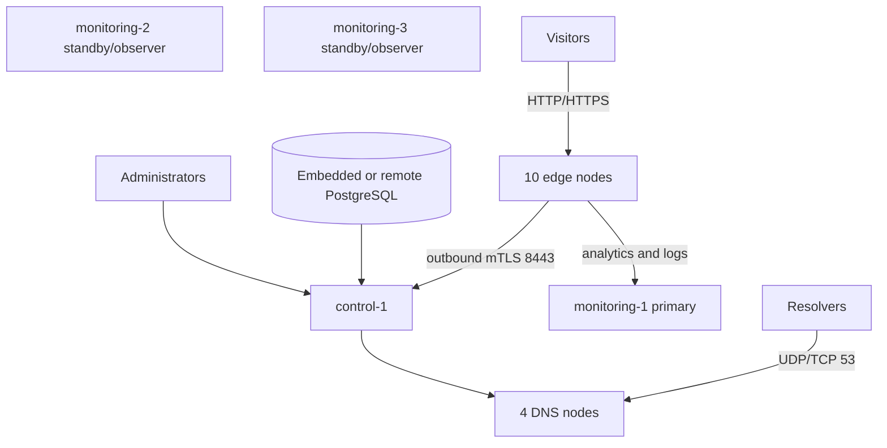

# Production quick start: 18-node fleet

This guide creates a larger CDNFoundry deployment with:

- **1 control node**;
- **10 edge-only nodes**;
- **4 DNS-only nodes**;
- **3 monitoring nodes**;
- embedded PostgreSQL on the control host **or** an operator-managed remote PostgreSQL service;
- manual edge creation and UUID/token assignment;
- node-specific mTLS, secrets, bundles, and startup instructions.

The included example script creates all 18 inventory records and bundles. It does not call the control API and does not enroll edges automatically.

## Before You Begin

### 1. Clone the Repository at a Specific Version

```bash
# For production: clone a specific release tag (recommended)
git clone --branch v1.0.0 --depth 1 https://github.com/vaheed/CDNFoundry.git
cd CDNFoundry

# For testing/development: clone a specific branch
git clone --branch dev --depth 1 https://github.com/vaheed/CDNFoundry.git
cd CDNFoundry

# Or clone and checkout a specific commit
git clone https://github.com/vaheed/CDNFoundry.git
cd CDNFoundry
git checkout <commit-sha>
```

> **Important**: Always deploy from a pinned release tag or commit SHA in production. Never use mutable tags like `latest`, `main`, or major/minor version tags.

### 2. Quick Configuration with a Single File (Recommended)

Instead of editing multiple scripts, you can use a centralized configuration file. See [Production Fleet Configuration Guide](production-config.md) for details.

Create a `fleet-config.ini` file:

```ini
[control]
hostname = control.ops.example.com
ipv4 = 192.0.2.10
region = global
location = ashburn

[pop]
dns-ashburn = 192.0.2.21,us-east,ashburn
dns-frankfurt = 192.0.2.22,europe,frankfurt
dns-singapore = 192.0.2.23,asia,singapore
dns-sao-paulo = 192.0.2.24,south-america,sao-paulo
edge-ashburn = 198.51.100.1,us-east,ashburn
edge-los-angeles = 198.51.100.2,us-west,los-angeles
edge-sao-paulo = 198.51.100.3,south-america,sao-paulo
edge-frankfurt = 198.51.100.4,europe,frankfurt
edge-johannesburg = 198.51.100.5,africa,johannesburg
edge-dubai = 198.51.100.6,middle-east,dubai
edge-mumbai = 198.51.100.7,asia,mumbai
edge-singapore = 198.51.100.8,asia,singapore
edge-tokyo = 198.51.100.9,asia,tokyo
edge-sydney = 198.51.100.10,oceania,sydney

[fleet]
operator_domain = ops.example.com
platform_domain = example.net
release = v1.0.0
acme_email = operations@example.com
control_db_mode = embedded
enable_monitoring = true
state_dir = /var/lib/cdnfoundry-fleet
output_dir = /var/lib/cdnfoundry-fleet/bundles
```

Then generate your fleet state:

```bash
sudo CONFIG_FILE=/path/to/fleet-config.ini ./deploy/production/examples/large-production.sh
```

The rest of this guide shows the manual step-by-step approach for full control.

## Topology and responsibility



| Group | Count | Function |
| --- | ---: | --- |
| Control | 1 | UI/API, desired state, workers, scheduler, edge-control, Valkey, optional embedded PostgreSQL |
| DNS | 4 | Independent local PowerDNS PostgreSQL, PowerDNS, DNSdist, DNS API |
| Edge | 10 | Edge agent, cells, gateway, cache, MMDB, analytics Vector |
| Monitoring | 3 | Independent telemetry stacks; `monitoring-1` is the active ingestion/log target |

### Monitoring behavior

The repository's production Compose stack is not an automatic Prometheus/ClickHouse/Loki cluster. The generator therefore treats:

- `monitoring-1` as the active telemetry and centralized-log host;
- `monitoring-2` and `monitoring-3` as separately rendered observer/warm-standby stacks.

They do not automatically replicate ClickHouse, Loki, Prometheus, or Grafana data. Production HA requires provider snapshots, external object storage, database-native replication, or another operator-owned replication/failover design. To change the active host, reconfigure monitoring/logging, update DNS or the load balancer, rerender all affected bundles, and verify ingestion before retiring the old primary.

## Sizing baseline

Use actual measurements to refine these values. The monitoring numbers depend heavily on analytics volume, log rate, cardinality, and retention.

| Role | Starting production size | Storage notes |
| --- | --- | --- |
| Control with embedded PostgreSQL | 8–12 vCPU, 16–32 GiB RAM | 250–500 GiB NVMe plus off-host backups |
| Control with remote PostgreSQL | 8 vCPU, 16 GiB RAM | 100–200 GiB SSD; database capacity is external |
| Remote PostgreSQL service | 8–16 vCPU, 32–64 GiB RAM | 500 GiB+ provisioned-IOPS/NVMe, PITR, tested replicas/backups |
| Each DNS node | 4 vCPU, 8 GiB RAM | 100–200 GiB SSD; local PowerDNS database |
| Each edge node | 8 vCPU, 16 GiB RAM | 250 GiB–2 TiB NVMe according to cache target |
| `monitoring-1` primary | 16 vCPU, 64 GiB RAM | 2 TiB+ NVMe for ClickHouse/Loki/Prometheus retention |
| `monitoring-2/3` | 8–16 vCPU, 32–64 GiB RAM | 1–2 TiB each if they retain independent data |

Also size:

- transit and peering bandwidth per edge;
- packet-per-second capacity for DNS nodes;
- filesystem inode count for cache workloads;
- object storage for encrypted backups and telemetry archives;
- private interconnect bandwidth between control, monitoring, and remote PostgreSQL;
- provider firewall rule limits and health-check sources.

## Example inventory

| Node | Role | Region/location | Example IP |
| --- | --- | --- | --- |
| `control-1` | control | global / ashburn | `192.0.2.10` |
| `monitoring-1` | monitoring primary | global / ashburn | `192.0.2.11` |
| `monitoring-2` | monitoring standby | europe / frankfurt | `192.0.2.12` |
| `monitoring-3` | monitoring standby | asia / singapore | `192.0.2.13` |
| `dns-ashburn` | DNS | us-east / ashburn | `192.0.2.21` |
| `dns-frankfurt` | DNS | europe / frankfurt | `192.0.2.22` |
| `dns-singapore` | DNS | asia / singapore | `192.0.2.23` |
| `dns-sao-paulo` | DNS | south-america / sao-paulo | `192.0.2.24` |
| `edge-ashburn` | edge | us-east / ashburn | `198.51.100.1` |
| `edge-los-angeles` | edge | us-west / los-angeles | `198.51.100.2` |
| `edge-sao-paulo` | edge | south-america / sao-paulo | `198.51.100.3` |
| `edge-frankfurt` | edge | europe / frankfurt | `198.51.100.4` |
| `edge-johannesburg` | edge | africa / johannesburg | `198.51.100.5` |
| `edge-dubai` | edge | middle-east / dubai | `198.51.100.6` |
| `edge-mumbai` | edge | asia / mumbai | `198.51.100.7` |
| `edge-singapore` | edge | asia / singapore | `198.51.100.8` |
| `edge-tokyo` | edge | asia / tokyo | `198.51.100.9` |
| `edge-sydney` | edge | oceania / sydney | `198.51.100.10` |

Replace every address. Use private `monitor_ipv4` and `log_ipv4` values when the hosts share a private network; otherwise the generator uses `public_ipv4` as the target and the firewall must still restrict access.

## Network policy

| Destination | Source |
| --- | --- |
| Control TCP `80`, `443`; UDP `443` | Public |
| Control TCP `8443` | The 10 edge source addresses only |
| DNS UDP/TCP `53` | Public |
| DNS TCP `8444` | Control source address only |
| Edge TCP `80`, `443` | Public service addresses |
| Monitoring TCP `80`, `443`, `8444` | Authorized edge/control/log sources; public UI only through trusted access controls |
| Node exporter TCP `9100` | Monitoring private addresses only |
| Log collector metrics TCP `9599` | Monitoring private addresses only |
| PostgreSQL TCP `5432` | Control and approved administrative/backup sources only; never public |
| Grafana, Prometheus, Loki, ClickHouse native/internal ports | Private networks only |

Use independent operator DNS for control, telemetry, and DNS API names. Place `telemetry.ops.example.com` behind a controlled DNS failover, floating IP, or load balancer that points to the currently active monitoring host.

## 1. Prepare the repository and hosts

Install the same exact release on every host or distribute generated bundles from a trusted checkout. On the generator machine:

```bash
cd /opt/CDNFoundry
sudo ./scripts/install-production-prerequisites.sh
./scripts/cdnfoundry-fleet --repo-root "$PWD" doctor
```

Confirm Docker Compose v2 on every deployment host and accurate NTP time everywhere.

## 2A. Generate the fleet with embedded control PostgreSQL

Run on the protected generator/control machine:

```bash
sudo env \
  STATE_DIR=/var/lib/cdnfoundry-fleet \
  OUTPUT_DIR=/var/lib/cdnfoundry-fleet/bundles \
  OPERATOR_DOMAIN=ops.example.com \
  PLATFORM_DOMAIN=example.net \
  RELEASE=vMAJOR.MINOR.PATCH \
  CONTROL_DB_MODE=embedded \
  ./deploy/production/examples/large-production.sh
```

The control bundle includes `control-db`, and `start.sh` starts `control-db` plus `redis` before running migrations.

## 2B. Generate the fleet with remote PostgreSQL

Provision the database before rendering:

- database: `cdnf`;
- application owner/user: `cdnf`;
- a high-entropy unique password;
- network allowlist restricted to the control host and approved management/backup sources;
- TLS enabled, preferably `verify-full` with a hostname matching the server certificate;
- backups/PITR and a tested restore process.

Create a protected password file on the generator machine:

```bash
sudo install -m 0600 /dev/null /root/cdnfoundry-postgres-password
sudo sh -c 'read -r password; printf "%s\n" "$password" > /root/cdnfoundry-postgres-password'
```

Then run:

```bash
sudo env \
  STATE_DIR=/var/lib/cdnfoundry-fleet \
  OUTPUT_DIR=/var/lib/cdnfoundry-fleet/bundles \
  OPERATOR_DOMAIN=ops.example.com \
  PLATFORM_DOMAIN=example.net \
  RELEASE=vMAJOR.MINOR.PATCH \
  CONTROL_DB_MODE=remote \
  REMOTE_POSTGRES_HOST=postgres.internal.example \
  REMOTE_POSTGRES_PORT=5432 \
  REMOTE_POSTGRES_SSLMODE=verify-full \
  CONTROL_DB_PASSWORD_FILE=/root/cdnfoundry-postgres-password \
  ./deploy/production/examples/large-production.sh
```

When `DB_HOST` is not `control-db`, the renderer:

- preserves `DB_HOST`, `DB_PORT`, and `DB_SSLMODE` in `.env.prod`;
- removes the embedded `control-db` service and its volume from the control bundle;
- removes Compose dependencies on `control-db`;
- starts only Valkey before migrations;
- points colocated Grafana PostgreSQL provisioning/datasource defaults at the same remote host.

The example script loads the password with this protected-file command, so it is not passed in command-line arguments or stored in the topology JSON:

```bash
sudo ./scripts/cdnfoundry-fleet \
  --state-dir /var/lib/cdnfoundry-fleet \
  set-secret --secret control-db-password \
  --from-file /root/cdnfoundry-postgres-password \
  --non-interactive
```

For a custom username/database or a provider URL, use node `extra_env` values supported by the repository, such as `DB_URL`. Avoid embedding passwords in a version-controlled JSON file or shell history.

## 3. Review and validate all 18 bundles

```bash
sudo ./scripts/cdnfoundry-fleet \
  --state-dir /var/lib/cdnfoundry-fleet \
  --output-dir /var/lib/cdnfoundry-fleet/bundles \
  status

sudo ./scripts/cdnfoundry-fleet \
  --state-dir /var/lib/cdnfoundry-fleet \
  --output-dir /var/lib/cdnfoundry-fleet/bundles \
  --repo-root "$PWD" validate

sudo ./scripts/cdnfoundry-fleet \
  --state-dir /var/lib/cdnfoundry-fleet \
  show-start-order
```

Expected inventory:

- 1 control;
- 4 DNS;
- 10 edge;
- 3 monitoring;
- 18 generated node directories.

## 4. Start monitoring primary and control

Start `monitoring-1` first when dedicated telemetry/logging is enabled. Transfer its bundle, verify `SHA256SUMS`, run `validate.sh`, and then run `start.sh`.

Start `monitoring-2` and `monitoring-3` as independent standby/observer stacks only after defining how their storage, DNS, and failover will be managed.

Then start `control-1`:

```bash
cd /opt/cdnfoundry
./validate.sh
./start.sh
curl -fsS https://control.ops.example.com/api/health
curl -fsS https://control.ops.example.com/api/ready
```

For remote PostgreSQL, verify from the control host before migration:

```bash
openssl s_client -starttls postgres \
  -connect postgres.internal.example:5432 \
  -servername postgres.internal.example </dev/null
```

Use the database provider's approved client/check method as well. Do not weaken TLS verification merely to pass startup.

## 5. Start the four DNS nodes

Each DNS host owns an independent local PostgreSQL database for PowerDNS. It never uses the control database.

On each target DNS host:

```bash
cd /opt/cdnfoundry
./validate.sh
docker compose --env-file .env.prod up -d --wait pdns-db
docker compose --env-file .env.prod --profile tools run --rm pdns-migrate
docker compose --env-file .env.prod up -d
docker compose --env-file .env.prod ps
```

Create four DNS clusters in the control panel, one per generated DNS API hostname/key. Test TLS before enabling each cluster. Use at least two DNS nodes in different providers and failure domains for platform delegation; the other two add regional capacity and resilience.

## 6. Create the 10 edges manually

In the running control panel create one edge record for each edge inventory name. Record the UUID and one-time token in a protected operator worksheet/password manager.

For each edge, create a temporary token file and configure registration:

```bash
sudo install -m 0600 /dev/null /root/edge-ashburn.bootstrap-token
sudo sh -c 'read -r token; printf "%s\n" "$token" > /root/edge-ashburn.bootstrap-token'

sudo ./scripts/cdnfoundry-fleet \
  --state-dir /var/lib/cdnfoundry-fleet \
  configure-edge-registration \
  --node edge-ashburn \
  --edge-id 11111111-2222-3333-4444-555555555555 \
  --bootstrap-token-file /root/edge-ashburn.bootstrap-token \
  --non-interactive

sudo ./scripts/cdnfoundry-fleet \
  --state-dir /var/lib/cdnfoundry-fleet \
  update-node \
  --node edge-ashburn \
  --extra-env 'EDGE_GATEWAY_ADDRESS_MAP={"203.0.113.101":"10.101.0.101","203.0.113.102":"10.101.0.102"}' \
  --non-interactive

sudo ./scripts/cdnfoundry-fleet \
  --state-dir /var/lib/cdnfoundry-fleet \
  --output-dir /var/lib/cdnfoundry-fleet/bundles \
  --repo-root "$PWD" \
  validate --node edge-ashburn

sudo ./scripts/cdnfoundry-fleet \
  --state-dir /var/lib/cdnfoundry-fleet \
  --output-dir /var/lib/cdnfoundry-fleet/bundles \
  --repo-root "$PWD" \
  render --node edge-ashburn
```

Repeat for all 10 edge names. Every edge must have:

- its own control-plane UUID;
- its own one-time token;
- its own persisted `edge-agent-state` volume;
- a complete advertised-to-local gateway address map;
- unique service addresses and firewall/NAT mappings;
- a bundle generated only for that edge.

Do not clone an enrolled edge disk or `edge-agent-state` volume.

## 7. Start and verify each edge

Transfer and activate one edge at a time. Start with a canary region, verify it, then continue:

```bash
cd /opt/cdnfoundry
./validate.sh
./start.sh
docker compose --env-file .env.prod ps
docker compose --env-file .env.prod logs --since 10m --no-color edge-agent
```

Verify the control panel shows a registered mTLS identity, current heartbeat, ready cells/gateway, active revision, and expected capacity.

After each successful enrollment:

```bash
sudo ./scripts/cdnfoundry-fleet \
  --state-dir /var/lib/cdnfoundry-fleet \
  clear-edge-bootstrap-token --node edge-ashburn --non-interactive

sudo ./scripts/cdnfoundry-fleet \
  --state-dir /var/lib/cdnfoundry-fleet \
  --output-dir /var/lib/cdnfoundry-fleet/bundles \
  --repo-root "$PWD" \
  render --node edge-ashburn

sudo rm -f /root/edge-ashburn.bootstrap-token
```

Transfer the clean bundle and recreate only `edge-agent`. Keep the UUID and identity volume.

## 8. Monitoring failover procedure

To move active ingestion from `monitoring-1` to `monitoring-2`:

```bash
sudo ./scripts/cdnfoundry-fleet \
  --state-dir /var/lib/cdnfoundry-fleet \
  configure-monitoring --mode dedicated --host monitoring-2 --non-interactive

sudo ./scripts/cdnfoundry-fleet \
  --state-dir /var/lib/cdnfoundry-fleet \
  configure-logs --mode centralized --host monitoring-2 --non-interactive

sudo ./scripts/cdnfoundry-fleet \
  --state-dir /var/lib/cdnfoundry-fleet \
  --output-dir /var/lib/cdnfoundry-fleet/bundles \
  --repo-root "$PWD" validate

sudo ./scripts/cdnfoundry-fleet \
  --state-dir /var/lib/cdnfoundry-fleet \
  --output-dir /var/lib/cdnfoundry-fleet/bundles \
  --repo-root "$PWD" render
```

Update `telemetry.ops.example.com` or the load balancer, distribute affected bundles, and verify new ClickHouse/Loki ingestion before stopping the previous primary. This changes destinations; it does not migrate old telemetry data.

## 9. Rollout order

1. Provision networks, DNS, firewalls, storage, backups, and remote PostgreSQL if selected.
2. Generate and validate all bundles.
3. Start `monitoring-1`.
4. Start `control-1` and run migrations.
5. Start all four DNS nodes and configure/test DNS clusters.
6. Create edge records in the panel.
7. Configure UUID/token/address map and rerender each edge.
8. Start one canary edge and verify mTLS/runtime health.
9. Roll out the remaining nine edges by region.
10. Remove all bootstrap tokens.
11. Start/qualify monitoring observers and document failover.
12. Test customer DNS, HTTP, TLS, dashboards, alerts, backups, and restore.

## Production acceptance checklist

- [ ] exact release is identical on all 18 hosts;
- [ ] every bundle passes checksum and Compose validation;
- [ ] control readiness passes with embedded or remote PostgreSQL;
- [ ] remote PostgreSQL uses restricted networking, TLS, backups/PITR, and tested restoration;
- [ ] all four DNS nodes answer UDP/TCP and DNS API TLS tests;
- [ ] all 10 edges have unique UUIDs, identities, volumes, maps, and service addresses;
- [ ] all one-time tokens are removed after enrollment;
- [ ] monitoring-1 receives metrics, analytics, and logs;
- [ ] monitoring-2/3 behavior and data limitations are documented;
- [ ] alert delivery and monitoring failover are tested;
- [ ] provider and `DOCKER-USER` firewalls block private services;
- [ ] control/CA/fleet-state recovery materials are stored off-host;
- [ ] DNS and customer HTTPS survive a control-plane outage using last valid state;
- [ ] a failed runtime candidate preserves the previous active revision;
- [ ] a full isolated restore exercise has a recorded RPO and RTO.

See [Production quick start: three nodes](production-quick-start.md) for the complete manual mTLS registration sequence and [Production fleet operator guide](production-fleet-operator-guide.md) for upgrades, rotation, adoption, and troubleshooting.
