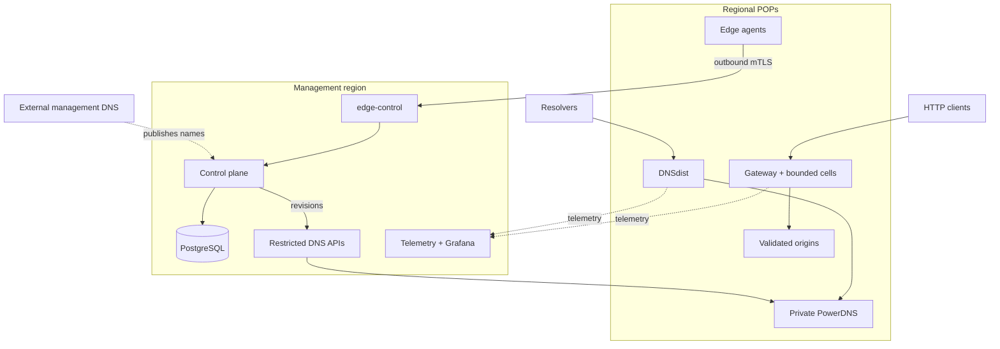

# Production quick start: multi-region fleet



::: danger Keep management DNS outside CDNFoundry
Publish `control.<operator-zone>`, `edge-control.<operator-zone>`,
`telemetry.<operator-zone>`, and every `dns-api-N.<operator-zone>` through an
independent external DNS provider. Do not put the operator zone in CDNFoundry
PowerDNS. CDNFoundry PowerDNS contains derived platform/customer runtime state
and must not be required to find the services that repair or manage it.
:::

This example models one control node, four authoritative DNS nodes, ten edge nodes, and three monitoring-role nodes. “Multi-region” describes its failure-domain design; it is not a special runtime mode or a fixed scale limit.

Read and complete the [starter fleet quick start](production-quick-start.md) first. The same security, PKI, transfer, migration, enrollment, last-valid-state, backup, and acceptance rules apply.

## Clone an immutable source revision

```bash
git clone https://github.com/vaheed/CDNFoundry.git cdnfoundry
cd cdnfoundry
git checkout v1.0.0
git rev-parse --verify HEAD
sudo ./scripts/install-production-prerequisites.sh
```

## Configure the topology without editing scripts

```bash
install -m 0600 deploy/production/examples/multi-region-fleet.json ./fleet.json
```

Edit `fleet.json` and replace the operator/platform domains, exact release, ACME contact, every documentation address, hostname, region, and location. Add private `monitor_ipv4`/`log_ipv4` addresses when monitoring traffic must avoid public paths. For remote PostgreSQL, add typed control-node `extra_env` values for `DB_HOST`, `DB_PORT`, and `DB_SSLMODE`, then replace `control-db-password` through `set-secret --from-file`; never put the password in JSON.

Validate without writing:

```bash
python3 -m json.tool fleet.json >/dev/null
./scripts/cdnfoundry-fleet --config fleet.json --non-interactive --dry-run setup
```

Create state and all node bundles:

```bash
sudo ./scripts/cdnfoundry-fleet \
  --config fleet.json \
  --state-dir /var/lib/cdnfoundry-fleet \
  --output-dir /var/lib/cdnfoundry-fleet/bundles \
  --non-interactive \
  setup
```

## Roll out in dependency order

1. Start `control-1`, including its MMDB updater, database dependencies, migrations, control services, and health checks.
2. Start the selected dedicated monitoring host and qualify Prometheus, Grafana, ClickHouse, Loki, and log ingestion.
3. Start all four DNS nodes. Register, test, and enable their DNS clusters;
   apply NS/glue platform identity only afterward and wait for every cluster to
   acknowledge it. Qualify UDP/TCP answers before delegation.
4. Create each edge in the control panel, configure its UUID/token through protected files, rerender, and start edge bundles one at a time.
5. Remove every consumed bootstrap token, rerender, and recreate only the affected agent.
6. Validate regional fallback, draining, node loss, control-plane outage, restart, telemetry loss, and previous-bundle rollback.

Do not activate all hosts simultaneously. A target must be valid and serving before any source is drained. Generated `.env.prod` is authoritative for every role bundle; do not add deployment defaults to Compose or edit rendered manifests on a host.

See [Production fleet configuration reference](production-fleet-config-reference.md) for JSON fields and [Production fleet operator guide](production-fleet-operator-guide.md) for lifecycle commands.
