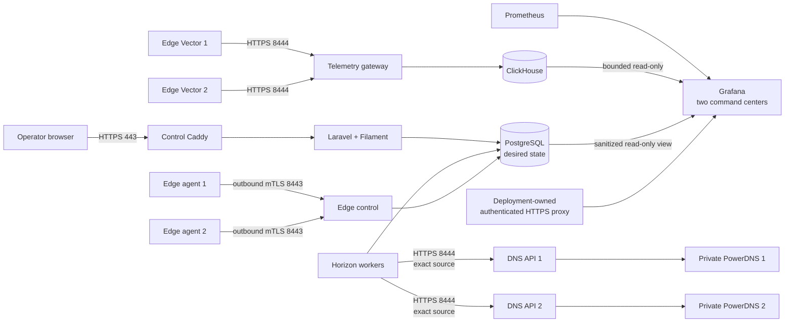
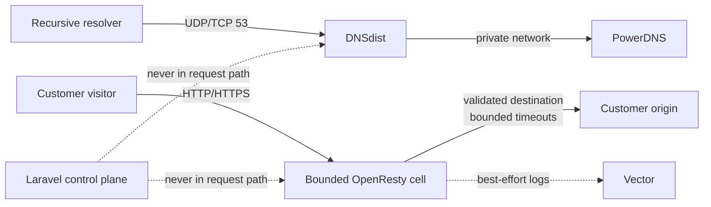
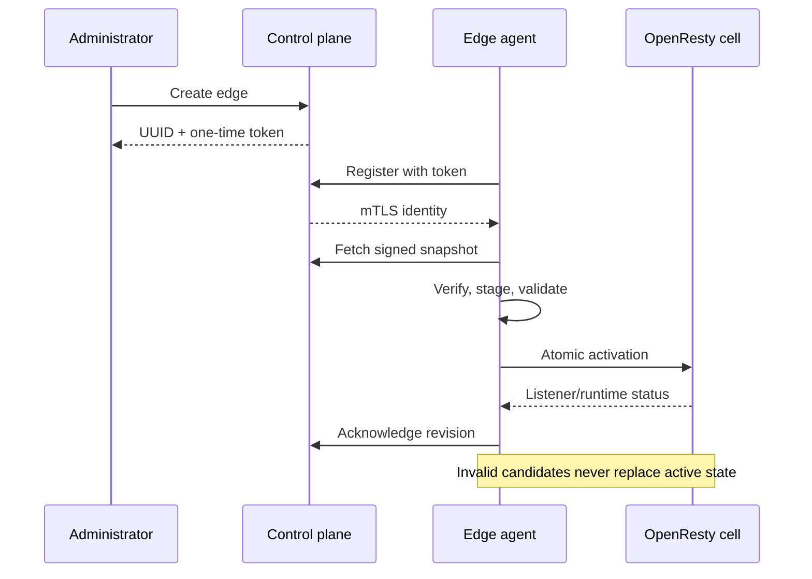

# Production quick start

This guide deploys the smallest practical production CDNFoundry fleet:

- one control host for the panel, API, workers, PostgreSQL, Valkey,
  ClickHouse, metrics, loopback-only Grafana, and public management gateways;
- two combined DNS and edge hosts in different failure domains;
- one exact, immutable CDNFoundry release on every host;
- IPv4 everywhere, with optional IPv6 enabled per host.

The procedure is intentionally explicit. Each mutation has a validation step,
and delegation is delayed until both authoritative servers answer correctly.

::: danger Production data
Never run `docker compose down -v`, delete named volumes, regenerate
`APP_KEY`, or replace CA keys during an upgrade. PostgreSQL and the PKI contain
state that cannot be reconstructed from container images.
:::

::: tip Copyable examples
VitePress adds a copy button to every command block. Replace every uppercase
placeholder and documentation IP before copying a command to a host.
:::

## What this topology provides

| Host | Services | Public listeners |
| --- | --- | --- |
| `CONTROL` | Laravel, web, Horizon, Scheduler, edge control, PostgreSQL, Valkey, ClickHouse, Vector, Prometheus, Alertmanager, loopback-only Grafana, Caddy | TCP `80`, `443`, `8443`, `8444`; UDP `443` |
| `EDGE_1` | DNSdist, PowerDNS, PowerDNS database, DNS API gateway, shared/quarantine OpenResty cells, edge agent, Vector, MMDB updater | TCP/UDP `53`; TCP `80`, `443`, `8444` |
| `EDGE_2` | Same roles as edge 1 in another provider, rack, or failure domain | TCP/UDP `53`; TCP `80`, `443`, `8444` |

The control host is not highly available in this minimum topology. Customer
DNS and HTTP traffic continue through the last valid runtime state when it is
offline, but management, deployment, new certificates, and analytics queries
pause. Off-host backup and tested recovery are therefore mandatory.



Grafana is not published by the control Caddy overlay. It binds to loopback by
default; operators must place a separately authenticated HTTPS reverse proxy or
trusted tunnel in front of it. Grafana failure affects diagnosis only and does
not enter DNS, HTTP, telemetry ingestion, or reconciliation paths.

Customer traffic has a separate path:



## Values used in this guide

Replace these examples consistently:

| Purpose | Example |
| --- | --- |
| Independent operator DNS zone | `ops.example.com` |
| CDNFoundry platform zone | `example.net` |
| Control IPv4 | `198.51.100.10` |
| Edge 1 IPv4 | `198.51.100.20` |
| Edge 2 IPv4 | `198.51.100.30` |
| Exact existing release | `v0.8.2` |
| Installation directory | `/opt/cdnfoundry` |
| Protected PKI directory | `/etc/cdnfoundry/pki` |

`198.51.100.0/24` is reserved for documentation and cannot route on the public
Internet. `ops.example.com` must remain at an independent DNS provider.
CDNFoundry will become authoritative for `example.net`.

::: warning Avoid a bootstrap dependency
Do not host `control`, `edge-control`, `telemetry`, or `dns-api-*` inside the
CDNFoundry-managed platform zone. Operators must still resolve management
endpoints while platform DNS is being repaired.
:::

## Before you start

Prepare:

- three fresh supported Linux hosts with Docker Engine and the Compose plugin;
- exact public IPv4 addresses and provider firewall access;
- optional exact public IPv6 addresses;
- an independent operator-owned DNS zone;
- one unused platform domain whose registrar permits child nameserver glue;
- an ACME contact address;
- an encrypted, off-host Restic repository and prefix-scoped credentials;
- a secret transfer channel and password manager;
- an immutable release tag or 40-character commit SHA.

A reasonable *starting point*, not a capacity promise, is:

| Role | CPU | Memory | Disk |
| --- | ---: | ---: | ---: |
| Control | 4 vCPU | 8 GiB | 100 GiB SSD |
| Each combined DNS/edge | 4 vCPU | 6 GiB | 50 GiB SSD plus planned cache capacity |

Measure DNS QPS, HTTP requests per second, concurrent origin connections,
bandwidth, cache churn, telemetry volume, ClickHouse retention, and disk
latency before resizing. See [Scaling](../operations/scaling.md) for the actual
scaling units.

## Network policy

Apply provider and host firewall policy before starting services:

| Destination | Allowed source |
| --- | --- |
| Control TCP `22` | trusted administrator networks |
| Control TCP `80`, `443`; UDP `443` | public |
| Control TCP `8443` | registered edge networks |
| Control TCP `8444` | registered edge networks |
| Edge TCP/UDP `53` | public |
| Edge TCP `80`, `443` | public |
| Edge TCP `8444` | control public IPv4 only |
| PostgreSQL, Valkey, ClickHouse, raw PowerDNS API, Prometheus, Grafana port 3000 | never public |

Docker-published ports can bypass ordinary UFW input policy. Enforce equivalent
rules in the provider firewall and the host's `DOCKER-USER` chain, keep console
access open during changes, and test both allowed and denied sources.

Outbound DNS and HTTPS are needed for image pulls, ACME, origin validation,
GeoIP downloads, agent enrollment, telemetry, and backups.

## Step 1: create bootstrap DNS and glue

At the independent provider for `ops.example.com`, create:

| Record | Value |
| --- | --- |
| `control.ops.example.com` A | control IPv4 |
| `edge-control.ops.example.com` A | control IPv4 |
| `telemetry.ops.example.com` A | control IPv4 |
| `dns-api-1.ops.example.com` A | edge 1 IPv4 |
| `dns-api-2.ops.example.com` A | edge 2 IPv4 |

Add AAAA records only when the matching host and firewall are IPv6-ready.

At the registrar for `example.net`, register child nameservers:

| Child nameserver | Glue |
| --- | --- |
| `ns1.example.net` | edge 1 IPv4 and optional IPv6 |
| `ns2.example.net` | edge 2 IPv4 and optional IPv6 |

Do **not** delegate `example.net` yet.

## Step 2: install one exact release everywhere

Run on all three hosts:

```sh
sudo apt-get update
sudo DEBIAN_FRONTEND=noninteractive apt-get install -y \
  ca-certificates curl git openssl

docker version
docker compose version

export CDNF_RELEASE=v0.8.2
sudo install -d -m 0755 /opt/cdnfoundry
sudo git clone --branch "${CDNF_RELEASE}" --depth 1 \
  https://github.com/vaheed/CDNFoundry.git /opt/cdnfoundry
sudo chown -R "$(id -u):$(id -g)" /opt/cdnfoundry
cd /opt/cdnfoundry
git rev-parse HEAD
```

If GHCR packages are private, authenticate with a read-only package token.
Never deploy `latest`, a major alias, or a minor alias.

## Step 3: generate a host-specific environment

Run the interactive generator once on each host:

```sh
cd /opt/cdnfoundry
./scripts/generate-production-env.sh
stat -c '%a %n' .env.prod
```

The expected mode is `600`. The generator refuses to overwrite an existing
file and generates independent secrets for each host.

On `CONTROL`, choose:

- role `control`;
- operator domain `ops.example.com`;
- platform domain `example.net`;
- the exact release;
- the control IPv4;
- both edge IPv4 addresses in the edge allowlist;
- the real Restic repository and backup-only credentials.

On each edge, choose role `dns-edge` and a unique label:

- `dns-api-1` on edge 1;
- `dns-api-2` on edge 2.

Each edge needs the control host's ClickHouse password for Vector ingestion.
Transfer only that value through the protected channel:

```sh
sudo sed -n 's/^CLICKHOUSE_PASSWORD=//p' \
  /opt/cdnfoundry/.env.prod
```

::: danger Secret separation
Never copy the control `.env.prod` to an edge. Each PowerDNS database password,
PowerDNS API key, edge status token, and agent identity has a distinct trust
boundary.
:::

## Step 4: generate the private PKI

Run once on `CONTROL`:

```sh
sudo install -d -m 0700 /etc/cdnfoundry/secrets
sudo /opt/cdnfoundry/scripts/generate-production-certificates.sh \
  /etc/cdnfoundry/pki \
  edge-control.ops.example.com \
  proxy.example.net \
  dns-api-1.ops.example.com \
  dns-api-2.ops.example.com

sudo sh -c 'umask 077; openssl rand -base64 48 > /etc/cdnfoundry/secrets/metrics-token'
sudo sh -c 'umask 077; openssl rand -base64 48 > /etc/cdnfoundry/secrets/restic-password'
sudo chown root:82 /etc/cdnfoundry/pki/edge-identity-ca.key
sudo chmod 0640 /etc/cdnfoundry/pki/edge-identity-ca.key
```

Verify certificate names before distribution:

```sh
openssl x509 -in /etc/cdnfoundry/pki/edge-control-server.crt \
  -noout -subject -issuer -ext subjectAltName
openssl verify -CAfile /etc/cdnfoundry/pki/edge-server-ca.crt \
  /etc/cdnfoundry/pki/edge-control-server.crt \
  /etc/cdnfoundry/pki/edge-runtime.crt \
  /etc/cdnfoundry/pki/dns-api-1.crt \
  /etc/cdnfoundry/pki/dns-api-2.crt
```

Copy to each edge only:

- `edge-server-ca.crt`;
- `edge-runtime.crt` and `edge-runtime.key`;
- its own `dns-api-N.crt` and `dns-api-N.key`.

Certificate mode is `0644`; private-key mode is `0600`. Never copy
`edge-server-ca.key` or `edge-identity-ca.key` to an edge. See
[Internal certificates](certificates.md) for the complete ownership
and rotation matrix.

## Step 5: validate and start the control host

Use the base production file plus the control-host overlay:

```sh
cd /opt/cdnfoundry

docker compose --env-file .env.prod \
  -f compose.prod.yml \
  -f deploy/production/compose.control-host.yml \
  --profile control --profile telemetry --profile logs config --quiet

docker compose --env-file .env.prod \
  -f compose.prod.yml \
  -f deploy/production/compose.control-host.yml \
  --profile control --profile telemetry --profile logs pull

docker compose --env-file .env.prod \
  -f compose.prod.yml \
  -f deploy/production/compose.control-host.yml \
  --profile tools run --rm migrate

docker compose --env-file .env.prod \
  -f compose.prod.yml \
  -f deploy/production/compose.control-host.yml \
  --profile control --profile telemetry --profile logs up -d

docker compose --env-file .env.prod \
  -f compose.prod.yml \
  -f deploy/production/compose.control-host.yml ps
```

The migration is explicit. Long-running services do not race database
migration during startup.

Verify the public path:

```sh
curl -fsS https://control.ops.example.com/api/health
curl -fsS https://control.ops.example.com/api/ready
```

`health` proves process liveness. `ready` reports dependency and operational
readiness; investigate degraded components before continuing.

Create the first administrator:

```sh
docker compose --env-file .env.prod \
  -f compose.prod.yml \
  -f deploy/production/compose.control-host.yml \
  exec -u www-data core php artisan cdnf:admin:create \
  --name="CDN Operations" \
  --email="admin@example.com"
```

The command prompts for the password and does not place it in shell history.
Sign in at `https://control.ops.example.com/admin`.

## Step 6: start authoritative DNS on both edges

Run independently on `EDGE_1` and `EDGE_2`:

```sh
cd /opt/cdnfoundry

docker compose --env-file .env.prod \
  -f compose.prod.yml \
  -f deploy/production/compose.dns-edge-host.yml \
  --profile dns --profile edge --profile logs config --quiet

docker compose --env-file .env.prod \
  -f compose.prod.yml \
  -f deploy/production/compose.dns-edge-host.yml \
  --profile dns --profile edge --profile logs pull

docker compose --env-file .env.prod \
  -f compose.prod.yml \
  -f deploy/production/compose.dns-edge-host.yml \
  --profile tools run --rm pdns-migrate

docker compose --env-file .env.prod \
  -f compose.prod.yml \
  -f deploy/production/compose.dns-edge-host.yml \
  --profile dns --profile logs up -d
```

Inspect the host:

```sh
docker compose --env-file .env.prod \
  -f compose.prod.yml \
  -f deploy/production/compose.dns-edge-host.yml \
  ps pdns-db pdns-auth dnsdist dns-api
```

From an external workstation, prove both transports reach DNSdist:

```sh
dig @198.51.100.20 example.net SOA
dig @198.51.100.20 example.net SOA +tcp
dig @198.51.100.30 example.net SOA
dig @198.51.100.30 example.net SOA +tcp
```

The zone does not exist yet, so an authoritative negative answer is acceptable.
A timeout, connection refusal, or response from an unrelated server is not.

## Step 7: configure system DNS identity

In **Control plane → System DNS identity**, enter:

| Field | Value |
| --- | --- |
| Platform domain | `example.net` |
| Proxy hostname | `proxy.example.net` |
| Nameserver 1 | `ns1.example.net`, edge 1 IPv4, optional IPv6 |
| Nameserver 2 | `ns2.example.net`, edge 2 IPv4, optional IPv6 |
| SOA primary | `ns1.example.net` |
| SOA mailbox | `hostmaster.example.net` |
| Refresh / retry / expire | `3600` / `600` / `1209600` |
| Minimum / default TTL | `300` / `300` |

Choose **Validate and preview**. Confirm normalization, nameserver/glue pairs,
SOA values, proxy hostname, and target list. Apply the exact confirmation token.
Changing input invalidates the preview token.

## Step 8: add and qualify DNS clusters

Create two disabled clusters:

| Field | Cluster 1 | Cluster 2 |
| --- | --- | --- |
| API URL | `https://dns-api-1.ops.example.com:8444` | `https://dns-api-2.ops.example.com:8444` |
| API key | edge 1 `PDNS_API_KEY` | edge 2 `PDNS_API_KEY` |
| Server ID | `localhost` | `localhost` |
| Nameserver | `ns1.example.net` | `ns2.example.net` |

For each cluster:

1. save it disabled;
2. run the asynchronous connection test;
3. inspect the stable result and TLS verification;
4. enable only after it is healthy;
5. reconcile system DNS identity;
6. wait for the candidate checksum to become active.

Test directly:

```sh
dig @198.51.100.20 example.net SOA +tcp
dig @198.51.100.30 example.net NS
dig @198.51.100.20 ns1.example.net A
dig @198.51.100.30 ns2.example.net A
```

Only now delegate `example.net` to `ns1.example.net` and `ns2.example.net`.

## Step 9: create and enroll each edge

In **Edge network → Edges**, create one edge per host with its real location.
Management IPv4/IPv6 are optional inventory fields; use them only for operator
access or monitoring. They are not pool endpoints and are not used by mTLS.
Copy the UUID and one-time bootstrap token.

The edge agent needs outbound DNS and TCP access to the hostname and port in
`EDGE_CONTROL_URL`. The control plane does not need inbound access to the edge.

Add them to that edge's `.env.prod`:

```dotenv
EDGE_ID=replace-with-edge-uuid
EDGE_BOOTSTRAP_TOKEN=replace-with-one-time-token
```

Start the edge profile:

```sh
docker compose --env-file .env.prod \
  -f compose.prod.yml \
  -f deploy/production/compose.dns-edge-host.yml \
  --profile edge --profile logs up -d

docker compose --env-file .env.prod \
  -f compose.prod.yml \
  -f deploy/production/compose.dns-edge-host.yml \
  ps edge edge-quarantine edge-agent vector mmdb-updater
```

Wait for:

- registered identity;
- a fresh heartbeat;
- a ready shared cell;
- listener-ready status;
- current agent version and sequence;
- visible bounded CPU, memory, and connection capacity.

Erase the bootstrap token after registration, then recreate only the agent:

```sh
sudo sed -i 's/^EDGE_BOOTSTRAP_TOKEN=.*/EDGE_BOOTSTRAP_TOKEN=/' \
  /opt/cdnfoundry/.env.prod

docker compose --env-file .env.prod \
  -f compose.prod.yml \
  -f deploy/production/compose.dns-edge-host.yml \
  --profile edge up -d --force-recreate edge-agent
```

Never clone the edge-agent identity volume to another host.



## Step 10: add the first customer domain

Use this order:

1. create the domain user;
2. create and assign the domain;
3. ask the owner to delegate to `ns1.example.net` and `ns2.example.net`;
4. verify nameservers asynchronously;
5. activate the domain;
6. wait for both DNS clusters to acknowledge the revision;
7. add DNS-only A/AAAA records first;
8. test DNS from outside;
9. add one proxied hostname with one explicit public origin;
10. wait for edge deployment and managed DNS-01 certificate completion.

External checks:

```sh
dig +trace CUSTOMER_DOMAIN NS
dig @198.51.100.20 CUSTOMER_DOMAIN A
dig @198.51.100.30 CUSTOMER_DOMAIN A +tcp
curl --fail --head \
  --resolve CUSTOMER_DOMAIN:443:198.51.100.20 \
  https://CUSTOMER_DOMAIN/
```

Origin validation rejects loopback, link-local, multicast, metadata, internal
platform, edge-service, and proxy-loop destinations. Do not weaken this check
to make a private origin work; private origin connectivity is not implemented.

## Step 11: establish backup and monitoring

Before accepting customer traffic:

- create and verify a Restic backup;
- copy required application and CA keys into the protected recovery system;
- configure a real Alertmanager receiver;
- confirm metrics require the separate bearer-token file;
- record baseline queue depth, disk use, edge capacity, DNS health, and MMDB age;
- restore into an isolated environment and measure RPO/RTO.

PostgreSQL, CA keys, application encryption/signing keys, and externally stored
customer TLS material form the recovery set. Derived PowerDNS data, edge
snapshots, and telemetry aggregates can be rebuilt.

## Step 12: production acceptance checklist

Do not announce service until all items are true:

- [ ] all hosts use the same exact release;
- [ ] Compose configuration renders without placeholders;
- [ ] Laravel and PowerDNS migrations completed explicitly;
- [ ] control health and readiness are acceptable;
- [ ] both DNS servers answer UDP and TCP externally;
- [ ] registrar glue matches active listener addresses;
- [ ] system DNS identity is active on both clusters;
- [ ] both edge identities are registered and bootstrap tokens removed;
- [ ] shared cells are listener-ready;
- [ ] one test domain resolves through both nameservers;
- [ ] one proxied HTTPS request succeeds through each edge;
- [ ] failed candidate activation preserves the previous valid state;
- [ ] telemetry failure does not interrupt DNS or HTTP;
- [ ] off-host backup and isolated restore are proven;
- [ ] firewall tests confirm private services are not public.

## Daily commands

Control host status:

```sh
docker compose --env-file .env.prod \
  -f compose.prod.yml \
  -f deploy/production/compose.control-host.yml ps

docker compose --env-file .env.prod \
  -f compose.prod.yml \
  -f deploy/production/compose.control-host.yml \
  logs --tail=200 core horizon scheduler caddy
```

Combined edge status:

```sh
docker compose --env-file .env.prod \
  -f compose.prod.yml \
  -f deploy/production/compose.dns-edge-host.yml ps

docker compose --env-file .env.prod \
  -f compose.prod.yml \
  -f deploy/production/compose.dns-edge-host.yml \
  logs --tail=200 dnsdist pdns-auth dns-api edge edge-agent vector
```

## Common startup failures

### Caddy cannot obtain the control certificate

Check:

1. the independent A/AAAA record;
2. public TCP `80` and `443`;
3. the ACME contact and upstream reachability;
4. Caddy logs;
5. provider rate limits.

```sh
docker compose --env-file .env.prod \
  -f compose.prod.yml \
  -f deploy/production/compose.control-host.yml \
  logs --tail=200 caddy
```

### Core is unhealthy

```sh
docker compose --env-file .env.prod \
  -f compose.prod.yml \
  -f deploy/production/compose.control-host.yml \
  logs --tail=200 core

docker inspect --format '{{json .State.Health}}' \
  "$(docker compose --env-file .env.prod \
  -f compose.prod.yml \
  -f deploy/production/compose.control-host.yml ps -q core)"
```

The production root filesystem is read-only. Do not make it writable as a
workaround. Verify migrations, mounted secrets, permissions, and writable
tmpfs/storage paths.

### DNS reconciliation fails

Check in order:

1. the operation and stable error code;
2. the control source IPv4 and firewall counters;
3. `DNS_API_HOSTNAME` against the certificate SAN;
4. the mounted server CA;
5. that edge's unique `PDNS_API_KEY`;
6. `dns-api` and `pdns-auth` health.

Never publish raw PowerDNS API port `8081`.

### Edge registration or deployment fails

Check edge UUID, one-time token state, server CA, system clock, outbound `8443`,
agent identity volume, artifact signature, sequence, available disk, and cell
status. Do not delete the active runtime directory: the agent intentionally
retains it as rollback state.

## Add another combined node

For each additional node:

1. create `dns-api-N.ops.example.com`;
2. install the same exact release;
3. generate a host-specific `dns-edge` environment;
4. issue a unique DNS API identity:

   ```sh
   sudo ./scripts/issue-production-dns-api-certificate.sh \
     /etc/cdnfoundry/pki \
     dns-api-3 \
     dns-api-3.ops.example.com
   ```

5. update exact-source firewall and gateway allowlists;
6. migrate and start DNS;
7. add, test, and enable its DNS cluster;
8. create and enroll its edge;
9. test DNS and HTTP before adding traffic.

The current platform bounds are eight nameserver identities and sixteen DNS
cluster targets. Adding a server does not always require adding another
delegated nameserver identity.

## Optional IPv6

Leave `PUBLIC_BIND_IPV6=` empty on IPv4-only hosts and omit IPv6 overlays.

Control with IPv6:

```sh
docker compose --env-file .env.prod \
  -f compose.prod.yml \
  -f deploy/production/compose.control-host.yml \
  -f deploy/production/compose.control-host-ipv6.yml \
  --profile control --profile telemetry --profile logs up -d
```

Combined DNS/edge with IPv6:

```sh
docker compose --env-file .env.prod \
  -f compose.prod.yml \
  -f deploy/production/compose.dns-edge-host.yml \
  -f deploy/production/compose.dns-host-ipv6.yml \
  -f deploy/production/compose.edge-host-ipv6.yml \
  --profile dns --profile edge --profile logs up -d
```

Publish AAAA and glue only after external IPv6 DNS and HTTPS checks pass.

## Upgrade and rollback

Back up first. Upgrade one edge at a time, then control components. Keep
application and runtime compatibility within the documented envelope. Run
explicit migrations and never roll back a database after an incompatible
migration.

Use [Upgrade and rollback](upgrade.md) for the canary sequence and
[Backup and recovery](../operations/backup-and-recovery.md) for the recovery set.

## Next steps

- [Understand the production topology](topology.md)
- [Harden secrets and networks](../security/hardening.md)
- [Configure monitoring](../operations/monitoring.md)
- [Practice incident runbooks](../operations/runbooks.md)
- [Scale roles independently](../operations/scaling.md)
