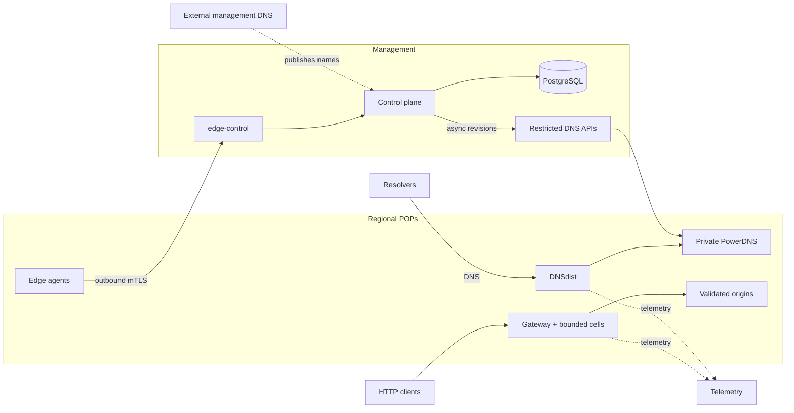

# Production quick start: starter fleet



::: danger Keep management DNS independent
`ops.example.com` and `example.net` are intentionally separate zones. Host
`control`, `edge-control`, `telemetry`, `grafana`, and every `dns-api-N` record
for the operator zone with an independent external DNS provider. Never host or
delegate the operator zone in CDNFoundry's own PowerDNS: that database is
derived runtime state, so using it for management names creates a bootstrap
dependency and can break control, recovery, and DNS reconciliation.
:::

CDNFoundry owns the platform zone (`example.net`) and enrolled customer zones.
Only DNSdist is public on port 53; PowerDNS and its database remain private.

This runbook creates the smallest practical production CDNFoundry fleet:

- one control-plane node with colocated monitoring and operational logs;
- two combined DNS and edge nodes in separate failure domains;
- one generated, role-filtered bundle per host.

The topology is data: edit a local JSON file containing your domains, addresses, and locations. Fleet generates the deployment files. Host-specific DNS or Docker networking overrides, when needed, are documented below and must be retained alongside the generated bundle.

Use steps 1–6 for host installation, then choose the browser or API instructions
for desired state. Both paths use the same accounts, permissions and asynchronous
operations. Fleet does not create panel users, register DNS clusters, enroll edge
identities, change registrar delegation, or prove public traffic readiness.

Before starting, have three hosts, an independently hosted management suffix,
a platform zone, a separate disposable customer zone with registrar access, an
ACME email, and a working owned origin. Record its scheme, host/IP, port, Host
header, and HTTPS SNI. These are distinct inputs: the customer zone must not
be the reserved platform zone. Keep IPv6 disabled until it is routable.

## 1. Prepare the hosts

Use supported Linux hosts with Docker Engine, Docker Compose v2, Python 3, PyYAML, OpenSSL, outbound HTTPS, synchronized clocks, and private administrative access. Open only the listeners documented in [Production fleet reference](production-fleet.md).

On an administrative workstation or the future control node, clone an immutable release or commit:

```bash
git clone https://github.com/vaheed/CDNFoundry.git cdnfoundry
cd cdnfoundry
read -r -p 'Verified release source commit (40 hex characters): ' CDNF_SOURCE_COMMIT
[[ "$CDNF_SOURCE_COMMIT" =~ ^[0-9a-f]{40}$ ]] || exit 1
git checkout --detach "$CDNF_SOURCE_COMMIT"
git rev-parse --verify HEAD
sudo ./scripts/install-production-prerequisites.sh
```

Select the source commit from an available signed release manifest. Do not
deploy from a moving branch or mutable image tag. Select the exact successful publication run and verify its evidence. Publication
alone does not qualify a staging installation or establish production readiness.

Before installation, complete [release verification and Fleet image projection](../operations/software-supply-chain.md#verify-a-release).
Populate the topology below, then use that procedure to produce
`fleet.verified.json` with all nine verified component digests. Use that file in
subsequent setup commands. No published tag or example digest is assumed here.

## 2. Create your topology file

Copy the starter example outside the repository-managed path:

```bash
install -m 0600 deploy/production/examples/starter-fleet.json ./fleet.json
```

Edit `fleet.json` and replace every example value:

- `operator_domain`: independently hosted management DNS suffix for control, DNS API, edge-control, node, and telemetry names;
- `platform_domain`: customer-facing CDN platform suffix;
- `release`: the exact checked-out tag or 40-character commit SHA;
- each required `CDNF_*_IMAGE` node `extra_env` value: the matching verified
  `@sha256` reference from `release-manifest.json`;
- `acme_email`: monitored certificate contact;
- every `hostname`, `public_ipv4`, region, and location;
- `public_ipv6` and `bind_ipv6` when deploying dual stack.

Keep `public_ipv6`, `bind_ipv6`, `monitor_ipv6`, and `log_ipv6` in every node object and set unavailable paths to JSON `null`. Set global `ipv6` to `true` only after the independent DNS provider's AAAA records, host routes, firewalls, and external reachability are ready.

The checked-in addresses are RFC documentation ranges and cannot serve production traffic. For DNS roles on hosts with a loopback resolver such as Ubuntu's
`127.0.0.53:53`, set `bind_ipv4` to the node's assigned local service address.
Binding `0.0.0.0:53` would conflict with that resolver. Keep the resolver intact;
validate that both UDP and TCP 53 bind successfully. On NAT hosts use the
assigned local interface address, not an unassigned advertised address.

Validate the JSON before it can create state:

```bash
python3 -m json.tool fleet.json >/dev/null
./scripts/cdnfoundry-fleet --config fleet.json --non-interactive --dry-run setup
```

The dry run performs topology, role, address, feature, and Compose validation without writing Fleet state or bundles. It does not establish signatures, public DNS/TLS reachability, or production readiness; use the verified image projection before actual setup.

### Publish the control-host management records

Before starting the control bundle, create these records at the independent
DNS provider that hosts `operator_domain`. In the starter topology the first four
names point to the control node because control, edge-control, telemetry and
Grafana are colocated. Each PoP management name points to its own host:

| Name | Record | Value |
| --- | --- | --- |
| `control.ops.example.com` | `A` | control node `public_ipv4` |
| `edge-control.ops.example.com` | `A` | control node `public_ipv4` |
| `telemetry.ops.example.com` | `A` | control node `public_ipv4` |
| `grafana.ops.example.com` | `A` | control node `public_ipv4` |
| `pop-1.ops.example.com` | `A` | first PoP `public_ipv4` |
| `pop-2.ops.example.com` | `A` | second PoP `public_ipv4` |

When the control node has a configured `public_ipv6`, publish matching `AAAA`
records to that address. Otherwise do not publish `AAAA` records. Replace the
example names with the names derived from your `operator_domain`.

Caddy obtains public certificates for these names. It can be container-healthy
while certificate issuance is failing, so do not continue until public DNS
resolvers return the control node address for every published name:

```bash
dig +short A control.ops.example.com @1.1.1.1
dig +short A edge-control.ops.example.com @1.1.1.1
dig +short A telemetry.ops.example.com @1.1.1.1
dig +short A grafana.ops.example.com @1.1.1.1
```

TCP ports 80 and 443 must also reach the control node during certificate
issuance and normal operation. Do not point these records at a PoP address.

## 3. Generate protected state and bundles

```bash
sudo install -d -m 0700 /var/lib/cdnfoundry-fleet
sudo ./scripts/cdnfoundry-fleet \
  --config fleet.verified.json \
  --state-dir /var/lib/cdnfoundry-fleet \
  --output-dir /var/lib/cdnfoundry-fleet/bundles \
  --non-interactive \
  setup
```

The command creates secrets and private PKI once, validates the complete desired topology, renders bundles atomically, and prints start order. Each node bundle contains its filtered Compose manifest, complete `.env.prod`, required runtime files, certificates, secrets, and operator scripts.

Never commit `fleet.json`, Fleet state, generated bundles, `.env.prod`, or private keys.

## 4. Inspect before transfer

```bash
sudo ./scripts/cdnfoundry-fleet \
  --state-dir /var/lib/cdnfoundry-fleet \
  --output-dir /var/lib/cdnfoundry-fleet/bundles \
  validate
sudo ./scripts/cdnfoundry-fleet \
  --state-dir /var/lib/cdnfoundry-fleet \
  status
sudo ./scripts/cdnfoundry-fleet \
  --state-dir /var/lib/cdnfoundry-fleet \
  show-start-order
```

For every bundle, review `README.md`. Before running `./validate.sh`, prepare
its metrics token ownership when the file is present (control or monitoring
roles). Run these commands from the protected bundle directory on both the
validation workstation and the destination host after transfer:

```bash
if [ -f secrets/metrics-token ]; then
  sudo chown 0:82 secrets/metrics-token
  sudo chmod 0640 secrets/metrics-token
fi
sudo ./validate.sh
```

Fresh rendering creates the metrics token with mode `0640` but the rendering
user's ownership. The validator requires `root:82`; `start.sh` also sets this
ownership, but the pre-transfer/pre-start validation occurs first. Keep the
bundle directory mode `0700` and do not broaden other secret permissions.

Validation uses the pinned Caddy images to parse every Caddyfile included in that node before activation, in addition to checking Compose interpolation, permissions, and certificate chains. It may pull a missing pinned image and create a short-lived validation container, but it does not start the application services. Production Compose has no deployment-value defaults: all interpolation comes from that bundle's generated `.env.prod`.

## 5. Start the control plane

Transfer `bundles/control-1` over an authenticated channel to `/opt/cdnfoundry` on the control host. Preserve modes and do not place the bundle in a public or shared directory.

The bundle directory is root-owned mode `0700`. Run commands inside it from a
root shell (`sudo -i`) on that host; leave that shell with `exit` when finished.
Use the same protected root-shell workflow on each PoP. Do not loosen directory
or env-file permissions merely to run Compose as your SSH user.

```bash
cd /opt/cdnfoundry
# Apply the metrics-token ownership step above if that file is present.
sudo ./validate.sh
sudo ./start.sh
docker compose --env-file .env.prod ps
```

Run the control bundle's `start.sh` as root. Before starting Compose, it keeps the edge identity CA signing key restricted while changing it from the transfer-safe root-only mode to owner `root`, numeric group `82`, mode `0640`; group `82` is the PHP-FPM worker in the immutable core image. Without this activation step, `core` deliberately refuses to start because its worker cannot read the signing key. Other private keys remain mode `0600`.

The activation script also restores read/traverse access on non-secret files
under `docker/` and `generated/`. This protects startup when an authenticated
transfer preserves file contents but narrows ordinary configuration files to
mode `0600`. It does not broaden permissions on `.env.prod`, `pki/`, or
`secrets/`.

The control bundle starts `mmdb-updater` before services that consume GeoIP data. Run migrations only through the generated `start.sh`/tools workflow; container startup never migrates the database.

Container health is not the completion gate for this step. Verify that Caddy
has obtained a certificate and that the public control endpoint completes a TLS
handshake:

```bash
curl --fail --show-error https://control.ops.example.com/api/health
curl --fail --show-error https://control.ops.example.com/api/ready
curl --fail --show-error https://grafana.ops.example.com/api/health
docker compose --env-file .env.prod logs --since 10m --no-color caddy
```

If a browser reports `ERR_SSL_PROTOCOL_ERROR`, first recheck the four control-host `A` and
optional `AAAA` records above, inbound TCP 80/443, and the Caddy log for ACME
errors. A healthy `caddy` container only confirms its local process health; it
does not confirm public DNS, certificate issuance, or the external TLS path.
Do not proceed to PoP setup until the control health request succeeds.

### Create the first administrator and sign in

Create the initial administrator from the running control container. Choose
the administrator's name and email on the command line; the command prompts
for the password twice without placing it in shell history:

```bash
docker compose --env-file .env.prod exec core \
  php artisan cdnf:admin:create \
  --name='Operations Administrator' \
  --email='admin@example.com'
```

Use a unique monitored email address and a password of at least 12 characters.
Expect `Administrator admin@example.com created.` A duplicate or invalid email,
short password, or confirmation mismatch is rejected without creating a user.
Do not use Artisan Tinker or insert the administrator directly into PostgreSQL;
the supported command applies validation, password hashing, and audit logging.

Open the administrator panel in a browser:

```text
https://control.ops.example.com/admin
```

Replace the example hostname with your `control.<operator_domain>` name and
sign in with the credentials just created. Expect the CDNFoundry operations
overview after login. If the browser shows a certificate warning or cannot
complete TLS, do not bypass it; return to the DNS, firewall, ACME-log, and
public `curl` checks above.

Create the bootstrap administrator only once. Additional administrators and
domain users belong in the authenticated **Customers → Users** workflow so
normal authorization and auditing apply.

### Use the role-specific login URL

The two browser panels intentionally have different authorization boundaries:

- administrators sign in at `https://control.ops.example.com/admin/login`;
- domain users sign in at `https://control.ops.example.com/app/login`.

Give every newly created domain user the `/app/login` URL. A domain user cannot
sign in to `/admin/login`, and an administrator cannot sign in to `/app/login`.
The login form deliberately returns the same generic credentials error for a
wrong password and a valid account presented to the wrong panel, so first
confirm the URL, user type, and active state before resetting a password. A
domain assignment is not required merely to sign in; an unassigned domain user
sees the bounded empty state.

## 6. Start authoritative DNS on both PoPs

Transfer `bundles/pop-1` and `bundles/pop-2` over authenticated channels to
`/opt/cdnfoundry` on their respective hosts. Preserve file modes. On each PoP:

```bash
cd /opt/cdnfoundry
# Apply the metrics-token ownership step above if that file is present.
sudo ./validate.sh
sudo ./start.sh
docker compose --env-file .env.prod ps
```

At this stage a combined `dns-edge` bundle has no edge UUID or bootstrap token.
Its generated `start.sh` therefore activates the `dns` profile only: it starts
the node-local PowerDNS database, idempotently ensures its base schema,
synchronizes the local database role to the bundle's node-specific password,
applies the separate PowerDNS migration, and starts PowerDNS, DNSdist, and the
restricted DNS API. It deliberately does not start the edge profile yet. This
activation can repair an interrupted first database initialization without
deleting the persistent volume.

Before adding either DNS cluster in the control panel, confirm that DNSdist
answers locally over both transports and that the control host can reach the
restricted DNS API with the generated certificate and API key. Allow public UDP
and TCP 53; keep TCP 8444 restricted to the control-plane source addresses.

```bash
# Replace this with the PoP's actual bind_ipv4; a response before zone
# publication proves reachability only, not a working authoritative zone.
read -r -p 'PoP bind IPv4: ' CDNF_DNS_BIND
dig @"$CDNF_DNS_BIND" example.net SOA +norecurse +time=3 +tries=1
dig +tcp @"$CDNF_DNS_BIND" example.net SOA +norecurse +time=3 +tries=1
openssl s_client -connect pop-1.ops.example.com:8444 \
  -servername pop-1.ops.example.com \
  -CAfile pki/edge-server-ca.crt </dev/null
```

Do not delegate a customer zone yet. An empty PowerDNS runtime can be healthy;
the control plane publishes desired state only after the clusters are registered
in the next step.

## 7. Configure DNS desired state

Sign in to the administrator panel, configure platform nameservers and DNS clusters using the two PoP hostnames, and verify registrar glue for their public addresses. DNSdist is the only public authoritative endpoint; PowerDNS and its database remain private.

Use this exact order:

1. In **Infrastructure → DNS clusters**, create each PoP disabled with its generated `https://pop-N.ops.example.com:8444` endpoint and node-local API key. Test it, then enable it. Do not apply platform identity until both targets are healthy.
2. In **Infrastructure → System DNS identity**, configure `example.net`, `ns1.example.net`, `ns2.example.net`, and their A/optional AAAA glue. Click **Validate and preview**. A **Review and save DNS identity** modal opens with the normalized public identity, glue addresses, DNS cluster targets, and timers. **Validation has not saved anything yet: review the modal, then click the red _Save DNS identity and queue update_ button to save the desired state.** Wait for both platform deployments to acknowledge the revision before continuing.
3. In **Domains → Create domain**, add a test customer zone. Creation
   automatically queues its initial SOA/NS deployment and then nameserver
   verification. Wait for both cluster acknowledgements, then verify the SOA
   and NS answers over UDP and TCP directly against both authoritative hosts.
4. Only after those answers are correct, create any required registrar glue and
   change customer delegation to the **exact Assigned nameservers shown on that
   customer domain**, including their claim prefix. The base platform
   `ns1.example.net` and `ns2.example.net` alone do not prove the customer claim.
   Keep the platform registrar glue pointing to the PoPs. A recursive
   `dig NS customer.test` may show child-zone answers even while the registrar
   still has the wrong names: verify the actual parent delegation. The first automatic verification may show a
   visible failure because delegation was intentionally not changed earlier;
   use **Verify nameservers** now and wait for it to succeed. Successful verification activates the
   domain; if it remains disabled after a previously verified claim, use its
   activation action. Add its first DNS-only A/AAAA record, wait for both cluster
   acknowledgements, and verify those answers directly. DNS desired-state setup
   is now complete. Edge creation and host changes begin in step 8; do not
   enable proxying yet.

Follow the [API setup sequence](#api-setup-sequence) below for exact routes and
request fields. API automation follows the same sequence. Authenticate with `POST /api/auth/login`, protect the returned bearer token, and use the DNS-cluster, domain, record, and edge endpoints in the live OpenAPI document. Send `Idempotency-Key` on mutations and poll the operation returned by `202 Accepted`. Never store an API token in Fleet JSON.

Both PoP DNS runtimes must already be healthy from step 6. If either cluster
test fails, do not enable it and do not delegate the customer zone.

## 8. Create, enroll, and start both edge roles

The PoP bundles were already transferred and started for DNS in step 6. Do not
rerender or transfer them again merely to enroll the edge role.

The `dns-api` name refers to a container inside a PoP bundle. It is not another
machine and never receives a separate enrollment file or bundle.

### 8.1 Create the edge records

Open **Infrastructure → Edges** and create two records. Their display names do
not have to match `fleet.json` node names. Each one-time modal shows only the
deployment-neutral values:

```dotenv
EDGE_ID=11111111-2222-3333-4444-555555555555
EDGE_BOOTSTRAP_TOKEN=the-one-time-token
```

Copy each block to its matching PoP. If the modal is closed before the token is
saved, use **Rotate identity** and use only the newest replacement token.

### 8.2 Paste two values and start the edge profile

On `pop-1`, replace the empty `EDGE_ID` and `EDGE_BOOTSTRAP_TOKEN` values in
`/opt/cdnfoundry/.env.prod` with the values for that edge. Keep the file private,
then start the edge profile explicitly:

```bash
cd /opt/cdnfoundry
sudo chmod 0600 .env.prod
sudo docker compose --env-file .env.prod --profile edge up -d
```

Repeat on `pop-2` with its own values. For subsequent whole-host starts, run
`sudo ./start.sh`. It reads the current `EDGE_ID` through Compose and includes
the edge profile after enrollment without editing the script or rerendering the
bundle. No second bundle transfer is required. Invalid UUID/configuration fails before migrations or activation. Keep
the spent bootstrap token blank after a fresh heartbeat; the persisted identity
continues to authenticate the agent. Existing PowerDNS containers and volumes
remain in place.

Wait for a fresh heartbeat in the administrator panel. If enrollment fails,
inspect `docker compose --env-file .env.prod logs --tail=200 edge-agent`, fix
connectivity, CA, clock, UUID, or token errors, and run the same profile command
again. After success, the token is spent; blank it in `.env.prod` during normal
secret hygiene. No immediate second restart is required.

### 8.3 Configure service addresses

Directly assigned public service addresses need no gateway map. Add the same
public addresses as pool endpoints in the administrator panel and the gateway
binds them directly. For one-to-one NAT or a load balancer, configure the host
once before adding endpoints:

```dotenv
EDGE_GATEWAY_ADDRESS_MAP={"198.51.100.30":"10.30.0.30"}
```

The key is the advertised endpoint and the value is the distinct private local
listener. Never use `0.0.0.0` or `::` as a service identity. Set
`EDGE_GATEWAY_REQUIRE_ADDRESS_MAP=true` only where policy requires every
advertised endpoint to have an explicit translation.

Back in **Infrastructure → Edges**, wait for enrollment time, a fresh heartbeat,
reported agent version, and a ready gateway. A new edge with no domains still
activates an empty generation at sequence `0`; do not create a placeholder
domain.

Finish edge desired state in this order:

1. Create the service pool disabled.
2. Assign the intended non-drained cells on each edge.
3. Add each PoP's advertised endpoint and, only for NAT, its matching public
   key configured in `EDGE_GATEWAY_ADDRESS_MAP`.
4. Enable the pool after every participating edge has its endpoint and enough
   assigned cells. Wait for the gateway to acknowledge the listener-only endpoint generation.
   No placeholder or proxied customer hostname is required, and this state must
   not emit repeated candidate errors or generation-mismatch warnings.
5. Add the validated origin and enable proxying for the test hostname, then
   wait for its placement and route generation to become active.

Creating the endpoint before assigning cells is also safe: it remains pending
and omitted from the candidate until a cell participates, then converges to the
same listener-only generation. Follow the bounded pool and address rules in the
[Fleet operator guide](production-fleet-operator-guide.md).

If a host's only public address will be its service endpoint, leave that edge's
optional **Management IPv4/IPv6** blank. Management inventory addresses must be
different from service endpoints. Assign a cell to the Geo-Unicast pool before
creating the endpoint; the first endpoint is valid before any customer domain
exists and activates an empty runtime for that assigned cell.

The gateway image runs as an unprivileged user and carries only the
file capability required to bind ports 80 and 443; Compose drops every
capability and adds only `NET_BIND_SERVICE`. A `bind ...:80` or
`bind ...:443: permission denied` error with the generated Compose file is a
gateway image or release defect. Do not run the container privileged, change it to root, or add
broader capabilities. Keep the endpoint withdrawn until a corrected immutable
gateway image is deployed.

### Create and assign the customer user

After the customer domain exists, open **Customers → Users**, select **Create**,
enter **Name**, **Email**, a unique **Password**, and **Type = Domain user**. Save the
account, open **Customers → Domains**, select the test domain, open its **Users**
relation, select **Attach**, choose the new account, and confirm **Attach**. Reuse existing accounts/domains during qualification.
Give the owner their email, password through a protected channel, and
`https://control.ops.example.com/app/login`. Never send the administrator
password as the customer's credentials. Sign in separately as that user and
confirm the assigned domain is visible and administrator navigation is absent.
The API equivalents are in the table below. Browser checks are owner-run.

### API setup sequence

Use the checked-out release's `docs/public/openapi.json` together with the
[endpoint catalog](../reference/api/endpoints.md). All paths below start with
`/api`. Send JSON and `Accept: application/json`; authenticated calls need the
bearer token. Generate a distinct UUID `Idempotency-Key` for each mutation;
retry a timed-out request with the same key and identical body. Never put actual
passwords/tokens in command arguments, terminal output or Fleet JSON. Use a
protected request file or an API client that reads secrets without echoing them.

1. `POST /auth/login` with `email`, `password`, `device_name`. Save `data.token`
   privately. Login works for either user type; `/admin/*` requires an admin.
2. Use the following sequence, keeping every returned cluster/domain/user/edge/
   pool/cell/record ID. Read existing lists first so reruns reuse desired state.
3. Poll `GET /admin/operations/{id}` as admin, or `GET /operations/{id}` as the
   authorized domain user. A `202` is queued work, not success. Operation IDs
   occur at top-level `operation_id`, `data.operation_id`, or `data.id` when the
   response is an operation object. Stop on `failed`; inspect its error, correct
   the cause, and submit an intentional new attempt with a new key. Bound polls
   to three minutes and report a timeout instead of continuing silently.
4. Revoke the temporary API token with `POST /auth/logout` when finished.

| Order | Request | Fields and completion check |
| --- | --- | --- |
| DNS clusters, once per PoP | `POST /admin/dns/clusters` | `name`, `location`, `api_url` (`https://pop-N.ops.example.com:8444`), protected `api_key`, `server_id: "localhost"`, `nameservers: [{"hostname":"ns1.example.net"},{"hostname":"ns2.example.net"}]`, `capacity_zones: 10000`; created disabled, test queued; poll top-level `operation_id` |
| Test/retry and enable | `POST /admin/dns/clusters/{id}/test`, then `POST /admin/dns/clusters/{id}/enable` | Empty objects; wait for test success before enable; wait for its reconcile operation |
| Preview platform identity | `POST /admin/system/settings/dns/validate` | Payload below; receive `data.confirmation_token`; validation alone saves nothing |
| Save platform identity | `PATCH /admin/system/settings/dns` | Same payload plus `confirmation_token`; poll operation `data.id`; require both DNS deployments |
| Customer zone | `POST /domains` | `{"name":"customer.test"}` using your actual owned zone; retain `data.id`; inspect `GET /domains/{id}` for assigned nameservers and `GET /domains/{id}/dns/deployment` for acknowledgements |
| Verify real delegation | `POST /domains/{id}/verify-nameservers` | Empty object after saving the exact assigned names at the registrar; poll `data.id`; expect `lifecycle_state: active`; never use force-verification for qualification |
| Customer user | `POST /admin/users` | `name`, `email`, `password` (12+ characters with upper/lower case and digits), `type: "user"`; retain `data.id` |
| Assign customer user | `POST /admin/domains/{domain}/users` | `{"user_id": USER_ID}`; log in separately as this user and check `GET /domains`; administrator API calls must return 403 |
| Edge, once per PoP | `POST /admin/edges` | `name`, actual `country_code` and `continent_code`, `cell_slot_count: 8`; leave management IPs null when the same addresses serve traffic; securely retain `data.id` and one-time `data.bootstrap_token`; perform step 8 host enrollment |
| Shared service pool | `POST /admin/edge-pools` | `name`, `kind: "shared"`, `routing_mode: "geo_unicast"`, `minimum_ready_cells: 1`, `replicas_per_edge: 1`, `maximum_domains_per_cell: 1000`, `cache_profile: "standard"`, `compression_profile: "standard"`, `waf_capable: false`; created disabled |
| Assign a cell on each edge | `PUT /admin/edge-pools/{pool}/cells/{cell}` | Empty object; select an unassigned, non-drained cell from `GET /admin/edges/{edge}`; poll `data.operation_id` |
| Endpoint, once per edge | `POST /admin/edge-pools/{pool}/edges/{edge}/endpoint` | `ipv4`, `ipv6: null` for IPv4-only, `withdrawn: false`; use the actual service address |
| Enable pool | `POST /admin/edge-pools/{pool}/enable` | Empty object after cells/endpoints exist; inspect `GET /admin/edge-pools/{pool}` until every endpoint has `gateway_state: ready` and a fresh acknowledgement |

Example identity payload (replace every example domain and address):

```json
{
  "platform_domain": "example.net",
  "proxy_hostname": "proxy.example.net",
  "nameservers": [
    {"hostname": "ns1.example.net", "ipv4": "198.51.100.30", "ipv6": null},
    {"hostname": "ns2.example.net", "ipv4": "198.51.100.31", "ipv6": null}
  ],
  "soa_primary": "ns1.example.net",
  "soa_mailbox": "hostmaster.example.net",
  "soa_refresh": 3600,
  "soa_retry": 600,
  "soa_expire": 1209600,
  "soa_minimum_ttl": 300,
  "default_ttl": 300,
  "cluster_targets": ["pop-1.ops.example.com:8444", "pop-2.ops.example.com:8444"]
}
```

For the active customer zone, create a DNS-only record with
`POST /domains/{domain}/dns/records` using the release's record schema. Check
`GET /domains/{domain}/dns/deployment` and query both authoritative servers.
Then configure a proxied record with its validated origin using the same record
API, and check `GET /domains/{domain}/deployment`. Use
`POST /domains/{domain}/dns/records/{record}/origin/test` for the queued origin
probe. Origin `host`, `port`, `scheme`, `host_header`, `sni`, `verify_tls`,
`connect_timeout_ms`, `response_timeout_ms`, and `retry_count` are explicit fields.
Advanced HTTP ports such as 8096 are supported through this API; the browser's
scheme selector chooses the standard port. Inspect the saved port before changing
it. An HTTP origin does not prove verified HTTPS origin connectivity.

Wait for managed DNS-01 issuance and the acknowledged edge deployment before
claiming client HTTPS works. Follow the implemented [Phase 1 manual checks](https://github.com/vaheed/CDNFoundry/blob/dev/docs/manual-browser-qualification.md#phase-1--empty-staging-smoke)
for origin, TLS, cache purge, security and telemetry, and execute the runtime
checks in step 9. API/UI success alone is not traffic evidence.

### Host DNS and gateway readiness troubleshooting

These checks reproduce two observed host-network failures without weakening
certificate, DNSSEC, domain-claim or image verification:

- If nameserver verification reports DNSSEC/resolution failure, run
  `docker compose --env-file .env.prod exec -T core delv -q CUSTOMER_ZONE -t DS`.
  Compare with the same command using `delv @1.1.1.1` and `delv @8.8.8.8` only
  where those resolvers are reachable and appropriate for the host. A fully
  validated negative DS response is expected for an unsigned customer zone.
  If Docker's inherited resolver fails but approved explicit resolvers validate,
  put their addresses in a host-local `/opt/cdnfoundry/compose.override.yml` under
  `services.core.dns`, `services.horizon.dns`, and `services.scheduler.dns`,
  validate it, then recreate those three services. The queue worker performs
  domain verification, so fixing only the web application is insufficient.
- If an enrolled edge has fresh heartbeats but the gateway stays unacknowledged,
  inspect `docker compose --env-file .env.prod exec -T edge-agent cat /etc/hosts`.
  An `invalid IP` entry for `host-gateway` cannot resolve. Obtain the actual
  gateway with `docker network inspect cdnfoundry_edge`; do not assume its subnet.
  In a host-local override set `services.edge-agent.extra_hosts.host-gateway`
  to that bridge's IPv4 gateway, validate, then recreate only `edge-agent`.
  Confirm the agent can read `http://host-gateway:9105/metrics` and the endpoint
  becomes ready. Restrict external TCP 9105 to monitoring/control sources;
  allow the local bridge path. Do not expose metrics publicly.

Example override shapes; substitute approved resolvers and the inspected bridge
address, and apply only the relevant service on each host:

```yaml
services:
  core:
    dns: [1.1.1.1, 8.8.8.8]
  horizon:
    dns: [1.1.1.1, 8.8.8.8]
  scheduler:
    dns: [1.1.1.1, 8.8.8.8]
```

```yaml
services:
  edge-agent:
    extra_hosts:
      host-gateway: 172.18.0.1
```

Preserve any existing override; merge and review rather than overwrite it. Keep
it mode `0600` in the mode-`0700` bundle directory. Before activation use
`sudo docker compose --env-file .env.prod config --quiet`, then
`sudo docker compose --env-file .env.prod up -d --no-deps --wait SERVICE` with
`SERVICE` replaced by `core horizon scheduler` on control or `edge-agent` on a PoP. Retain the previous override for
rollback. These deployment overrides are not Fleet state: keep them in protected
host inventory and reapply/revalidate them after a future bundle replacement.
They require no image rebuild, database migration or volume removal.

## 9. Acceptance and recovery gate

Check public endpoints before delegation or traffic:

```bash
curl --fail https://control.ops.example.com/api/health
curl --fail https://control.ops.example.com/api/ready
curl --fail https://grafana.ops.example.com/api/health
dig +short A control.ops.example.com @1.1.1.1
dig +short AAAA control.ops.example.com @1.1.1.1 # empty is valid when IPv6 is null
dig +tcp SOA example.net @ns1.example.net
dig SOA example.net @ns2.example.net
# Use the enrolled customer hostname, never the reserved platform namespace.
curl --fail --resolve www.customer.test:443:EDGE_IP https://www.customer.test/
```

Run `docker compose --env-file .env.prod ps` on every node. Long-running services must be healthy; completed migration helpers may be exited. Ports 8443/8444, metrics, PostgreSQL, Valkey, PowerDNS API, ClickHouse, and Loki are restricted interfaces, not general public endpoints.

Confirm:

- control health, queues, Scheduler, Horizon, and migrations;
- DNS answers over UDP and TCP from both public nodes;
- edge mTLS enrollment and heartbeat;
- customer HTTP/TLS service through both PoPs;
- MMDB health on control, DNS, and edge roles;
- Prometheus targets, Grafana dashboards, ClickHouse telemetry, and bounded Loki logs;
- encrypted backup and restore rehearsal when backups are enabled;
- restart and previous-bundle rollback without deleting volumes.

Never run `docker compose down -v`, regenerate application/CA keys during an ordinary upgrade, or copy one edge identity volume to another host.

Continue with the [Production fleet operator guide](production-fleet-operator-guide.md). For separated roles across several regions, use the [Multi-region fleet quick start](production-quick-start-multi-region.md).
