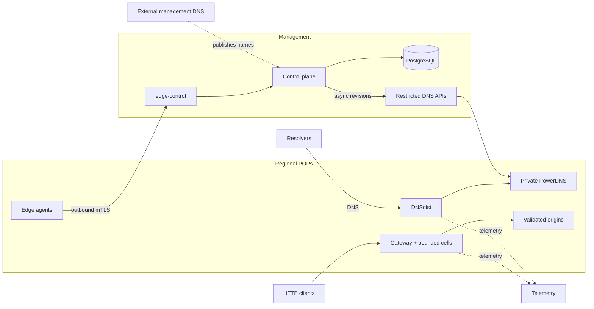

# Production quick start: starter fleet



::: danger Keep management DNS independent
`ops.example.com` and `example.net` are intentionally separate zones. Host
`control`, `edge-control`, `telemetry`, `grafana`, and every `dns-api-N` record
for the operator zone with an independent external DNS provider. Never host or
delegate the operator zone in CDNFoundry's own PowerDNS: that database is
derived runtime state, so using it for management names creates a bootstrap
dependency and can break control, recovery, and DNS reconciliation.
:::

CDNFoundry owns the platform zone (`example.net`) and enrolled customer zones.
Only DNSdist is public on port 53; PowerDNS and its database remain private.

This runbook creates the smallest practical production CDNFoundry fleet:

- one control-plane node with colocated monitoring and operational logs;
- two combined DNS and edge nodes in separate failure domains;
- one generated, role-filtered bundle per host.

The topology is data, not code. You edit a local JSON file containing your domains, addresses, and locations. You do not edit deployment shell scripts or Compose files.

## 1. Prepare the hosts

Use supported Linux hosts with Docker Engine, Docker Compose v2, Python 3, PyYAML, OpenSSL, outbound HTTPS, synchronized clocks, and private administrative access. Open only the listeners documented in [Production fleet reference](production-fleet.md).

On an administrative workstation or the future control node, clone an immutable release or commit:

```bash
git clone https://github.com/vaheed/CDNFoundry.git cdnfoundry
cd cdnfoundry
git checkout v1.0.0
git rev-parse --verify HEAD
sudo ./scripts/install-production-prerequisites.sh
```

Replace `v1.0.0` with a published release tag or exact commit SHA. Do not deploy from a moving branch or mutable image tag.

## 2. Create your topology file

Copy the starter example outside the repository-managed path:

```bash
install -m 0600 deploy/production/examples/starter-fleet.json ./fleet.json
```

Edit `fleet.json` and replace every example value:

- `operator_domain`: independently hosted management DNS suffix for control, DNS API, edge-control, node, and telemetry names;
- `platform_domain`: customer-facing CDN platform suffix;
- `release`: the exact checked-out tag or 40-character commit SHA;
- each required `CDNF_*_IMAGE` node `extra_env` value: the matching verified
  `@sha256` reference from `release-manifest.json`;
- `acme_email`: monitored certificate contact;
- every `hostname`, `public_ipv4`, region, and location;
- `public_ipv6` and `bind_ipv6` when deploying dual stack.

Keep `public_ipv6`, `bind_ipv6`, `monitor_ipv6`, and `log_ipv6` in every node object and set unavailable paths to JSON `null`. Set global `ipv6` to `true` only after the independent DNS provider's AAAA records, host routes, firewalls, and external reachability are ready.

The checked-in addresses are RFC documentation ranges and cannot serve production traffic. Keep `bind_ipv4` as `0.0.0.0` for normal routed/NAT hosts unless a specific local interface address is required.

Validate the JSON before it can create state:

```bash
python3 -m json.tool fleet.json >/dev/null
./scripts/cdnfoundry-fleet --config fleet.json --non-interactive --dry-run setup
```

The dry run performs topology, role, address, feature, and Compose validation without writing Fleet state or bundles.

### Publish the control-host management records

Before starting the control bundle, create these records at the independent
DNS provider that hosts `operator_domain`. In the starter topology all four
names point to the control node's public address because control, edge-control,
telemetry, and Grafana are colocated:

| Name | Record | Value |
| --- | --- | --- |
| `control.ops.example.com` | `A` | control node `public_ipv4` |
| `edge-control.ops.example.com` | `A` | control node `public_ipv4` |
| `telemetry.ops.example.com` | `A` | control node `public_ipv4` |
| `grafana.ops.example.com` | `A` | control node `public_ipv4` |

When the control node has a configured `public_ipv6`, publish matching `AAAA`
records to that address. Otherwise do not publish `AAAA` records. Replace the
example names with the names derived from your `operator_domain`.

Caddy obtains public certificates for these names. It can be container-healthy
while certificate issuance is failing, so do not continue until public DNS
resolvers return the control node address for every published name:

```bash
dig +short A control.ops.example.com @1.1.1.1
dig +short A edge-control.ops.example.com @1.1.1.1
dig +short A telemetry.ops.example.com @1.1.1.1
dig +short A grafana.ops.example.com @1.1.1.1
```

TCP ports 80 and 443 must also reach the control node during certificate
issuance and normal operation. Do not point these records at a PoP address.

## 3. Generate protected state and bundles

```bash
sudo install -d -m 0700 /var/lib/cdnfoundry-fleet
sudo ./scripts/cdnfoundry-fleet \
  --config fleet.json \
  --state-dir /var/lib/cdnfoundry-fleet \
  --output-dir /var/lib/cdnfoundry-fleet/bundles \
  --non-interactive \
  setup
```

The command creates secrets and private PKI once, validates the complete desired topology, renders bundles atomically, and prints start order. Each node bundle contains its filtered Compose manifest, complete `.env.prod`, required runtime files, certificates, secrets, and operator scripts.

Never commit `fleet.json`, Fleet state, generated bundles, `.env.prod`, or private keys.

## 4. Inspect before transfer

```bash
sudo ./scripts/cdnfoundry-fleet \
  --state-dir /var/lib/cdnfoundry-fleet \
  --output-dir /var/lib/cdnfoundry-fleet/bundles \
  validate
sudo ./scripts/cdnfoundry-fleet \
  --state-dir /var/lib/cdnfoundry-fleet \
  status
sudo ./scripts/cdnfoundry-fleet \
  --state-dir /var/lib/cdnfoundry-fleet \
  show-start-order
```

For every bundle, review `README.md` and run `./validate.sh`. Validation uses the pinned Caddy images to parse every Caddyfile included in that node before activation, in addition to checking Compose interpolation, permissions, and certificate chains. It may pull a missing pinned image and create a short-lived validation container, but it does not start the application services. Production Compose has no deployment-value defaults: all interpolation comes from that bundle's generated `.env.prod`.

## 5. Start the control plane

Transfer `bundles/control-1` over an authenticated channel to `/opt/cdnfoundry` on the control host. Preserve modes and do not place the bundle in a public or shared directory.

```bash
cd /opt/cdnfoundry
./validate.sh
sudo ./start.sh
docker compose --env-file .env.prod ps
```

Run the control bundle's `start.sh` as root. Before starting Compose, it keeps the edge identity CA signing key restricted while changing it from the transfer-safe root-only mode to owner `root`, numeric group `82`, mode `0640`; group `82` is the PHP-FPM worker in the immutable core image. Without this activation step, `core` deliberately refuses to start because its worker cannot read the signing key. Other private keys remain mode `0600`.

The activation script also restores read/traverse access on non-secret files
under `docker/` and `generated/`. This protects startup when an authenticated
transfer preserves file contents but narrows ordinary configuration files to
mode `0600`. It does not broaden permissions on `.env.prod`, `pki/`, or
`secrets/`.

The control bundle starts `mmdb-updater` before services that consume GeoIP data. Run migrations only through the generated `start.sh`/tools workflow; container startup never migrates the database.

Container health is not the completion gate for this step. Verify that Caddy
has obtained a certificate and that the public control endpoint completes a TLS
handshake:

```bash
curl --fail --show-error https://control.ops.example.com/api/health
curl --fail --show-error https://control.ops.example.com/api/ready
curl --fail --show-error https://grafana.ops.example.com/api/health
docker compose --env-file .env.prod logs --since 10m --no-color caddy
```

If a browser reports `ERR_SSL_PROTOCOL_ERROR`, first recheck the three `A` and
optional `AAAA` records above, inbound TCP 80/443, and the Caddy log for ACME
errors. A healthy `caddy` container only confirms its local process health; it
does not confirm public DNS, certificate issuance, or the external TLS path.
Do not proceed to PoP setup until the control health request succeeds.

### Create the first administrator and sign in

Create the initial administrator from the running control container. Choose
the administrator's name and email on the command line; the command prompts
for the password twice without placing it in shell history:

```bash
docker compose --env-file .env.prod exec core \
  php artisan cdnf:admin:create \
  --name='Operations Administrator' \
  --email='admin@example.com'
```

Use a unique monitored email address and a password of at least 12 characters.
Expect `Administrator admin@example.com created.` A duplicate or invalid email,
short password, or confirmation mismatch is rejected without creating a user.
Do not use Artisan Tinker or insert the administrator directly into PostgreSQL;
the supported command applies validation, password hashing, and audit logging.

Open the administrator panel in a browser:

```text
https://control.ops.example.com/admin
```

Replace the example hostname with your `control.<operator_domain>` name and
sign in with the credentials just created. Expect the CDNFoundry operations
overview after login. If the browser shows a certificate warning or cannot
complete TLS, do not bypass it; return to the DNS, firewall, ACME-log, and
public `curl` checks above.

Create the bootstrap administrator only once. Additional administrators and
domain users belong in the authenticated **Customers → Users** workflow so
normal authorization and auditing apply.

## 6. Start authoritative DNS on both PoPs

Transfer `bundles/pop-1` and `bundles/pop-2` over authenticated channels to
`/opt/cdnfoundry` on their respective hosts. Preserve file modes. On each PoP:

```bash
cd /opt/cdnfoundry
./validate.sh
sudo ./start.sh
docker compose --env-file .env.prod ps
```

At this stage a combined `dns-edge` bundle has no edge UUID or bootstrap token.
Its generated `start.sh` therefore activates the `dns` profile only: it starts
the node-local PowerDNS database, idempotently ensures its base schema,
synchronizes the local database role to the bundle's node-specific password,
applies the separate PowerDNS migration, and starts PowerDNS, DNSdist, and the
restricted DNS API. It deliberately does not start the edge profile yet. This
activation can repair an interrupted first database initialization without
deleting the persistent volume.

Before adding either DNS cluster in the control panel, confirm that DNSdist
answers locally over both transports and that the control host can reach the
restricted DNS API with the generated certificate and API key. Allow public UDP
and TCP 53; keep TCP 8444 restricted to the control-plane source addresses.

```bash
dig @127.0.0.1 version.bind TXT CH +short
dig +tcp @127.0.0.1 version.bind TXT CH +short
openssl s_client -connect pop-1.ops.example.com:8444 \
  -servername pop-1.ops.example.com \
  -CAfile pki/edge-server-ca.crt </dev/null
```

Do not delegate a customer zone yet. An empty PowerDNS runtime can be healthy;
the control plane publishes desired state only after the clusters are registered
in the next step.

## 7. Configure DNS desired state

Sign in to the administrator panel, configure platform nameservers and DNS clusters using the two PoP hostnames, and verify registrar glue for their public addresses. DNSdist is the only public authoritative endpoint; PowerDNS and its database remain private.

Use this exact order:

1. In **Infrastructure → DNS clusters**, create each PoP disabled with its generated `https://pop-N.ops.example.com:8444` endpoint and node-local API key. Test it, then enable it. Do not apply platform identity until both targets are healthy.
2. In **Infrastructure → System DNS identity**, configure `example.net`, `ns1.example.net`, `ns2.example.net`, and their A/optional AAAA glue. Click **Validate and preview**. A **Review and save DNS identity** modal opens with the normalized public identity, glue addresses, DNS cluster targets, and timers. **Validation has not saved anything yet: review the modal, then click the red _Save DNS identity and queue update_ button to save the desired state.** Wait for both platform deployments to acknowledge the revision before continuing.
3. In **Domains → Create domain**, add a test customer zone. Creation
   automatically queues its initial SOA/NS deployment and then nameserver
   verification. Wait for both cluster acknowledgements, then verify the SOA
   and NS answers over UDP and TCP directly against both authoritative hosts.
4. Only after those answers are correct, create any required registrar glue and
   change customer delegation. The first automatic verification may show a
   visible failure because delegation was intentionally not changed earlier;
   use **Verify nameservers** now and wait for it to succeed. Activate the
   domain, add its first DNS-only A/AAAA record, wait for both cluster
   acknowledgements, and verify those answers directly. DNS desired-state setup
   is now complete. Edge creation and host changes begin in step 8; do not
   enable proxying yet.

API automation follows the same sequence. Authenticate with `POST /api/v1/admin/login`, protect the returned bearer token, and use the DNS-cluster, domain, record, and edge endpoints in the live OpenAPI document. Send `Idempotency-Key` on mutations and poll the operation returned by `202 Accepted`. Never store an API token in Fleet JSON.

Both PoP DNS runtimes must already be healthy from step 6. If either cluster
test fails, do not enable it and do not delegate the customer zone.

## 8. Create, enroll, and start both edge roles

The PoP bundles were already transferred and started for DNS in step 6. Do not
rerender or transfer them again merely to enroll the edge role.

The `dns-api` name refers to a container inside a PoP bundle. It is not another
machine and never receives a separate enrollment file or bundle.

### 8.1 Create the edge records

Open **Infrastructure → Edges** and create two records. Their display names do
not have to match `fleet.json` node names. Each one-time modal shows only the
deployment-neutral values:

```dotenv
EDGE_ID=11111111-2222-3333-4444-555555555555
EDGE_BOOTSTRAP_TOKEN=the-one-time-token
```

Copy each block to its matching PoP. If the modal is closed before the token is
saved, use **Rotate identity** and use only the newest replacement token.

### 8.2 Paste two values and start the edge profile

On `pop-1`, replace the empty `EDGE_ID` and `EDGE_BOOTSTRAP_TOKEN` values in
`/opt/cdnfoundry/.env.prod` with the values for that edge. Keep the file private,
then start the edge profile explicitly:

```bash
cd /opt/cdnfoundry
sudo chmod 0600 .env.prod
sudo docker compose --env-file .env.prod --profile edge up -d
```

Repeat on `pop-2` with its own values. For future whole-host starts, add
`--profile edge` to the generated `start.sh` Compose `up` command. The script
does not inspect enrollment state, edit `.env.prod`, wait for registration, or
restart the agent. No second bundle transfer, Fleet registration command, or
manual token file is required. Existing PowerDNS containers and volumes stay
running.

Wait for a fresh heartbeat in the administrator panel. If enrollment fails,
inspect `docker compose --env-file .env.prod logs --tail=200 edge-agent`, fix
connectivity, CA, clock, UUID, or token errors, and run the same profile command
again. After success, the token is spent; blank it in `.env.prod` during normal
secret hygiene. No immediate second restart is required.

### 8.3 Configure service addresses

Directly assigned public service addresses need no gateway map. Add the same
public addresses as pool endpoints in the administrator panel and the gateway
binds them directly. For one-to-one NAT or a load balancer, configure the host
once before adding endpoints:

```dotenv
EDGE_GATEWAY_ADDRESS_MAP={"198.51.100.30":"10.30.0.30"}
```

The key is the advertised endpoint and the value is the distinct private local
listener. Never use `0.0.0.0` or `::` as a service identity. Set
`EDGE_GATEWAY_REQUIRE_ADDRESS_MAP=true` only where policy requires every
advertised endpoint to have an explicit translation.

Back in **Infrastructure → Edges**, wait for enrollment time, a fresh heartbeat,
reported agent version, and a ready gateway. A new edge with no domains still
activates an empty generation at sequence `0`; do not create a placeholder
domain.

Finally, create and assign the service pool, add each PoP's advertised endpoint
and, only for NAT, the matching public key configured in
`EDGE_GATEWAY_ADDRESS_MAP`. Add the validated origin and enable proxying for the
test hostname. Follow the bounded pool and address rules in the
[Fleet operator guide](production-fleet-operator-guide.md).

If a host's only public address will be its service endpoint, leave that edge's
optional **Management IPv4/IPv6** blank. Management inventory addresses must be
different from service endpoints. Assign a cell to the Geo-Unicast pool before
creating the endpoint; the first endpoint is valid before any customer domain
exists and activates an empty runtime for that assigned cell.

## 9. Acceptance and recovery gate

Check public endpoints before delegation or traffic:

```bash
curl --fail https://control.ops.example.com/api/health
curl --fail https://control.ops.example.com/api/ready
curl --fail https://grafana.ops.example.com/api/health
dig +short A control.ops.example.com @1.1.1.1
dig +short AAAA control.ops.example.com @1.1.1.1 # empty is valid when IPv6 is null
dig +tcp SOA example.net @ns1.example.net
dig SOA example.net @ns2.example.net
curl --fail --resolve www.example.net:443:EDGE_IP https://www.example.net/
```

Run `docker compose --env-file .env.prod ps` on every node. Long-running services must be healthy; completed migration helpers may be exited. Ports 8443/8444, metrics, PostgreSQL, Valkey, PowerDNS API, ClickHouse, and Loki are restricted interfaces, not general public endpoints.

Confirm:

- control health, queues, Scheduler, Horizon, and migrations;
- DNS answers over UDP and TCP from both public nodes;
- edge mTLS enrollment and heartbeat;
- customer HTTP/TLS service through both PoPs;
- MMDB health on control, DNS, and edge roles;
- Prometheus targets, Grafana dashboards, ClickHouse telemetry, and bounded Loki logs;
- encrypted backup and restore rehearsal when backups are enabled;
- restart and previous-bundle rollback without deleting volumes.

Never run `docker compose down -v`, regenerate application/CA keys during an ordinary upgrade, or copy one edge identity volume to another host.

Continue with the [Production fleet operator guide](production-fleet-operator-guide.md). For separated roles across several regions, use the [Multi-region fleet quick start](production-quick-start-multi-region.md).
