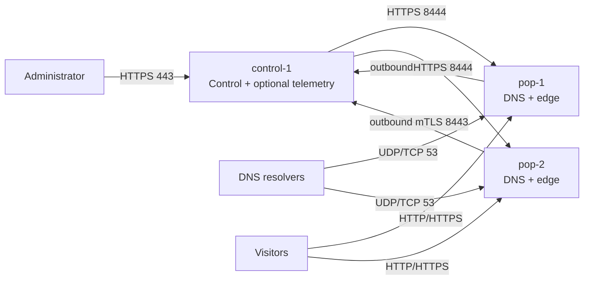

# Production quick start: three nodes

This guide deploys the smallest practical CDNFoundry fleet with the fleet generator:

- one control-plane host, `control-1`;
- two combined authoritative DNS and edge hosts, `pop-1` and `pop-2`;
- mutual TLS between each edge agent and edge-control;
- optional monitoring and centralized logs colocated on `control-1`;
- a separate generated bundle for every host.

The generator runs only on a protected control/operations machine. Edge enrollment is deliberately manual: first start the control plane, create each edge in the control panel, then give the generator the returned UUID and one-time bootstrap token.

> **Replace every example domain, address, release, email, service address, UUID, and token.** The `192.0.2.0/24` and `198.51.100.0/24` ranges are documentation-only.

## Before You Begin

### 1. Clone the Repository at a Specific Version

```bash
# For production: clone a specific release tag (recommended)
git clone --branch v1.0.0 --depth 1 https://github.com/vaheed/CDNFoundry.git
cd CDNFoundry

# For testing/development: clone a specific branch
git clone --branch dev --depth 1 https://github.com/vaheed/CDNFoundry.git
cd CDNFoundry

# Or clone and checkout a specific commit
git clone https://github.com/vaheed/CDNFoundry.git
cd CDNFoundry
git checkout <commit-sha>
```

> **Important**: Always deploy from a pinned release tag or commit SHA in production. Never use mutable tags like `latest`, `main`, or major/minor version tags.

### 2. Quick Configuration with a Single File (Recommended)

Instead of editing multiple scripts, you can use a centralized configuration file. See [Production Fleet Configuration Guide](production-config.md) for details.

Create a `fleet-config.ini` file:

```ini
[control]
hostname = control.ops.example.com
ipv4 = 192.0.2.10
region = global
location = primary

[pop]
pop-1 = 198.51.100.20,europe,amsterdam
pop-2 = 198.51.100.30,europe,frankfurt

[fleet]
operator_domain = ops.example.com
platform_domain = example.net
release = v1.0.0
acme_email = operations@example.com
enable_monitoring = true
state_dir = /var/lib/cdnfoundry-fleet
output_dir = /var/lib/cdnfoundry-fleet/bundles
```

Then generate your fleet state:

```bash
sudo ./scripts/cdnfoundry-fleet --config fleet-config.ini setup --non-interactive
```

The rest of this guide shows the manual step-by-step approach for full control.

## Resulting topology



| Host | Services | Public listeners |
| --- | --- | --- |
| `control-1` | Core, web, Horizon, scheduler, edge-control, Valkey, embedded PostgreSQL; optional Prometheus, Grafana, ClickHouse, Loki | TCP `80`, `443`, `8443`, `8444`; UDP `443` |
| `pop-1` | Local PowerDNS PostgreSQL, PowerDNS, DNSdist, DNS API, edge agent, cells, gateway, Vector | UDP/TCP `53`; TCP `80`, `443`, `8444` |
| `pop-2` | Same as `pop-1`, in another provider/rack/failure domain | UDP/TCP `53`; TCP `80`, `443`, `8444` |

Laravel is not in the DNS or customer HTTP request path. If the control host is temporarily unavailable, already-active DNS and edge runtime state can continue serving, while management and new deployments pause.

## Capacity planning

These are practical starting points, not hard limits. Increase disk and bandwidth for cache size, analytics retention, request volume, and backup policy.

| Role | Minimum starting size | Recommended for this guide |
| --- | --- | --- |
| Control without telemetry | 4 vCPU, 8 GiB RAM, 100 GiB SSD | 4–8 vCPU, 8–16 GiB, 150 GiB SSD |
| Control with colocated telemetry/logs | 8 vCPU, 16 GiB RAM, 250 GiB NVMe | 12 vCPU, 32 GiB, 500 GiB+ NVMe |
| Each combined DNS/edge host | 4 vCPU, 8 GiB RAM, 100 GiB SSD | 8 vCPU, 16 GiB, 250 GiB+ NVMe/cache |

Plan separately for:

- customer traffic bandwidth and provider transfer limits;
- edge cache capacity and write endurance;
- ClickHouse/Loki retention when telemetry is colocated;
- off-host backups of the control database, application keys, and CA keys;
- console access if firewall changes lock out SSH.

## Example values

| Purpose | Example |
| --- | --- |
| Operator zone | `ops.example.com` |
| Platform zone | `example.net` |
| Control hostname/IP | `control.ops.example.com` / `192.0.2.10` |
| Edge-control hostname | `control.ops.example.com:8443` |
| Telemetry hostname | `telemetry.ops.example.com` |
| `pop-1` hostname/IP | `pop-1.ops.example.com` / `198.51.100.20` |
| `pop-2` hostname/IP | `pop-2.ops.example.com` / `198.51.100.30` |
| `pop-1` advertised/local service addresses | `198.51.100.120` → `10.20.1.120`; `198.51.100.121` → `10.20.1.121` |
| `pop-2` advertised/local service addresses | `198.51.100.130` → `10.20.2.130`; `198.51.100.131` → `10.20.2.131` |
| Exact release | `vMAJOR.MINOR.PATCH` or a 40-character commit SHA |
| Fleet state | `/var/lib/cdnfoundry-fleet` |
| Bundles | `/var/lib/cdnfoundry-fleet/bundles` |

Keep management names at an independent DNS provider. Do not place `control.ops.example.com`, `telemetry.ops.example.com`, or DNS API names inside the CDNFoundry-managed platform zone.

## 1. Prepare the three hosts

Install a supported Linux distribution, Docker Engine, Docker Compose v2, Git, OpenSSL, curl, CA certificates, and accurate time on all hosts.

Run on the generator/control machine from the repository root:

```bash
sudo ./scripts/install-production-prerequisites.sh
./scripts/cdnfoundry-fleet --repo-root "$PWD" doctor
```

Apply provider and host firewall rules. Docker-published ports can bypass ordinary UFW policy, so enforce the same rules in the provider firewall and the host `DOCKER-USER` chain.

| Destination | Allowed source |
| --- | --- |
| All hosts TCP `22` | Trusted administrator networks only |
| Control TCP `80`, `443`; UDP `443` | Public |
| Control TCP `8443` | `pop-1` and `pop-2` source addresses only |
| Control TCP `8444` | Edge/log source addresses only when telemetry is enabled |
| Pops UDP/TCP `53` | Public |
| Pops TCP `80`, `443` | Public on mapped service addresses |
| Pops TCP `8444` | Control source address only |
| TCP `9100`, `9599` | Private monitoring network/control only |
| PostgreSQL, Valkey, ClickHouse, Loki, Prometheus, Grafana | Never public |

## 2. Create bootstrap DNS and registrar glue

At the independent operator DNS provider create:

| Record | Value |
| --- | --- |
| `control.ops.example.com` A | `192.0.2.10` |
| `telemetry.ops.example.com` A | `192.0.2.10` when telemetry is colocated |
| `pop-1.ops.example.com` A | `198.51.100.20` |
| `pop-2.ops.example.com` A | `198.51.100.30` |

At the platform-domain registrar create child nameserver glue:

| Child nameserver | Address |
| --- | --- |
| `ns1.example.net` | `198.51.100.20` |
| `ns2.example.net` | `198.51.100.30` |

Do not delegate the platform zone until both authoritative servers and system-zone revisions are healthy.

## 3. Generate initial fleet state and bundles

The included example creates exactly three nodes. It uses embedded PostgreSQL on the control host and enables colocated monitoring/logging by default.

Run on the control-plane machine:

```bash
cd /opt/CDNFoundry
sudo env \
  STATE_DIR=/var/lib/cdnfoundry-fleet \
  OUTPUT_DIR=/var/lib/cdnfoundry-fleet/bundles \
  OPERATOR_DOMAIN=ops.example.com \
  PLATFORM_DOMAIN=example.net \
  RELEASE=vMAJOR.MINOR.PATCH \
  ACME_EMAIL=operations@example.com \
  ENABLE_MONITORING=1 \
  ./deploy/production/examples/three-node-production.sh
```

For a lighter control host, set `ENABLE_MONITORING=0` and enable telemetry later.

Review the inventory:

```bash
sudo ./scripts/cdnfoundry-fleet \
  --state-dir /var/lib/cdnfoundry-fleet \
  --output-dir /var/lib/cdnfoundry-fleet/bundles \
  status

sudo ./scripts/cdnfoundry-fleet \
  --state-dir /var/lib/cdnfoundry-fleet \
  --output-dir /var/lib/cdnfoundry-fleet/bundles \
  --repo-root "$PWD" validate
```

The first render intentionally has no edge UUID or bootstrap token. Do not start the edge runtime yet.

## 4. Transfer and start the control bundle

On the control-plane machine:

```bash
sudo tar --numeric-owner --owner=0 --group=0 \
  -C /var/lib/cdnfoundry-fleet/bundles \
  -czf /root/control-1.tar.gz control-1
```

Transfer it over a protected channel if the generator and control host are different.

On `control-1`:

```bash
sudo install -d -m 0700 /opt/cdnfoundry.new
sudo tar -xzf /root/control-1.tar.gz --strip-components=1 -C /opt/cdnfoundry.new
cd /opt/cdnfoundry.new
sudo sha256sum -c SHA256SUMS
sudo ./validate.sh
sudo ./start.sh
```

`start.sh` starts embedded PostgreSQL and Valkey, runs the Laravel migration explicitly, then starts the remaining control services.

Verify:

```bash
docker compose --env-file .env.prod ps
curl -fsS https://control.ops.example.com/api/health
curl -fsS https://control.ops.example.com/api/ready
```

Create the first administrator using the control bundle's Compose service:

```bash
docker compose --env-file .env.prod exec -u www-data core \
  php artisan cdnf:admin:create \
  --name="CDN Operations" \
  --email="admin@example.com"
```

## 5. Start DNS-only services on both combined hosts

Transfer the current `pop-1` and `pop-2` bundles exactly as shown for `control-1`.

Run independently on each target DNS host, but do not use `start.sh` yet:

```bash
cd /opt/cdnfoundry
./validate.sh

docker compose --env-file .env.prod up -d --wait pdns-db
docker compose --env-file .env.prod --profile tools run --rm pdns-migrate
docker compose --env-file .env.prod up -d mmdb-updater pdns-auth dnsdist dns-api
docker compose --env-file .env.prod ps
```

From an external workstation verify UDP and TCP DNS:

```bash
dig @198.51.100.20 example.net SOA
dig @198.51.100.20 example.net SOA +tcp
dig @198.51.100.30 example.net SOA
dig @198.51.100.30 example.net SOA +tcp
```

An authoritative negative response is acceptable before the platform zone exists. Timeouts and refused connections are not.

## 6. Configure platform DNS and DNS clusters

In the control panel configure the platform identity:

- platform domain: `example.net`;
- proxy hostname: `proxy.example.net`;
- nameservers: `ns1.example.net` and `ns2.example.net`;
- SOA primary: `ns1.example.net`;
- SOA mailbox: `hostmaster.example.net`.

Create two DNS clusters using the generated per-node `PDNS_API_KEY` values:

| Cluster | API URL | Nameserver |
| --- | --- | --- |
| `pop-1` | `https://pop-1.ops.example.com:8444` | `ns1.example.net` |
| `pop-2` | `https://pop-2.ops.example.com:8444` | `ns2.example.net` |

Save each cluster disabled, test its TLS connection, enable it, reconcile the system DNS identity, and wait for the active revision. Delegate the platform zone only after both servers answer correctly.

## 7. Create edges in the control panel

In **Edge network → Edges**, create one edge for `pop-1` and one for `pop-2`. Copy each returned:

- edge UUID;
- one-time bootstrap token.

The generator does not call the control API and does not create edges automatically.

On the protected generator/control machine, save each token in a mode-`0600` temporary file:

```bash
sudo install -m 0600 /dev/null /root/pop-1.bootstrap-token
sudo sh -c 'read -r token; printf "%s\n" "$token" > /root/pop-1.bootstrap-token'

sudo install -m 0600 /dev/null /root/pop-2.bootstrap-token
sudo sh -c 'read -r token; printf "%s\n" "$token" > /root/pop-2.bootstrap-token'
```

Enter the token when each command waits for input. Do not paste tokens into shell history, Git, tickets, or chat.

Configure the UUID/token and service-address map for `pop-1`:

```bash
sudo ./scripts/cdnfoundry-fleet \
  --state-dir /var/lib/cdnfoundry-fleet \
  configure-edge-registration \
  --node pop-1 \
  --edge-id 11111111-2222-3333-4444-555555555555 \
  --bootstrap-token-file /root/pop-1.bootstrap-token \
  --non-interactive

sudo ./scripts/cdnfoundry-fleet \
  --state-dir /var/lib/cdnfoundry-fleet \
  update-node \
  --node pop-1 \
  --extra-env 'EDGE_GATEWAY_ADDRESS_MAP={"198.51.100.120":"10.20.1.120","198.51.100.121":"10.20.1.121"}' \
  --non-interactive
```

Repeat for `pop-2` with its own UUID, token, and address map:

```bash
sudo ./scripts/cdnfoundry-fleet \
  --state-dir /var/lib/cdnfoundry-fleet \
  configure-edge-registration \
  --node pop-2 \
  --edge-id aaaaaaaa-bbbb-cccc-dddd-eeeeeeeeeeee \
  --bootstrap-token-file /root/pop-2.bootstrap-token \
  --non-interactive

sudo ./scripts/cdnfoundry-fleet \
  --state-dir /var/lib/cdnfoundry-fleet \
  update-node \
  --node pop-2 \
  --extra-env 'EDGE_GATEWAY_ADDRESS_MAP={"198.51.100.130":"10.20.2.130","198.51.100.131":"10.20.2.131"}' \
  --non-interactive
```

The UUID is stored in protected fleet state. The one-time token is stored separately as a mode-`0600` node secret. Both are placed into that edge's generated `.env.prod`; they are never copied to other nodes.

## 8. Render and activate the registered edge bundles

Run on the control-plane machine:

```bash
for node in pop-1 pop-2; do
  sudo ./scripts/cdnfoundry-fleet \
    --state-dir /var/lib/cdnfoundry-fleet \
    --output-dir /var/lib/cdnfoundry-fleet/bundles \
    --repo-root "$PWD" \
    validate --node "$node"

  sudo ./scripts/cdnfoundry-fleet \
    --state-dir /var/lib/cdnfoundry-fleet \
    --output-dir /var/lib/cdnfoundry-fleet/bundles \
    --repo-root "$PWD" \
    render --node "$node"
done
```

Securely replace each existing pop bundle. On each pop:

```bash
cd /opt/cdnfoundry
./validate.sh
docker compose --env-file .env.prod up -d
docker compose --env-file .env.prod ps
```

The edge agent creates its private key and CSR locally, uses the UUID and one-time token once, receives an identity certificate signed by the edge identity CA, and persists the resulting mTLS identity in the `edge-agent-state` volume. Never clone or restore that volume onto another edge.

Wait for the control panel to show:

- registered identity and current heartbeat;
- ready shared and quarantine cells;
- listener-ready gateway;
- acknowledged active revision;
- expected capacity and health.

## 9. Remove each one-time bootstrap token

After successful registration, clear the token from authoritative fleet state and regenerate the bundle:

```bash
for node in pop-1 pop-2; do
  sudo ./scripts/cdnfoundry-fleet \
    --state-dir /var/lib/cdnfoundry-fleet \
    clear-edge-bootstrap-token --node "$node" --non-interactive

  sudo ./scripts/cdnfoundry-fleet \
    --state-dir /var/lib/cdnfoundry-fleet \
    --output-dir /var/lib/cdnfoundry-fleet/bundles \
    --repo-root "$PWD" \
    render --node "$node"
done

sudo rm -f /root/pop-1.bootstrap-token /root/pop-2.bootstrap-token
```

Transfer the clean bundles again. On each pop recreate only the agent so it keeps the identity volume but no longer receives the token:

```bash
cd /opt/cdnfoundry
docker compose --env-file .env.prod up -d --force-recreate edge-agent
```

Keep `EDGE_ID`; remove only `EDGE_BOOTSTRAP_TOKEN`.

## 10. Validate customer traffic

Create a test customer/domain, wait for both DNS clusters and both edges to acknowledge the active revision, then test externally:

```bash
dig +trace CUSTOMER_DOMAIN NS
dig @198.51.100.20 CUSTOMER_DOMAIN A
dig @198.51.100.30 CUSTOMER_DOMAIN A +tcp

curl --fail --head \
  --resolve CUSTOMER_DOMAIN:443:198.51.100.120 \
  https://CUSTOMER_DOMAIN/

curl --fail --head \
  --resolve CUSTOMER_DOMAIN:443:198.51.100.130 \
  https://CUSTOMER_DOMAIN/
```

## Step 11. Backups and operational checks

Never run `docker compose down -v`, delete named volumes, regenerate `APP_KEY`, rotate CA keys during an ordinary upgrade, or copy one edge identity volume to another host.

Back up and test restoration of:

- control PostgreSQL;
- `APP_KEY` and artifact-signing key;
- edge identity and server CA keys;
- Valkey when queue/session recovery matters;
- Grafana, Prometheus, ClickHouse, and Loki volumes when telemetry retention matters;
- fleet state and its secret directory;
- external TLS and object-storage credentials.

Final checklist:

- [ ] all three hosts run the same exact release;
- [ ] all bundle checksums and `validate.sh` checks pass;
- [ ] control health and readiness endpoints pass;
- [ ] both DNS servers answer UDP and TCP externally;
- [ ] registrar glue and delegation are correct;
- [ ] both DNS clusters have active revisions;
- [ ] both edges are registered through mTLS;
- [ ] one-time bootstrap tokens are removed;
- [ ] gateway address maps use real assigned local addresses;
- [ ] proxied HTTPS works through both failure domains;
- [ ] private databases, metrics, logs, and APIs are not public;
- [ ] recovery copies and an isolated restore test exist.

For the larger topology, see [Production quick start: 18-node fleet](production-quick-start-large-fleet.md). For all commands and lifecycle operations, see [Production fleet operator guide](production-fleet-operator-guide.md).
