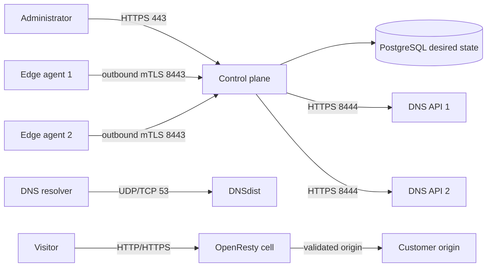

# Production quick start

This guide deploys the smallest practical CDNFoundry production fleet:

- one control host;
- two combined DNS and edge hosts in different failure domains;
- one exact CDNFoundry release on every host;
- optional monitoring and centralized logs, enabled only after serving works.

Follow the numbered steps in order. Commands say exactly which host they run
on. Do not enable the optional `telemetry` or `logs` profiles during the base
installation.

::: danger Preserve production state
Never run `docker compose down -v`, delete named volumes, regenerate `APP_KEY`,
or replace CA keys during an upgrade. PostgreSQL, application keys, CA keys,
and externally stored TLS material are part of the recovery set.
:::

::: tip Replace the examples
Replace every uppercase placeholder and documentation IP before running a
command. `198.51.100.0/24` is reserved for documentation and cannot carry real
Internet traffic.
:::

## Resulting topology

| Host | Required services | Public listeners |
| --- | --- | --- |
| `CONTROL` | Laravel, web, Horizon, Scheduler, PostgreSQL, Valkey, edge-control, Caddy | TCP `80`, `443`, `8443`, `8444`; UDP `443` |
| `EDGE_1` | DNSdist, PowerDNS, DNS API, OpenResty cells, edge agent, gateway, traffic Vector | TCP/UDP `53`; TCP `80`, `443`, `8444` |
| `EDGE_2` | Same as edge 1 in another provider, rack, or failure domain | TCP/UDP `53`; TCP `80`, `443`, `8444` |

The optional final step adds ClickHouse, Prometheus, Alertmanager, Grafana,
Loki, node-exporter, and one operational-log collector per host.

The control host is a single management failure domain in this minimum
topology. If it is offline, existing DNS and HTTP traffic continue using the
last valid runtime state. Management, deployments, new certificates, and
analytics pause until it recovers.



Laravel is never in the DNS or HTTP request path.

## Example values

Use your real values consistently on every host:

| Purpose | Example |
| --- | --- |
| Independent operator DNS zone | `ops.example.com` |
| CDNFoundry platform zone | `example.net` |
| Control IPv4 | `198.51.100.10` |
| Edge 1 IPv4 | `198.51.100.20` |
| Edge 2 IPv4 | `198.51.100.30` |
| Exact release | `v0.8.2` |
| Installation directory | `/opt/cdnfoundry` |
| Protected PKI directory | `/etc/cdnfoundry/pki` |

Keep `control.ops.example.com`, `edge-control.ops.example.com`,
`telemetry.ops.example.com`, and every `dns-api-N.ops.example.com` at an
independent DNS provider. Do not put management names inside the CDNFoundry
platform zone.

## Step 1: prepare hosts and firewall rules

Prepare three supported Linux hosts with:

- Docker Engine and the Docker Compose plugin;
- Git, OpenSSL, curl, and CA certificates;
- accurate system time;
- an operator firewall and a provider firewall;
- an encrypted off-host Restic repository;
- console access in case a firewall rule is wrong.

A reasonable starting size is:

| Role | CPU | Memory | Disk |
| --- | ---: | ---: | ---: |
| Control | 4 vCPU | 8 GiB | 100 GiB SSD |
| Each DNS/edge host | 4 vCPU | 6 GiB | 50 GiB SSD plus cache capacity |

Allow only these inbound connections:

| Destination | Allowed source |
| --- | --- |
| Control TCP `22` | trusted administrator networks |
| Control TCP `80`, `443`; UDP `443` | public |
| Control TCP `8443`, `8444` | the two edge public IPv4 addresses |
| Edge TCP/UDP `53` | public |
| Edge TCP `80`, `443` | public |
| Edge TCP `8444` | control public IPv4 only |
| PostgreSQL, Valkey, ClickHouse, PowerDNS API, Prometheus, Loki, Grafana `3000` | never public |

Docker-published ports can bypass ordinary UFW rules. Apply the same policy in
the provider firewall and the host `DOCKER-USER` chain. Keep outbound DNS and
HTTPS available for images, ACME, origins, GeoIP, telemetry, and backups.

## Step 2: create bootstrap DNS and registrar glue

At the independent provider for `ops.example.com`, create:

| Record | Value |
| --- | --- |
| `control.ops.example.com` A | control IPv4 |
| `edge-control.ops.example.com` A | control IPv4 |
| `telemetry.ops.example.com` A | control IPv4 |
| `dns-api-1.ops.example.com` A | edge 1 IPv4 |
| `dns-api-2.ops.example.com` A | edge 2 IPv4 |

Add AAAA records only when that host and its firewall are IPv6-ready.

At the registrar for `example.net`, register child nameserver glue:

| Child nameserver | Address |
| --- | --- |
| `ns1.example.net` | edge 1 IPv4 and optional IPv6 |
| `ns2.example.net` | edge 2 IPv4 and optional IPv6 |

Do not delegate `example.net` yet.

## Step 3: install the same exact release on every host

Run on `CONTROL`, `EDGE_1`, and `EDGE_2`:

```sh
sudo apt-get update
sudo DEBIAN_FRONTEND=noninteractive apt-get install -y \
  ca-certificates curl git openssl

docker version
docker compose version

export CDNF_RELEASE=v0.8.2
sudo install -d -m 0755 /opt/cdnfoundry
sudo git clone --branch "${CDNF_RELEASE}" --depth 1 \
  https://github.com/vaheed/CDNFoundry.git /opt/cdnfoundry
sudo chown -R "$(id -u):$(id -g)" /opt/cdnfoundry
cd /opt/cdnfoundry
git rev-parse HEAD
```

The final commit must match on all three hosts. Use an exact release tag or
40-character commit SHA; never deploy `latest` or a moving major/minor alias.
Authenticate to GHCR with a read-only package token if the images are private.

## Step 4: generate one private environment per host

The generator creates `.env.prod` with mode `0600` and refuses to overwrite an
existing file.

On `CONTROL`:

```sh
cd /opt/cdnfoundry
./scripts/generate-production-env.sh
stat -c '%a %n' .env.prod
```

Choose:

- role `control`;
- your operator and platform domains;
- the exact release from Step 3;
- the control IPv4;
- both edge IPv4 addresses in the edge allowlist;
- the real Restic repository and its prefix-scoped credentials.

Record the generated ClickHouse ingestion password in the password manager:

```sh
sudo sed -n 's/^CLICKHOUSE_PASSWORD=//p' \
  /opt/cdnfoundry/.env.prod
```

Run the generator separately on `EDGE_1` and `EDGE_2`. Choose role `dns-edge`
and use a unique DNS API label:

- `dns-api-1` on `EDGE_1`;
- `dns-api-2` on `EDGE_2`.

When prompted, enter the ClickHouse password copied from `CONTROL`. The
generator sets the remote ClickHouse and Loki endpoints, plus unique log host
and collector identities, so optional monitoring can be enabled later.

Verify every host:

```sh
cd /opt/cdnfoundry
test "$(stat -c '%a' .env.prod)" = 600
if grep -n 'replace-with' .env.prod; then
  echo 'Replace every value shown above before continuing.' >&2
  exit 1
fi
```

Never copy the whole control environment to an edge. Database passwords, API
keys, edge tokens, and agent identities have separate trust boundaries.

## Step 5: create secret files and internal certificates

Run once on `CONTROL`:

```sh
sudo install -d -m 0700 /etc/cdnfoundry/secrets
sudo install -d -m 0700 /etc/cdnfoundry/pki

sudo /opt/cdnfoundry/scripts/generate-production-certificates.sh \
  /etc/cdnfoundry/pki \
  edge-control.ops.example.com \
  proxy.example.net \
  dns-api-1.ops.example.com \
  dns-api-2.ops.example.com

sudo sh -c 'umask 077; openssl rand -base64 48 > /etc/cdnfoundry/secrets/metrics-token'
sudo sh -c 'umask 077; openssl rand -base64 48 > /etc/cdnfoundry/secrets/restic-password'
sudo chown root:82 /etc/cdnfoundry/pki/edge-identity-ca.key
sudo chmod 0640 /etc/cdnfoundry/pki/edge-identity-ca.key
```

Initialize the Restic repository using the exact password stored in
`/etc/cdnfoundry/secrets/restic-password`, then store a recovery copy outside
these hosts.

Verify certificate names:

```sh
openssl x509 -in /etc/cdnfoundry/pki/edge-control-server.crt \
  -noout -subject -issuer -ext subjectAltName
openssl verify -CAfile /etc/cdnfoundry/pki/edge-server-ca.crt \
  /etc/cdnfoundry/pki/edge-control-server.crt \
  /etc/cdnfoundry/pki/edge-runtime.crt \
  /etc/cdnfoundry/pki/dns-api-1.crt \
  /etc/cdnfoundry/pki/dns-api-2.crt
```

Copy to each edge through a protected channel:

- `edge-server-ca.crt`;
- `edge-runtime.crt` and `edge-runtime.key`;
- only that host's `dns-api-N.crt` and `dns-api-N.key`.

Certificates use mode `0644`; private keys use `0600`. Never copy
`edge-server-ca.key` or `edge-identity-ca.key` to an edge. See
[Internal certificates](certificates.md) for the full ownership matrix.

## Step 6: start the control plane

Run on `CONTROL`. Notice that only the required `control` profile is enabled.

```sh
cd /opt/cdnfoundry

docker compose --env-file .env.prod \
  -f compose.prod.yml \
  -f deploy/production/compose.control-host.yml \
  --profile control config --quiet

docker compose --env-file .env.prod \
  -f compose.prod.yml \
  -f deploy/production/compose.control-host.yml \
  --profile control pull

docker compose --env-file .env.prod \
  -f compose.prod.yml \
  -f deploy/production/compose.control-host.yml \
  --profile tools run --rm migrate

docker compose --env-file .env.prod \
  -f compose.prod.yml \
  -f deploy/production/compose.control-host.yml \
  --profile control up -d

docker compose --env-file .env.prod \
  -f compose.prod.yml \
  -f deploy/production/compose.control-host.yml ps
```

Verify the control database, Valkey, workers, scheduler, web, edge-control, and
Caddy are running. Then check the public API:

```sh
curl -fsS https://control.ops.example.com/api/health
curl -fsS https://control.ops.example.com/api/ready
```

`health` proves process liveness. `ready` requires PostgreSQL and Valkey and
must return `ready` before continuing.

Create the first administrator:

```sh
docker compose --env-file .env.prod \
  -f compose.prod.yml \
  -f deploy/production/compose.control-host.yml \
  exec -u www-data core php artisan cdnf:admin:create \
  --name="CDN Operations" \
  --email="admin@example.com"
```

Enter the password only at the prompt. Sign in at
`https://control.ops.example.com/admin`.

## Step 7: start authoritative DNS on both edge hosts

Run these commands independently on `EDGE_1` and `EDGE_2`:

```sh
cd /opt/cdnfoundry

docker compose --env-file .env.prod \
  -f compose.prod.yml \
  -f deploy/production/compose.dns-edge-host.yml \
  --profile dns --profile edge config --quiet

docker compose --env-file .env.prod \
  -f compose.prod.yml \
  -f deploy/production/compose.dns-edge-host.yml \
  --profile dns --profile edge pull

docker compose --env-file .env.prod \
  -f compose.prod.yml \
  -f deploy/production/compose.dns-edge-host.yml \
  --profile tools run --rm pdns-migrate

docker compose --env-file .env.prod \
  -f compose.prod.yml \
  -f deploy/production/compose.dns-edge-host.yml \
  --profile dns up -d

docker compose --env-file .env.prod \
  -f compose.prod.yml \
  -f deploy/production/compose.dns-edge-host.yml \
  ps pdns-db pdns-auth dnsdist dns-api
```

From an external workstation, verify UDP and TCP on both hosts:

```sh
dig @198.51.100.20 example.net SOA
dig @198.51.100.20 example.net SOA +tcp
dig @198.51.100.30 example.net SOA
dig @198.51.100.30 example.net SOA +tcp
```

The zone does not exist yet, so an authoritative negative answer is acceptable.
A timeout, refusal, or response from an unrelated DNS server is not.

## Step 8: configure platform DNS

In **Control plane → System DNS identity**, enter:

| Field | Value |
| --- | --- |
| Platform domain | `example.net` |
| Proxy hostname | `proxy.example.net` |
| Nameserver 1 | `ns1.example.net`, edge 1 IPv4, optional IPv6 |
| Nameserver 2 | `ns2.example.net`, edge 2 IPv4, optional IPv6 |
| SOA primary | `ns1.example.net` |
| SOA mailbox | `hostmaster.example.net` |
| Refresh / retry / expire | `3600` / `600` / `1209600` |
| Minimum / default TTL | `300` / `300` |

Choose **Validate and preview**, review the normalized result, and apply the
exact confirmation token.

Create two disabled DNS clusters:

| Field | Cluster 1 | Cluster 2 |
| --- | --- | --- |
| API URL | `https://dns-api-1.ops.example.com:8444` | `https://dns-api-2.ops.example.com:8444` |
| API key | edge 1 `PDNS_API_KEY` | edge 2 `PDNS_API_KEY` |
| Server ID | `localhost` | `localhost` |
| Nameserver | `ns1.example.net` | `ns2.example.net` |

For each cluster:

1. save it disabled;
2. run the asynchronous connection test;
3. confirm TLS verification and a healthy result;
4. enable it;
5. reconcile system DNS identity;
6. wait for its candidate checksum to become active.

Verify the active zone externally:

```sh
dig @198.51.100.20 example.net SOA +tcp
dig @198.51.100.30 example.net NS
dig @198.51.100.20 ns1.example.net A
dig @198.51.100.30 ns2.example.net A
```

Only now delegate `example.net` to `ns1.example.net` and `ns2.example.net` at
the registrar.

## Step 9: create and enroll both edges

In **Edge network → Edges**, create one edge per host and copy its UUID and
one-time bootstrap token.

Add the values to the matching edge's `.env.prod`:

```dotenv
EDGE_ID=replace-with-edge-uuid
EDGE_BOOTSTRAP_TOKEN=replace-with-one-time-token
```

Start the edge runtime on that host:

```sh
docker compose --env-file .env.prod \
  -f compose.prod.yml \
  -f deploy/production/compose.dns-edge-host.yml \
  --profile edge up -d

docker compose --env-file .env.prod \
  -f compose.prod.yml \
  -f deploy/production/compose.dns-edge-host.yml \
  ps edge edge-quarantine edge-agent edge-gateway vector mmdb-updater
```

The traffic Vector process starts with the edge profile. Until optional
telemetry is enabled, it retries into a bounded disk buffer and may eventually
drop old analytics events. This does not block or slow DNS and HTTP serving.

Wait until the panel shows:

- registered identity and a fresh heartbeat;
- ready shared and quarantine cells;
- listener-ready gateway status;
- an acknowledged active revision;
- bounded CPU, memory, disk, and connection capacity.

Remove the bootstrap token after registration and recreate only the agent:

```sh
sudo sed -i 's/^EDGE_BOOTSTRAP_TOKEN=.*/EDGE_BOOTSTRAP_TOKEN=/' \
  /opt/cdnfoundry/.env.prod

docker compose --env-file .env.prod \
  -f compose.prod.yml \
  -f deploy/production/compose.dns-edge-host.yml \
  --profile edge up -d --force-recreate edge-agent
```

Repeat this step on the other edge. Never clone an edge-agent identity volume.

## Step 10: add and test the first customer domain

Use this order:

1. create a domain user;
2. create and assign the domain;
3. ask the owner to delegate to `ns1.example.net` and `ns2.example.net`;
4. verify nameservers asynchronously;
5. activate the domain;
6. wait for both DNS clusters to acknowledge the revision;
7. add DNS-only A/AAAA records and test them;
8. add one proxied hostname with one explicit public origin;
9. wait for edge deployment and DNS-01 certificate completion.

From an external workstation:

```sh
dig +trace CUSTOMER_DOMAIN NS
dig @198.51.100.20 CUSTOMER_DOMAIN A
dig @198.51.100.30 CUSTOMER_DOMAIN A +tcp
curl --fail --head \
  --resolve CUSTOMER_DOMAIN:443:198.51.100.20 \
  https://CUSTOMER_DOMAIN/
curl --fail --head \
  --resolve CUSTOMER_DOMAIN:443:198.51.100.30 \
  https://CUSTOMER_DOMAIN/
```

Origin validation rejects loopback, link-local, multicast, metadata, internal
platform, edge-service, and proxy-loop destinations. Do not weaken this check
to make a private origin work.

## Step 11: create and prove the mandatory backup

Monitoring is optional; recovery is not. Before accepting customer traffic:

1. create an encrypted Restic backup;
2. verify the snapshot remotely;
3. store `APP_KEY`, signing keys, CA keys, Restic credentials, and external TLS
   material in the protected recovery system;
4. restore into an isolated environment;
5. record the tested RPO and RTO.

See [Backup and recovery](../operations/backup-and-recovery.md).

The required serving checklist is:

- [ ] every host runs the same exact release;
- [ ] every Compose configuration renders successfully;
- [ ] Laravel and PowerDNS migrations completed explicitly;
- [ ] control `/api/health` and `/api/ready` succeed;
- [ ] both DNS servers answer UDP and TCP externally;
- [ ] registrar glue matches the active listener addresses;
- [ ] both DNS clusters have active system-zone revisions;
- [ ] both edge identities are registered and bootstrap tokens removed;
- [ ] shared cells and gateways are listener-ready;
- [ ] the test domain resolves through both nameservers;
- [ ] proxied HTTPS works through each edge;
- [ ] a failed runtime candidate preserves the previous valid state;
- [ ] an off-host backup and isolated restore are proven;
- [ ] firewall tests confirm private services are not public.

## Step 12, optional: enable monitoring and centralized logs

The CDN can serve without this step. Prometheus, Grafana, Loki, ClickHouse, and
operational log collectors are diagnostic systems: their failure must not stop
DNS, HTTP, queue processing, or runtime activation.

### 12.1 Start telemetry on `CONTROL`

The environment generator already created independent Grafana passwords,
ClickHouse credentials, Loki limits, and the source allowlists.

```sh
cd /opt/cdnfoundry

docker compose --env-file .env.prod \
  -f compose.prod.yml \
  -f deploy/production/compose.control-host.yml \
  --profile telemetry config --quiet

docker compose --env-file .env.prod \
  -f compose.prod.yml \
  -f deploy/production/compose.control-host.yml \
  --profile telemetry pull

docker compose --env-file .env.prod \
  -f compose.prod.yml \
  -f deploy/production/compose.control-host.yml \
  --profile telemetry up -d

docker compose --env-file .env.prod \
  -f compose.prod.yml \
  -f deploy/production/compose.control-host.yml \
  ps clickhouse prometheus alertmanager grafana loki node-exporter vector
```

### 12.2 Start exactly one operational-log collector per host

On `CONTROL`:

```sh
docker compose --env-file .env.prod \
  -f compose.prod.yml \
  -f deploy/production/compose.control-host.yml \
  --profile logs up -d log-collector
```

On both `EDGE_1` and `EDGE_2`:

```sh
docker compose --env-file .env.prod \
  -f compose.prod.yml \
  -f deploy/production/compose.dns-edge-host.yml \
  --profile logs up -d log-collector
```

The Docker socket is a privileged read boundary. Only the collector receives a
read-only mount; never expose the socket over TCP or mount it into application
containers. Add `deploy/production/compose.host-journal.yml` only on hosts that
use persistent systemd journals and need kernel OOM, disk, and daemon events.

### 12.3 Configure Prometheus targets and Alertmanager

Populate deployment-owned copies of:

- `docker/prometheus/edge-targets.prod.yml` with private gateway metrics
  endpoints;
- `docker/prometheus/operational-log-targets.prod.yml` with each private
  `host:9599` collector endpoint.

Configure a real Alertmanager receiver. Keep metrics endpoints private and
require the metrics bearer-token file.

### 12.4 Open Grafana safely

Grafana binds to `127.0.0.1:3000`. For the first check, use an SSH tunnel from
an administrator workstation:

```sh
ssh -L 3000:127.0.0.1:3000 ADMIN_USER@control.ops.example.com
```

Open `http://127.0.0.1:3000`, sign in with `GRAFANA_ADMIN_USER` and the generated
`GRAFANA_ADMIN_PASSWORD`, and confirm exactly two dashboards exist. For ongoing
use, deploy an authenticated HTTPS reverse proxy or SSO gateway; never expose
port `3000` directly.

Verify:

- all four datasources report healthy;
- the System and Domain Command Centers load;
- HTTP and DNS access analytics reach ClickHouse;
- operational logs reach Loki without access-log duplication;
- the request tail shows client and origin status with a bounded refresh;
- stopping monitoring does not interrupt DNS or HTTP traffic.

See [Grafana](../operations/grafana.md),
[Monitoring](../operations/monitoring.md), and
[Operational logging](../operations/operational-logging.md).

## Daily status commands

On `CONTROL`:

```sh
docker compose --env-file .env.prod \
  -f compose.prod.yml \
  -f deploy/production/compose.control-host.yml ps

docker compose --env-file .env.prod \
  -f compose.prod.yml \
  -f deploy/production/compose.control-host.yml \
  logs --tail=200 core horizon scheduler caddy
```

On an edge:

```sh
docker compose --env-file .env.prod \
  -f compose.prod.yml \
  -f deploy/production/compose.dns-edge-host.yml ps

docker compose --env-file .env.prod \
  -f compose.prod.yml \
  -f deploy/production/compose.dns-edge-host.yml \
  logs --tail=200 dnsdist pdns-auth dns-api edge edge-agent edge-gateway
```

## Common startup failures

### Control certificate failure

Check the independent A/AAAA record, public TCP `80` and `443`, ACME contact,
Caddy logs, outbound HTTPS, and provider rate limits:

```sh
docker compose --env-file .env.prod \
  -f compose.prod.yml \
  -f deploy/production/compose.control-host.yml \
  logs --tail=200 caddy
```

### Core is unhealthy

```sh
docker compose --env-file .env.prod \
  -f compose.prod.yml \
  -f deploy/production/compose.control-host.yml \
  logs --tail=200 core
```

Verify migrations, secret-file paths, file permissions, PostgreSQL, Valkey,
and writable tmpfs/storage mounts. Do not make the production root filesystem
writable as a workaround.

### DNS reconciliation fails

Check the operation error code, control source IPv4, firewall counters,
`DNS_API_HOSTNAME`, certificate SAN, mounted CA, the edge's unique API key, and
`dns-api`/`pdns-auth` health. Never publish raw PowerDNS API port `8081`.

### Edge registration fails

Check edge UUID, one-time token state, server CA, system clock, outbound TCP
`8443`, identity volume, artifact signature, sequence, available disk, gateway,
and cell status. Do not delete the active runtime directory; it is the rollback
state.

### Optional monitoring is empty

Check `telemetry.ops.example.com`, source allowlists, edge `CLICKHOUSE_URL` and
`LOKI_ENDPOINT`, collector identities, Vector buffers, ClickHouse health, Loki
`/ready`, and the selected Grafana time range. Do not restart serving services
to repair monitoring.

## Optional IPv6

Leave `PUBLIC_BIND_IPV6=` empty and omit IPv6 overlays on IPv4-only hosts.

Control with IPv6:

```sh
docker compose --env-file .env.prod \
  -f compose.prod.yml \
  -f deploy/production/compose.control-host.yml \
  -f deploy/production/compose.control-host-ipv6.yml \
  --profile control up -d
```

Combined DNS/edge with IPv6:

```sh
docker compose --env-file .env.prod \
  -f compose.prod.yml \
  -f deploy/production/compose.dns-edge-host.yml \
  -f deploy/production/compose.dns-host-ipv6.yml \
  -f deploy/production/compose.edge-host-ipv6.yml \
  --profile dns --profile edge up -d
```

Publish AAAA and glue only after external IPv6 DNS and HTTPS checks pass.

## Upgrade and rollback

Back up first. Upgrade one edge at a time, then control components. Run explicit
migrations and keep application/runtime versions inside the documented
compatibility envelope. Never roll back a database after an incompatible
migration.

Use [Upgrade and rollback](upgrade.md) and
[Backup and recovery](../operations/backup-and-recovery.md).

## Next steps

- [Understand the production topology](topology.md)
- [Harden secrets and networks](../security/hardening.md)
- [Practice incident runbooks](../operations/runbooks.md)
- [Scale roles independently](../operations/scaling.md)
