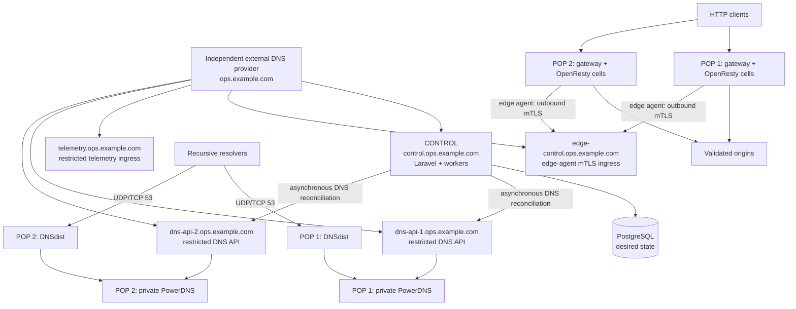

# Production quick start: starter fleet



::: danger Keep management DNS independent
`ops.example.com` and `example.net` are intentionally separate zones. Host
`control`, `edge-control`, `telemetry`, `grafana`, and every `dns-api-N` record
for the operator zone with an independent external DNS provider. Never host or
delegate the operator zone in CDNFoundry's own PowerDNS: that database is
derived runtime state, so using it for management names creates a bootstrap
dependency and can break control, recovery, and DNS reconciliation.
:::

CDNFoundry owns the platform zone (`example.net`) and enrolled customer zones.
Only DNSdist is public on port 53; PowerDNS and its database remain private.

This runbook creates the smallest practical production CDNFoundry fleet:

- one control-plane node with colocated monitoring and operational logs;
- two combined DNS and edge nodes in separate failure domains;
- one generated, role-filtered bundle per host.

The topology is data, not code. You edit a local JSON file containing your domains, addresses, and locations. You do not edit deployment shell scripts or Compose files.

## 1. Prepare the hosts

Use supported Linux hosts with Docker Engine, Docker Compose v2, Python 3, PyYAML, OpenSSL, outbound HTTPS, synchronized clocks, and private administrative access. Open only the listeners documented in [Production fleet reference](production-fleet.md).

On an administrative workstation or the future control node, clone an immutable release or commit:

```bash
git clone https://github.com/vaheed/CDNFoundry.git cdnfoundry
cd cdnfoundry
git checkout v1.0.0
git rev-parse --verify HEAD
sudo ./scripts/install-production-prerequisites.sh
```

Replace `v1.0.0` with a published release tag or exact commit SHA. Do not deploy from a moving branch or mutable image tag.

## 2. Create your topology file

Copy the starter example outside the repository-managed path:

```bash
install -m 0600 deploy/production/examples/starter-fleet.json ./fleet.json
```

Edit `fleet.json` and replace every example value:

- `operator_domain`: independently hosted management DNS suffix for control, DNS API, edge-control, node, and telemetry names;
- `platform_domain`: customer-facing CDN platform suffix;
- `release`: the exact checked-out tag or 40-character commit SHA;
- `acme_email`: monitored certificate contact;
- every `hostname`, `public_ipv4`, region, and location;
- `public_ipv6` and `bind_ipv6` when deploying dual stack.

Keep `public_ipv6`, `bind_ipv6`, `monitor_ipv6`, and `log_ipv6` in every node object and set unavailable paths to JSON `null`. Set global `ipv6` to `true` only after the independent DNS provider's AAAA records, host routes, firewalls, and external reachability are ready.

The checked-in addresses are RFC documentation ranges and cannot serve production traffic. Keep `bind_ipv4` as `0.0.0.0` for normal routed/NAT hosts unless a specific local interface address is required.

Validate the JSON before it can create state:

```bash
python3 -m json.tool fleet.json >/dev/null
./scripts/cdnfoundry-fleet --config fleet.json --non-interactive --dry-run setup
```

The dry run performs topology, role, address, feature, and Compose validation without writing Fleet state or bundles.

## 3. Generate protected state and bundles

```bash
sudo install -d -m 0700 /var/lib/cdnfoundry-fleet
sudo ./scripts/cdnfoundry-fleet \
  --config fleet.json \
  --state-dir /var/lib/cdnfoundry-fleet \
  --output-dir /var/lib/cdnfoundry-fleet/bundles \
  --non-interactive \
  setup
```

The command creates secrets and private PKI once, validates the complete desired topology, renders bundles atomically, and prints start order. Each node bundle contains its filtered Compose manifest, complete `.env.prod`, required runtime files, certificates, secrets, checksums, and operator scripts.

Never commit `fleet.json`, Fleet state, generated bundles, `.env.prod`, or private keys.

## 4. Inspect before transfer

```bash
sudo ./scripts/cdnfoundry-fleet \
  --state-dir /var/lib/cdnfoundry-fleet \
  --output-dir /var/lib/cdnfoundry-fleet/bundles \
  validate
sudo ./scripts/cdnfoundry-fleet \
  --state-dir /var/lib/cdnfoundry-fleet \
  status
sudo ./scripts/cdnfoundry-fleet \
  --state-dir /var/lib/cdnfoundry-fleet \
  show-start-order
```

For every bundle, verify `SHA256SUMS`, review `README.md`, and run `./validate.sh`. Validation uses the pinned Caddy images to parse every Caddyfile included in that node before activation, in addition to checking Compose interpolation, permissions, and certificate chains. It may pull a missing pinned image and create a short-lived validation container, but it does not start the application services. Production Compose has no deployment-value defaults: all interpolation comes from that bundle's generated `.env.prod`.

## 5. Start the control plane

Transfer `bundles/control-1` over an authenticated channel to `/opt/cdnfoundry` on the control host. Preserve modes and do not place the bundle in a public or shared directory.

```bash
cd /opt/cdnfoundry
sha256sum -c SHA256SUMS
./validate.sh
sudo ./start.sh
docker compose --env-file .env.prod ps
```

Run the control bundle's `start.sh` as root. Before starting Compose, it keeps the edge identity CA signing key restricted while changing it from the transfer-safe root-only mode to owner `root`, numeric group `82`, mode `0640`; group `82` is the PHP-FPM worker in the immutable core image. Without this activation step, `core` deliberately refuses to start because its worker cannot read the signing key. Other private keys remain mode `0600`.

The control bundle starts `mmdb-updater` before services that consume GeoIP data. Run migrations only through the generated `start.sh`/tools workflow; container startup never migrates the database.

## 6. Configure DNS desired state

Sign in to the administrator panel, configure platform nameservers and DNS clusters using the two PoP hostnames, and verify registrar glue for their public addresses. DNSdist is the only public authoritative endpoint; PowerDNS and its database remain private.

Use this exact order:

1. Open `https://control.ops.example.com/admin`. In **Control plane → System settings**, configure `example.net`, `ns1.example.net`, `ns2.example.net`, and their A/optional AAAA glue.
2. In **Infrastructure → DNS clusters**, create each PoP disabled with its generated `https://pop-N.ops.example.com:8444` endpoint and node-local API key. Test it, then enable it.
3. In **Domains → Create domain**, add a delegated customer zone and its first DNS-only A/AAAA record. Wait for both cluster acknowledgements before registrar delegation.
4. Verify UDP and TCP answers. Only then use **Edge network → Edges** to create edge inventory, capture each UUID and one-time bootstrap token, enroll it as described below, create/assign a service pool, add the origin endpoint, and enable proxying for the hostname.

API automation follows the same sequence. Authenticate with `POST /api/v1/admin/login`, protect the returned bearer token, and use the DNS-cluster, domain, record, and edge endpoints in the live OpenAPI document. Send `Idempotency-Key` on mutations and poll the operation returned by `202 Accepted`. Never store an API token in Fleet JSON.

Transfer and start each PoP bundle only after its replacement validates. Allow both UDP and TCP 53 and restrict DNS API, metrics, and management listeners to documented control/monitoring sources.

## 7. Enroll both edge nodes

Create each edge in the administrator panel and copy its UUID and one-time bootstrap token to protected local files. On the Fleet authority:

```bash
sudo ./scripts/cdnfoundry-fleet \
  --state-dir /var/lib/cdnfoundry-fleet \
  configure-edge-registration \
  --node pop-1 \
  --edge-id EDGE_UUID \
  --bootstrap-token-file /root/pop-1.bootstrap-token \
  --non-interactive
```

Repeat for `pop-2`, rerender those bundles, validate, transfer, and activate them. After successful mTLS registration:

```bash
sudo ./scripts/cdnfoundry-fleet --state-dir /var/lib/cdnfoundry-fleet \
  clear-edge-bootstrap-token --node pop-1 --non-interactive
sudo ./scripts/cdnfoundry-fleet --state-dir /var/lib/cdnfoundry-fleet \
  render --node pop-1
```

Transfer the token-free bundle and recreate only `edge-agent`. Never reuse or retain a consumed bootstrap token.

## 8. Acceptance and recovery gate

Check public endpoints before delegation or traffic:

```bash
curl --fail https://control.ops.example.com/health
curl --fail https://grafana.ops.example.com/api/health
dig +short A control.ops.example.com @1.1.1.1
dig +short AAAA control.ops.example.com @1.1.1.1 # empty is valid when IPv6 is null
dig +tcp SOA example.net @ns1.example.net
dig SOA example.net @ns2.example.net
curl --fail --resolve www.example.net:443:EDGE_IP https://www.example.net/
```

Run `docker compose --env-file .env.prod ps` on every node. Long-running services must be healthy; completed migration helpers may be exited. Ports 8443/8444, metrics, PostgreSQL, Valkey, PowerDNS API, ClickHouse, and Loki are restricted interfaces, not general public endpoints.

Confirm:

- control health, queues, Scheduler, Horizon, and migrations;
- DNS answers over UDP and TCP from both public nodes;
- edge mTLS enrollment and heartbeat;
- customer HTTP/TLS service through both PoPs;
- MMDB health on control, DNS, and edge roles;
- Prometheus targets, Grafana dashboards, ClickHouse telemetry, and bounded Loki logs;
- encrypted backup and restore rehearsal when backups are enabled;
- restart and previous-bundle rollback without deleting volumes.

Never run `docker compose down -v`, regenerate application/CA keys during an ordinary upgrade, or copy one edge identity volume to another host.

Continue with the [Production fleet operator guide](production-fleet-operator-guide.md). For separated roles across several regions, use the [Multi-region fleet quick start](production-quick-start-multi-region.md).
