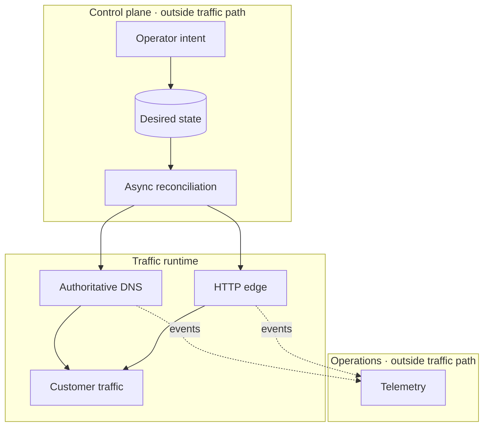
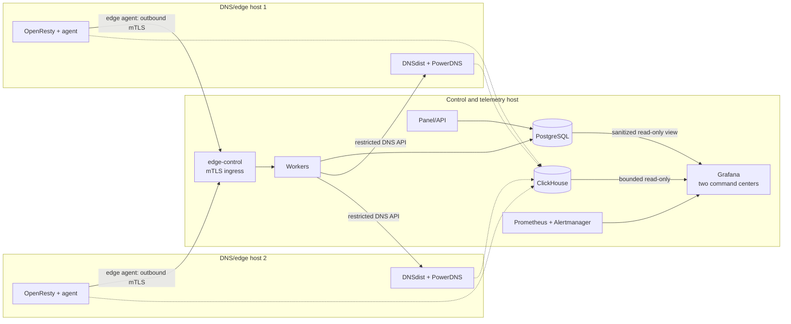

# How to build a self-hosted private CDN

A self-hosted private CDN runs its control plane, authoritative DNS, edge
proxies, cache, TLS lifecycle, and telemetry on infrastructure you operate. It
is not just a reverse proxy installed in several locations: it is a control
system for traffic placement, origin safety, cache consistency, security,
upgrades, and recovery.

CDNFoundry provides those pieces as one bounded platform for organizations that
operate their own servers or points of presence. This guide explains the design
decisions before installation.

::: info Who this is for
Use this architecture when a private company, hosting provider, university,
government network, or ISP needs control of DNS and edge infrastructure. It is
not a replacement for upstream volumetric DDoS scrubbing or global transit.
:::

## Self-hosted CDN or managed CDN?

The choice is primarily about operational ownership, not a checklist of proxy
features.

| Requirement | Self-hosted private CDN | Managed CDN |
| --- | --- | --- |
| Infrastructure | Your servers, networks, and points of presence | Provider-owned global network |
| DNS and edge operations | Your team operates and qualifies them | Provider operates the data plane |
| Placement | Explicitly limited to capacity you deploy | Broad provider footprint |
| Data and telemetry | Remain in systems you control | Follow the provider's platform and contracts |
| Failure response | Your runbooks, spares, and transit | Provider service levels and support |
| Upstream DDoS capacity | Requires separate network or scrubbing arrangements | Often available as a provider service |

Self-hosting fits organizations that already operate network capacity, need
specific regional placement or data control, and can own DNS, TLS, upgrades,
monitoring, and incident response. A managed CDN is usually the better choice
when the goal is broad global reach without operating an authoritative DNS and
edge fleet.

## Start with failure behavior

The first design question is not “how many requests per second?” It is “what
happens when each dependency fails?”

| Dependency failure | Required private-CDN behavior |
| --- | --- |
| Management application | Existing DNS and HTTP continue |
| Control database | Existing runtime continues; new changes pause |
| Queue | Existing runtime continues; deployments wait |
| One DNS server | Other authoritative servers answer |
| Edge configuration candidate | Previous valid snapshot stays active |
| Certificate renewal | Current valid certificate stays active |
| Origin | Eligible cache/stale policy may respond; failure is observable |
| Telemetry database | Serving continues; analytics becomes partial |
| One point of presence | DNS placement withdraws only failed capacity |

CDNFoundry implements this by separating desired state from runtime state and
keeping management outside customer request paths.

## The six systems you need

### 1. A control plane

The control plane authenticates users, enforces permissions, validates bounded
configuration, records audit history, increments revisions, and dispatches
external work. CDNFoundry uses one Laravel modular monolith and two Filament
panels instead of distributing ordinary CRUD across microservices.

PostgreSQL owns desired state. Valkey owns sessions, application cache, and
queue transport. Horizon separates interactive, runtime, certificate/purge,
and bulk-maintenance work so a large job cannot consume every worker.

### 2. Authoritative DNS

The CDN must control answers for customer hostnames. DNSdist is the only public
authoritative endpoint. Private PowerDNS servers answer from a derived database
that reconciliation can rebuild.

DNS is responsible for:

- platform nameserver identity and glue;
- ordinary DNS-only records;
- listener-ready proxy addresses;
- country/continent/default Geo-DNS answers;
- monotonic SOA serials;
- removal of failed, drained, stale, or overloaded capacity.

Every production platform needs at least two authoritative servers in separate
failure domains and must test both UDP and TCP externally.

### 3. Bounded edge runtimes

An edge should not create a new process, container, server block, cache
directory, reload, or timer for every domain. CDNFoundry runs shared,
data-driven OpenResty cells with explicit CPU, memory, and PID ceilings.

The Go edge agent:

- enrolls with a one-time token and then short-lived mutual TLS;
- fetches signed, revisioned artifacts;
- verifies signature, checksum, schema, and compatibility;
- compiles and validates runtime data;
- activates directories atomically;
- retains previous valid state;
- reports acknowledgement, listener readiness, and capacity.

Quarantine uses a separately bounded cell. Exceptional dedicated pools are a
placement class, not the default tenant architecture.

### 4. Origin and cache policy

Every proxied hostname needs one explicit origin. Validate at write time and
again before connection because DNS can change after configuration.

Reject:

- loopback and unspecified addresses;
- link-local and multicast ranges;
- cloud metadata addresses;
- internal platform and service addresses;
- edge listeners and the platform proxy hostname;
- any resolution that creates a proxy loop.

Bound connect/response timeouts, retries, header size, body handling,
concurrency, object admission, and temporary storage. Use one deterministic
cache key for lookup and URL purge. Implement full purge as an epoch increment,
not a directory scan.

### 5. Certificate and security lifecycle

Managed certificates should start only when an active, delegated domain first
gains an eligible proxied hostname. CDNFoundry uses DNS-01 so issuance is not
coupled to a particular HTTP edge.

Custom certificates require:

- matching public/private key;
- valid chain;
- exact/wildcard name coverage;
- acceptable expiry;
- bounded PEM sizes;
- encrypted private-key storage.

Application security evaluates trusted client addresses, ordered allow/block
rules, bounded profiles, method/request limits, and persisted emergency state.
These features contain application load; they cannot protect a saturated
uplink.

### 6. Independent telemetry and recovery

Vector receives OpenResty events and DNSdist dnstap, removes sensitive fields,
bounds values, and writes ClickHouse. Laravel queries bounded time ranges but
does not receive raw traffic. The telemetry role also runs Prometheus,
Alertmanager, and loopback-only Grafana. Grafana's two command centers read
Prometheus, bounded ClickHouse tables, and a sanitized PostgreSQL operational
view with separate read-only credentials.

Recovery requires more than database rows:

- PostgreSQL backup;
- original Laravel encryption key;
- artifact signing key;
- edge identity and server CA material;
- Restic password and repository credentials;
- externally retained customer TLS material;
- documented immutable image versions.

PowerDNS data and edge snapshots are derived. Rebuild them through
reconciliation rather than promoting drift to source-of-truth state.

## Minimum production topology

Grafana remains off public listeners. Remote operators reach it only through a
deployment-owned authenticated HTTPS proxy or trusted tunnel; its failure does
not enter serving, ingestion, or reconciliation paths.

This is a reliability minimum, not a scale maximum. Larger ISPs can separate
DNS, edge, telemetry, control workers, PostgreSQL, and Valkey using the shipped
role profiles, generated bundles, and external endpoints.

## Capacity planning for an ISP

Measure each plane independently:

| Plane | Primary measurements |
| --- | --- |
| DNS | UDP/TCP QPS, response latency, packet loss, backend health, zone count |
| Edge | requests/s, concurrent connections, TLS handshakes, bandwidth, CPU |
| Origin | connection concurrency, latency, failure rate, retry amplification |
| Cache | hit ratio, object-size distribution, churn, disk latency, evictions |
| Control | mutation rate, queue age, worker utilization, reconciliation duration |
| Telemetry | events/s, buffer use, insert latency, retention bytes, query latency |

Scale by adding the constrained unit. Do not add control-plane complexity to
solve an edge bandwidth problem.

::: warning Validate real traffic
Published CPU and memory values are safety limits, not performance guarantees.
Qualify your hardware, kernel, NICs, storage, transit, origin behavior, request
mix, TLS rate, and IPv4/IPv6 paths before committing capacity.
:::

## Build or adopt

Building all of these capabilities independently requires:

- a domain/user/permission model;
- DNS record validation and a safe authoritative deployment mechanism;
- edge identity, signing, delivery, rollback, and readiness;
- origin SSRF and proxy-loop defenses;
- certificate automation and encrypted key handling;
- deterministic cache/purge semantics;
- security policy compilation;
- bounded telemetry schemas and queries;
- backups, migrations, health, alerts, and incident runbooks.

CDNFoundry is useful when that architecture matches your requirements and
Docker Compose is an acceptable operational model. It deliberately does not
include Kubernetes requirements, billing, reseller hierarchies, GraphQL,
plugin runtimes, private-origin tunnels, or automatic global traffic
orchestration.

## Common evaluation questions

### Is a reverse proxy enough to build a CDN?

No. A reverse proxy can cache and forward requests, but a production CDN also
needs traffic placement, authoritative DNS, certificate lifecycle, safe origin
policy, configuration distribution, rollback, telemetry, capacity management,
and failure recovery.

### Can a self-hosted CDN run on one server?

One server can support development or a controlled evaluation, but it is not a
production failure-isolated CDN. The minimum documented production fleet uses
one control and telemetry node plus two DNS and edge nodes in separate failure
domains.

### Does self-hosted mean the origin can be private?

Not in the current CDNFoundry feature set. Proxied origins must resolve to
allowed public destinations; private-origin tunnels are intentionally outside
the verified product boundary.

### Is a self-hosted CDN always cheaper?

No. Compare servers, transit, storage, certificates, monitoring, on-call work,
spares, upgrades, and incident response against managed-CDN pricing. Private
CDN ownership is valuable when control or placement requirements justify that
operational cost.

## Evaluation checklist

- [ ] You control at least one platform domain and registrar glue.
- [ ] You can place two DNS/edge nodes in separate failure domains.
- [ ] You can keep PostgreSQL, Valkey, ClickHouse, and PowerDNS APIs private.
- [ ] You have exact-source firewall control.
- [ ] Public origins are acceptable for the current feature set.
- [ ] Docker Compose matches your deployment and upgrade practices.
- [ ] You can store encryption, signing, PKI, and backup secrets externally.
- [ ] You can test UDP/TCP DNS, IPv4/IPv6, HTTPS, origin, cache, and failure behavior.
- [ ] You understand that application limits are not upstream DDoS scrubbing.

## Continue

1. Learn the request lifecycle in [CDN fundamentals](../concepts/cdn-fundamentals.md).
2. Compare [Production reference architectures](../architecture/production-reference-architectures.md).
3. Read the [architecture](../architecture/index.md) and [desired-state model](../concepts/desired-state.md).
4. Follow the [Production quick start](../deployment/production-quick-start.md).
5. Apply [Production best practices](../operations/production-best-practices.md)
   and [security hardening](../security/hardening.md).
6. Establish [monitoring](../operations/monitoring.md) and [backup recovery](../operations/backup-and-recovery.md).
7. Use [scaling guidance](../operations/scaling.md) after measuring the first fleet.
