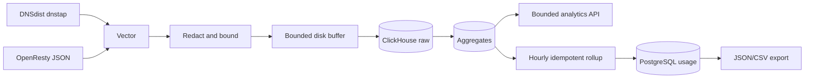

# Analytics, logs, and usage

| Data class | Contract |
| --- | --- |
| Raw logs | Domain/admin scoped, maximum 24-hour query |
| Aggregates | Bounded analytics, maximum 90-day query |
| Usage | Compact PostgreSQL rows for stable export |
| Client address | IPv4/IPv6 masking applied |
| Sensitive fields | Authorization, cookies, bodies, and query strings removed |

::: caution Analytics is not authoritative
ClickHouse loss can create partial intervals, but it cannot change DNS, edge
state, security decisions, certificate selection, or serving.
:::

Vector sends normalized edge and DNS events directly to ClickHouse. Laravel
queries bounded results; it does not receive raw traffic through a queue or
store it in PostgreSQL.

## Domain analytics

The `/app/analytics` page and domain API expose:

- summary;
- timeseries;
- status codes;
- cache outcomes;
- countries;
- hostnames;
- top URL paths;
- origin health;
- edge distribution;
- compression encoding, delivered/identity bytes, savings ratio, profile, and fallback;
- DNS query aggregates.

Aggregate queries accept at most 90 days. Raw request, DNS, error, and security
logs and the unsampled compression view accept at most 24 hours. Logs use
opaque cursor pagination.

Responses label units, requested range, finalization state, and partial data.
ClickHouse failure returns HTTP 503 with `code=analytics_unavailable`. Filament
shows the outage instead of failing the serving plane.

## Privacy

Vector strips authorization, cookies, request bodies, and query strings.
Paths, user agents, referrers, errors, names, and addresses are length bounded.
Normal views and exports mask client addresses using the platform IPv4 and IPv6
prefix settings.

Raw ClickHouse tables have a seven-day TTL. Hourly aggregates have a 400-day
TTL and daily aggregates a three-year TTL in the shipped schema. Platform
retention settings describe the policy and reporting surface; changing them
does not rewrite the static ClickHouse DDL by itself.

## Usage rollups

The scheduler finalizes the most recently complete hour after the configured
delay. `usage_rollups` stores request, DNS, ingress, and egress counts with a
stable interval and status. Rebuilding the same interval is idempotent.

Domain and administrator usage endpoints support cursor lists plus JSON or CSV
export, bounded to 10,000 rows. The export metadata includes contract version
and range. This is reporting data for an external billing system; CDNFoundry
does not implement billing.

## Telemetry loss

Each Vector ClickHouse sink has a 1 GiB disk buffer, batches up to 1,000 events,
retries delivery for a bounded duration, and drops newest events when full.
Prometheus alerts on discarded events, delivery errors, and buffer pressure.
DNS and HTTP continue serving.
