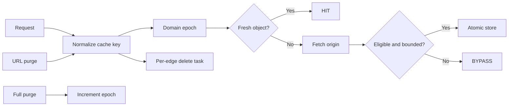

# Cache and purge

| Concern | Contract |
| --- | --- |
| Namespace | Persistent per-cell storage; keys isolate domain, policy, epoch, and URL generation |
| Key | Same normalized key for lookup and URL purge |
| Full purge | Increment epoch; never scan the filesystem |
| URL purge | Durable per-edge task |
| Development mode | Absolute bounded bypass expiry |
| Failure | Retry the same task and expose backlog |

::: info Purge completion
An accepted purge proves task creation. Confirm edge task completion and make a
real request to verify the expected MISS.
:::

Cache policy is per domain and revisioned with edge configuration.

| Setting | Allowed values |
| --- | --- |
| enabled | boolean |
| edge TTL | 0–31,536,000 seconds |
| browser TTL | 0–31,536,000 seconds |
| maximum object | 1 MiB–1 GiB, capped by the pool profile |
| respect origin headers | boolean |
| query policy | include all, ignore all, include selected, or ignore selected |
| selected query names | up to 32 distinct safe names |
| bypass cookie names | up to 32 distinct names, each 1–64 safe characters |
| status TTLs | approved 200, 203, 204, 206, 301, 302, and 404 map; 0 disables admission |
| admission requests | 1–10 requests before a new object is admitted |
| stale if error | 0–86,400 seconds |
| stale while revalidate | 0–86,400 seconds |
| serving mode | normal, cache-only, or stale-only |
| variants | 1–128 distinct variants per resource/minute |

Defaults are enabled, 3,600-second edge TTL, 300-second browser TTL, 100 MiB
maximum object, origin-header respect, query inclusion, no bypass cookies,
approved status TTLs, two-request admission, 60 seconds of stale-if-error,
30 seconds of stale-while-revalidate, normal serving, and 32 variants.

Requests with authorization, unsafe methods, configured cookies, `Set-Cookie`,
private/no-store responses, unsupported `Vary`, ranges, and disallowed status
codes follow the runtime bypass or no-store rules. Cache keys and URL purge use
the same normalized scheme, lowercase hostname, path, sorted query pairs,
policy generation, epoch, and URL generation. Range requests bypass admission.

## Pool profiles and storage

Administrators select one profile on each service pool. The profile is compiled
into every assigned domain artifact and caps the domain policy:

| Profile | Cache | Temporary | Minimum free | Inactive | Object | Admissions/s |
| --- | ---: | ---: | ---: | ---: | ---: | ---: |
| Small | 256 MiB | 64 MiB | 32 MiB | 30 min | 10 MiB | 20 |
| Standard | 1 GiB | 128 MiB | 64 MiB | 1 hour | 100 MiB | 50 |
| Large | 4 GiB | 512 MiB | 256 MiB | 6 hours | 512 MiB | 100 |
| Streaming | 8 GiB | 1 GiB | 512 MiB | 24 hours | 1 GiB | 25 |

Every installed cell has its own persistent cache volume. Request temporary
storage remains a separate bounded filesystem. The OpenResty cache also reserves
minimum free space and evicts inactive/least-recent objects. Operators must set
the volume quota to the selected profile or a stricter local ceiling; changing
profiles never creates a directory, process, or timer per domain.

Cache-only and stale-only keep cache hits available but reject an origin-bound
miss with stable reason `cache_mode_origin_disabled`. They therefore remain
safe during origin isolation and do not call Laravel from the request path.

## Development mode

Enable development mode for 1–1,440 minutes. PostgreSQL stores an absolute
expiry and the signed artifact carries it. OpenResty checks the time on each
request, so bypass ends without the scheduler or control plane.

## Purge

A purge is either:

- `all`, which increments the domain cache epoch and does not scan disk;
- `urls`, which accepts 1–100 distinct URLs and generates exact cache keys.

The payload is limited to 128 KiB. A domain may have at most 100 outstanding
purges. The controller creates one durable task per eligible edge and returns
`202`. Full and URL purges are idempotent through the request key and task ID.

The agent sends the task to every matching cell. OpenResty records the new epoch
or bounded URL-key invalidations in shared memory. Failed delivery retains the
same task, records `last_error`, and retries with bounded delay. Traffic
continues throughout.

## Storage isolation

Every cell uses a distinct persistent cache volume plus a distinct temporary
filesystem, CPU, memory, and PID limit. Cache loss is safe because content is
derived from origins and desired policy; restart preserves content, while
volume replacement rebuilds it on demand. Exhaustion in one cell does not scan
or delete another cell's storage.

Delivery compression does not vary the cache key. The cell requests identity
from the origin and stores one canonical object, then applies the pool's
bounded [compression profile](compression.md) after HIT, MISS, or stale lookup.
