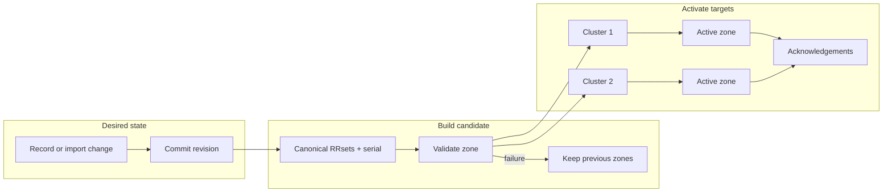

# Authoritative DNS

| Concern | Source of truth or bound |
| --- | --- |
| Desired records | Control PostgreSQL |
| Runtime records | Derived PowerDNS PostgreSQL |
| Public ingress | DNSdist only, UDP and TCP port 53 |
| Mutation | One monotonic domain revision; bulk/import is atomic |
| Target bounds | 16 clusters and 8 nameserver identities |
| Failure rule | Invalid candidate never replaces active RRsets |



::: danger Never expose PowerDNS directly
DNSdist is the only public authoritative listener. Keep the raw PowerDNS API
and daemon private behind the source-restricted TLS gateway.
:::

## Records

Use the domain's **DNS records** relation or
`/api/domains/{domain}/dns/records`. Lists use cursor pagination with 100 rows.
Create, update, delete, and bulk operations validate the final zone before
incrementing its revision.

Supported types, modes, field bounds, and CNAME rules are in
[DNS record reference](../reference/dns-records.md).

Bulk input is limited by controller validation and payload-size checks. Every
record is normalized before duplicates and zone-wide constraints are checked.
One valid bulk mutation creates one desired revision.

## Import

`POST /api/domains/{domain}/dns/import` accepts:

```json
{
  "zone": "$ORIGIN example.com.\n@ 300 IN A 192.0.2.10\n",
  "replace_existing": false
}
```

The parser supports `$ORIGIN`, `$TTL`, comments, parenthesized multiline
records, omitted owners, relative names, common TTL suffixes, and supported
record types. Input is limited to 1 MiB and 5,000 records.

Imports over 64 KiB or 100 physical lines create a `dns.zone_import` operation
on `bulk_maintenance` and return `202`. Smaller imports apply transactionally in
the request. A failure leaves the previous zone and revision unchanged.

SOA input is ignored because CDNFoundry owns SOA serial generation.

## Export

`GET /api/domains/{domain}/dns/export` returns deterministic BIND text with
`$ORIGIN`, `$TTL`, and stable owner/type ordering. Platform-managed SOA is not
exported. Re-importing with replacement recreates the desired customer records.

## Reconciliation

Each enabled, healthy DNS cluster has one deployment row per active domain.
The worker renders deterministic RRsets, compares checksums, writes or replaces
the target zone, verifies active state, and records acknowledgement. A failed
target retains its previous active RRsets.

Administrators can reconcile one domain, all DNS zones, or the platform DNS
identity. Global work is chunked at 500 domain IDs.

## Drift

PowerAdmin is diagnostic only. Treat direct runtime edits as drift. Reconcile
from PostgreSQL rather than copying runtime data back into desired state.
