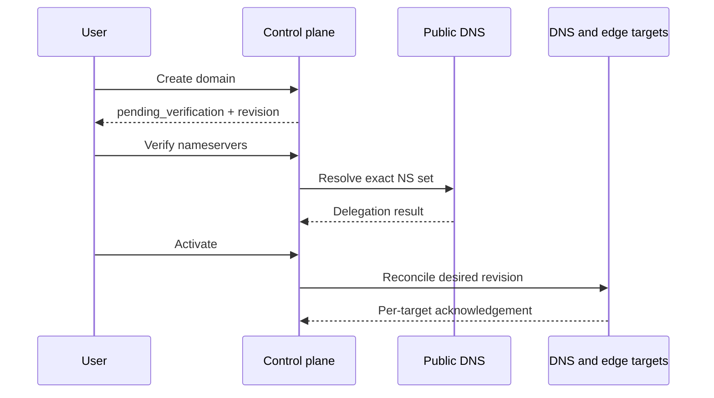

# Domain lifecycle

| Concern | Implemented boundary |
| --- | --- |
| Durable owner | PostgreSQL domain, deployment, and tombstone rows |
| External work | NS verification, DNS reconciliation, edge deployment |
| Completion | Operation plus target-specific acknowledgement |
| Failure | Preserve last-valid runtime and expose the failed target |
| Retirement | Delayed deprovision, acknowledged tombstones, reclaim cooldown |

::: warning Form save is not runtime activation
Inspect domain status, the operation receipt, and DNS/edge deployment state
before declaring a lifecycle change complete.
:::

## Create

`POST /api/domains` and the domain create form accept a `name` and optional
`display_name`. Names are normalized by `DomainName` and must be registrable
DNS names. The built-in public-suffix guard covers the suffix list implemented
in `core/app/Support/DomainName.php`; it is intentionally not a full public
suffix database.

Creation:

- assigns the creating domain user;
- starts at `pending_verification`;
- creates the initial revision;
- queues DNS reconciliation;
- does not require an origin or certificate.

## Verify

`POST /api/domains/{domain}/verify-nameservers` creates an asynchronous
operation. The resolver compares public NS answers with the platform identity.
Administrators have a force-verify route for controlled local tests.

## Activate

Activation requires verified nameservers and changes lifecycle state to
`active`. DNS and edge work remain asynchronous. Use the domain status, DNS
deployment, and edge deployment endpoints to confirm acknowledgement.

## Disable

Disable stops new desired changes from representing an active customer service,
but retains last-valid runtime state for the `dns_lifecycle.deprovision_delay_days`
window. The scheduler then dispatches bounded DNS deprovisioning and final
domain retirement.

## Delete and reclaim

`DELETE /api/domains/{domain}` starts asynchronous retirement; it is not an
immediate row removal. Edge tombstones must be acknowledged before finalization.
The name is then held in `domain_name_tombstones` for
`domain_reclaim_cooldown_days`.

Never delete PowerDNS zones, edge files, or cache directories as a substitute
for this lifecycle.

## Operational proof

After activation, query every authoritative target over UDP and TCP and compare
SOA serials. Before retirement, confirm tombstones are acknowledged and the
cooldown is visible. Repair or deliberately withdraw a failed target instead
of deleting durable state.
