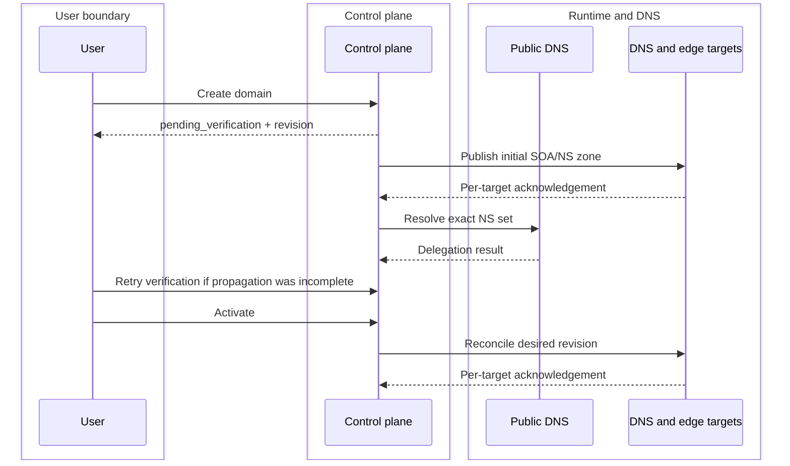

# Domain lifecycle

| Concern | Implemented boundary |
| --- | --- |
| Durable owner | PostgreSQL domain, deployment, and tombstone rows |
| External work | NS verification, DNS reconciliation, edge deployment |
| Completion | Operation plus target-specific acknowledgement |
| Failure | Preserve last-valid runtime and expose the failed target |
| Retirement | Delayed deprovision, acknowledged tombstones, reclaim cooldown |

::: warning Form save is not runtime activation
Inspect domain status, the operation receipt, and DNS/edge deployment state
before declaring a lifecycle change complete.
:::

## Create

`POST /api/domains` and the domain create form accept `name`. The API has a
separate display-label update. Names are normalized consistently using UTS #46
IDNA and a pinned complete Public Suffix List (ICANN and PRIVATE sections),
including wildcard and exception rules. Delegated subdomains and reverse zones
remain supported; platform and management namespaces are reserved. API and
Filament creation share a transaction and PostgreSQL name lock with finalization.
The active-name unique index remains the final duplicate guard.

Creation:

- assigns the creating domain user;
- starts at `pending_verification`;
- creates the initial revision;
- queues initial DNS reconciliation and then public nameserver verification;
- does not require an origin or certificate.

## Verify

Creation assigns a random nameserver prefix, a seven-day pending-claim deadline
and the creating user's assignment. Read **Assigned nameservers** on the domain
page or `assigned_nameservers` in the API response. At the registrar (or parent
zone for delegated children), set exactly these names. There is no customer TXT
challenge. The assignment resolves to the existing bounded DNS hosts through
platform wildcard A/AAAA records; no per-domain DNS process is created.

The worker uses BIND `delv` with its root trust anchor to validate parent discovery
and DS absence, then bounded nonrecursive `dig` queries to parent authorities.
Every parent must return the same exact delegation. Child-zone answers, shared
platform nameservers, stale previous assignments, DNSSEC failures and partial
propagation cannot activate a new claim. The unsigned runtime requires removing
stale DS records from a previous provider. The worker has a 45-second DNS budget,
a 60-second job timeout, at most 16 parent authorities and four addresses per
parent, and a 64-KiB process-output limit. DNS errors remain visible failures;
retry after correcting DNS or propagation.

Pending zones serve only SOA/NS bootstrap records. A pending child of an already
managed zone is not published, so it cannot shadow the parent's DNS records.
Verification completes before that child is activated. ACME DNS-01 remains
separate and is used only for eligible proxied hostnames after verification.

Requests coalesce through the same API/Filament verification boundary. Completion
rechecks the actor, assignment, operation, claim and lifecycle under database
locks. Disabled, deprovisioning, expired, cancelled or revoked work cannot activate.
The explicit administrator force-verification route remains audited; it is an
operator override, not evidence that public delegation was checked.

Each domain user may hold at most 20 unverified claims, including disabled or
retiring claims. Administrator bulk operations remain separately authorized.
An unverified claim expires after seven days even if the applicant disables it. The scheduler retires at most
500 expired claims per minute through normal asynchronous deprovisioning and
reclaim cooldown. Verified owners never expire on this deadline. For disputes,
an administrator must inspect independent registrar/parent evidence and audit
any deliberate assignment or override; a competing applicant cannot replace a
verified configuration. Do not bypass cooldown or delete tombstones to recover
a claim. Following retirement and cooldown, create a fresh claim with different
nameservers. Repeated squatting or disputed registrar evidence requires operator
review; automatic ownership transfer is not supported.

## Activate

Activation requires verified nameservers and changes lifecycle state to
`active`. DNS and edge work remain asynchronous. Use the domain status, DNS
deployment, and edge deployment endpoints to confirm acknowledgement.

## Disable

Disable stops new desired changes from representing an active customer service,
but retains last-valid runtime state for the `dns_lifecycle.deprovision_delay_days`
window. The scheduler then dispatches bounded DNS deprovisioning and final
domain retirement.

## Delete and reclaim

`DELETE /api/domains/{domain}` starts asynchronous retirement; it is not an
immediate row removal. Edge tombstones must be acknowledged before finalization.
The name is then held in `domain_name_tombstones` for
`domain_reclaim_cooldown_days`.

Never delete PowerDNS zones, edge files, or cache directories as a substitute
for this lifecycle.

## Operational proof

After activation, query every authoritative target over UDP and TCP and compare
SOA serials. Before retirement, confirm tombstones are acknowledged and the
cooldown is visible. Repair or deliberately withdraw a failed target instead
of deleting durable state.

## Upgrade and recovery for claim assignments

Before upgrading, drain or stop old runtime workers so older verification code
cannot process pending claims. Apply the additive
`2026_09_05_160000_add_domain_delegation_claims` migration explicitly, deploy the
new control/worker image (including `bind-tools`), and resume workers. Reconcile
platform identity and verify wildcard nameserver A/AAAA answers on every DNS
host before onboarding new customers. Existing verified zones retain their
nameservers and assignments. Existing pending claims receive a fresh assignment
when **Verify nameservers** is requested again; old unverified claims older than
seven days retire under the expiry rule.
If an older installation already has `delegation_nameservers` as JSON but lacks
the migration receipt, the migration preserves its values, converts the column
to JSONB, and adds only missing claim fields. The conversion bounds lock wait
to five seconds and execution to 30 seconds; a timeout leaves the transaction
unapplied for a later explicit retry. Check migration status before resuming
workers.

The new nullable columns are recovery evidence. Preserve them in backups and
retain platform wildcard records during rollback. Do not roll back to code that
accepts shared delegation for new claims; use a forward fix and suspend new
claim verification if necessary. No migration is automatically applied by web
requests or image startup. Production/public registrar qualification remains a
separate gate in the [audit report](../operations/security-audit.md).

The packaged PSL snapshot and its upstream commit/checksum are in
`core/resources/data/public_suffix_list.*`. Update both from the official
[Public Suffix List](https://publicsuffix.org/list/), retain its MPL notice, and
run normalization regressions before release; workers never download it at
request time.
