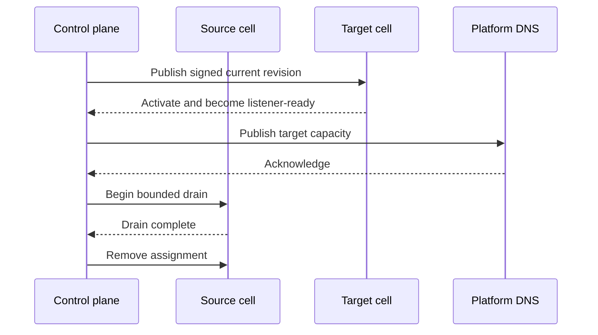

# Edges and placement

| Concern | Durable/runtime boundary |
| --- | --- |
| Identity | Edge UUID plus short-lived mTLS certificate |
| Bootstrap | One-time token exchanged for persistent identity |
| Delivery | Signed incremental manifest or bounded recovery snapshot |
| Placement | Pool/cell state in PostgreSQL |
| Movement | Target acknowledged before source drain |
| Eligibility | Heartbeat, listener readiness, drain, emergency, and capacity |

::: caution Never clone identity state
An edge-agent volume belongs to one edge row and host. Restore it only to that
identity, or rotate the edge and enroll again.
:::

## Pools

Administrators create `shared`, `quarantine`, or `dedicated` pools. Pool names
become stable runtime names and cannot change after cells are provisioned.
Enabling a pool asynchronously provisions one cell per eligible edge in bounded
batches. Disabling removes it from new placement decisions without inventing a
per-domain runtime.

The standard production profile supplies `shared-default` and
`quarantine-default`. A dedicated pool requires an operator-owned Compose
override that repeats the bounded cell shape with unique ports and volumes.

## Edge rows

Create an edge with:

- unique name;
- ISO country code and continent code;
- optional unique management IPv4;
- optional unique management IPv6.

Management addresses may be private. They are operator inventory and are not
used by the edge-control connection or bound by the customer gateway. The
agent initiates control traffic outbound to `EDGE_CONTROL_URL`.

The create response exposes an edge UUID and bootstrap token once. Store them
only long enough to enroll the agent.

## Pool service endpoints

Cells do not own public addresses. Assign one or more bounded cells to a pool,
then create one pool endpoint on the edge with public IPv4, IPv6, or both. The
gateway binds those endpoint addresses and routes them to the pool's assigned
cells after agent acknowledgement. Endpoint addresses cannot equal management
addresses.

New edges begin with every cell unassigned. Creating a pool never assigns cells
to this or any other edge; all participation is an explicit administrator
choice.

For a Simple Anycast pool, configure the approved pair once on the pool and
assign its first cell on each intended edge. CDNFoundry automatically creates
that edge's addressless participation record, binds and publishes the inherited
pair, but never announces or withdraws BGP routes. Manual endpoint creation is
only for Geo-Unicast. See the
[Simple Anycast runbook](../operations/simple-anycast.md).

## Agent environment

The production profile supplies:

| Variable | Purpose |
| --- | --- |
| `EDGE_CONTROL_URL` | Mutual-TLS control URL |
| `EDGE_CONTROL_CA_CERTIFICATE` | Server trust anchor |
| `EDGE_ID` | UUID used for first enrollment |
| `EDGE_BOOTSTRAP_TOKEN` | One-time enrollment secret |
| `EDGE_STATE_DIR` | Persistent identity and acknowledgement directory |
| `EDGE_RUNTIME_DIR` | Persistent active/previous runtime snapshots |
| `EDGE_CELL_STATUS_URLS` | Internal cell status/control endpoints |
| `EDGE_STATUS_TOKEN` | Shared agent-to-cell control token |
| `EDGE_ONCE` | Optional one-cycle diagnostic mode; defaults to false |

After enrollment, remove `EDGE_BOOTSTRAP_TOKEN`. Keep the agent state volume.

## Drain and movement

Draining an edge or cell makes it ineligible for new publication and queues the
relevant runtime task. Moving a domain creates a target placement, delivers and
acknowledges the current revision there, updates DNS, waits
`edge_runtime.placement_drain_seconds`, then completes source drain.

Never delete the active source before the target is ready.

## Recovery

If the manifest gap is too large or local state is lost, the agent fetches
`/edge/v1/config/full`. It validates the signed gzip snapshot, builds candidate
pool files, preserves the previous active directory, and acknowledges only
after activation. Invalid snapshots remain rejected and visible.
