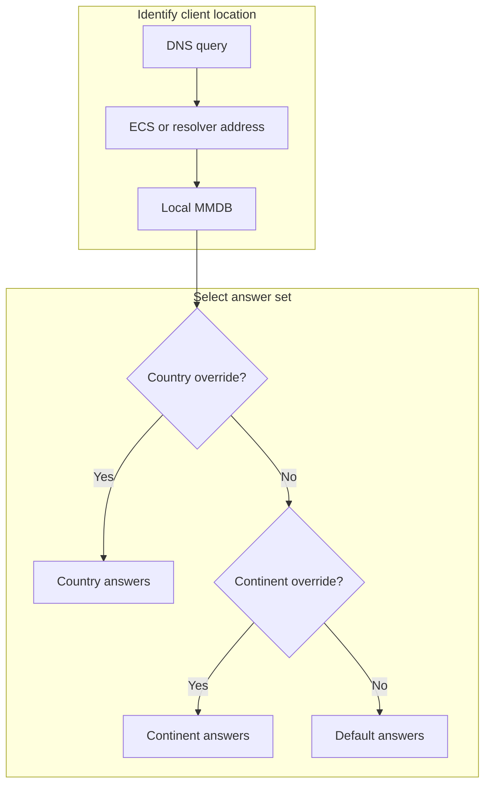

# Geo-DNS

Geo-DNS is a DNS record mode that returns operator-supplied answers according
to the request's classified country or continent. PowerDNS evaluates a bounded
Lua record locally from the active zone and memory-mapped GeoIP database. A DNS
query never calls Laravel or an external GeoIP service.

::: danger Geo-DNS is not CDN edge routing
Geo-DNS changes authoritative DNS answers only. It does not proxy HTTP, choose
an OpenResty cell, redirect a browser, apply security policy, or test whether a
target is healthy. Use service pools and pool endpoints for CDN edge placement.
Never use geographic classification as authentication or an access-control
boundary.
:::

## Selection model

Every Geo-DNS record has a required default answer set and optional country and
continent overrides. Selection is deterministic:



For example, with country `IR`, continent `EU`, and default answer sets:

| Classified request | Selected set | Reason |
| --- | --- | --- |
| Country `IR`, continent `AS` | `IR` country answers | Country is most specific |
| Country `FR`, continent `EU` | `EU` continent answers | No `FR` override exists |
| Unknown country and continent | Default answers | Classification is unavailable |
| Country `US`, continent `NA`, with neither override | Default answers | No configured match exists |

Unknown or invalid geography does not fail the DNS query merely because a
classification is unavailable; it continues to the default set.

::: warning Resolver location and ECS
Without EDNS Client Subnet (ECS), the authoritative server usually sees and
classifies the recursive resolver, which may be far from the end user. When ECS
is supplied, the shipped PowerDNS runtime processes it. Direct test clients can
also submit ECS, so treat it only as an answer-selection hint. Previewing an IP
does not prove what a real resolver sends on the public query path.
:::

## Supported record types

Geo-DNS supports `A`, `AAAA`, `CNAME`, `MX`, `TXT`, `NS`, `SRV`, and `PTR`.
`CAA` remains DNS-only. Every target is normalized using the same rules as an
ordinary record of that type.

| Type | Geographic target values | Values that stay fixed on the record |
| --- | --- | --- |
| `A` | IPv4 addresses | None |
| `AAAA` | IPv6 addresses | None |
| `CNAME` | Canonical DNS names | None |
| `MX` | Mail exchanger names | Priority |
| `TXT` | Text values | None |
| `NS` | Nameserver names | Administrator-only delegation rules still apply |
| `SRV` | Service target names | Priority, weight, and port |
| `PTR` | Reverse target names | Reverse-zone ownership rules still apply |

An `A` set cannot contain IPv6 values and an `AAAA` set cannot contain IPv4
values. Relative DNS targets are normalized within the managed zone; fully
qualified targets are stored with their canonical trailing dot.

## Limits and validation

| Item | Bound |
| --- | ---: |
| Default answers | 1–8 targets |
| Country overrides | 0–64 distinct codes |
| Continent overrides | 0–7 distinct codes |
| Targets in each override | 1–8 unique, type-valid values |
| Target input | At most 4,096 characters before type normalization |

Country keys are uppercase ISO 3166-1 alpha-2 codes. Supported continent codes
are `AF`, `AN`, `AS`, `EU`, `NA`, `OC`, and `SA`. Duplicate targets are compared
case-insensitively and rejected. One Geo-DNS record must be the only record of
its type at that owner; normal CNAME coexistence and zone-boundary rules still
apply.

::: warning Default answers are mandatory
The default set is the availability fallback for missing MMDB data, unknown
addresses, resolvers without useful ECS, and countries or continents without
an override. Do not use a placeholder or an address that is intentionally
unreachable. Geo-DNS does not health-check or automatically remove targets.
:::

## Configure in the panel

1. Open the domain in `/app` or the administrator domain resource.
2. Open **DNS records** and choose **Create DNS record**.
3. Select a supported record type and set **Mode** to **Geo-DNS**.
4. Enter one to eight **Default answers**.
5. Add optional **Country overrides**. Choose the uppercase country code and
   enter that country's answer set.
6. Add optional **Continent overrides**. Country overrides always win when both
   match.
7. Enter TTL and the fixed MX or SRV numeric fields when applicable.
8. Save, then wait until every enabled DNS cluster acknowledges the domain's
   new desired revision.
9. Use the row's **Preview** action with a known IPv4 and IPv6 address. Record
   the displayed country, continent, and selected answers.

Editing the geographic configuration validates the complete candidate in a
transaction, increments the domain revision only when it changed, records an
audit event, and coalesces DNS reconciliation after commit. Invalid input does
not change desired state.

## Configure through the API

Create the record through the ordinary DNS-record endpoint. This example
returns an Iran-specific address, a Europe address for other European
countries, and the default everywhere else:

```http
POST /api/domains/42/dns/records
Authorization: Bearer TOKEN
Content-Type: application/json
Idempotency-Key: 810ddb0a-fc60-47b7-8c40-eb4d62ae87bd

{
  "type": "A",
  "name": "download",
  "ttl": 300,
  "mode": "geo_dns",
  "geo": {
    "default": ["203.0.113.10"],
    "countries": {
      "IR": ["203.0.113.30"]
    },
    "continents": {
      "EU": ["203.0.113.20"]
    }
  }
}
```

For an existing Geo-DNS record:

| Method and path | Purpose |
| --- | --- |
| `GET /api/domains/{domain}/dns/records/{record}/geo` | Read the normalized configuration |
| `PUT /api/domains/{domain}/dns/records/{record}/geo` | Replace the complete configuration; requires `Idempotency-Key` |
| `POST /api/domains/{domain}/dns/records/{record}/geo/preview` | Classify one supplied IP and show the selected targets |

Preview request:

```json
{"ip":"2001:db8::1"}
```

The response includes `ip`, nullable `country` and `continent`, classification
`source` (`mmdb` or `unknown`), selected `targets`, and a reminder that runtime
classification may use the resolver rather than the end user.

## Runtime data and failure behavior

PowerDNS reads `/mmdb/GeoLite2-City.mmdb` in memory-mapped mode. The updater
downloads a candidate, validates it with `mmdblookup`, optionally checks its
configured SHA-256, and renames it atomically. A bad download or validation
failure preserves the previous valid database.

The DNS candidate contains only normalized, bounded static answer sets and the
selection program. PowerDNS data is derived from PostgreSQL desired state. A
render, validation, API, or activation failure records the failed deployment
and preserves the previous active RRsets; never edit the generated Lua record
or PowerDNS database directly.

::: info TTL controls change visibility
Resolvers can retain the previously selected answer until its TTL expires.
After changing an override, first verify the authoritative answer directly,
then account for recursive cache TTL before declaring deployment failure.
:::

## Qualify before production

1. Preview one IP known to match a country override, one matching only a
   continent override, and one unknown/unconfigured address.
2. Query `EDGE_1` and `EDGE_2` authoritative DNS directly over UDP and TCP.
3. Test through at least three real recursive resolver or network vantage
   points. Record whether each query carried ECS.
4. In a controlled environment, compare a query without ECS with one carrying
   an explicit subnet:

   ```sh
   dig @DNS_ADDRESS download.example.com A +short
   dig @DNS_ADDRESS download.example.com A +subnet=CLIENT_ADDRESS/24 +short
   ```

5. Repeat for IPv6 when published, using an appropriate IPv6 prefix length.
6. Confirm both authoritative servers return the same selection for the same
   request context.
7. Inject or observe an unknown classification and require the default answer.
8. Confirm a failed MMDB update and a rejected DNS candidate preserve the last
   valid database and active answers.

::: danger A preview is not release evidence
The preview tests control-plane classification for the IP you supply. Production
qualification must include real authoritative queries from external networks,
both DNS transports, both authoritative hosts, resolver-cache behavior, and the
actual ECS policy of the recursive resolvers your users depend on.
:::

For symptom-based diagnosis, see [Troubleshoot DNS](../troubleshooting/dns.md#geo-dns-returns-unexpected-geography).
