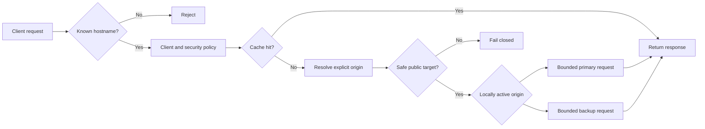

# Proxy and origins

| Concern | Implemented contract |
| --- | --- |
| Eligible records | Proxied A, AAAA, and CNAME only |
| Origin cardinality | One primary and at most one active-passive backup per hostname |
| Runtime | Shared data-driven OpenResty cell |
| Safety | Revalidate resolution before connection |
| Failure | Last-valid edge revision remains active |

::: warning Private origins are not implemented
Do not weaken safety checks to reach RFC1918, loopback, link-local, metadata,
platform-service, or proxy-loop destinations.
:::

A proxied hostname uses one DNS record, one required primary origin, and at
most one optional backup. Only `A`, `AAAA`, and `CNAME` records can use
`proxied` mode. Their DNS `content` becomes platform-managed; do not treat it
as an origin.

## Origin fields

| Field | Behaviour |
| --- | --- |
| `host` | DNS hostname or IP address, maximum 253 characters |
| `scheme` | `http` or `https` |
| `port` | Derived as 80 for HTTP or 443 for HTTPS |
| `host_header` | Required upstream `Host`, maximum 253 characters |
| `sni` | Required for verified HTTPS, maximum 253 characters |
| `verify_tls` | Verify the origin certificate when HTTPS |
| `connect_timeout_ms` | 100–10,000 ms |
| `response_timeout_ms` | 500–60,000 ms |
| `retry_count` | 0–2 |
| `websocket` | Permit WebSocket upgrade |
| `health_check` | Optional path and 60–86,400 second interval |
| `backup` | Optional origin with the same destination, TLS, header, and timeout validation |
| `failover.failure_threshold` | 1–20 consecutive primary failures |
| `failover.recovery_threshold` | 1–20 consecutive primary recovery successes |
| `failover.hold_down_seconds` | 5–3,600 seconds |
| `failover.failback_delay_seconds` | 5–86,400 seconds |

The control plane resolves and validates the destination before saving. The edge
agent resolves and validates again immediately before an origin test or runtime
connection.

## Active-passive failover

Failover is local to each OpenResty cell and never calls Laravel in the request
path. A cell normally selects primary. Consecutive connection, timeout, or 5xx
evidence activates backup after `failure_threshold`. The cell keeps backup
active for the greater of hold-down and failback delay, then requires
`recovery_threshold` successful primary requests before returning to primary.
This deliberately permits cells to transition at slightly different times
according to their own bounded evidence.

`X-CDNFoundry-Origin` reports `primary` or `backup`.
`X-CDNFoundry-Origin-Transition` reports `none`,
`primary_failure_threshold`, `backup_failure`, or
`primary_recovery_threshold`. The authenticated cell status response also
lists active role, reason, and failback time without destination secrets.
Vector stores the role and reason with request events.

When both origins fail, the configured cache stale window applies before a
bounded upstream failure is returned. Cache-only, stale-only, and maintenance
policies retain their existing precedence. Failover never creates a weighted,
percentage, geographic, or arbitrary origin pool.

## Destination safety

Non-bypassable policy rejects unspecified, loopback, link-local, multicast,
metadata, reserved, platform-listener, edge-service, and proxy-loop addresses
for IPv4 and IPv6. Private destinations are rejected unless they fall inside a
narrow `origin_safety.private_origin_allowlist`. Additional networks and
individual addresses can be blocked through platform settings.

The private allowlist cannot permit a built-in unsafe range.

## Proxy defaults

Domain proxy settings include enablement, HTTPS redirect, HTTP versions
(`1.1`, `2`), retry count, and optional maintenance response. Platform
`proxy_defaults` are copied when a domain has no explicit value. Runtime
settings are revisioned and delivered as signed artifacts.

## Origin tests

`POST .../origin/test` is rate limited and asynchronous. Set `origin_role` to
`primary` (the default) or `backup`. A runtime task resolves the selected
destination, connects with bounded timeouts, does not follow redirects, and
records status, address, latency, HTTP status, or a stable failure reason.
Scheduled health checks run only when explicitly enabled and are dispatched in
batches of at most 100 per minute.

## Forwarding and cache

OpenResty strips hop-by-hop input, controls `Host`, SNI, and forwarded headers,
and uses bounded request buffering, response buffering, temporary storage, and
origin connection accounting. See [Cache and purge](cache.md) for admission
and stale behaviour.

## Deployment and rollback

Every origin or proxy change increments the domain revision and queues an edge
reconcile operation. Inspect `/deployment` and `/revisions`. Rollback selects a
retained validated revision and creates a new monotonic revision.
