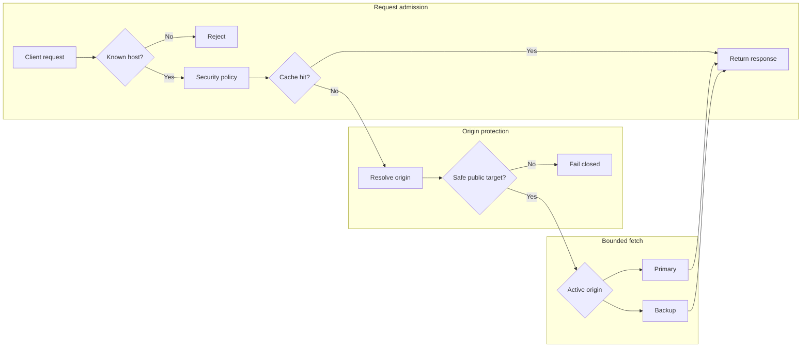

# Proxy and origins

| Concern | Implemented contract |
| --- | --- |
| Eligible records | Proxied A, AAAA, and CNAME only |
| Origin cardinality | One primary and at most one active-passive backup per hostname |
| Runtime | Shared data-driven OpenResty cell |
| Safety | Revalidate resolution before connection |
| Failure | Last-valid edge revision remains active |

::: warning Private origins are not implemented
Do not weaken safety checks to reach RFC1918, loopback, link-local, metadata,
platform-service, or proxy-loop destinations.
:::

A proxied hostname uses one DNS record, one required primary origin, and at
most one optional backup. Only `A`, `AAAA`, and `CNAME` records can use
`proxied` mode. Their DNS `content` becomes platform-managed; do not treat it
as an origin.

## Origin fields

| Field | Behaviour |
| --- | --- |
| `host` | DNS hostname or IP address, maximum 253 characters |
| `scheme` | `http` or `https` |
| `port` | Derived as 80 for HTTP or 443 for HTTPS |
| `host_header` | Required upstream `Host`, maximum 253 characters |
| `sni` | Required for verified HTTPS, maximum 253 characters |
| `verify_tls` | Verify the origin certificate when HTTPS |
| `connect_timeout_ms` | 100–10,000 ms |
| `response_timeout_ms` | 500–60,000 ms |
| `retry_count` | 0–2 |
| `websocket` | Permit WebSocket upgrade |
| `health_check` | Optional path and 60–86,400 second interval |
| `backup` | Optional origin with the same destination, TLS, header, and timeout validation |
| `failover.failure_threshold` | 1–20 consecutive primary failures |
| `failover.recovery_threshold` | 1–20 consecutive primary recovery successes |
| `failover.hold_down_seconds` | 5–3,600 seconds |
| `failover.failback_delay_seconds` | 5–86,400 seconds |

The control plane resolves and validates the destination before saving. OpenResty
revalidates destinations for customer traffic. Before an origin probe connects,
the agent resolves the hostname again, validates every answer, and requires each
to belong to that operation's approved address set. Mixed safe/unsafe answers,
new unapproved answers, and failed resolution stop the probe. Request a fresh
test after DNS changes so the control plane can apply its current platform and
edge-address exclusions. Literal IP origins are checked without a DNS query.

For customer traffic, OpenResty checks the complete A and AAAA answer sets
before choosing an address. A successful empty answer for one family is valid;
a resolver error, unsafe address or incomplete resolution fails the origin
attempt. The combined answer sections may contain at most 64 records, including
CNAME records. The whole DNS lookup, including retries and TCP fallback, has a
three-second ceiling, reduced to the configured origin response timeout when
that timeout is smaller. This is a DNS budget; upstream connection and response
limits still apply separately. Each uncached origin attempt resolves again,
including when a keepalive connection exists. The configured bounded stale-cache
policy may serve a cached response after an origin failure.

The origin connection limit applies to in-flight attempts in each domain and
selected origin role within a cell, including DNS lookup time. Capacity
rejections return 503 and do not count as origin failures or trigger failover.
Rejected requests leave occupied slots intact; an admitted attempt releases
its reservation when it finishes.

## Active-passive failover

Failover is local to each OpenResty cell and never calls Laravel in the request
path. A cell normally selects primary. Consecutive DNS, connection, timeout, or 5xx
evidence activates backup after `failure_threshold`. The cell keeps backup
active for the greater of hold-down and failback delay, then requires
`recovery_threshold` successful primary requests before returning to primary.
This deliberately permits cells to transition at slightly different times
according to their own bounded evidence.

Retries use one budget per origin request: at most two additional attempts,
further reduced by the security retry limit or emergency retry disablement.
The budget is never renewed after a failed attempt. Passive health and failover
use the final upstream response; a successful retry does not record an origin
failure. Exhausting retries records one failed request. The existing Nginx
restriction on replaying a POST already sent to an origin remains in effect.

`X-CDNFoundry-Origin` reports `primary` or `backup`.
`X-CDNFoundry-Origin-Transition` reports `none`,
`primary_failure_threshold`, `backup_failure`, or
`primary_recovery_threshold`. The authenticated cell status response also
lists active role, reason, and failback time without destination secrets.
Vector stores the role and reason with request events.

When both origins fail, the configured cache stale window applies before a
bounded upstream failure is returned. Cache-only, stale-only, and maintenance
policies retain their existing precedence. Failover never creates a weighted,
percentage, geographic, or arbitrary origin pool.

## Destination safety

Non-bypassable policy rejects unspecified, loopback, link-local, multicast,
metadata, reserved, platform-listener, edge-service, and proxy-loop addresses
for IPv4 and IPv6. Private destinations are rejected unless they fall inside a
narrow `origin_safety.private_origin_allowlist`. Additional networks and
individual addresses can be blocked through platform settings.

The private allowlist never overrides an explicit blocked network or address.
Address exclusions compare IPv6 values regardless of compressed or expanded
spelling. IPv4-mapped IPv6 origins are rejected, including expanded spellings;
use a permitted native IPv4 address instead. The edge applies these checks to
parsed IP values before choosing a peer. Native IPv6 origins support HTTP and
verified HTTPS; TLS SNI remains a DNS hostname. The shared-address range
`100.64.0.0/10` needs an explicit private-origin allowlist entry, just like other
supported private destinations.

## Proxy defaults

Domain proxy settings include enablement, HTTPS redirect, HTTP versions
(`1.1`, `2`), retry count, and optional maintenance response. Platform
`proxy_defaults` are copied when a domain has no explicit value. Runtime
settings are revisioned and delivered as signed artifacts.

## Origin tests

`POST .../origin/test` is rate limited and asynchronous. Set `origin_role` to
`primary` (the default) or `backup`. A runtime task connects to the approved
address with bounded timeouts, does not follow redirects, and
records status, address, latency, HTTP status, or a stable failure reason.
Scheduled health checks run only when explicitly enabled and are dispatched in
batches of at most 100 per minute.

Tests require an active domain with verified nameservers and current update
permission. API and **Test origin** / **Test backup** panel actions use the same
checks. Pending, disabled, and deprovisioning domains cannot start probes.
Each operation binds the selected origin configuration and fixes at most 20
edge recipients. Dispatch and task delivery recheck permission, lifecycle, and
configuration; obsolete pending tasks are cancelled. Retries preserve recipients
and progress. Origin edits clear old health, and late results for a changed
origin remain operation history without replacing current health.

A probe admits at most 64 approved addresses and 64 fresh DNS answers, connects
to one approved current address, and caps response headers at 64 KiB. DNS is
bounded by the configured connection timeout and at most three seconds; the
configured response timeout covers the complete DNS/HTTP/TLS operation. It
never follows redirects. Successful HTTPS reports `tls_result=verified` only
when certificate verification is enabled; otherwise it reports `unverified`.
Existing tasks remain readable, but old agent builds retain their old probe
behavior until upgraded. These probe checks do not qualify public IPv6 paths
or replace customer-traffic runtime qualification.

## Forwarding and cache

OpenResty strips hop-by-hop input, controls `Host`, SNI, and forwarded headers,
and uses bounded request buffering, response buffering, temporary storage, and
origin connection accounting. See [Cache and purge](cache.md) for admission
and stale behaviour.

## Deployment and rollback

Every origin or proxy change increments the domain revision and queues an edge
reconcile operation. Inspect `/deployment` and `/revisions`. Rollback selects a
retained validated revision and creates a new monotonic revision.
