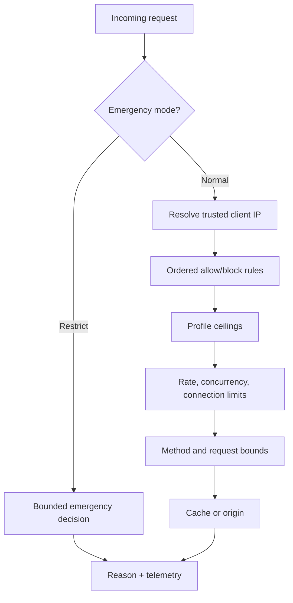

# Security and DDoS readiness

| Layer | Purpose |
| --- | --- |
| Trusted-client parsing | Trust forwarded addresses only from configured proxies |
| Ordered rules | Deterministic IP/CIDR/country/continent allow or block |
| Profiles | Fixed presets or bounded manual values |
| Readiness | Remove stale, drained, failed, or overloaded targets |
| Emergency controls | Persisted, audited, expiring actions |

::: warning Not volumetric scrubbing
Upstream transit controls and provider scrubbing remain necessary for attacks
that saturate a host or uplink.
:::

CDNFoundry provides bounded application-layer controls. It does not claim to
absorb volumetric traffic after a host or uplink is saturated.

## Ordered rules

Each domain may have up to 1,000 rules. A bulk import accepts at most 500.
Rules match `ip`, `cidr`, `country`, or `continent`, and take `allow` or `block`
action. Lower numeric priority runs first; ID breaks ties. Disabled rules are
ignored. An allow match terminates evaluation and therefore overrides later
rules, not earlier ones.

Imports normalize every rule, reject duplicates, and can append or replace the
existing set in one revision.

## Profiles

`standard`, `protected`, and `quarantine` provide immutable platform ceilings
for request rate/burst, client and domain connections, TLS handshakes, body and
header size, timeouts, keepalive, request duration, origin concurrency and
retries, cache key length, and cache admission. `manual` permits values up to
the standard ceiling; it cannot exceed platform capacity policy.

The exact ceilings appear in [Limits](/reference/limits).

## Readiness states

Domain security state is `normal`, `suspected`, `restricted`, `quarantined`, or
`recovering`. Agent heartbeats carry a bounded set of noisy-domain summaries and
reason codes. Automatic policy can restrict or quarantine, while scheduled
reconciliation expires controls and advances quiet recovery.

Target-first quarantine uses the normal placement protocol: deliver to the
quarantine pool, publish its addresses, then drain the shared source.

## Emergency controls

Administrators can apply expiring or explicitly permanent controls to an edge,
cell, domain, or pool. Supported actions are:

- reject unknown hosts;
- disable request bodies;
- allow only GET and HEAD;
- reduce keepalive;
- reduce origin concurrency;
- disable origin retries;
- serve cache only;
- serve stale only;
- return a maintenance response;
- quarantine a domain;
- withdraw a service IP from DNS.

Controls are persisted in PostgreSQL, delivered as durable edge tasks, stored by
the agent, and enforced in OpenResty shared state. Clearing a control uses a
separate idempotent task.

Pool withdrawal removes its addresses through DNS reconciliation. It is an
emergency tool, not an alternative to safe placement.
