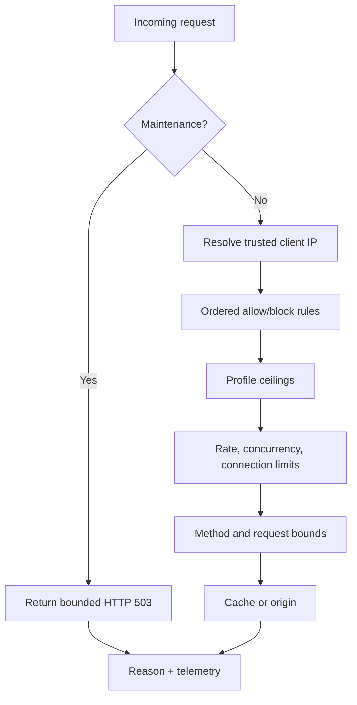

# Security and DDoS readiness

| Layer | Purpose |
| --- | --- |
| Trusted-client parsing | Trust forwarded addresses only from configured proxies |
| Ordered rules | Deterministic IP/CIDR/country/continent allow or block |
| Profiles | Fixed presets or bounded manual values |
| Readiness | Remove stale, drained, failed, or overloaded targets |
| Incident controls | Explicit domain, pool, cell, and edge actions |

::: warning Not volumetric scrubbing
Upstream transit controls and provider scrubbing remain necessary for attacks
that saturate a host or uplink.
:::

CDNFoundry provides bounded application-layer controls. It does not claim to
absorb volumetric traffic after a host or uplink is saturated.

## Ordered rules

Each domain may have up to 1,000 rules. A bulk import accepts at most 500.
Rules match `ip`, `cidr`, `country`, or `continent`, and take `allow` or `block`
action. Lower numeric priority runs first; ID breaks ties. Disabled rules are
ignored. An allow match terminates evaluation and therefore overrides later
rules, not earlier ones.

Imports normalize every rule, reject duplicates, and can append or replace the
existing set in one revision.

## Profiles

`standard`, `protected`, and `quarantine` provide immutable platform ceilings
for request rate/burst, client and domain connections, TLS handshakes, body and
header size, timeouts, keepalive, request duration, origin concurrency and
retries, cache key length, and cache admission. `manual` permits values up to
the standard ceiling; it cannot exceed platform capacity policy.

The exact ceilings appear in [Limits](../reference/limits.md).

## Readiness states

Domain security state is `normal`, `suspected`, `restricted`, `quarantined`, or
`recovering`. Agent heartbeats carry a bounded set of noisy-domain summaries and
reason codes. Automatic policy can restrict or quarantine, while scheduled
reconciliation expires controls and advances quiet recovery.

Target-first quarantine uses the normal placement protocol: deliver to the
quarantine pool, publish its addresses, then drain the shared source.

## Simple incident controls

There is no generic emergency-action picker. Each scope has only controls with
clear runtime behavior:

| Scope | Control | Effect |
| --- | --- | --- |
| Domain | Protect | Applies stricter bounded security state without moving the domain |
| Domain | Quarantine | Deploys the domain target-first to the quarantine pool |
| Domain | Start maintenance | Returns the configured HTTP 503 only for that domain |
| Edge | Drain | Stops new placement/traffic eligibility for that edge |
| Cell | Drain / Restart | Removes one cell from readiness or restarts that cell |
| Pool | Maintenance | Returns HTTP 503 from cells assigned to that pool until its required expiry |
| Pool | Withdraw | Removes that pool from gateway/DNS publication; it does not control BGP |

Use **Return to normal**, **End maintenance**, **Undrain**, **Restore**, or the
matching inverse action to recover. Pool maintenance is persisted in
PostgreSQL, delivered as durable per-edge tasks only to assigned cells, audited,
and automatically expires. Domain maintenance is part of the normal signed
domain revision and therefore retains the previous valid edge snapshot on a
failed deployment.

`quarantine_domain` was formerly exposed as a pool/edge flag but had no domain
identity and could not perform a placement change. It is no longer selectable.
Quarantine is now only the explicit domain action above.
