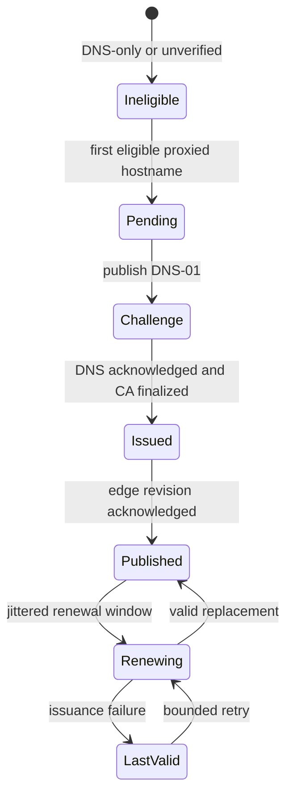

# TLS certificates

| Mode | Private-key owner | Validation |
| --- | --- | --- |
| Managed | Control plane, encrypted | ACME DNS-01 after an eligible proxied hostname |
| Custom | Uploaded then encrypted | Key match, chain, names, expiry, and size |
| Disabled | No domain certificate | Explicit policy |

::: danger Private-key handling
Never log or expose certificate keys. Recovery needs the original application
encryption key and externally retained TLS material.
:::

A domain TLS mode is `managed`, `custom`, or `disabled`.

## Managed certificates

Managed issuance requires all of the following:

- lifecycle state `active`;
- verified nameservers;
- at least one proxied hostname;
- ACME enabled and configured;
- healthy authoritative DNS reconciliation.

DNS-only and unverified domains do not create ACME orders.

The certificate-name compiler creates bounded name sets. The usual set includes
the apex and wildcard; deep hostnames that a wildcard cannot cover use a
supplemental order. A valid existing certificate is reused where it covers the
required names.

Managed planning reads the current domain under its database lock. Reusing a
certificate cannot overwrite a newer custom-certificate selection, and
activation advances from the latest desired revision. Certificate activation,
orders and their operation records commit together; queued issuance and edge
reconciliation are released after commit. A failed write rolls back the plan
so the job can retry without leaving a partial activation.

The workflow writes DNS-01 challenges as desired TXT state, waits for every
required DNS acknowledgement, validates with the ACME server, stores the
encrypted private key and certificate, publishes a new edge revision, and
cleans challenge records. New orders are globally bounded per hour and initial
work is jittered.

Hourly maintenance renews certificates inside `ACME_RENEW_BEFORE_DAYS`, retries
eligible orders, removes expired challenge state, and creates deduplicated
administrator alerts for failures or impending expiry.

## Manual managed actions

- **Renew** creates work only when renewal is due.
- **Reissue** forces a new managed order.
- `GET .../tls/status` includes the latest order without private material.

Both actions return `202` and an operation UUID.

## Custom certificates

Upload a leaf certificate, issuing chain, and private key in PEM. Bounds are
16 KiB for leaf and key and 64 KiB for chain. Validation confirms:

- the key matches the leaf;
- accepted key algorithm and size;
- an ordered chain of at most ten issuing/root certificates ends at its
  self-signed root and verifies for TLS server authentication;
- CA constraints, signing key usage, path length, server purpose, name
  constraints and critical extensions permit the leaf;
- chain keys and non-root signatures satisfy OpenSSL authentication level 2
  (at least 112-bit security), rejecting 1024-bit RSA and SHA-1 leaf/issuer
  signatures; root self-signatures do not establish trust;
- the leaf, issuers and root are currently valid;
- names cover every required proxied hostname.

Private keys are encrypted before persistence and never returned. The response
contains only metadata and fingerprint. Removing the active custom certificate
returns the domain to managed mode and queues managed issuance.

Only normalized public certificate blocks are stored in the issuing-chain
field. Extra export text or private-key blocks in that field are discarded;
paste the private key only into **Private key PEM**. Re-uploading the same leaf
updates its validated chain without changing the certificate ID and queues a
new domain revision. A rejected upload changes neither the active certificate
nor the domain revision or edge artifact.
If another request changes the domain during certificate validation, the API
returns `409` with code `conflict`; the panel shows a validation error on
**Leaf certificate PEM**. Reload current domain state and retry with a bundle
covering its current proxied hostnames. The conflicting upload leaves the
active certificate and other request's committed revision intact.

The supplied root is the explicit trust anchor for validation, so a valid
private CA is supported. This does not install that CA into visitors' trust
stores or prove public-browser trust. Supply the appropriate chain for your
clients. Validation performs no remote CA or revocation lookup.
The control-plane image includes the pinned OpenSSL command-line verifier.
It checks public certificate PEM locally with a five-second timeout; private
keys never enter its input or command arguments. Custom non-container PHP
test environments also need the OpenSSL 3 command available on `PATH`.

When upgrading from an earlier validator, review existing custom bundles in a
restricted environment without printing their contents. Re-upload a complete,
currently valid bundle to replace legacy chain text, including when retaining
the same leaf. If a private key was pasted into the old chain field, treat its
unencrypted database and backup copies as exposed material: issue a replacement
key/certificate and revoke the old certificate through its issuer. Preserve
required backups under restricted access; this update does not erase historical
rows, snapshots or backups. Existing invalid chains require a valid replacement;
the update does not silently deactivate currently serving certificates.

## Failure behaviour

An ACME failure records the order error, cleans unusable challenge state, and
preserves any valid active certificate and edge artifact. Do not delete a valid
certificate to force recovery. Repair DNS, CA access, clock, or configuration,
then renew or reissue.

See [Certificates](../deployment/certificates.md) for internal service PKI, which is
separate from customer TLS.
