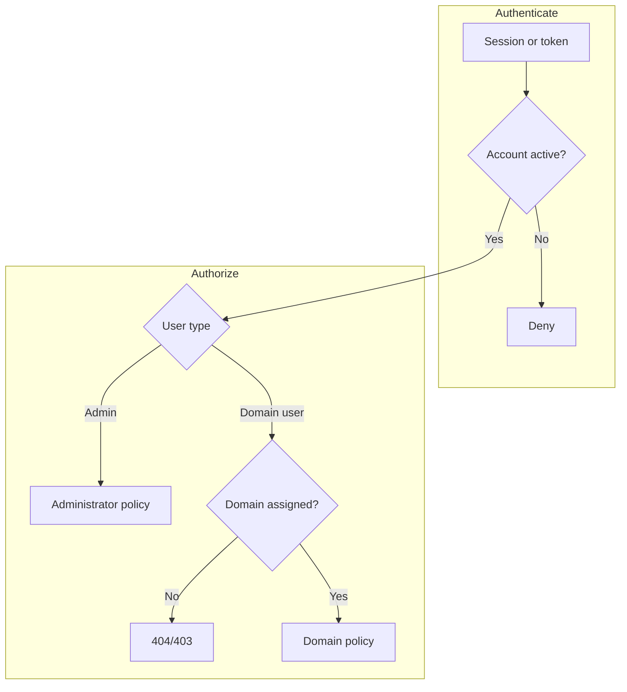

# Users and access

| Concern | Implemented boundary |
| --- | --- |
| Human identity | `users.type` is `admin` or `user` |
| Browser authentication | Panel session with active-user enforcement |
| API authentication | Hashed Sanctum bearer tokens shown once |
| Tenant scope | Explicit `domain_user` assignments plus scoped route binding |
| Machine identity | Separate edge mTLS enrollment, never a human token |



::: warning One-time secrets
Passwords, new Sanctum tokens, and edge bootstrap tokens are not recoverable
status fields. Capture them only at their intended one-time boundary.
:::

CDNFoundry has two user types: `admin` and `user`. It does not implement custom
roles or per-feature permission matrices.

## Administrators

Administrators can access `/admin`, all administrator API routes, Horizon,
system settings, DNS clusters, edges, pools, operations, backups, telemetry,
audit logs, and every domain. An administrator cannot disable, demote, or delete
their own account.

Create the first administrator with `cdnf:admin:create`. Later administrators
and users can be created under **Customers → Users** or through
`POST /api/admin/users`.

## Domain users

Domain users access `/app` and only domains in the assignment pivot table. They
can create domains and manage assigned domains according to `DomainPolicy`.
Administrators attach and detach users from the domain view or
`/api/admin/domains/{domain}/users`.

A user with domain assignments or active API tokens cannot be permanently
deleted. Remove assignments and revoke tokens first.

## Disabled accounts

Disabling an account sets `disabled_at`, revokes all Sanctum tokens, blocks new
login, and rejects later session/API requests through `account.active`.
Re-enabling does not recreate tokens.

## Profiles and passwords

Both panels expose the shared profile page. API equivalents are:

- `GET /api/me`
- `PATCH /api/me`
- `PUT /api/me/password`

Password change requires the current password and confirmation, revokes other
tokens, and writes an audit event.

## API tokens

The shared **API tokens** page and `/api/me/tokens` API list cursor-paginated
metadata. A new plaintext token is shown once; only its hash and final six
characters are retained. Send it as:

```http
Authorization: Bearer TOKEN
Accept: application/json
```

Never put a token in a URL, commit, screenshot, or shared log.
