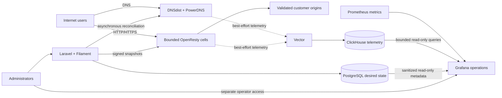

CDNFoundry is a small, production-oriented private CDN. A Laravel and Filament
control plane owns desired state in PostgreSQL; DNS and HTTP traffic remain on
PowerDNS, DNSdist, and bounded OpenResty cells. External changes run
asynchronously through revisioned reconciliation, and invalid candidates never
replace the last valid runtime state.

Grafana is a read-only operations component in the telemetry role. It has no
request-path or reconciliation responsibility: an observability outage cannot
change desired state or stop DNS and HTTP serving.

::: info Designed for private operators and ISPs
CDNFoundry is intended for organizations that operate their own authoritative
DNS and edge capacity. It favors predictable failure, bounded resources, and
operational clarity over a hyperscale public-cloud feature surface.
:::

Start with [the product overview](getting-started/index.md), or choose a destination
from the audience cards above. The [documentation audit](contributing/documentation-audit.md)
records how this site was reconstructed from the implementation and what remains
outside the verified product boundary.
