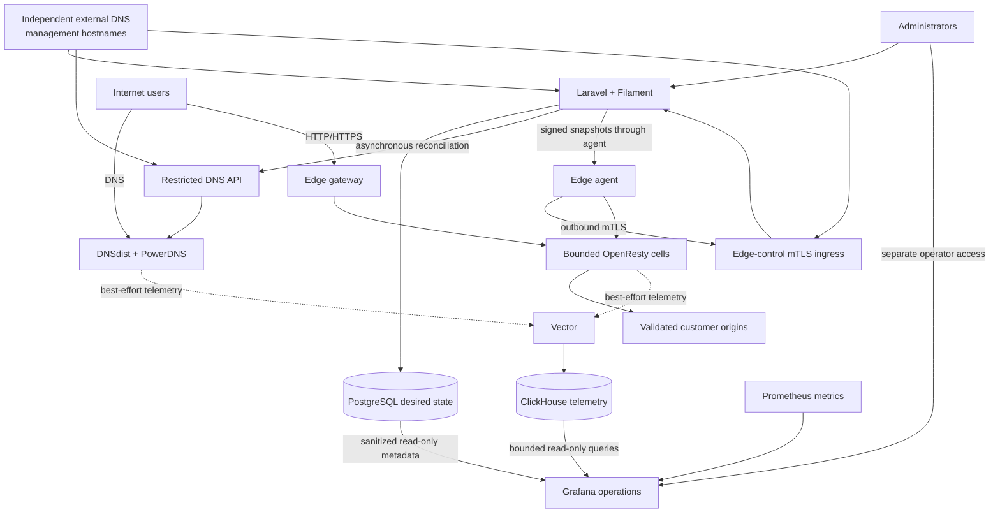

CDNFoundry is a small, production-oriented private CDN. A Laravel and Filament
control plane owns desired state in PostgreSQL; DNS and HTTP traffic remain on
PowerDNS, DNSdist, and bounded OpenResty cells. External changes run
asynchronously through revisioned reconciliation, and invalid candidates never
replace the last valid runtime state.

## What CDNFoundry includes

| Capability | What the stack provides |
| --- | --- |
| Control plane | Laravel modular monolith, Filament administrator and domain-user panels, Sanctum API, policies, audit history, idempotent operations, Horizon, and Scheduler |
| Authoritative DNS | Public DNSdist in front of private PowerDNS, DNS-only and proxied records, Geo-DNS, revisioned reconciliation, cluster health, and UDP/TCP serving |
| Edge delivery | Stable placement across bounded OpenResty cells, explicit origins, host and SNI routing, shared and quarantine pools, draining, and last-valid snapshots |
| TLS | Managed DNS-01 certificates, encrypted private keys, custom certificate upload, renewal scheduling, and per-host certificate selection |
| Cache and performance | Deterministic cache keys, bounded admission and storage, stale serving, URL purge, epoch-based full purge, Gzip, Brotli, and origin failover |
| Security | Tenant policies, origin destination validation, trusted-client-IP handling, rate controls, managed WAF rules, quarantine, and bounded runtime resources |
| Analytics and operations | Vector pipelines, ClickHouse telemetry, Prometheus metrics, Grafana dashboards, operational logs, health checks, backups, upgrades, and recovery workflows |

## How the stack is separated

The serving path does not depend on Laravel. DNS queries terminate at DNSdist
and PowerDNS; HTTP and HTTPS terminate at the edge gateway and OpenResty cells.
The control plane commits desired state, queues bounded external work, and
delivers revisioned runtime artifacts asynchronously. PostgreSQL is the durable
source of truth, while PowerDNS data, edge snapshots, artifacts, and telemetry
aggregates are rebuildable runtime state.

## Production deployment model

CDNFoundry deploys with immutable container images and generated, role-filtered
Docker Compose bundles. The smallest documented production fleet uses one
control node and two combined DNS/edge nodes in separate failure domains. Larger
fleets can separate control, DNS, edge, and monitoring roles across regions
without introducing a second application backend or a per-domain runtime.

- Start with the [production reference architectures](architecture/production-reference-architectures.md) to choose role placement and failure domains.
- Follow the [production quick start](deployment/production-quick-start.md) for a dependency-ordered first installation.
- Use the [feature guides](guides/index.md) for domains, DNS, origins, TLS, cache, security, and analytics.
- Keep the [operations runbooks](operations/runbooks.md) available for diagnosis, rollback, backup, and recovery.

## Who it is for

CDNFoundry is designed for companies, hosting providers, and ISPs that operate
their own authoritative DNS and edge capacity. It favors predictable failure,
bounded resource use, explicit infrastructure ownership, and a small operational
surface. It is not a hosted CDN service and does not claim upstream volumetric
DDoS protection when network capacity is saturated.

Grafana is a read-only operations component in the telemetry role. It has no
request-path or reconciliation responsibility: an observability outage cannot
change desired state or stop DNS and HTTP serving.

Start with [the product overview](getting-started/index.md), or choose a destination
from the audience cards above. The [documentation audit](contributing/documentation-audit.md)
records how this site was reconstructed from the implementation and what remains
outside the verified product boundary.
