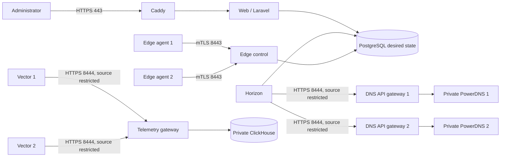
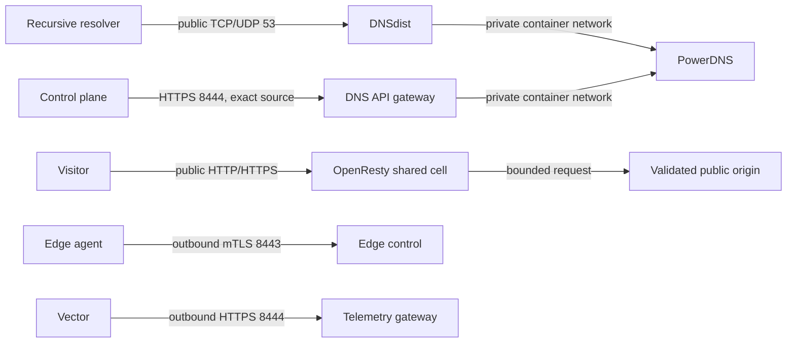
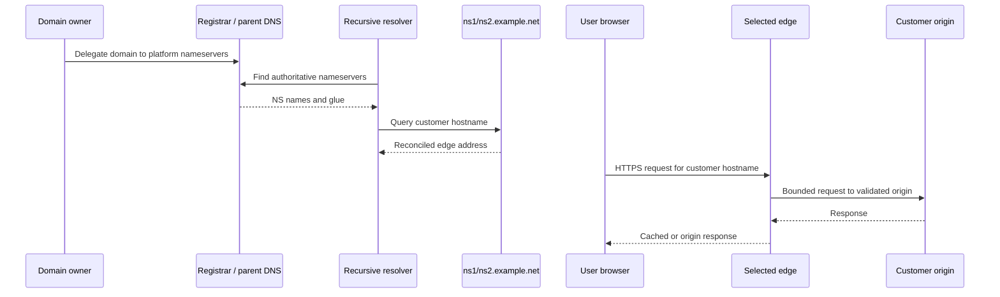

# Production quick start

This guide brings up a minimum production CDNFoundry fleet:

- one control host running the panel, workers, PostgreSQL, Valkey, ClickHouse,
  and the public control/telemetry gateways;
- two combined DNS/edge hosts;
- IPv4 is required and IPv6 is optional;
- each host has one public IP. The administrator connects to the control
  host's same public address; there is no separate `ADMIN_PUBLIC_IPV4`.

This is a starting topology, not a two-edge limit. The same role-based
deployment files support more combined nodes and separate DNS, edge,
telemetry, control, and worker hosts. The expansion procedure later in this
guide covers the repeatable path; [Production scaling](production-scaling.md)
covers larger layouts and capacity gates.

The three initial hosts are:

| Label | Role | Minimum public listeners |
|---|---|---|
| `CONTROL` | Laravel, Horizon, Scheduler, PostgreSQL, Valkey, ClickHouse, Caddy | public `80`, `443`, `443/udp`; edge-restricted `8443`, `8444` |
| `EDGE_1` | DNSdist, PowerDNS, OpenResty, edge agent, Vector | public `53/tcp`, `53/udp`, `80`, `443`; control-restricted `8444` |
| `EDGE_2` | Same as edge 1, preferably in another provider or failure domain | same as edge 1 |

Two DNS/edge hosts are the minimum because a delegated zone needs redundant
authoritative service and one host failure must not remove all DNS and CDN
traffic. Keeping the controller separate ensures customer DNS and HTTP
requests never pass through Laravel. This layout does not provide control-plane
high availability: off-host backup and tested recovery remain necessary.

The examples use these replaceable values:

| Purpose | Example |
|---|---|
| Operator-owned DNS zone | `ops.example.com` |
| CDN platform zone | `example.net` |
| Control IPv4 | `198.51.100.10` |
| Edge 1 IPv4 | `198.51.100.20` |
| Edge 2 IPv4 | `198.51.100.30` |

Names under `ops.example.com` are infrastructure endpoints managed at an
independent DNS provider. CDNFoundry manages `example.net`. Therefore the
nameservers are `ns1.example.net` and `ns2.example.net`—not
`ns1.cdn.example.net`.

The IP addresses in this guide are documentation ranges and do not work on the
public Internet. Replace every one before running commands.

## Before you start

Provide three fresh Ubuntu 24.04 LTS hosts, exact public IPv4 addresses, an
email address for ACME, an encrypted off-host Restic repository, and an exact
published CDNFoundry release tag or 40-character commit SHA. Install Docker
Engine and the Docker Compose plugin from Docker's official repository.

IPv6 is not needed. If a host has IPv6, add it only for that host as described
in [Optional IPv6](#optional-ipv6).

For an initial low-traffic deployment, a practical starting point is:

| Host | Starting capacity |
|---|---|
| Control | 4 vCPU, 8 GiB RAM, 100 GiB SSD |
| Each DNS/edge | 4 vCPU, 6 GiB RAM, 50 GiB SSD |

These are not capacity guarantees. Measure bandwidth, request concurrency,
cache churn, DNS query rate, ClickHouse retention, disk latency, and container
limits before resizing.

## Why two DNS domains are used

Keep infrastructure access and the CDN platform identity separate:

1. `ops.example.com` remains at an independent DNS provider. The operator
   manually owns `control`, `edge-control`, `telemetry`, and `dns-api-*`
   records. CDNFoundry never reconciles this zone.
2. `example.net` is the CDNFoundry-managed platform zone. It contains
   `ns1.example.net`, `ns2.example.net`, `proxy.example.net`, and other derived
   service records.

Reusing the managed platform domain for the control panel or edge-control
endpoint creates a bootstrap loop: when platform DNS is unhealthy, operators
could lose the names needed to repair it. Customer domains are added only
after this bootstrap and delegate to the platform nameservers.

## How the topology works

### Control-plane view



PostgreSQL owns desired state. Horizon performs external work asynchronously
through the protected DNS API gateways. Runtime changes are revisioned,
idempotent, and validated before activation. Edge agents fetch signed runtime
snapshots over mTLS and retain the previous valid snapshot when a deployment
fails or the controller is unavailable. Vector sends telemetry directly to
ClickHouse through Caddy; telemetry failure must never stop serving traffic.

### DNS/edge-host view



DNSdist is the only public authoritative DNS endpoint. PowerDNS and its native
API remain private. OpenResty serves customer traffic without consulting
Laravel and selects configuration and certificates from the last validated
runtime snapshot. One shared, data-driven runtime serves assigned domains; the
system does not create a process, container, timer, or Nginx configuration per
domain.

### Customer request view



The operator reaches `control.ops.example.com` through independently managed
DNS. Customer DNS goes directly to DNSdist and customer HTTP goes directly to
OpenResty; neither data path traverses the control plane.

## 1. Create bootstrap DNS

**Why:** Caddy needs working public DNS for ACME, agents need a stable
edge-control name, Horizon needs hostname-verified DNS API endpoints, and the
registrar needs glue before it can delegate the platform zone.

At the current authoritative provider for `ops.example.com`, create:

| Record | Value |
|---|---|
| `control.ops.example.com` A | control IPv4 |
| `edge-control.ops.example.com` A | control IPv4 |
| `telemetry.ops.example.com` A | control IPv4 |
| `dns-api-1.ops.example.com` A | edge 1 IPv4 |
| `dns-api-2.ops.example.com` A | edge 2 IPv4 |

Add AAAA records only for hosts that actually have IPv6.

At the registrar for `example.net`, register the following child nameservers
and glue:

| Child nameserver | Glue |
|---|---|
| `ns1.example.net` | edge 1 IPv4, plus its optional IPv6 |
| `ns2.example.net` | edge 2 IPv4, plus its optional IPv6 |

Do not change the `example.net` delegation yet. Both authoritative endpoints
must be running and healthy first.

## 2. Install the same release on every host

Run on the control host and both edge hosts. Replace the release example with
an existing immutable release.

**Why:** every host must render compatible artifacts and use the same tested
schema/runtime contract. An exact tag or commit prevents one node from
silently pulling a different mutable image.

```sh
sudo apt-get update
sudo DEBIAN_FRONTEND=noninteractive apt-get install -y ca-certificates curl git openssl
docker version
docker compose version

export CDNF_RELEASE=v1.4.0
sudo install -d -m 0755 /opt/cdnfoundry
sudo git clone --branch "${CDNF_RELEASE}" --depth 1 \
  https://github.com/vaheed/CDNFoundry.git /opt/cdnfoundry
sudo chown -R "$(id -u):$(id -g)" /opt/cdnfoundry
cd /opt/cdnfoundry
```

If the GHCR packages are private, run `docker login ghcr.io` with a read-only
package token on each host.

## 3. Generate `.env.prod`

**Why:** each host needs complete role-aware configuration and unique secrets.
The generator avoids missed placeholders, accidental secret reuse, permissive
file modes, and shell-history exposure.

Do not copy and manually fill the template. The generator asks only for
deployment-specific input, creates all other passwords and signing values with
OpenSSL, writes mode `0600`, and refuses to overwrite an existing file.

Make the script executable after upgrading from a revision that predates it:

```sh
cd /opt/cdnfoundry
chmod +x scripts/generate-production-env.sh
./scripts/generate-production-env.sh
```

On the control host choose role `control`, operator domain `ops.example.com`,
platform domain `example.net`, and enter both edge IPv4 addresses when asked
for the edge allow-list.

On each edge choose role `dns-edge`. Use `dns-api-1` on edge 1 and
`dns-api-2` on edge 2. The generator asks for the control host's
`CLICKHOUSE_PASSWORD` so Vector can authenticate to telemetry. Read it on the
control host without printing the rest of the environment:

```sh
sudo sed -n 's/^CLICKHOUSE_PASSWORD=//p' /opt/cdnfoundry/.env.prod
```

Transfer that one value through the same protected administrative channel used
for certificates. Never copy the control host's entire `.env.prod` to an edge.
Each edge receives its own generated PowerDNS database password, API key, and
edge status token.

To generate at another protected path:

```sh
./scripts/generate-production-env.sh --output /tmp/edge-1.env
```

Move the result to `/opt/cdnfoundry/.env.prod` on its intended host and retain
mode `0600`. Store the control `APP_KEY`, artifact signing key, Restic
password, and database credentials in the encrypted backup/secret system.

## 4. Generate and distribute private certificates

**Why:** public ACME certificates protect the browser-facing panel, while this
private PKI authenticates edge agents and hostname-verifies internal gateways.
The identity CA private key stays only with the control plane.

Run on the control host:

```sh
cd /opt/cdnfoundry
sudo install -d -m 0700 /etc/cdnfoundry/secrets
sudo ./scripts/generate-production-certificates.sh \
  /etc/cdnfoundry/pki \
  edge-control.ops.example.com \
  proxy.example.net \
  198.51.100.10 \
  198.51.100.20 \
  dns-api-1.ops.example.com \
  dns-api-2.ops.example.com
sudo sh -c 'umask 077; openssl rand -base64 48 > /etc/cdnfoundry/secrets/metrics-token'
sudo sh -c 'umask 077; openssl rand -base64 48 > /etc/cdnfoundry/secrets/restic-password'
sudo chown root:82 /etc/cdnfoundry/pki/edge-identity-ca.key
sudo chmod 0640 /etc/cdnfoundry/pki/edge-identity-ca.key
```

The two IP arguments are the control and bootstrap edge addresses; replace
them. From the resulting protected directory, copy to each edge only:

- `edge-server-ca.crt`;
- `edge-runtime.crt` and `edge-runtime.key`;
- that edge's matching `dns-api-N.crt` and `dns-api-N.key`.

Place them under `/etc/cdnfoundry/pki`, certificate mode `0644` and key mode
`0600`. Never copy either CA private key to an edge. On each edge, ensure the
generated `DNS_API_SERVER_CERTIFICATE` and
`DNS_API_SERVER_PRIVATE_KEY` paths match the transferred filenames.

## 5. Start the control plane

Run on the control host:

**Why:** Compose validation catches interpolation errors before mutation,
pulling first confirms the immutable release exists, and the explicit migration
runs before long-lived workers start. Named volumes are preserved.

```sh
cd /opt/cdnfoundry
docker compose --env-file .env.prod \
  -f compose.prod.yml \
  -f compose.prod.yml \
  --profile control --profile telemetry config --quiet
docker compose --env-file .env.prod \
  -f compose.prod.yml \
  -f compose.prod.yml \
  --profile control --profile telemetry pull
docker compose --env-file .env.prod \
  -f compose.prod.yml \
  -f compose.prod.yml \
  --profile tools run --rm migrate
docker compose --env-file .env.prod \
  -f compose.prod.yml \
  -f compose.prod.yml \
  --profile control --profile telemetry up -d
docker compose --env-file .env.prod \
  -f compose.prod.yml \
  -f compose.prod.yml ps
```

Check the public path:

**Why:** these checks prove public DNS, Caddy certificate issuance, Laravel
health, database connectivity, and readiness through the same path used by an
operator.

```sh
curl -fsS https://control.ops.example.com/api/health
curl -fsS https://control.ops.example.com/api/ready
```

Create the first administrator; the command prompts for the password:

```sh
docker compose --env-file .env.prod \
  -f compose.prod.yml \
  -f compose.prod.yml \
  exec -u www-data core php artisan cdnf:admin:create \
  --name="CDN Operations" --email="admin@example.com"
```

Sign in at `https://control.ops.example.com/admin`.

## 6. Start DNS on each edge

Run separately on edge 1 and edge 2:

**Why:** the separate PowerDNS migration updates only its derived runtime
database. Starting DNS before delegation lets you qualify both UDP and TCP
authoritative service without affecting public resolvers.

```sh
cd /opt/cdnfoundry
docker compose --env-file .env.prod \
  -f compose.prod.yml \
  -f compose.prod.yml \
  --profile dns config --quiet
docker compose --env-file .env.prod \
  -f compose.prod.yml \
  -f compose.prod.yml \
  --profile dns --profile edge pull
docker compose --env-file .env.prod \
  -f compose.prod.yml \
  -f compose.prod.yml \
  --profile tools run --rm pdns-migrate
docker compose --env-file .env.prod \
  -f compose.prod.yml \
  -f compose.prod.yml \
  --profile dns up -d
```

From an outside workstation, prove UDP and TCP reach DNSdist on both hosts:

```sh
dig @198.51.100.20 version.bind TXT CH +short
dig @198.51.100.20 version.bind TXT CH +tcp +short
dig @198.51.100.30 version.bind TXT CH +short
dig @198.51.100.30 version.bind TXT CH +tcp +short
```

## 7. Configure DNS identity and clusters

**Why:** the system identity is desired state, while clusters are independently
tested deployment targets. Creating clusters disabled prevents an unqualified
endpoint from receiving production revisions.

In the administrator panel open **System DNS identity** and enter:

| Field | Value |
|---|---|
| Platform domain | `example.net` |
| Proxy hostname | `proxy.example.net` |
| Nameserver 1 | `ns1.example.net`, edge 1 IPv4, optional IPv6 |
| Nameserver 2 | `ns2.example.net`, edge 2 IPv4, optional IPv6 |
| SOA primary | `ns1.example.net` |
| SOA mailbox | `hostmaster.example.net` |
| Refresh / retry / expire | `3600` / `600` / `1209600` |
| Minimum / default TTL | `300` / `300` |
| Cluster targets | both DNS API endpoints below |

Choose **Validate and preview**, inspect the normalized values, then
**Confirm and queue update**.

Under **DNS clusters**, create two initially disabled clusters:

| Field | Cluster 1 | Cluster 2 |
|---|---|---|
| API URL | `https://dns-api-1.ops.example.com:8444` | `https://dns-api-2.ops.example.com:8444` |
| API key | edge 1 `PDNS_API_KEY` | edge 2 `PDNS_API_KEY` |
| Server ID | `localhost` | `localhost` |
| Nameserver | `ns1.example.net` | `ns2.example.net` |

Use each real region and a bounded capacity. Wait for each asynchronous
connection test to become healthy, then enable both clusters. Confirm both
deployments acknowledge the DNS identity revision.

Test before delegation:

```sh
dig @198.51.100.20 example.net SOA +tcp
dig @198.51.100.30 example.net NS
dig @198.51.100.20 ns1.example.net A
```

Now delegate `example.net` at its registrar to exactly `ns1.example.net` and
`ns2.example.net`.

## 8. Enroll and start the edges

**Why:** enrollment exchanges a one-time bootstrap token for a persistent mTLS
identity. Only after that identity exists should the shared runtime receive
signed assignments.

In **Edges → New edge**, create one row for each host. Enter its actual
location, public IPv4, and optional IPv6. Copy the UUID and one-time bootstrap
token immediately. Put them into that host's `.env.prod` as `EDGE_ID` and
`EDGE_BOOTSTRAP_TOKEN`.

Start the runtime on each edge:

```sh
cd /opt/cdnfoundry
docker compose --env-file .env.prod \
  -f compose.prod.yml \
  -f compose.prod.yml \
  --profile edge up -d
docker compose --env-file .env.prod \
  -f compose.prod.yml \
  -f compose.prod.yml \
  ps edge edge-quarantine edge-agent vector mmdb-updater
```

After the panel shows a fresh heartbeat and ready shared cell, erase the
one-time token and recreate only the agent:

```sh
sudo sed -i 's/^EDGE_BOOTSTRAP_TOKEN=.*/EDGE_BOOTSTRAP_TOKEN=/' \
  /opt/cdnfoundry/.env.prod
docker compose --env-file .env.prod \
  -f compose.prod.yml \
  -f compose.prod.yml \
  --profile edge up -d --force-recreate edge-agent
```

Never copy an edge-agent identity volume between hosts.

## 9. Add a customer domain

**Why:** delegation verification precedes activation, DNS-only records allow a
safe first qualification, and managed DNS-01 issuance starts only when a
hostname actually becomes proxied.

Create or assign the domain user, create the domain, and tell the customer to
delegate it to `ns1.example.net` and `ns2.example.net`. Verify nameservers,
activate the domain, and wait for both DNS clusters to acknowledge its
revision. Add DNS-only records first. For a proxied record, configure exactly
one public validated origin and wait for the edge runtime revision and
certificate operation to succeed.

Useful outside checks:

```sh
dig +trace CUSTOMER_DOMAIN NS
dig @198.51.100.20 CUSTOMER_DOMAIN A
dig @198.51.100.30 CUSTOMER_DOMAIN A +tcp
curl -I --resolve CUSTOMER_DOMAIN:443:198.51.100.20 https://CUSTOMER_DOMAIN/
```

## Daily operations

### Health and logs

```sh
docker compose --env-file .env.prod -f compose.prod.yml \
  -f compose.prod.yml ps
docker compose --env-file .env.prod -f compose.prod.yml \
  -f compose.prod.yml logs --tail=200 core caddy
```

On an edge, replace the override with
`compose.prod.yml` and inspect `dnsdist`,
`pdns-auth`, `edge`, `edge-agent`, and `vector`.

### Upgrade

Back up first. Pin the same exact tested release on every host, pull it, run
the explicit migration, and recreate services without removing named volumes.
Upgrade one edge at a time and confirm it is healthy before continuing. Never
use mutable `latest`, major, or minor image tags.

### Common failures

If the control panel does not obtain a certificate, verify the
`control.ops.example.com` A record, public ports `80` and `443`, and Caddy
logs. Do not expose Caddy's administration endpoint.

```sh
docker compose --env-file .env.prod -f compose.prod.yml \
  -f compose.prod.yml logs --tail=200 caddy
```

If `core` is unhealthy, inspect its startup output and health result. The
production root filesystem is intentionally read-only; do not “fix” startup by
making it writable.

```sh
docker compose --env-file .env.prod -f compose.prod.yml \
  -f compose.prod.yml logs --tail=200 core
docker inspect --format '{{json .State.Health}}' \
  "$(docker compose --env-file .env.prod -f compose.prod.yml \
  -f compose.prod.yml ps -q core)"
```

Verify `/etc/cdnfoundry/pki/edge-identity-ca.key` is readable by container
group `82` with mode `0640`, never world-readable.

If DNS reconciliation fails, check in this order:

1. the cluster operation and stable error code in the administrator panel;
2. the control source IPv4 and provider/host firewall counters;
3. `DNS_API_HOSTNAME`, certificate SAN, and mounted server CA;
4. that edge's unique `PDNS_API_KEY`;
5. PowerDNS and DNS API gateway health.

Do not temporarily publish raw PowerDNS API port `8081`. If an edge deployment
fails validation, inspect the agent operation and logs; the previous valid
snapshot should remain active.

### Add more nodes

For every additional combined DNS/edge host:

1. create `dns-api-N.ops.example.com` at the independent DNS provider;
2. install the same exact release and run the environment generator with role
   `dns-edge`;
3. issue a unique DNS API certificate:

   ```sh
   sudo ./scripts/issue-production-dns-api-certificate.sh \
     /etc/cdnfoundry/pki dns-api-3 dns-api-3.ops.example.com
   ```

4. add its IPv4 to `CONTROL_PUBLIC_IPV4_ALLOWLIST` on that edge and to
   `EDGE_PUBLIC_IPV4_ALLOWLIST` on the control host as appropriate;
5. update network firewalls, start DNS, add and qualify the DNS cluster;
6. add a new nameserver identity only when the registrar and capacity design
   require it—multiple DNS servers may sit behind one measured endpoint;
7. create and enroll the edge, then test DNS and HTTP before adding traffic.

Restart only the gateways whose allow-list changed. See
[Production scaling](production-scaling.md) for standalone DNS, edge,
telemetry, and control-worker roles, capacity gates, and larger layouts.
Current platform bounds are eight nameserver identities and sixteen DNS
cluster targets.

## Optional IPv6

Leave `PUBLIC_BIND_IPV6=` empty on IPv4-only hosts. The normal host overrides
never reference it, so Compose validation and startup do not fail.

On a host with IPv6, put its exact address in `PUBLIC_BIND_IPV6`, publish the
matching AAAA/glue records, and append the relevant opt-in override:

```sh
# Control host:
docker compose --env-file .env.prod \
  -f compose.prod.yml \
  -f compose.prod.yml \
  -f compose.prod.yml \
  --profile control --profile telemetry up -d

# Combined DNS/edge host:
docker compose --env-file .env.prod \
  -f compose.prod.yml \
  -f compose.prod.yml \
  -f compose.prod.yml \
  -f compose.prod.yml \
  --profile dns --profile edge up -d
```

Test IPv6 from an external IPv6-capable system before publishing customer
AAAA traffic.

## Appendix A: network hardening

The minimum installation assumes provider firewalls already allow only the
documented flows. Before accepting production traffic, enforce:

| Destination | Allowed source |
|---|---|
| control TCP 22 | trusted administrator network |
| control TCP 80/443 and UDP 443 | public |
| control TCP 8443/8444 | registered edge networks |
| edge TCP/UDP 53 | public |
| edge TCP 80/443 | public |
| edge TCP 8444 | control public IPv4 only |
| any PostgreSQL, Valkey, raw ClickHouse, raw PowerDNS API, Prometheus, metrics port | never public |

Use both the provider firewall and host `DOCKER-USER` rules; Docker-published
ports can bypass ordinary UFW input policy. Keep a provider console open while
changing rules. Make rules persistent, test from allowed and denied sources,
and repeat equivalent policy for IPv6 only when IPv6 is enabled.

Outbound DNS and HTTPS are required for ACME, origin verification, GeoIP
updates, enrollment, telemetry, backups, and image pulls. Use exact-source
firewalls and verified TLS for any external PostgreSQL, Valkey, or ClickHouse
endpoint.

## Appendix B: secrets, backup, and recovery

- Keep `.env.prod` mode `0600`; never commit or print it.
- Back up the application encryption key, artifact signing key, both CA keys,
  Restic password, database backup, and externally held customer TLS material.
- Store backup credentials and decryption material separately from the backup.
- Periodically restore to an isolated environment and record RPO/RTO results.
- Never delete production named volumes or use destructive database refreshes.

## Appendix C: release qualification

Run the selected revision's non-browser automated and real-runtime suite.
Complete [manual browser qualification](manual-browser-qualification.md) on
the deployed fleet. Record image digests, operation IDs, DNS and edge
revisions, certificate fingerprints, backup result, IPv4 results, optional
IPv6 results, and deviations from this topology.
