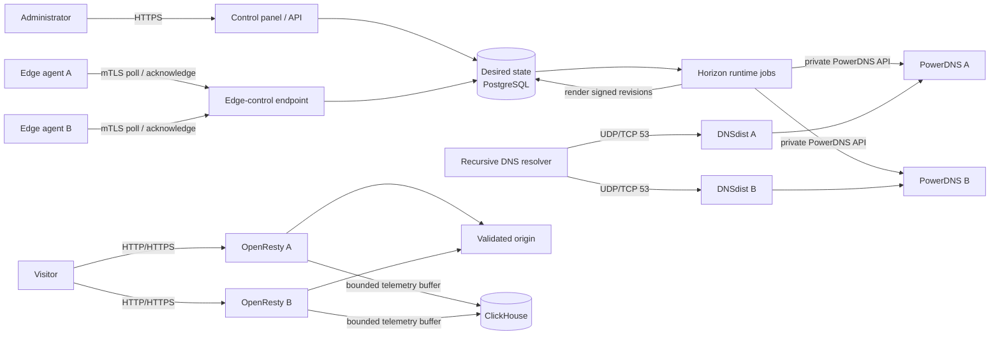

# Three-host production quick start

This guide installs the smallest useful public CDNFoundry topology. It uses one
control/telemetry VPS and two VPSs that each run an authoritative DNS endpoint
and an edge runtime. Use fresh hosts, Docker Engine with the Compose plugin, a
private routed network such as WireGuard, and a public IPv4 **and IPv6** address
on both DNS/edge hosts.

This is a production-like starting point, not full control-plane high
availability. DNS and cached HTTP traffic continue on either data-plane host
when the controller is unavailable, but the single PostgreSQL and ClickHouse
instances still require backups and host recovery. Split DNS and edge roles or
add more nodes later without creating per-domain services.

## Topology and traffic flow

| Host | Example private IP | Public listeners | Private listeners | Main services |
|---|---:|---|---|---|
| Control | `10.77.0.1` | panel HTTPS through a host proxy; edge control TCP `8443` | ClickHouse TCP `8123` | Laravel, PostgreSQL, Valkey, Horizon, Scheduler, ClickHouse, Prometheus |
| DNS/edge A | `10.77.0.2` | DNS TCP/UDP `53`; HTTP `80`; HTTPS `443` | PowerDNS API TCP `8081` | DNSdist, PowerDNS, OpenResty, edge agent, Vector |
| DNS/edge B | `10.77.0.3` | DNS TCP/UDP `53`; HTTP `80`; HTTPS `443` | PowerDNS API TCP `8081` | DNSdist, PowerDNS, OpenResty, edge agent, Vector |

For an initial low-traffic deployment, start the control host at 4 vCPU, 8 GiB
RAM, and 100 GiB SSD, and each combined DNS/edge host at 4 vCPU, 6 GiB RAM, and
50 GiB SSD. These are planning starting points, not capacity claims. Size the
controller disk from measured ClickHouse retention and backup volume, and size
edge bandwidth from peak origin/client traffic. Monitor the bounded container
limits before increasing them deliberately.

Two data-plane hosts are the minimum because a domain needs at least two
authoritative nameservers and CDN traffic must not depend on one edge. Combining
DNS and edge roles keeps the minimum at three VPSs. The controller is separate
so customer DNS and HTTP traffic never pass through Laravel.



End to end, the registrar delegates a customer domain to `ns1` and `ns2`.
DNSdist answers from derived PowerDNS state with the assigned service-pool
addresses. The visitor then connects directly to OpenResty, which selects the
domain certificate, applies security/cache policy, and contacts the explicitly
validated origin. Only desired-state changes and signed revisions use the
controller. Vector sends telemetry directly to ClickHouse; a telemetry outage
does not stop DNS or HTTP serving.

## 1. Prepare names, addresses, and firewall rules

Choose these values before installation and replace the examples everywhere:

| Purpose | Example |
|---|---|
| Existing operator DNS name for the panel | `control.ops.example.net` |
| Existing operator DNS name for edge control | `edge-control.ops.example.net` |
| CDN platform domain | `cdn.example.net` |
| Public nameservers | `ns1.cdn.example.net`, `ns2.cdn.example.net` |
| Proxy routing hostname | `proxy.cdn.example.net` |
| Edge A public addresses | `203.0.113.20`, `2001:db8:20::20` |
| Edge B public addresses | `203.0.113.30`, `2001:db8:30::30` |

Create public A/AAAA records for the two operator names in DNS that does not
depend on CDNFoundry. At the registrar for `example.net`, register `ns1` and
`ns2` as child nameservers with their matching IPv4 and IPv6 glue. Do not point
a customer domain at them until both DNS clusters are healthy.

Allow these inbound flows and deny unsolicited access to private services:

| Destination | Sources | Ports |
|---|---|---|
| Control | operators or public TLS proxy | TCP `443` |
| Control | DNS/edge A and B public addresses | TCP `8443` |
| Control private IP | DNS/edge A and B private IPs | TCP `8123` |
| Each DNS/edge public IP | internet | TCP and UDP `53` |
| Each DNS/edge public IP | internet | TCP `80`, `443` |
| Each DNS/edge private IP | control private IP | TCP `8081` |
| Every host | operator network | TCP `22` |

Never expose PostgreSQL `5432`, Valkey `6379`, the PowerDNS DNS listener,
ClickHouse, Prometheus, Vector, or container metrics to the internet. Ensure the
host firewall also permits the required forwarded traffic between Docker and
the private VPN interface. The edges need outbound DNS and TCP `80`/`443`; the
controller workers need outbound DNS and HTTPS for verification and ACME.

## 2. Select an image release and install the deployment files

CI publishes six GHCR packages with the same tags. A successful `main` build
publishes the immutable 40-character commit SHA and `latest`. Pushing a stable
Git tag such as `v1.4.0` additionally publishes `v1.4.0`, `1.4.0`, `1.4`, `1`,
and `latest`. Use a commit SHA or exact `vMAJOR.MINOR.PATCH` in production;
`latest`, major, and minor are mutable discovery channels.

On all three hosts, install the same repository revision:

```sh
export CDNF_RELEASE=v1.4.0
sudo install -d -m 0755 /opt/cdnfoundry
sudo git clone --branch "${CDNF_RELEASE}" --depth 1 https://github.com/vaheed/CDNFoundry.git /opt/cdnfoundry
sudo chown -R "$(id -u):$(id -g)" /opt/cdnfoundry
cd /opt/cdnfoundry
cp .env.prod.example .env.prod
chmod 0600 .env.prod
```

If GHCR packages are private, log in with a read-only package token on each
host. Do not place the token in `.env.prod`:

```sh
docker login ghcr.io -u YOUR_GITHUB_USER
```

Set `CDNF_RELEASE` inside every `.env.prod` to the same exact release. Compose
parses the whole file even when only one profile is selected, so every marked
required variable must remain non-empty. On a host that does not own a variable,
use an obvious non-secret value such as `unused-on-this-host` or `/dev/null`;
never copy the control database password, application key, backup credentials,
or identity-CA private key to an edge merely to fill an unused value.

## 3. Bootstrap control-plane secrets and certificates

Run on the control host from `/opt/cdnfoundry`. Replace the hostnames and public
IP with real values. The helper refuses to overwrite an existing PKI directory
and does not print private keys.

```sh
sudo install -d -m 0700 /etc/cdnfoundry/secrets
sudo ./scripts/generate-production-certificates.sh \
  /etc/cdnfoundry/pki \
  edge-control.ops.example.net \
  edge-bootstrap.cdn.example.net \
  CONTROL_PUBLIC_IPV4 \
  EDGE_A_PUBLIC_IPV4
sudo sh -c 'umask 077; openssl rand -base64 48 > /etc/cdnfoundry/secrets/metrics-token'
sudo sh -c 'umask 077; openssl rand -base64 48 > /etc/cdnfoundry/secrets/restic-password'
sudo chown root:82 /etc/cdnfoundry/pki/edge-identity-ca.key
sudo chmod 0640 /etc/cdnfoundry/pki/edge-identity-ca.key
```

Back up the PKI, `APP_KEY`, artifact-signing key, Restic password, and external
TLS material separately. Copy only these three runtime/trust files to each edge:

```text
/etc/cdnfoundry/pki/edge-server-ca.crt
/etc/cdnfoundry/pki/edge-runtime.crt
/etc/cdnfoundry/pki/edge-runtime.key
```

Never copy `edge-identity-ca.key` or `edge-server-ca.key` to an edge. Transfer
files with your normal encrypted administrative channel and keep the runtime
private key mode `0600`.

On the control host, fill `.env.prod` using `.env.prod.example` as the field
reference. Important values are:

- `APP_URL=https://control.ops.example.net`
- `CONTROL_BIND=127.0.0.1:8080`
- `EDGE_CONTROL_URL=https://edge-control.ops.example.net:8443`
- `EDGE_CONTROL_BIND=0.0.0.0:8443`
- `CLICKHOUSE_URL=http://clickhouse:8123`
- `PRIVATE_BIND_IP=10.77.0.1`
- the `/etc/cdnfoundry/pki/...` and `/etc/cdnfoundry/secrets/...` paths above
- unique application, PostgreSQL, Valkey, ClickHouse, signing, PowerDNS, and
  off-host Restic/S3 secrets

Generate an application key without starting Laravel if needed:

```sh
sudo sh -c 'umask 077; key=$(openssl rand -base64 32 | tr -d "\n"); sed -i "s|^APP_KEY=.*|APP_KEY=base64:${key}|" /opt/cdnfoundry/.env.prod'
```

Configure a host TLS reverse proxy to forward
`https://control.ops.example.net` to `127.0.0.1:8080`. For initial restricted
qualification, keep the panel on loopback and use an SSH tunnel instead of
publishing plain HTTP:

```sh
ssh -L 8080:127.0.0.1:8080 root@CONTROL_PUBLIC_IP
```

## 4. Start the controller and create the first administrator

The control-host override publishes ClickHouse only on the private VPN address.
Validate interpolation, pull, migrate, and start without deleting any volume:

```sh
cd /opt/cdnfoundry
docker compose --env-file .env.prod -f compose.prod.yml -f deploy/production/compose.control-host.yml --profile control --profile telemetry config --quiet
docker compose --env-file .env.prod -f compose.prod.yml -f deploy/production/compose.control-host.yml --profile control --profile telemetry pull
docker compose --env-file .env.prod -f compose.prod.yml -f deploy/production/compose.control-host.yml --profile tools run --rm migrate
docker compose --env-file .env.prod -f compose.prod.yml -f deploy/production/compose.control-host.yml --profile control --profile telemetry up -d
docker compose --env-file .env.prod -f compose.prod.yml -f deploy/production/compose.control-host.yml ps
curl -fsS http://127.0.0.1:8080/api/health
curl -fsS http://127.0.0.1:8080/api/ready
```

Create the first administrator. The command prompts twice through the terminal
so the password is not placed in shell history:

```sh
docker compose --env-file .env.prod -f compose.prod.yml -f deploy/production/compose.control-host.yml exec -u www-data core \
  php artisan cdnf:admin:create --name="CDN Operations" --email="admin@example.net"
```

Open `/admin` through the TLS proxy or the SSH tunnel and sign in.

## 5. Start both DNS nodes

On DNS/edge A set these role-owned values in `.env.prod`:

- `PRIVATE_BIND_IP=10.77.0.2`
- `DNS_BIND_V4=0.0.0.0`
- a unique `PDNS_DB_PASSWORD` and `PDNS_API_KEY`
- `CLICKHOUSE_URL=http://10.77.0.1:8123` and the controller's ClickHouse ingest
  username/password
- the real `EDGE_CONTROL_URL`, copied edge-control CA path, runtime certificate
  paths, and a unique `EDGE_STATUS_TOKEN`
- `EDGE_HTTP_BIND=0.0.0.0:80` and `EDGE_HTTPS_BIND=0.0.0.0:443`

Use the same settings on DNS/edge B, except `PRIVATE_BIND_IP=10.77.0.3` and use
different PowerDNS database/API and edge-status secrets. Leave `EDGE_ID` and
`EDGE_BOOTSTRAP_TOKEN` empty for now.

On each DNS/edge host:

```sh
cd /opt/cdnfoundry
docker compose --env-file .env.prod -f compose.prod.yml -f deploy/production/compose.dns-edge-host.yml --profile dns config --quiet
docker compose --env-file .env.prod -f compose.prod.yml -f deploy/production/compose.dns-edge-host.yml --profile dns --profile edge pull
docker compose --env-file .env.prod -f compose.prod.yml -f deploy/production/compose.dns-edge-host.yml --profile tools run --rm pdns-migrate
docker compose --env-file .env.prod -f compose.prod.yml -f deploy/production/compose.dns-edge-host.yml --profile dns up -d
docker compose --env-file .env.prod -f compose.prod.yml -f deploy/production/compose.dns-edge-host.yml ps
```

From an external machine, both nodes must answer DNSdist over UDP and TCP even
though they have no customer zones yet:

```sh
dig @EDGE_A_PUBLIC_IPV4 version.bind TXT CH +short
dig @EDGE_B_PUBLIC_IPV4 version.bind TXT CH +tcp +short
```

Do not expose or query PowerDNS port `53` directly. Its private API should be
reachable from the control host only. Check network reachability without putting
the API key in shell history, then let **DNS clusters → Test connection** perform
the authenticated qualification:

```sh
nc -vz -w 3 10.77.0.2 8081
nc -vz -w 3 10.77.0.3 8081
```

## 6. Configure the platform DNS identity and clusters

In `/admin`, open **System DNS identity**, enter the platform domain first, and
then fill:

| Field | Value |
|---|---|
| Platform domain | `cdn.example.net` |
| Proxy hostname | `proxy.cdn.example.net` |
| Nameserver 1 | `ns1.cdn.example.net` plus edge A public IPv4 and IPv6 |
| Nameserver 2 | `ns2.cdn.example.net` plus edge B public IPv4 and IPv6 |
| SOA primary | `ns1.cdn.example.net` |
| SOA mailbox | `hostmaster.cdn.example.net` |
| Refresh / retry / expire | `3600` / `600` / `1209600` |
| Minimum / default TTL | `300` / `300` |
| Cluster targets | `10.77.0.2:8081`, `10.77.0.3:8081` |

Choose **Validate and preview**, verify the normalized values, then **Confirm and
queue update**. Next open **DNS clusters → New DNS cluster** and create both
rows. Start each disabled:

| Field | Cluster A | Cluster B |
|---|---|---|
| Name | `dns-edge-a` | `dns-edge-b` |
| Location | actual city/region A | actual city/region B |
| API URL | `http://10.77.0.2:8081` | `http://10.77.0.3:8081` |
| API key | edge A `PDNS_API_KEY` | edge B `PDNS_API_KEY` |
| Server ID | `localhost` | `localhost` |
| Nameservers | both `ns1` and `ns2` hostnames | both `ns1` and `ns2` hostnames |
| Capacity zones | a bounded planned value, e.g. `100000` | same |

Saving queues an asynchronous connection test. Wait for **healthy**, edit the
row, and enable it. Confirm the System DNS identity operation and both target
deployments succeed. Then query the public endpoints:

```sh
dig @EDGE_A_PUBLIC_IPV4 cdn.example.net SOA +tcp
dig @EDGE_B_PUBLIC_IPV4 cdn.example.net NS
dig @EDGE_A_PUBLIC_IPV4 ns1.cdn.example.net A
dig @EDGE_B_PUBLIC_IPV4 ns2.cdn.example.net AAAA
```

## 7. Create and enroll both edges

Open **Edges → New edge**. Create `edge-a` and `edge-b` with their real country,
continent, public IPv4, and public IPv6 values. Copy each UUID and one-time
bootstrap token immediately; the token is stored only as a hash.

On the matching host, set `EDGE_ID` and `EDGE_BOOTSTRAP_TOKEN` in `.env.prod`,
then start the edge profile:

```sh
cd /opt/cdnfoundry
docker compose --env-file .env.prod -f compose.prod.yml -f deploy/production/compose.dns-edge-host.yml --profile edge up -d
docker compose --env-file .env.prod -f compose.prod.yml -f deploy/production/compose.dns-edge-host.yml ps edge edge-quarantine edge-agent vector mmdb-updater
docker compose --env-file .env.prod -f compose.prod.yml -f deploy/production/compose.dns-edge-host.yml logs --tail=100 edge-agent
```

Wait until the admin page shows a fresh heartbeat and a ready shared cell. Then
erase `EDGE_BOOTSTRAP_TOKEN` from that host and recreate only the agent so the
one-time token is no longer present in its environment:

```sh
sudo sed -i 's/^EDGE_BOOTSTRAP_TOKEN=.*/EDGE_BOOTSTRAP_TOKEN=/' /opt/cdnfoundry/.env.prod
docker compose --env-file .env.prod -f compose.prod.yml -f deploy/production/compose.dns-edge-host.yml --profile edge up -d --force-recreate edge-agent
```

Repeat on edge B. The persistent agent volumes retain the locally generated
mTLS identities. Do not copy an identity volume between hosts.

## 8. Add the first customer domain

1. In **Users**, create a domain user if needed. Use a unique email and a
   password of at least 12 characters.
2. In **Domains → New domain**, enter only the registrable customer domain; an
   origin is deliberately not requested yet. If an administrator created it,
   attach the domain user in the domain's **Users** relation.
3. At the customer's registrar, replace the domain delegation with exactly
   `ns1.cdn.example.net` and `ns2.cdn.example.net`. Remove parking or old
   nameservers and wait for parent-zone propagation.
4. Open the domain, choose **Verify nameservers**, and wait for the asynchronous
   operation to succeed. Do not use force verification for release acceptance.
5. Choose **Activate** and wait until both DNS cluster deployments show the
   desired revision.
6. Add ordinary DNS-only records first. For CDN delivery, create an A, AAAA, or
   CNAME record in **Proxied** mode and provide one public, validated origin,
   scheme, Host header, and TLS SNI. The origin must not resolve to an edge,
   platform, loopback, private metadata, link-local, or multicast address.
7. Wait for both edges to acknowledge the revision. Managed DNS-01 TLS starts
   only when the first hostname becomes proxied; DNS-only domains do not obtain
   a certificate.

Verify authoritative DNS and direct edge traffic from outside the fleet:

```sh
dig +trace CUSTOMER_DOMAIN NS
dig @EDGE_A_PUBLIC_IPV4 CUSTOMER_DOMAIN A
dig @EDGE_B_PUBLIC_IPV4 CUSTOMER_DOMAIN AAAA +tcp
curl -I --resolve CUSTOMER_DOMAIN:80:EDGE_A_PUBLIC_IPV4 http://CUSTOMER_DOMAIN/
curl -I --resolve CUSTOMER_DOMAIN:443:EDGE_B_PUBLIC_IPV4 https://CUSTOMER_DOMAIN/
```

The final HTTPS command should be run only after the managed/custom certificate
is active. Repeat against IPv6 with `curl -6` and an IPv6-capable client.

## 9. Upgrades, rollback, and the core health failure

Before an upgrade, back up control PostgreSQL, `.env.prod`, application and
signing keys, PKI, externally held TLS material, and the Restic decryption
material. Change `CDNF_RELEASE` to one exact tested SHA or version on one host at
a time, pull, run additive migrations, and recreate services without removing
volumes. Preserve the previous valid edge snapshot and previous image pin until
the canary is healthy.

If `core` starts but becomes unhealthy when the full stack starts, inspect the
actual startup error:

```sh
docker compose --env-file .env.prod -f compose.prod.yml logs --tail=200 core
docker inspect --format '{{json .State.Health}}' "$(docker compose --env-file .env.prod -f compose.prod.yml ps -q core)"
```

Older images ran Filament asset publication and changed `bootstrap/cache`
ownership at container startup even though the production root filesystem is
read-only. Deploy a newly published SHA/version containing the read-only startup
fix; restarting the old immutable image cannot repair it. Also verify that the
edge identity CA key is readable by container group `82` on the control host.
Never work around the failure by making the container root filesystem writable
or making a CA private key world-readable.

## Release qualification checkpoint

This guide does not replace release qualification. Before declaring the fleet
ready, run the repository's agent-owned non-browser checks for the selected
revision and complete [manual browser qualification](manual-browser-qualification.md)
on the real dual-edge deployment. Record the commit/image digests, operation
IDs, DNS revisions, edge acknowledgements, public IPv4/IPv6 results, certificate
fingerprints, backup result, and every deviation from this example topology.
