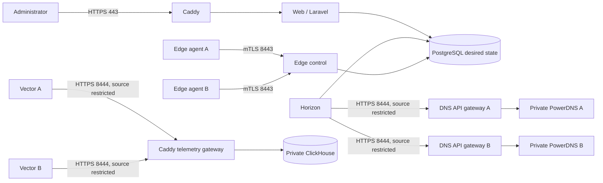
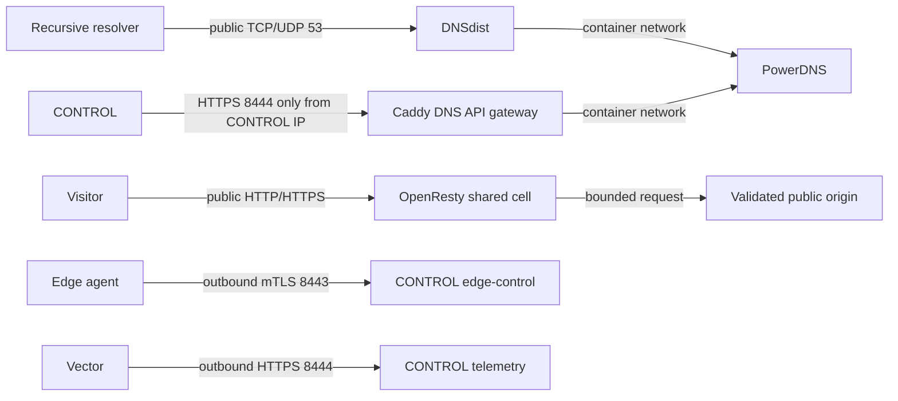
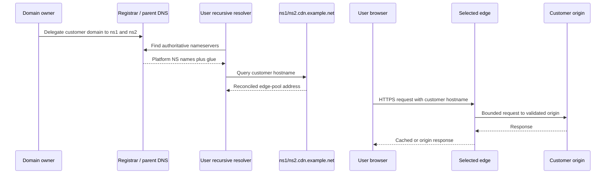

# Three-host production quick start

This runbook installs the smallest useful CDNFoundry fleet on three VPSs with
public IPv4 and IPv6 addresses. It does not use RFC1918 addresses, a private
VLAN, or a VPN. Restricted cross-host traffic is encrypted and allowed only
from an exact peer public IPv4 address.

This is only the minimum example. It does not impose a two-edge limit. After
the first fleet is healthy, use [Production scaling and larger topologies](production-scaling.md)
to add edge-only, DNS-only, telemetry, control, and worker hosts.

The three VPSs are:

| Label | Role | Minimum public listeners |
|---|---|---|
| `CONTROL` | Laravel control plane, PostgreSQL, Valkey, ClickHouse, Caddy | `80`, `443`, `443/udp`; edge-only `8443`, `8444` |
| `EDGE_A` | DNSdist, PowerDNS, OpenResty, edge agent, Vector | `53/tcp`, `53/udp`, `80`, `443`; control-only `8444` |
| `EDGE_B` | Same as edge A, in another provider or failure domain | `53/tcp`, `53/udp`, `80`, `443`; control-only `8444` |

Two DNS/edge hosts are the minimum because a delegated zone needs at least two
authoritative nameservers and one host failure must not remove all DNS and CDN
service. The separate controller keeps customer DNS and HTTP traffic out of
Laravel. This is not control-plane high availability: back up PostgreSQL,
ClickHouse, application keys, signing keys, and TLS material off-host.

The addresses below are public documentation ranges, not private addresses and
not usable on the Internet. Replace every example before running a command.

| Placeholder | Documentation example |
|---|---|
| `CONTROL_PUBLIC_IPV4` / `CONTROL_PUBLIC_IPV6` | `198.51.100.10` / `2001:db8:10::10` |
| `EDGE_A_PUBLIC_IPV4` / `EDGE_A_PUBLIC_IPV6` | `198.51.100.20` / `2001:db8:20::20` |
| `EDGE_B_PUBLIC_IPV4` / `EDGE_B_PUBLIC_IPV6` | `198.51.100.30` / `2001:db8:30::30` |
| `ADMIN_PUBLIC_IPV4` | `198.51.100.40` |

For an initial low-traffic fleet, start `CONTROL` at 4 vCPU, 8 GiB RAM, and
100 GiB SSD, and each edge at 4 vCPU, 6 GiB RAM, and 50 GiB SSD. These are
starting points, not capacity guarantees. Measure bandwidth, cache churn,
ClickHouse retention, and container limits before resizing.

## The two bootstrap DNS domains

Keep these two purposes separate. Reusing the CDNFoundry-managed domain for
control access creates a bootstrap loop during an outage.

1. **Manual access domain**, for example `ops.example.com`. Keep this zone at
   an existing independent DNS provider. You manually create and maintain:
   `control.ops.example.com`, `edge-control.ops.example.com`,
   `telemetry.ops.example.com`, `dns-api-a.ops.example.com`, and
   `dns-api-b.ops.example.com`. These records point directly to the public VPS
   addresses. CDNFoundry never reconciles this zone.
2. **CDNFoundry platform domain**, for example `cdn.example.net`. Delegate this
   zone to `ns1.cdn.example.net` and `ns2.cdn.example.net`, including registrar
   glue. CDNFoundry owns and automatically reconciles this zone for
   nameservers, proxy routing, service pools, and other system records. Do not
   use it for the panel, edge-control, telemetry, or PowerDNS API hostnames.

Customer domains are added after bootstrap. Their owners delegate them to the
two nameservers under the platform domain.

## How the topology works

### Control-plane view



PostgreSQL owns desired state. Horizon performs asynchronous, revisioned DNS
work through the two HTTPS PowerDNS gateways. Edge agents fetch signed runtime
revisions over mTLS and preserve the last valid state if the controller is
unavailable. Vector sends telemetry directly to ClickHouse through Caddy;
telemetry failure never stops DNS or HTTP service.

### DNS/edge-host view



DNSdist is the only public authoritative DNS listener. PowerDNS port `53` and
its native API remain container-private. OpenResty serves customer traffic
without consulting Laravel and selects configuration and certificates from the
last validated runtime snapshot.

### User-side request view



An administrator reaches `control.ops.example.com` through independently
managed DNS. An end user never traverses the controller: DNS goes to DNSdist,
and HTTP goes to OpenResty.

## 1. Create the manual DNS records and platform delegation

At the independent provider for `ops.example.com`, create these records before
starting Caddy:

| Manual record | Value | Owner |
|---|---|---|
| `control.ops.example.com` A and AAAA | `CONTROL` public IPv4 and IPv6 | operator |
| `edge-control.ops.example.com` A | `CONTROL` public IPv4 | operator |
| `telemetry.ops.example.com` A | `CONTROL` public IPv4 | operator |
| `dns-api-a.ops.example.com` A | `EDGE_A` public IPv4 | operator |
| `dns-api-b.ops.example.com` A | `EDGE_B` public IPv4 | operator |

Only the browser-facing control hostname needs AAAA in this baseline. The
source-restricted control protocols intentionally use IPv4 so every firewall
allow-list has one exact source address.

At the registrar that owns `example.net`, register these child nameservers and
glue, then delegate `cdn.example.net` to them:

| Platform name | Glue |
|---|---|
| `ns1.cdn.example.net` | `EDGE_A` public IPv4 and IPv6 |
| `ns2.cdn.example.net` | `EDGE_B` public IPv4 and IPv6 |

Do not delegate a customer domain until both public DNS endpoints answer and
both DNS clusters are healthy.

## 2. Install Docker and the deployment files

Install Ubuntu 24.04 LTS on fresh hosts. Configure provider security groups to
match the host rules in the next section. Do not open a database or metrics
port in the provider firewall.

**Run on: `CONTROL`, `EDGE_A`, and `EDGE_B`.**

**Why:** install firewall persistence and fetch one identical immutable
CDNFoundry release on all three hosts. Replace `v1.4.0` with an existing exact
release tag or 40-character image SHA.

```sh
sudo apt-get update
sudo DEBIAN_FRONTEND=noninteractive apt-get install -y ca-certificates curl git ufw iptables-persistent

# Install Docker Engine and the Compose plugin from Docker's official repository first.
docker version
docker compose version

export CDNF_RELEASE=v1.4.0
sudo install -d -m 0755 /opt/cdnfoundry
sudo git clone --branch "${CDNF_RELEASE}" --depth 1 https://github.com/vaheed/CDNFoundry.git /opt/cdnfoundry
sudo chown -R "$(id -u):$(id -g)" /opt/cdnfoundry
cd /opt/cdnfoundry
cp .env.prod.example .env.prod
chmod 0600 .env.prod
```

If GHCR is private, authenticate with a read-only package token. The password
prompt keeps the token out of `.env.prod` and shell history.

**Run on: `CONTROL`, `EDGE_A`, and `EDGE_B`.**

**Why:** permit Docker to pull private immutable images.

```sh
docker login ghcr.io -u YOUR_GITHUB_USER
```

Set `CDNF_RELEASE` in every `.env.prod` to the same exact release. Compose
parses required variables even when their service profile is not selected. Use
an obvious non-secret placeholder on a host that does not own a value; never
copy control-plane secrets to an edge merely to satisfy parsing.

## 3. Apply deny-by-default firewalls

Keep a provider console open. Replace all example addresses before enabling
UFW or SSH can be locked out. Provider security groups must enforce the same
source and destination rules.

UFW protects host listeners. Docker-published ports also need `DOCKER-USER`
rules because Docker forwarding can bypass ordinary UFW input rules. The
following rules accept established connections, accept only the documented
new flows, and drop every other new connection addressed to that host.

### Control firewall

**Run on: `CONTROL`.**

**Why:** default-deny the host; make Caddy public; allow SSH only from the
administrator; and allow edge control plus telemetry only from the two edges.

```sh
CONTROL_PUBLIC_IPV4=198.51.100.10
CONTROL_PUBLIC_IPV6=2001:db8:10::10
EDGE_A_PUBLIC_IPV4=198.51.100.20
EDGE_B_PUBLIC_IPV4=198.51.100.30
ADMIN_PUBLIC_IPV4=198.51.100.40

sudo ufw default deny incoming
sudo ufw default allow outgoing
sudo ufw allow proto tcp from "${ADMIN_PUBLIC_IPV4}" to "${CONTROL_PUBLIC_IPV4}" port 22
sudo ufw allow proto tcp to "${CONTROL_PUBLIC_IPV4}" port 80
sudo ufw allow proto tcp to "${CONTROL_PUBLIC_IPV4}" port 443
sudo ufw allow proto udp to "${CONTROL_PUBLIC_IPV4}" port 443
sudo ufw allow proto tcp to "${CONTROL_PUBLIC_IPV6}" port 80
sudo ufw allow proto tcp to "${CONTROL_PUBLIC_IPV6}" port 443
sudo ufw allow proto udp to "${CONTROL_PUBLIC_IPV6}" port 443
sudo ufw allow proto tcp from "${EDGE_A_PUBLIC_IPV4}" to "${CONTROL_PUBLIC_IPV4}" port 8443
sudo ufw allow proto tcp from "${EDGE_B_PUBLIC_IPV4}" to "${CONTROL_PUBLIC_IPV4}" port 8443
sudo ufw allow proto tcp from "${EDGE_A_PUBLIC_IPV4}" to "${CONTROL_PUBLIC_IPV4}" port 8444
sudo ufw allow proto tcp from "${EDGE_B_PUBLIC_IPV4}" to "${CONTROL_PUBLIC_IPV4}" port 8444
sudo ufw --force enable
sudo ufw status numbered
```

**Run on: `CONTROL`, after Docker is running.**

**Why:** mirror the allow-list in Docker's forwarding path. `--ctorigdst`
matches the public destination before Docker DNAT.

```sh
CONTROL_PUBLIC_IPV4=198.51.100.10
CONTROL_PUBLIC_IPV6=2001:db8:10::10
EDGE_A_PUBLIC_IPV4=198.51.100.20
EDGE_B_PUBLIC_IPV4=198.51.100.30

sudo iptables -N CDNF-CONTROL 2>/dev/null || true
sudo iptables -F CDNF-CONTROL
sudo iptables -A CDNF-CONTROL -m conntrack --ctstate ESTABLISHED,RELATED -j ACCEPT
sudo iptables -A CDNF-CONTROL -p tcp -m conntrack --ctorigdst "${CONTROL_PUBLIC_IPV4}" --ctorigdstport 80 -j ACCEPT
sudo iptables -A CDNF-CONTROL -p tcp -m conntrack --ctorigdst "${CONTROL_PUBLIC_IPV4}" --ctorigdstport 443 -j ACCEPT
sudo iptables -A CDNF-CONTROL -p udp -m conntrack --ctorigdst "${CONTROL_PUBLIC_IPV4}" --ctorigdstport 443 -j ACCEPT
sudo iptables -A CDNF-CONTROL -s "${EDGE_A_PUBLIC_IPV4}" -p tcp -m conntrack --ctorigdst "${CONTROL_PUBLIC_IPV4}" --ctorigdstport 8443 -j ACCEPT
sudo iptables -A CDNF-CONTROL -s "${EDGE_B_PUBLIC_IPV4}" -p tcp -m conntrack --ctorigdst "${CONTROL_PUBLIC_IPV4}" --ctorigdstport 8443 -j ACCEPT
sudo iptables -A CDNF-CONTROL -s "${EDGE_A_PUBLIC_IPV4}" -p tcp -m conntrack --ctorigdst "${CONTROL_PUBLIC_IPV4}" --ctorigdstport 8444 -j ACCEPT
sudo iptables -A CDNF-CONTROL -s "${EDGE_B_PUBLIC_IPV4}" -p tcp -m conntrack --ctorigdst "${CONTROL_PUBLIC_IPV4}" --ctorigdstport 8444 -j ACCEPT
sudo iptables -A CDNF-CONTROL -m conntrack --ctstate NEW --ctorigdst "${CONTROL_PUBLIC_IPV4}" -j DROP
sudo iptables -A CDNF-CONTROL -j RETURN
sudo iptables -C DOCKER-USER -j CDNF-CONTROL 2>/dev/null || sudo iptables -I DOCKER-USER 1 -j CDNF-CONTROL

sudo ip6tables -N CDNF-CONTROL 2>/dev/null || true
sudo ip6tables -F CDNF-CONTROL
sudo ip6tables -A CDNF-CONTROL -m conntrack --ctstate ESTABLISHED,RELATED -j ACCEPT
sudo ip6tables -A CDNF-CONTROL -p tcp -m conntrack --ctorigdst "${CONTROL_PUBLIC_IPV6}" --ctorigdstport 80 -j ACCEPT
sudo ip6tables -A CDNF-CONTROL -p tcp -m conntrack --ctorigdst "${CONTROL_PUBLIC_IPV6}" --ctorigdstport 443 -j ACCEPT
sudo ip6tables -A CDNF-CONTROL -p udp -m conntrack --ctorigdst "${CONTROL_PUBLIC_IPV6}" --ctorigdstport 443 -j ACCEPT
sudo ip6tables -A CDNF-CONTROL -m conntrack --ctstate NEW --ctorigdst "${CONTROL_PUBLIC_IPV6}" -j DROP
sudo ip6tables -A CDNF-CONTROL -j RETURN
sudo ip6tables -C DOCKER-USER -j CDNF-CONTROL 2>/dev/null || sudo ip6tables -I DOCKER-USER 1 -j CDNF-CONTROL

sudo netfilter-persistent save
```

### Edge firewall

Run the same block separately with that host's public addresses.

**Run on: `EDGE_A`, then `EDGE_B`.**

**Why:** default-deny each edge; publish only authoritative DNS and CDN
traffic; allow SSH only from the administrator; and allow the PowerDNS HTTPS
gateway only from `CONTROL`.

```sh
EDGE_PUBLIC_IPV4=198.51.100.20
EDGE_PUBLIC_IPV6=2001:db8:20::20
CONTROL_PUBLIC_IPV4=198.51.100.10
ADMIN_PUBLIC_IPV4=198.51.100.40

sudo ufw default deny incoming
sudo ufw default allow outgoing
sudo ufw allow proto tcp from "${ADMIN_PUBLIC_IPV4}" to "${EDGE_PUBLIC_IPV4}" port 22
sudo ufw allow proto tcp to "${EDGE_PUBLIC_IPV4}" port 53
sudo ufw allow proto udp to "${EDGE_PUBLIC_IPV4}" port 53
sudo ufw allow proto tcp to "${EDGE_PUBLIC_IPV4}" port 80
sudo ufw allow proto tcp to "${EDGE_PUBLIC_IPV4}" port 443
sudo ufw allow proto tcp to "${EDGE_PUBLIC_IPV6}" port 53
sudo ufw allow proto udp to "${EDGE_PUBLIC_IPV6}" port 53
sudo ufw allow proto tcp to "${EDGE_PUBLIC_IPV6}" port 80
sudo ufw allow proto tcp to "${EDGE_PUBLIC_IPV6}" port 443
sudo ufw allow proto tcp from "${CONTROL_PUBLIC_IPV4}" to "${EDGE_PUBLIC_IPV4}" port 8444
sudo ufw --force enable
sudo ufw status numbered
```

**Run on: `EDGE_A`, then `EDGE_B`, after Docker is running.**

**Why:** enforce the same edge allow-list on Docker-published ports.

```sh
EDGE_PUBLIC_IPV4=198.51.100.20
EDGE_PUBLIC_IPV6=2001:db8:20::20
CONTROL_PUBLIC_IPV4=198.51.100.10

sudo iptables -N CDNF-EDGE 2>/dev/null || true
sudo iptables -F CDNF-EDGE
sudo iptables -A CDNF-EDGE -m conntrack --ctstate ESTABLISHED,RELATED -j ACCEPT
sudo iptables -A CDNF-EDGE -p tcp -m conntrack --ctorigdst "${EDGE_PUBLIC_IPV4}" --ctorigdstport 53 -j ACCEPT
sudo iptables -A CDNF-EDGE -p udp -m conntrack --ctorigdst "${EDGE_PUBLIC_IPV4}" --ctorigdstport 53 -j ACCEPT
sudo iptables -A CDNF-EDGE -p tcp -m conntrack --ctorigdst "${EDGE_PUBLIC_IPV4}" --ctorigdstport 80 -j ACCEPT
sudo iptables -A CDNF-EDGE -p tcp -m conntrack --ctorigdst "${EDGE_PUBLIC_IPV4}" --ctorigdstport 443 -j ACCEPT
sudo iptables -A CDNF-EDGE -s "${CONTROL_PUBLIC_IPV4}" -p tcp -m conntrack --ctorigdst "${EDGE_PUBLIC_IPV4}" --ctorigdstport 8444 -j ACCEPT
sudo iptables -A CDNF-EDGE -m conntrack --ctstate NEW --ctorigdst "${EDGE_PUBLIC_IPV4}" -j DROP
sudo iptables -A CDNF-EDGE -j RETURN
sudo iptables -C DOCKER-USER -j CDNF-EDGE 2>/dev/null || sudo iptables -I DOCKER-USER 1 -j CDNF-EDGE

sudo ip6tables -N CDNF-EDGE 2>/dev/null || true
sudo ip6tables -F CDNF-EDGE
sudo ip6tables -A CDNF-EDGE -m conntrack --ctstate ESTABLISHED,RELATED -j ACCEPT
sudo ip6tables -A CDNF-EDGE -p tcp -m conntrack --ctorigdst "${EDGE_PUBLIC_IPV6}" --ctorigdstport 53 -j ACCEPT
sudo ip6tables -A CDNF-EDGE -p udp -m conntrack --ctorigdst "${EDGE_PUBLIC_IPV6}" --ctorigdstport 53 -j ACCEPT
sudo ip6tables -A CDNF-EDGE -p tcp -m conntrack --ctorigdst "${EDGE_PUBLIC_IPV6}" --ctorigdstport 80 -j ACCEPT
sudo ip6tables -A CDNF-EDGE -p tcp -m conntrack --ctorigdst "${EDGE_PUBLIC_IPV6}" --ctorigdstport 443 -j ACCEPT
sudo ip6tables -A CDNF-EDGE -m conntrack --ctstate NEW --ctorigdst "${EDGE_PUBLIC_IPV6}" -j DROP
sudo ip6tables -A CDNF-EDGE -j RETURN
sudo ip6tables -C DOCKER-USER -j CDNF-EDGE 2>/dev/null || sudo ip6tables -I DOCKER-USER 1 -j CDNF-EDGE

sudo netfilter-persistent save
```

Use edge B's IPv4 and IPv6 when repeating the block. Never publish PostgreSQL
`5432`, Valkey `6379`, raw ClickHouse `8123`, raw PowerDNS API `8081`,
Prometheus `9090`, or container metrics. Outbound DNS and HTTPS must remain
available for ACME, origin verification, GeoIP downloads, enrollment, and
telemetry.

## 4. Generate and distribute private PKI

The control panel uses Caddy's publicly trusted automatic HTTPS. The private
PKI is only for edge-control mTLS, the OpenResty fallback certificate, and the
two HTTPS gateways in front of PowerDNS.

**Run on: `CONTROL`, from `/opt/cdnfoundry`.**

**Why:** create CAs and hostname-verified server certificates without printing
private keys. The helper refuses to overwrite the output directory.

```sh
cd /opt/cdnfoundry
sudo install -d -m 0700 /etc/cdnfoundry/secrets
sudo ./scripts/generate-production-certificates.sh \
  /etc/cdnfoundry/pki \
  edge-control.ops.example.com \
  edge-bootstrap.cdn.example.net \
  198.51.100.10 \
  198.51.100.20 \
  dns-api-a.ops.example.com \
  dns-api-b.ops.example.com
sudo sh -c 'umask 077; openssl rand -base64 48 > /etc/cdnfoundry/secrets/metrics-token'
sudo sh -c 'umask 077; openssl rand -base64 48 > /etc/cdnfoundry/secrets/restic-password'
sudo chown root:82 /etc/cdnfoundry/pki/edge-identity-ca.key
sudo chmod 0640 /etc/cdnfoundry/pki/edge-identity-ca.key
```

Replace the three public IPv4 examples in that command. Copy only the public
server CA, runtime pair, and matching DNS API pair to each edge over your
encrypted administrative channel. Never copy `edge-identity-ca.key` or
`edge-server-ca.key` to an edge.

**Run on: `EDGE_A` and `EDGE_B`.**

**Why:** create the protected destination before transferring certificates.

```sh
sudo install -d -m 0700 /etc/cdnfoundry/pki
```

**Run on: `CONTROL`.**

**Why:** transfer only edge A's required trust and server material. Replace the
SSH account and address to match your administration setup.

```sh
sudo scp -p \
  /etc/cdnfoundry/pki/edge-server-ca.crt \
  /etc/cdnfoundry/pki/edge-runtime.crt \
  /etc/cdnfoundry/pki/edge-runtime.key \
  /etc/cdnfoundry/pki/dns-api-1.crt \
  /etc/cdnfoundry/pki/dns-api-1.key \
  root@198.51.100.20:/etc/cdnfoundry/pki/
```

**Run on: `CONTROL`.**

**Why:** transfer the matching DNS API identity to edge B.

```sh
sudo scp -p \
  /etc/cdnfoundry/pki/edge-server-ca.crt \
  /etc/cdnfoundry/pki/edge-runtime.crt \
  /etc/cdnfoundry/pki/edge-runtime.key \
  /etc/cdnfoundry/pki/dns-api-2.crt \
  /etc/cdnfoundry/pki/dns-api-2.key \
  root@198.51.100.30:/etc/cdnfoundry/pki/
```

**Run on: `EDGE_A` and `EDGE_B`.**

**Why:** make certificates readable and private keys root-only after transfer.

```sh
sudo chmod 0644 /etc/cdnfoundry/pki/*.crt
sudo chmod 0600 /etc/cdnfoundry/pki/*.key
```

Back up both CA private keys, the application key, artifact-signing key,
Restic password, and externally stored customer TLS material off-host.

## 5. Configure and start `CONTROL`

**Run on: `CONTROL`.**

**Why:** set every controller-owned value and give Caddy the public addresses
and names required for automatic HTTPS and source filtering.

```sh
cd /opt/cdnfoundry
sudoedit .env.prod
```

Set at least these controller values; generate unique high-entropy values for
every secret marked required in `.env.prod.example`:

```dotenv
APP_URL=https://control.ops.example.com
CONTROL_BIND=127.0.0.1:8080
CONTROL_HOSTNAME=control.ops.example.com
TELEMETRY_HOSTNAME=telemetry.ops.example.com
EDGE_PUBLIC_IPV4_ALLOWLIST="198.51.100.20 198.51.100.30"
PUBLIC_BIND_IPV4=198.51.100.10
PUBLIC_BIND_IPV6=2001:db8:10::10
EDGE_CONTROL_URL=https://edge-control.ops.example.com:8443
EDGE_CONTROL_BIND=198.51.100.10:8443
CLICKHOUSE_URL=http://clickhouse:8123
PDNS_CA_CERTIFICATE=/etc/cdnfoundry/pki/edge-server-ca.crt
SESSION_SECURE_COOKIE=true
```

Caddy in `deploy/production/compose.control-host.yml` listens directly on the
public addresses, obtains and renews public certificates for
`control.ops.example.com` and `telemetry.ops.example.com`, redirects panel HTTP
to HTTPS, and proxies only to container-private services. Successful ACME
issuance requires the manual A/AAAA records and public ports `80` and `443`.

**Run on: `CONTROL`.**

**Why:** generate a Laravel application key without starting a writable
application container or printing the key.

```sh
sudo sh -c 'umask 077; key=$(openssl rand -base64 32 | tr -d "\n"); sed -i "s|^APP_KEY=.*|APP_KEY=base64:${key}|" /opt/cdnfoundry/.env.prod'
```

**Run on: `CONTROL`.**

**Why:** validate interpolation, pull immutable images, run the explicit
database migration, and start the controller without deleting volumes.

```sh
cd /opt/cdnfoundry
docker compose --env-file .env.prod -f compose.prod.yml -f deploy/production/compose.control-host.yml --profile control --profile telemetry config --quiet
docker compose --env-file .env.prod -f compose.prod.yml -f deploy/production/compose.control-host.yml --profile control --profile telemetry pull
docker compose --env-file .env.prod -f compose.prod.yml -f deploy/production/compose.control-host.yml --profile tools run --rm migrate
docker compose --env-file .env.prod -f compose.prod.yml -f deploy/production/compose.control-host.yml --profile control --profile telemetry up -d
docker compose --env-file .env.prod -f compose.prod.yml -f deploy/production/compose.control-host.yml ps
```

**Run on: any administrator workstation.**

**Why:** prove public DNS, automatic TLS, and Laravel readiness through Caddy.

```sh
curl -fsS https://control.ops.example.com/api/health
curl -fsS https://control.ops.example.com/api/ready
```

If TLS is not ready, inspect Caddy without exposing its admin endpoint.

**Run on: `CONTROL`.**

**Why:** diagnose DNS or ACME challenge failure.

```sh
docker compose --env-file .env.prod -f compose.prod.yml -f deploy/production/compose.control-host.yml logs --tail=200 caddy
```

**Run on: `CONTROL`.**

**Why:** create the first administrator using an interactive password prompt so
the password does not enter shell history.

```sh
docker compose --env-file .env.prod -f compose.prod.yml -f deploy/production/compose.control-host.yml exec -u www-data core \
  php artisan cdnf:admin:create --name="CDN Operations" --email="admin@example.com"
```

Open `https://control.ops.example.com/admin` and sign in.

## 6. Configure and start DNS on both edges

Use unique `PDNS_DB_PASSWORD`, `PDNS_API_KEY`, and `EDGE_STATUS_TOKEN` values on
each host. Both edges use the controller's ClickHouse password only for bounded
telemetry ingestion.

**Run on: `EDGE_A`.**

**Why:** configure edge A's public listeners, TLS-protected PowerDNS gateway,
and telemetry destination.

```sh
cd /opt/cdnfoundry
sudoedit .env.prod
```

Set:

```dotenv
PUBLIC_BIND_IPV4=198.51.100.20
PUBLIC_BIND_IPV6=2001:db8:20::20
CONTROL_PUBLIC_IPV4_ALLOWLIST="198.51.100.10"
DNS_BIND_V4=198.51.100.20
EDGE_HTTP_BIND=198.51.100.20:80
EDGE_HTTPS_BIND=198.51.100.20:443
EDGE_CONTROL_URL=https://edge-control.ops.example.com:8443
CLICKHOUSE_URL=https://telemetry.ops.example.com:8444
DNS_API_HOSTNAME=dns-api-a.ops.example.com
DNS_API_SERVER_CERTIFICATE=/etc/cdnfoundry/pki/dns-api-1.crt
DNS_API_SERVER_PRIVATE_KEY=/etc/cdnfoundry/pki/dns-api-1.key
EDGE_CONTROL_CA_CERTIFICATE=/etc/cdnfoundry/pki/edge-server-ca.crt
EDGE_RUNTIME_TLS_CERTIFICATE=/etc/cdnfoundry/pki/edge-runtime.crt
EDGE_RUNTIME_TLS_PRIVATE_KEY=/etc/cdnfoundry/pki/edge-runtime.key
```

**Run on: `EDGE_B`.**

**Why:** configure edge B with its own public addresses and DNS API identity.

```sh
cd /opt/cdnfoundry
sudoedit .env.prod
```

Set the same fields as edge A, but use:

```dotenv
PUBLIC_BIND_IPV4=198.51.100.30
PUBLIC_BIND_IPV6=2001:db8:30::30
DNS_BIND_V4=198.51.100.30
EDGE_HTTP_BIND=198.51.100.30:80
EDGE_HTTPS_BIND=198.51.100.30:443
DNS_API_HOSTNAME=dns-api-b.ops.example.com
DNS_API_SERVER_CERTIFICATE=/etc/cdnfoundry/pki/dns-api-2.crt
DNS_API_SERVER_PRIVATE_KEY=/etc/cdnfoundry/pki/dns-api-2.key
```

Keep `EDGE_ID` and `EDGE_BOOTSTRAP_TOKEN` empty until enrollment. Raw
PowerDNS API `8081` is not published. Caddy exposes HTTPS `8444`, verifies its
static certificate, and rejects any source other than the controller in both
the Caddy route and host firewall.

**Run on: `EDGE_A`, then `EDGE_B`.**

**Why:** validate the role configuration, pull images, apply the separate
PowerDNS migration, and start authoritative DNS plus its HTTPS API gateway.

```sh
cd /opt/cdnfoundry
docker compose --env-file .env.prod -f compose.prod.yml -f deploy/production/compose.dns-edge-host.yml --profile dns config --quiet
docker compose --env-file .env.prod -f compose.prod.yml -f deploy/production/compose.dns-edge-host.yml --profile dns --profile edge pull
docker compose --env-file .env.prod -f compose.prod.yml -f deploy/production/compose.dns-edge-host.yml --profile tools run --rm pdns-migrate
docker compose --env-file .env.prod -f compose.prod.yml -f deploy/production/compose.dns-edge-host.yml --profile dns up -d
docker compose --env-file .env.prod -f compose.prod.yml -f deploy/production/compose.dns-edge-host.yml ps
```

**Run on: a workstation outside all three VPSs.**

**Why:** prove that DNSdist, not PowerDNS directly, answers both UDP and TCP on
each public endpoint.

```sh
dig @198.51.100.20 version.bind TXT CH +short
dig @198.51.100.20 version.bind TXT CH +tcp +short
dig @198.51.100.30 version.bind TXT CH +short
dig @198.51.100.30 version.bind TXT CH +tcp +short
```

**Run on: `CONTROL`.**

**Why:** verify each DNS API gateway's hostname and private-CA chain before
Laravel stores cluster credentials. A `401` or `403` HTTP response still proves
the TLS path; a certificate or connection error does not.

```sh
curl --cacert /etc/cdnfoundry/pki/edge-server-ca.crt -o /dev/null -sS -w '%{http_code}\n' https://dns-api-a.ops.example.com:8444/api/v1/servers
curl --cacert /etc/cdnfoundry/pki/edge-server-ca.crt -o /dev/null -sS -w '%{http_code}\n' https://dns-api-b.ops.example.com:8444/api/v1/servers
```

## 7. Configure the platform DNS identity and clusters

In `https://control.ops.example.com/admin`, open **System DNS identity**. This
is the second, CDNFoundry-managed domain—not the manual `ops.example.com` zone.

| Field | Value |
|---|---|
| Platform domain | `cdn.example.net` |
| Proxy hostname | `proxy.cdn.example.net` |
| Nameserver 1 | `ns1.cdn.example.net` plus edge A public IPv4 and IPv6 |
| Nameserver 2 | `ns2.cdn.example.net` plus edge B public IPv4 and IPv6 |
| SOA primary | `ns1.cdn.example.net` |
| SOA mailbox | `hostmaster.cdn.example.net` |
| Refresh / retry / expire | `3600` / `600` / `1209600` |
| Minimum / default TTL | `300` / `300` |
| Cluster targets | `dns-api-a.ops.example.com:8444`, `dns-api-b.ops.example.com:8444` |

Choose **Validate and preview**, verify normalized values, then **Confirm and
queue update**.

Open **DNS clusters → New DNS cluster** and create both rows disabled:

| Field | Cluster A | Cluster B |
|---|---|---|
| Name | `dns-edge-a` | `dns-edge-b` |
| Location | actual region A | actual region B |
| API URL | `https://dns-api-a.ops.example.com:8444` | `https://dns-api-b.ops.example.com:8444` |
| API key | edge A `PDNS_API_KEY` | edge B `PDNS_API_KEY` |
| Server ID | `localhost` | `localhost` |
| Nameservers | `ns1` and `ns2` hostnames | `ns1` and `ns2` hostnames |
| Capacity zones | bounded planned value, for example `100000` | same |

Saving queues an asynchronous connection test. Wait for **healthy**, then edit
and enable each cluster. Confirm the System DNS identity operation and both
target deployments succeed.

**Run on: a workstation outside the fleet.**

**Why:** prove the automatically reconciled platform zone exists on both
authoritative servers over IPv4 and IPv6-capable record types.

```sh
dig @198.51.100.20 cdn.example.net SOA +tcp
dig @198.51.100.30 cdn.example.net NS
dig @198.51.100.20 ns1.cdn.example.net A
dig @198.51.100.30 ns2.cdn.example.net AAAA
```

## 8. Create and enroll both edges

In **Edges → New edge**, create `edge-a` and `edge-b` with their actual country,
continent, public IPv4, and public IPv6. Copy each UUID and one-time bootstrap
token immediately; only the token hash is stored.

**Run on: the matching edge host.**

**Why:** bind the one-time identity to that host before starting its agent.

```sh
cd /opt/cdnfoundry
sudoedit .env.prod
```

Set the matching `EDGE_ID` and `EDGE_BOOTSTRAP_TOKEN`.

**Run on: `EDGE_A`, then `EDGE_B`.**

**Why:** start the shared/quarantine runtime, agent, and bounded telemetry path,
then inspect enrollment without touching DNS service.

```sh
cd /opt/cdnfoundry
docker compose --env-file .env.prod -f compose.prod.yml -f deploy/production/compose.dns-edge-host.yml --profile edge up -d
docker compose --env-file .env.prod -f compose.prod.yml -f deploy/production/compose.dns-edge-host.yml ps edge edge-quarantine edge-agent vector mmdb-updater
docker compose --env-file .env.prod -f compose.prod.yml -f deploy/production/compose.dns-edge-host.yml logs --tail=100 edge-agent
```

Wait for a fresh heartbeat and ready shared cell in the admin panel.

**Run on: `EDGE_A`, then `EDGE_B`, only after successful enrollment.**

**Why:** remove the one-time bootstrap token from the persistent environment;
the agent volume retains the generated mTLS identity.

```sh
sudo sed -i 's/^EDGE_BOOTSTRAP_TOKEN=.*/EDGE_BOOTSTRAP_TOKEN=/' /opt/cdnfoundry/.env.prod
cd /opt/cdnfoundry
docker compose --env-file .env.prod -f compose.prod.yml -f deploy/production/compose.dns-edge-host.yml --profile edge up -d --force-recreate edge-agent
```

Never copy an agent identity volume between hosts.

## 9. Add the first customer domain

1. In **Users**, create a domain user if needed with a unique email and a
   password of at least 12 characters.
2. In **Domains → New domain**, enter the registrable customer domain. If an
   administrator created it, attach the domain user in **Users**.
3. At the customer's registrar, delegate the domain to exactly
   `ns1.cdn.example.net` and `ns2.cdn.example.net`. Remove old nameservers and
   wait for parent-zone propagation.
4. Select **Verify nameservers** and wait for the asynchronous operation. Do not
   force verification for release acceptance.
5. Select **Activate** and wait for both DNS clusters to acknowledge the desired
   revision.
6. Add DNS-only records first. For CDN service, create an A, AAAA, or CNAME in
   **Proxied** mode and provide exactly one public validated origin, scheme,
   Host header, and TLS SNI. The origin must not resolve to any platform/edge,
   loopback, metadata, link-local, multicast, or otherwise forbidden address.
7. Wait for both edges to acknowledge the runtime revision. Managed DNS-01 TLS
   begins only when the first hostname becomes proxied.

**Run on: a workstation outside the fleet.**

**Why:** qualify delegation, both authoritative endpoints, both edge paths, and
the customer certificate from the same perspective as a real user.

```sh
dig +trace CUSTOMER_DOMAIN NS
dig @198.51.100.20 CUSTOMER_DOMAIN A
dig @198.51.100.30 CUSTOMER_DOMAIN AAAA +tcp
curl -I --resolve CUSTOMER_DOMAIN:80:198.51.100.20 http://CUSTOMER_DOMAIN/
curl -I --resolve CUSTOMER_DOMAIN:443:198.51.100.30 https://CUSTOMER_DOMAIN/
```

Run the final HTTPS command only after the managed or custom certificate is
active. Repeat with `curl -6` from an IPv6-capable workstation.

## 10. Upgrades and troubleshooting

Use one exact tested SHA or `vMAJOR.MINOR.PATCH` on all hosts. Never deploy the
mutable `latest`, major, or minor tag. Upgrade one edge at a time, preserve the
previous valid runtime snapshot and image pin, then upgrade the controller with
an off-host backup and additive migrations. Never remove named volumes during
an upgrade.

If `core` is unhealthy when the full stack starts, inspect the service and
healthcheck rather than making the root filesystem writable.

**Run on: `CONTROL`.**

**Why:** expose the actual startup failure and healthcheck result.

```sh
cd /opt/cdnfoundry
docker compose --env-file .env.prod -f compose.prod.yml -f deploy/production/compose.control-host.yml logs --tail=200 core
docker inspect --format '{{json .State.Health}}' "$(docker compose --env-file .env.prod -f compose.prod.yml -f deploy/production/compose.control-host.yml ps -q core)"
```

Older images attempted startup writes while the production root filesystem was
read-only. Use a published SHA/version containing the read-only startup fix and
verify that `/etc/cdnfoundry/pki/edge-identity-ca.key` is group-readable by
container group `82`. Do not make the key world-readable.

If DNS reconciliation fails, check the source address, firewall counters,
private-CA mount, API hostname, and per-host API key in that order. Do not
temporarily publish raw port `8081`.

## 11. Expand beyond three hosts

The allow-list variables are space-separated lists, not fixed A/B fields:

```dotenv
EDGE_PUBLIC_IPV4_ALLOWLIST="198.51.100.20 198.51.100.30 198.51.100.40"
CONTROL_PUBLIC_IPV4_ALLOWLIST="198.51.100.10 198.51.100.11"
```

The initial PKI helper accepts any number of DNS API hostnames after its two
optional IP arguments. Later, issue one new DNS API certificate without
regenerating existing identities:

**Run on: the protected control administration host.**

**Why:** add one DNS host identity without creating a fleet-size dependency in
the certificate script.

```sh
sudo ./scripts/issue-production-dns-api-certificate.sh \
  /etc/cdnfoundry/pki \
  dns-api-eu-3 \
  dns-api-eu-3.ops.example.com
```

Follow the [scaling guide](production-scaling.md) for standalone role Compose
overrides, firewall changes, larger topology examples, hardware starting
points, and capacity gates. CDNFoundry has explicit safety bounds rather than
claiming infinite scale: the current platform revision supports up to eight
nameserver identities and sixteen DNS cluster targets, while each target may
front additional measured DNS capacity.

## Release qualification checkpoint

Before declaring the fleet ready, run the selected revision's non-browser test
suite and complete [manual browser qualification](manual-browser-qualification.md)
on the real two-edge deployment. Record image digests, operation IDs, DNS and
edge revisions, public IPv4/IPv6 results, certificate fingerprints, backup
result, and deviations from this topology. The public three-host deployment
itself cannot be qualified from a local development machine.
