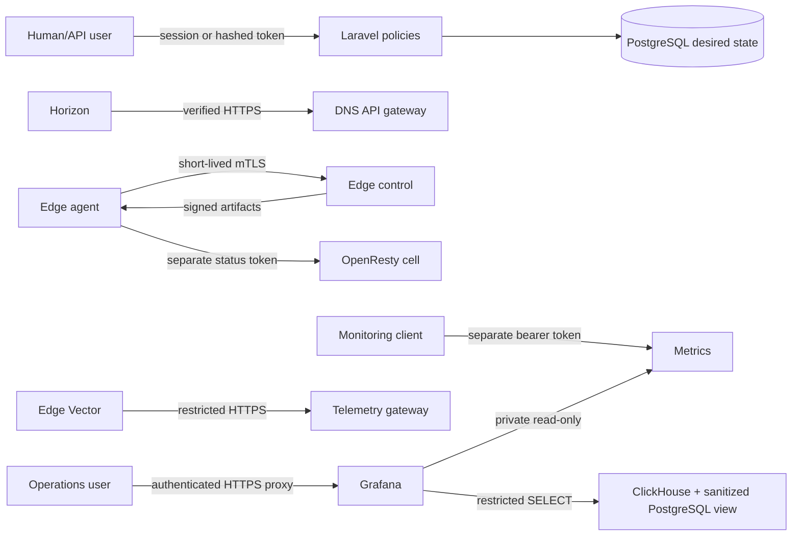

# Security model

CDNFoundry separates management identities, edge identities, runtime status
tokens, artifact signing, service TLS, database credentials, backup credentials,
and metrics access.

Human and API authorization is policy based:

- active administrators may use `/admin` and administrator API routes;
- active domain users may use `/app` and only assigned domains;
- disabled users lose API tokens and are rejected on later session requests;
- edge agents enroll once and then use short-lived client certificates;
- `/metrics` requires a separate bearer token and is not a user API.

Grafana has a separate administrator credential and never receives Laravel,
Vector-ingestion, or database-write credentials. Its ClickHouse account is
read-only with query bounds; its PostgreSQL account can read only domain
inventory columns and the sanitized operational view. Port 3000 remains on
loopback and requires a deployment-owned authenticated HTTPS proxy or trusted
tunnel for remote operator access.

Private keys are never returned by status APIs. Sanctum hashes API tokens.
Custom and managed TLS private keys are encrypted with the application
encryption key. DNS cluster API keys are encrypted and not echoed after storage.

## Secret classes

| Secret | Owner | Rotation consequence |
| --- | --- | --- |
| `APP_KEY` | control recovery system | Required to decrypt stored application secrets |
| Artifact signing key | control | Must remain compatible with agent verification |
| Edge identity CA key | control only | Replacement requires an agent re-enrollment plan |
| Edge server CA key | protected PKI | Reissue control/runtime/DNS API server identities |
| Agent private key | one edge identity volume | Rotate only that edge identity |
| Edge status token | one edge host | Update agent and cells together |
| PowerDNS API key | one DNS target | Update gateway and encrypted cluster credential |
| Metrics token | protected file | Update metrics client and mounted file |
| Restic password | recovery system | Required for existing backups |

::: danger Never log secrets
Use fingerprints, checksums, operation IDs, and redacted setting names in
diagnostics. Never paste environments, tokens, private keys, or customer data.
:::

Continue with [Deployment hardening](hardening.md) and
[Report a vulnerability](reporting.md).
